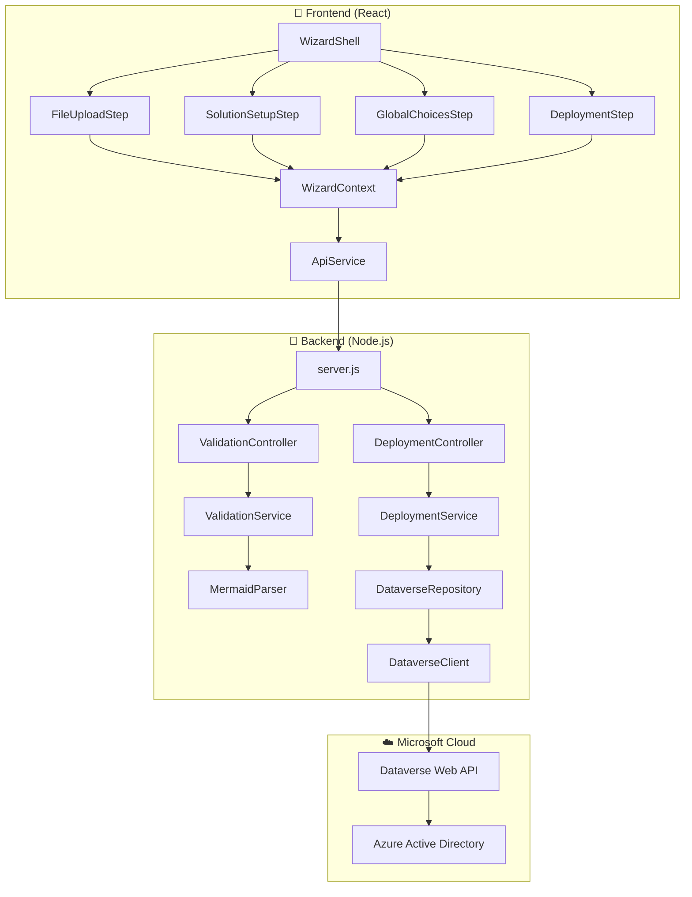

# 🎯 **PRESENTATION HELPER DOCUMENT**
**Mermaid to Dataverse Converter - Technical Architecture & Implementation**

---

## 📊 **1. DATAVERSE WEB API ENDPOINTS**

### **Authentication & Connection**
```http
# Health & Status
GET /api/data/v9.2/WhoAmI                    # Connection test
GET /health                                  # Application health
GET /api/admin/health                        # Detailed health check

# Publisher Management  
GET /api/data/v9.2/publishers               # Get all publishers
POST /api/data/v9.2/publishers              # Create new publisher

# Solution Management
GET /api/data/v9.2/solutions                # Get all solutions
POST /api/data/v9.2/solutions               # Create new solution

# Global Choices (Option Sets)
GET /api/data/v9.2/GlobalOptionSetDefinitions  # Get global choices
POST /api/data/v9.2/GlobalOptionSetDefinitions # Create global choice

# Entity & Relationship Creation
POST /api/data/v9.2/EntityDefinitions       # Create entity
POST /api/data/v9.2/RelationshipDefinitions # Create relationship
POST /api/data/v9.2/attributes              # Create entity attributes
```

### **Application-Specific API Routes**
```http
# Validation & Parsing
POST /api/validate-erd                      # Validate Mermaid ERD
POST /api/validation/validate               # Alternative validation endpoint
POST /api/validation/cleanup                # Clean up temporary resources

# Deployment & Configuration
POST /api/deployment/deploy                 # Deploy complete solution
POST /api/deployment/test-connection        # Test Dataverse connection
GET  /api/deployment/publishers             # Get publishers for deployment
GET  /api/deployment/solutions              # Get solutions for deployment
GET  /api/deployment/global-choices         # Get global choices for deployment

# Administrative
GET  /api/solution-status                   # Check solution deployment status
GET  /api/admin/logs                        # Get application logs
```

### **Request Headers (All Dataverse Calls)**
```http
Authorization: Bearer {ACCESS_TOKEN}
Content-Type: application/json
Accept: application/json
OData-MaxVersion: 4.0
OData-Version: 4.0
```

---

## 🏗️ **2. SIMPLIFIED APPLICATION SCHEMA**

### **Frontend Architecture (React + TypeScript)**

```
src/frontend/src/
├── 🎯 App.tsx                              # Main application entry
├── 📱 components/
│   └── wizard/                             # Wizard components
│       ├── WizardShell.tsx                 # Main wizard container
│       └── steps/                          # Wizard steps
│           ├── 📁 FileUploadStep.tsx       # Step 1: File upload & validation
│           ├── 📁 SolutionSetupStep.tsx    # Step 2: Solution & Publisher config
│           ├── 📁 GlobalChoicesStep.tsx    # Step 3: Global choices management
│           └── 📁 DeploymentStep.tsx       # Step 4: Deploy & results
├── 🔧 hooks/                               # Custom React hooks
│   ├── useWizardState.ts                   # Global wizard state management
│   ├── usePublishers.ts                    # Publishers data & operations
│   ├── useSolutions.ts                     # Solutions data & operations
│   └── useWizardContext.ts                 # Wizard context integration
├── 🌐 services/                            # API service layer
│   ├── apiService.ts                       # Core API client
│   ├── globalChoicesService.ts             # Global choices operations
│   └── deploymentService.ts                # Deployment operations
├── 🎨 context/                             # React Context providers
│   └── WizardContext.tsx                   # Global wizard state context
└── 📘 types/                               # TypeScript type definitions
    └── shared.types.ts                     # Shared type definitions
```

### **Backend Architecture (Node.js + Layered)**

```
src/backend/
├── 🌐 server.js                            # HTTP server & routing
├── 🎮 controllers/                         # Request handlers (MVC pattern)
│   ├── wizard-controller.js                # Wizard workflow coordination
│   ├── validation-controller.js            # ERD validation endpoints
│   ├── deployment-controller.js            # Solution deployment endpoints
│   └── admin-controller.js                 # Administrative endpoints
├── 🔧 services/                            # Business logic layer
│   ├── validation-service.js               # ERD validation & CDM detection
│   ├── deployment-service.js               # Solution deployment orchestration
│   ├── publisher-service.js                # Publisher management
│   ├── global-choices-service.js           # Global choices management
│   └── solution-service.js                 # Solution management
├── 💾 repositories/                        # Data access layer
│   ├── dataverse-repository.js             # Dataverse API abstraction
│   └── configuration-repository.js         # Configuration management
├── 🔌 clients/                             # External service clients
│   └── dataverse-client.js                 # Direct Dataverse Web API client
├── 🛡️ middleware/                          # Request processing middleware
│   ├── cors-middleware.js                  # CORS handling
│   ├── error-handler-middleware.js         # Error handling
│   ├── streaming-middleware.js             # Response streaming
│   └── security-middleware.js              # Security headers
└── 📝 parsers/                             # Content parsing
    ├── mermaid-parser.js                   # Mermaid ERD parser
    └── erd-parser.js                       # ERD structure parser
```

### **Key Component Relationships**



---

## 🔥 **3. REGEX HELL - MERMAID PARSING COMPLEXITY**

### **The Challenge: Distinguishing Attributes from Relationships**

The parser must differentiate between entity attributes and relationship definitions using regex patterns:

### **🎯 Relationship Pattern Matching**
```javascript
// Primary relationship pattern - handles multiple cardinality notations
const relationshipPattern = /^(\w+)\s+([|}{o-]+)\s+(\w+)(?:\s*:\s*(.+))?$/;

// Relationship indicators (cardinality symbols)
const relationshipIndicators = /\|\|--|--o\{|o\{|}\|/;

// Relationship label pattern (has colon + quoted text)
const relationshipLabelPattern = /:\s*["'][^"']*["']$/;

// Example matches:
// "Customer ||--o{ Order : places"     ✅ One-to-Many
// "User ||--|| Profile : has"          ✅ One-to-One  
// "Product }o--o{ Category : belongs"  ❌ Not supported (use junction table)
```

### **🎯 Entity Attribute Pattern Matching**
```javascript
// Complex attribute pattern supporting multiple formats
const attributePattern = /^((?:choice\([^)]+\)|lookup\([^)]+\)|\w+))\s+(\w+)(?:\s+([^"]+?))?(?:\s+"([^"]*)")?$/;

// Type mapping patterns
const typePatterns = {
  // Choice/Picklist types
  choice: /^choice\(([^)]+)\)$/,
  lookup: /^lookup\(([^)]+)\)$/,
  
  // Semantic type detection
  email: /email|mail/i,
  phone: /phone|tel|mobile/i,
  url: /url|website|link/i,
  date: /date|created|modified|birth/i,
  money: /price|cost|amount|salary/i
};

// Example matches:
// "string customer_name PK"             ✅ Primary key
// "choice(high,medium,low) priority"    ✅ Choice field
// "lookup(Account) account_id FK"       ✅ Foreign key lookup
// "decimal(10,2) price \"Product price\"" ✅ With description
```

### **🔥 The "Regex Hell" Complexity**

#### **Problem 1: Ambiguous Line Detection**
```javascript
// These lines could be either attributes OR relationships:
"Customer Account"        // Relationship? Or malformed attribute?
"string : name"           // Attribute? Or malformed relationship?
"Order ||-- Customer"     // Missing cardinality symbols

// Solution: Multi-pass validation with priority rules
parseAttribute(line) {
  // CRITICAL: Check relationship patterns FIRST
  if (relationshipPattern.test(line)) return null;
  if (relationshipIndicators.test(line)) return null;
  if (relationshipLabelPattern.test(line)) return null;
  
  // Then try attribute parsing
  const match = line.match(attributePattern);
  // ... rest of attribute parsing
}
```

#### **Problem 2: Cardinality Symbol Variations**
```javascript
// Mermaid supports multiple cardinality notations:
const cardinalityPatterns = {
  oneToMany: [
    /\|\|--o\{/,    // ||--o{
    /\|\|--\|\{/,   // ||--|{  
    /\|o--o\{/,     // |o--o{
    /\}o--\|\|/     // }o--||
  ],
  
  oneToOne: [
    /\|\|--\|\|/,   // ||--||
    /\|o--o\|/      // |o--o|
  ]
  
  // Note: Many-to-Many relationships not supported directly
  // Use junction tables: ProductCategory { product_id FK, category_id FK }
};

// Parse and normalize cardinality
parseCardinality(cardinality) {
  if (cardinality.includes('||') && cardinality.includes('{')) {
    return { type: 'OneToMany', from: 'One', to: 'Many' };
  }
  if (cardinality.includes('||') && cardinality.includes('||')) {
    return { type: 'OneToOne', from: 'One', to: 'One' };
  }
  if (cardinality.includes('}') && cardinality.includes('{')) {
    // Many-to-Many detected but not supported - suggest junction table
    throw new Error('Many-to-Many relationships not supported. Use junction table instead.');
  }
  // Fallback for unknown patterns
  return { type: 'Unknown', from: 'Unknown', to: 'Unknown' };
}
```

#### **Problem 3: Entity Boundary Detection**
```javascript
// Parsing entity definitions with proper boundary detection
parse(mermaidContent) {
  const lines = mermaidContent.split('\n').map(line => line.trim());
  let currentEntity = null;
  let inEntityDefinition = false;

  for (const line of lines) {
    if (line === 'erDiagram') continue;

    // Entity start: "EntityName {"
    const entityMatch = line.match(/^(\w+)\s*\{/);
    if (entityMatch) {
      currentEntity = entityMatch[1];
      this.entities.set(currentEntity, {
        name: currentEntity,
        attributes: []
      });
      inEntityDefinition = true;
      continue;
    }

    // Entity end: "}"
    if (line === '}') {
      inEntityDefinition = false;
      currentEntity = null;
      continue;
    }

    // Inside entity: parse attributes
    if (inEntityDefinition && currentEntity) {
      const attribute = this.parseAttribute(line);
      if (attribute) {
        this.entities.get(currentEntity).attributes.push(attribute);
      }
      continue;
    }

    // Outside entity: parse relationships
    const relationship = this.parseRelationship(line);
    if (relationship) {
      this.relationships.push(relationship);
    }
  }
}
```

#### **Problem 4: Validation Regex Patterns**
```javascript
// Complex validation patterns for different issue types
const validationPatterns = {
  // Naming conflicts (reserved words)
  namingConflicts: {
    // Entities with 'name' column that's not PK
    hasNameColumn: /string\s+name(?!\w)/,
    isNamePK: /string\s+name\s+PK/,
    
    // Status columns (Dataverse has built-in status)
    statusColumn: /\b(status|state)\s+/i,
    
    // Reserved system columns
    systemColumns: /(createdby|modifiedby|createdon|modifiedon|ownerid)/i
  },
  
  // Choice/Picklist issues
  choiceIssues: {
    // Choice columns without global choice reference
    choicePattern: /\w+\s+(choice|category)\s+\w+/g,
    
    // Invalid choice syntax
    invalidChoice: /choice\([^)]*\)(?!\s+\w+)/
  },
  
  // Primary key validation
  primaryKeyIssues: {
    // Multiple primary keys
    multiplePK: /PK.*PK/,
    
    // No primary key
    noPrimaryKey: (entity) => !entity.attributes.some(attr => attr.isPrimaryKey)
  }
};

// Apply validation with regex patterns
validateEntity(entityName, isCDMEntity = false) {
  const entity = this.entities.get(entityName);
  
  // Check naming conflicts (skip for CDM entities)
  if (!isCDMEntity) {
    const hasNameColumn = entity.attributes.some(attr => 
      validationPatterns.namingConflicts.hasNameColumn.test(`string ${attr.name}`)
    );
    const isNamePK = entity.attributes.some(attr => 
      validationPatterns.namingConflicts.isNamePK.test(`string ${attr.name} PK`)
    );
    
    if (hasNameColumn && !isNamePK) {
      this.warnings.push({
        type: 'naming_conflict',
        severity: 'warning',
        entity: entityName,
        message: `Entity '${entityName}' has a 'name' column that conflicts with Dataverse primary name column.`,
        suggestion: `Rename 'name' to '${entityName.toLowerCase()}_name' or make it the primary key.`
      });
    }
  }
  
  // Validate choice columns
  entity.attributes.forEach(attr => {
    if (validationPatterns.choiceIssues.choicePattern.test(`${attr.type} ${attr.name}`)) {
      this.warnings.push({
        type: 'choice_issue',
        severity: 'info',
        entity: entityName,
        attribute: attr.name,
        message: `Choice column '${attr.name}' detected. Consider using global choices for consistency.`
      });
    }
  });
}
```

### **🎯 Real-World Parsing Example**

Input Mermaid ERD:
```mermaid
erDiagram
    Customer {
        string customer_id PK "Unique identifier"
        string name "Customer name"
        choice(high,medium,low) priority
        datetime created_date
    }
    Order {
        string order_id PK
        string customer_ref FK
        decimal(10,2) total_amount
    }
    %% Many-to-Many via Junction Table (Recommended Approach)
    Product {
        string product_id PK
        string product_name
        decimal(10,2) price
    }
    ProductCategory {
        string id PK
        string product_id FK
        string category_id FK
    }
    Category {
        string category_id PK
        string category_name
    }
    Customer ||--o{ Order : places
    Product ||--o{ ProductCategory : has
    Category ||--o{ ProductCategory : contains
```

Regex Processing Steps:
1. **Entity Detection**: `/^(\w+)\s*\{/` → Matches "Customer {", "Order {", "Product {", etc.
2. **Attribute Parsing**: Complex pattern matches each attribute line
3. **Relationship Detection**: `/^(\w+)\s+([|}{o-]+)\s+(\w+)(?:\s*:\s*(.+))?$/` → Matches one-to-many relationships only
4. **Junction Table Recognition**: ProductCategory serves as junction table for Product ↔ Category many-to-many relationship
5. **Validation**: Multiple regex patterns check for naming conflicts, choice issues, etc.

**The regex complexity comes from handling the ambiguity and flexibility of Mermaid syntax while ensuring accurate parsing for Dataverse entity creation.**

---

## 🎉 **PRESENTATION TAKEAWAYS**

1. **API Integration**: 15+ Dataverse Web API endpoints with proper authentication
2. **Modular Architecture**: Clean separation between frontend (React) and backend (Node.js) with layered services  
3. **Regex Complexity**: Multi-pass parsing with 10+ regex patterns to handle Mermaid syntax ambiguity
4. **Relationship Strategy**: Supports One-to-One and One-to-Many relationships directly; Many-to-Many via junction tables (best practice for Dataverse)
5. **Real-World Challenge**: Converting human-readable ERD syntax into structured Dataverse entities requires sophisticated pattern matching and validation

---

*This helper document provides the technical foundation for your presentation, highlighting the complexity and sophistication of the parsing engine and overall architecture.*
