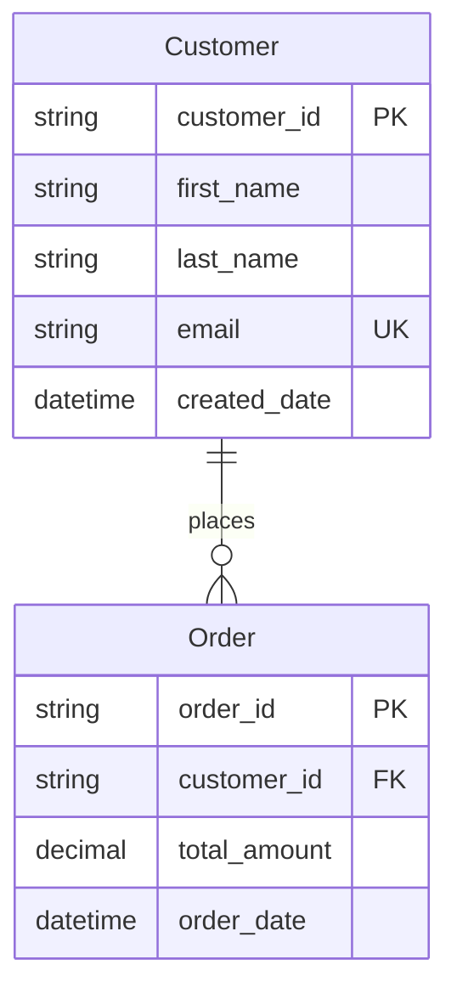

# Mermaid to Dataverse Converter

A tool that reads [Mermaid](https://www.mermaidchart.com/) ERD diagrams and creates corresponding tables, fields, and relationships in Microsoft Dataverse.

## Table of Contents
- [Features](#features)
- [Setup](#setup)
- [Usage](#usage)  
- [Relationship Types](#important-relationship-types)
- [Relationship Validation](#relationship-validation)
- [Example ERD Files](#example-erd-files)
- [Developer Documentation](#developer-documentation)

## Features

- **🔧 Solution Management**: Automatically creates or uses existing Dataverse solutions (idempotent)
- **👤 Publisher Management**: List, select, and manage Dataverse publishers for solutions  
- **🏗️ Entity Creation**: Parse Mermaid ERD syntax and generate Dataverse entity schemas
- **🔗 Relationship Management**: Create relationships between entities with proper cardinality
- **🛡️ Relationship Validation**: Detect and warn about conflicting relationships (multiple parental, circular cascades)
- **⚡ Safe Mode**: All-referential mode to prevent cascade delete conflicts
- **🔄 Idempotent Operations**: Safe to run multiple times - skips existing entities and relationships
- **🔐 Authentication**: Handle authentication with Microsoft Entra ID (automated setup)
- **📋 Type Support**: Support for various field types, constraints, and choice fields
- **🎯 Interactive & Non-Interactive**: CLI supports both guided prompts and automation-friendly modes### CLI Options

```bash
# Full command syntax
node src/index.js create [file] [options]

Core Options:
  -s, --solution <name>           Solution name to create entities in
  -p, --publisher-prefix <prefix> Publisher prefix (2-8 characters)
  --dry-run                       Preview without creating entities
  --verbose                       Show detailed output

Advanced Options:
  --no-validation                 Skip relationship validation (not recommended)
  --safe-mode                     Use safe mode: all relationships as lookups
  --all-referential               Make all relationships referential/lookup only
  --non-interactive               Run without interactive prompts
  --list-publishers               List available publishers before creating solution
  --no-create-publisher           Do not create publisher if it doesn't exist
```ution Management**: Automatically creates or uses existing Dataverse solutions (idempotent)
- **Publisher Management**: List, select, and manage Dataverse publishers for solutions
- **Entity Creation**: Parse Mermaid ERD syntax and generate Dataverse entity schemas
- **Relationship Management**: Create relationships between entities with proper cardinality
- **Idempotent Operations**: Safe to run multiple times - skips existing entities and relationships
- **Authentication**: Handle authentication with Microsoft Entra ID
- **Type Support**: Support for various field types and constraints

## Setup

### Prerequisites

Before you begin, make sure you have:

1. **Power Platform CLI** - [Official Documentation](https://learn.microsoft.com/power-platform/developer/cli/introduction)
   - **Important**: After installation, **restart VS Code** to ensure `pac` command is available
   - Test installation: Run `pac` in terminal

2. **Azure CLI** - Required for automated setup
   - Install from [Azure CLI docs](https://learn.microsoft.com/cli/azure/install-azure-cli)
   - Log in as admin: `az login`

3. **Node.js** - Required to run the tool
   - Install dependencies: `npm install`

4. **Dataverse Environment Access**
   - Your Dataverse environment URL (find it in [Power Platform Admin Center](https://admin.powerplatform.microsoft.com))
   - Admin permissions in your Dataverse environment

### Quick Setup (Automated)

The script automatically

- Creates Entra Id app registration and service principal
- Generates client secrets and updates your `.env` file  
- Creates the Dataverse Application User with proper permissions
- Handles the bootstrap authentication problem seamlessly
- Tests the complete setup to ensure everything works

**Setup Steps:**

1. Create your `.env` file with basic info:
```bash
cp .env.example .env
```

2. Edit `.env` and add your environment details:
```bash
DATAVERSE_URL=https://yourorg.crm.dynamics.com
TENANT_ID=your-tenant-id-here
# CLIENT_ID and CLIENT_SECRET will be auto-generated
```

3. Run the automated setup:
```bash
node scripts/setup.cjs
```

That's it! The script handles everything else automatically.

💡 For more details about the authentication setup and troubleshooting, see [scripts/README.md](scripts/README.md).

### Alternative Setup (Manual)

1. Install dependencies:
```bash
npm install
```

2. Configure environment variables:
```bash
cp .env.example .env
# Edit .env with your Dataverse and Microsoft Entra ID details
# See docs/entra-id-setup.md for detailed instructions
```

3. Run the tool:
```bash
# Interactive mode (recommended for first-time users)
node src/index.js create examples/ecommerce-erd.mmd

# Or preview first with dry run
node src/index.js create examples/ecommerce-erd.mmd --dry-run
```

## Supported Mermaid ERD Syntax



## Environment Variables

- `DATAVERSE_URL` - Your Dataverse environment URL
- `CLIENT_ID` - Microsoft Entra ID App Registration Client ID
- `CLIENT_SECRET` - Microsoft Entra ID App Registration Client Secret
- `TENANT_ID` - Microsoft Entra ID Tenant ID

## Usage

### Quick Start (Interactive)

The easiest way to get started is with the interactive `create` command:

```bash
# Interactive mode - will prompt for solution name and publisher prefix  
node src/index.js create examples/ecommerce-erd.mmd

# Preview without creating (dry run)
node src/index.js create examples/ecommerce-erd.mmd --dry-run

# Quick shortcut for interactive mode
npm run create
# Then provide the file path when prompted
```

This will:
1. **Prompt for solution name** - Enter a descriptive name for your Dataverse solution
2. **Prompt for publisher prefix** - Enter 2-8 characters unique to your organization  
3. **Show configuration summary** - Review your settings before proceeding
4. **Create the solution** - Build entities and relationships in Dataverse

### Solution Naming

The tool supports user-friendly solution names with spaces and special characters like `Customer Management System` amd handles the technical requirements:

- **Display Name**: Shown exactly as you enter it in Dataverse (e.g., "Customer Management System")
- **Technical Name**: Auto-generated API-safe name using PascalCase (e.g., "CustomerManagementSystem")

### Available npm Scripts

For convenience, several npm scripts are available:

```bash
npm run create      # Interactive create (prompts for file path)
npm run publishers  # List available publishers
npm run cleanup     # Remove temporary/debug files
npm test           # Run tests
```

Note: For commands with arguments, use the direct `node src/index.js` syntax shown above.

### Advanced Commands

```bash
# Specify all options via command line (non-interactive)
node src/index.js convert my-erd.mmd MyProjectSolution contoso

# Dry run with specific parameters
node src/index.js convert my-erd.mmd MyProjectSolution contoso --dry-run

# List available publishers in your environment
node src/index.js publishers
# OR use the shortcut
npm run publishers
```

# Use a specific publisher prefix
npm start convert -- --input ./my-erd.mmd --solution MyProjectSolution --publisher-prefix "contoso"

# List publishers before creating solution
npm start convert -- --input ./my-erd.mmd --solution MyProjectSolution --list-publishers

# Prevent automatic publisher creation (use existing only)
npm start convert -- --input ./my-erd.mmd --solution MyProjectSolution --no-create-publisher

# Dry run (preview without creating)
npm start convert -- --input ./my-erd.mmd --dry-run

# Verbose output
npm start convert -- --input ./my-erd.mmd --solution MyProjectSolution --verbose

# Validate ERD syntax
npm start validate -- --input ./my-erd.mmd

# Check configuration
npm start config
```

### CLI Options

```bash
# Full command syntax
npm start convert -- [options]

Options:
  -i, --input <file>              Input Mermaid ERD file path
  -s, --solution <name>           Solution name to create entities in (required)
  -o, --output <file>             Output JSON schema file (optional)
  --dry-run                       Preview without creating entities  
  --verbose                       Show detailed output
  --publisher-prefix <prefix>     Custom publisher prefix (default: mmd)
  --list-publishers               List available publishers before creating solution
  --no-create-publisher           Do not create publisher if it doesn't exist
```

## Maintenance

### Cleanup Repository

To remove temporary files, debug scripts, and test outputs:

```bash
npm run cleanup
```

This script automatically removes:
- Debug and test scripts (`debug-*.js`, `check-*.js`, etc.)
- Schema output files (`*-schema.json`)
- Temporary .env files (`.env.generated`, `.env.updated`)
- Keeps only essential examples (`ecommerce-erd.mmd`, `hr-system-erd.mmd`)

## Important: Relationship Types

⚠️ **Default Behavior**: All relationships are created as **referential (lookup)** relationships by default.

Mermaid ERD syntax doesn't distinguish between parental and referential relationships, so this tool defaults to the safer option that prevents cascade delete conflicts. This means:

- ✅ **All ERDs will create successfully** without "multiple parental relationships" errors
- ✅ **Data references are maintained** but without automatic cascade delete
- ⚠️ **Manual enhancement needed** if you want parental relationships with cascade delete

**📖 Read the full explanation**: [Relationship Types Documentation](docs/RELATIONSHIP_TYPES.md)

This covers:
- Why we default to referential relationships
- How to manually configure parental relationships in Dataverse
- Best practices for relationship design
- Migration guide for existing users

## Relationship Validation

The tool includes built-in validation to detect potential ERD structure issues:

### Automatic Detection
- **Self-References**: Identifies entities that reference themselves
- **Missing Primary Keys**: Ensures all entities have proper primary key definitions
- **Orphaned Entities**: Detects entities without any relationships (informational)
- **ERD Syntax Issues**: Validates proper Mermaid ERD format

### Validation Options
```bash
# Run with validation (default)
node src/index.js create examples/ecommerce-erd.mmd

# Skip validation (not recommended)
node src/index.js create examples/ecommerce-erd.mmd --no-validation

# Safe mode - explicitly ensures all relationships as lookups
node src/index.js create examples/ecommerce-erd.mmd --safe-mode

# Non-interactive mode for automation
node src/index.js create examples/ecommerce-erd.mmd --non-interactive
```

### Validation Output Example
```
🔍 Validating ERD structure...
✅ All entities have primary keys
✅ No self-references detected
ℹ️  All relationships will be created as referential (lookup) by default
✅ Validation completed successfully
```

**Note**: Since all relationships are created as referential by default, there are no cascade delete conflicts to detect. The validation focuses on ERD structure and syntax issues.

## Example ERD Files

The `examples/` directory contains ready-to-use Mermaid ERD files:

- **`ecommerce-erd.mmd`** - E-commerce system with customers, orders, and products
- **`hr-system-erd.mmd`** - HR system with employees, departments, and projects  
- **`event-erd.mmd`** - Event management with venues, events, and attendees
- **`choice-field-test.mmd`** - Demonstrates choice fields and global choice sets
- **`ultimate-datatype-test.mmd`** - Comprehensive field type examples

### Quick Test
```bash
# Try the e-commerce example
node src/index.js create examples/ecommerce-erd.mmd --dry-run

# Test relationship validation with complex example
node src/index.js create examples/event-erd.mmd --verbose
```

## Developer Documentation

For developers who want to understand, maintain, or contribute to this project: [Developer Documentation](docs/DEVELOPER.md) - Comprehensive technical guide 

## Contributing

Contributions welcome!
