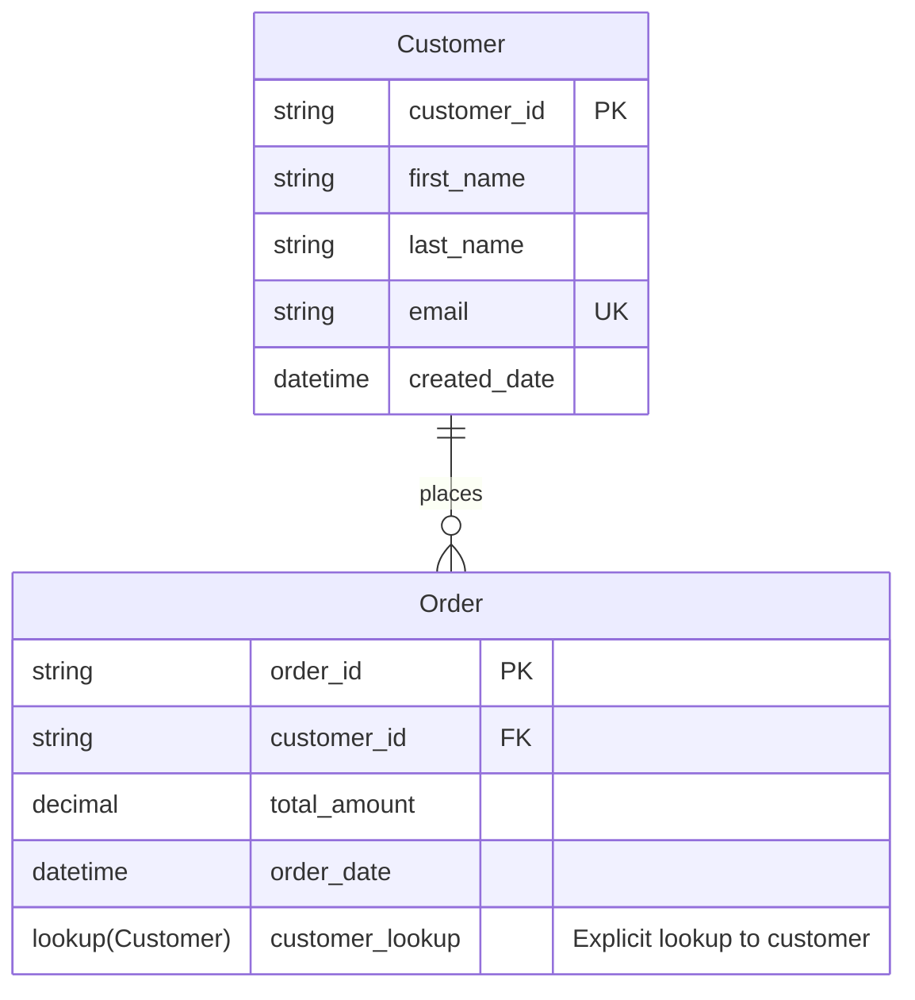

# Mermaid to Dataverse Converter

A tool that reads [Mermaid](https://www.mermaidchart.com/) ERD diagrams and creates corresponding tables, fields, and relationships in Microsoft Dataverse.

## Table of Contents

## Features

- **Safe Mode**: All-referential mode to prevent cascade delete conflicts
- **Idempotent Operations**: Safe to run multiple times - skips existing entities and relationships
- **Authentication**: Handle authentication with Microsoft Entra ID (automated setup)
- **Type Support**: Support for various field types, constraints, and choice fields
- **Interactive & Non-Interactive**: CLI supports both guided prompts and automation-friendly modes
 
### CLI Options

Core Options:

```
  -s, --solution <name>           Solution name to create entities in
  -p, --publisher-prefix <prefix> Publisher prefix (2-8 characters)
  --dry-run                       Preview without creating entities
  --list-publishers               List available publishers before creating solution
  --no-create-publisher           Do not create publisher if it doesn't exist
```
- **Relationship Management**: Create relationships between entities with proper cardinality
- **Idempotent Operations**: Safe to run multiple times - skips existing entities and relationships
- **Authentication**: Handle authentication with Microsoft Entra ID


### Prerequisites

Before you begin, make sure you have:

1. **[Power Platform CLI](https://learn.microsoft.com/power-platform/developer/cli/introduction)** - 
   - **Important**: After installation, **restart VS Code** to ensure `pac` command is available
   - Test installation: Run `pac` in terminal

2. **Azure CLI** - Required for automated setup
   - Log in as admin: `az login`

   - Your Dataverse environment URL (find it in [Power Platform Admin Center](https://admin.powerplatform.microsoft.com))
   - Admin permissions in your Dataverse environment

### Quick Setup (Automated)

The script automatically

- Creates Entra Id app registration and service principal
- Generates client secrets and updates your `.env` file  
- Creates the Dataverse Application User with proper permissions
- Handles the bootstrap authentication problem seamlessly
- Tests the complete setup to ensure everything works

**Setup Steps:**

1. Create your `.env` file with basic info:
```bash
cp .env.example .env
```

2. Edit `.env` and add your environment details:
```bash
DATAVERSE_URL=https://yourorg.crm.dynamics.com
TENANT_ID=your-tenant-id-here
# CLIENT_ID and CLIENT_SECRET will be auto-generated
```

3. Run the automated setup:
```bash
node scripts/setup.cjs
```

That's it! The script handles everything else automatically.

💡 For more details about the authentication setup and troubleshooting, see [scripts/README.md](scripts/README.md).

## Supported Mermaid ERD Syntax



### Field Types

- Basic types: `string`, `int`, `decimal`, `bool`, `datetime`, `date`, `money`
- Complex types:
  - `choice(option1,option2,option3)` - Creates a choice/option set field
  - `lookup(EntityName)` - Creates an explicit lookup field to another entity
  - `lookup(prefix:EntityName)` - Creates an explicit lookup to an entity with a specific publisher prefix
- Constraints: `PK` (Primary Key), `FK` (Foreign Key), `UK` (Unique Key), `NOT NULL` (Required)

### Working with Existing Entities

When working with existing Dataverse environments, you can:

1. Use explicit publisher prefixes in lookups: `lookup(rose:DEPARTMENT)` 
2. Run with the `--use-existing-prefix` flag to try multiple common prefixes for lookup targets

## Developer Documentation

For developers who want to understand, maintain, or contribute to this project: [Developer Documentation](docs/DEVELOPER.md)

## Contributing

Contributions welcome!
