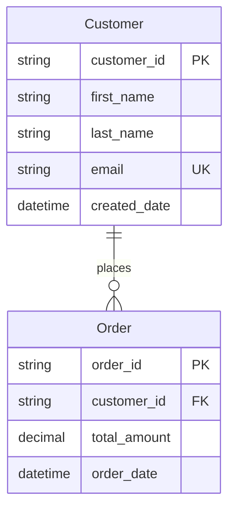

# Mermaid to Dataverse Converter

A tool that reads [Mermaid](https://www.mermaidchart.com/) ERD diagrams and creates corresponding tables, fields, and relationships in Microsoft Dataverse.

## Features

- **Authentication**: Handle authentication with Microsoft Entra ID (automated setup)
- **Type Support**: Support for various field types, constraints, and choice fields
- **Interactive & Non-Interactive**: CLI supports both guided prompts and automation-friendly modes
- **Safe Mode**: All-referential mode to prevent cascade delete conflicts
- **Idempotent Operations**: Safe to run multiple times - skips existing entities and relationships

## Prerequisites

Before you begin, make sure you have:

1. [Power Platform CLI](https://learn.microsoft.com/power-platform/developer/cli/introduction)
   - ⚡ After installation, restart VS Code to ensure `pac` command is available
   - Test installation: Run `pac` in terminal

2. [Azure CLI](https://learn.microsoft.com/en-us/cli/azure/?view=azure-cli-latest)
   - Log in as admin: `az login`
3. **Your Dataverse environment URL** (find it in [Power Platform Admin Center](https://admin.powerplatform.microsoft.com))
4. **Admin permissions in your Dataverse environment** 

## Quick Setup (Automated)

The script automatically

- Creates Entra Id app registration and service principal
- Generates client secrets and updates your `.env` file  
- Creates the Dataverse Application User with proper permissions
- Handles the bootstrap authentication problem seamlessly
- Tests the complete setup to ensure everything works

**Setup Steps:**

1. Create your `.env` file with basic info:
```bash
cp .env.example .env
```

2. Edit `.env` and add your environment details:
```bash
DATAVERSE_URL=https://yourorg.crm.dynamics.com
TENANT_ID=your-tenant-id-here
# CLIENT_ID and CLIENT_SECRET will be auto-generated
```

3. Run the automated setup:
```bash
node scripts/setup.cjs
```

That's it! The script handles everything else automatically.

💡 For more details about the authentication setup and troubleshooting, see [ENTRA-ID-SETUP](docs/ENTRA-ID_SETUP.md).

## Supported Mermaid ERD Syntax



More info on how to use the tool in the [USAGE-GUIDE](docs/USAGE-GUIDE.md).


## Developer Documentation

For developers who want to understand, maintain, or contribute to this project: [Developer Documentation](docs/DEVELOPER.md)

## Contributing

Contributions welcome!
