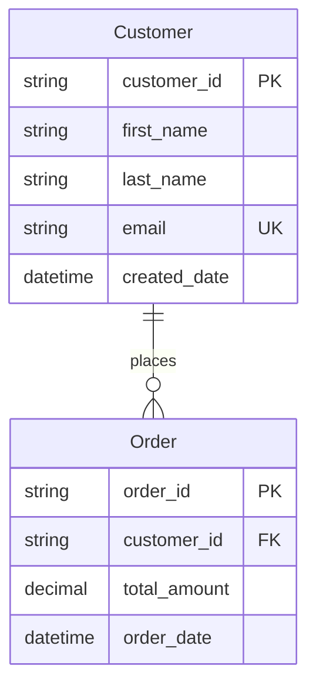

# Mermaid to Dataverse Converter

A tool that reads Mermaid ERD diagrams and creates corresponding tables, fields, and relationships in Microsoft Dataverse.

## Features

- **Solution Management**: Automatically creates or uses existing Dataverse solutions (idempotent)
- **Publisher Management**: List, select, and manage Dataverse publishers for solutions
- **Entity Creation**: Parse Mermaid ERD syntax and generate Dataverse entity schemas
- **Relationship Management**: Create relationships between entities with proper cardinality
- **Idempotent Operations**: Safe to run multiple times - skips existing entities and relationships
- **Authentication**: Handle authentication with Microsoft Entra ID
- **Type Support**: Support for various field types and constraints
- **Solution Integration**: All entities and components are created within a named solution for better organization

## Setup

### Prerequisites

You need:
- **Power Platform CLI** - [Installation Guide](docs/power-platform-cli-setup.md) | [Official Docs](https://learn.microsoft.com/power-platform/developer/cli/introduction)
  - **Important**: After installation, **restart VS Code** to ensure `pac` command is available
  - Test installation: Run `pac --version` in terminal

### Quick Setup (Automated)

**NEW**: We now have a fully automated setup script that handles the entire "chicken-and-egg" problem of Dataverse authentication!

The script automatically:
- Creates Azure app registration and service principal
- Generates client secrets and updates your .env file  
- Creates the Dataverse Application User with proper permissions
- Handles the bootstrap authentication problem seamlessly
- Tests the complete setup to ensure everything works

**Prerequisites**: 
- Azure CLI installed and logged in as admin (`az login`)
- Node.js with dependencies installed (`npm install`)
- Your Dataverse environment URL (find it in [Power Platform Admin Center](https://admin.powerplatform.microsoft.com))

**Setup Steps:**

1. Create your `.env` file with basic info:
```bash
cp .env.example .env
```

2. Edit `.env` and add your environment details:
```bash
DATAVERSE_URL=https://yourorg.crm.dynamics.com
TENANT_ID=your-tenant-id-here
# CLIENT_ID and CLIENT_SECRET will be auto-generated
```

3. Run the automated setup:
```bash
node scripts/setup-application-user.cjs
```

That's it! The script handles everything else automatically.

**What the script does:**
- Detects if you have existing app registrations or creates new ones
- Creates Azure service principal with proper Dataverse permissions
- Solves the "chicken-and-egg" authentication problem using admin fallback
- Creates Dataverse Application User with System Administrator role
- Updates your .env file with generated credentials
- Tests the complete authentication flow

For more details about the authentication setup and troubleshooting, see [scripts/README.md](scripts/README.md).

### Alternative Setup (Manual)

If you prefer manual setup or need to understand the process:

1. Install dependencies:
```bash
npm install
```

2. Configure environment variables:
```bash
cp .env.example .env
# Edit .env with your Dataverse and Microsoft Entra ID details
# See docs/azure-setup.md for detailed instructions
```

3. Run the tool:
```bash
npm start -- --input ./examples/sample-erd.mmd
```

## Supported Mermaid ERD Syntax



## Environment Variables

- `DATAVERSE_URL` - Your Dataverse environment URL
- `CLIENT_ID` - Microsoft Entra ID App Registration Client ID
- `CLIENT_SECRET` - Microsoft Entra ID App Registration Client Secret
- `TENANT_ID` - Microsoft Entra ID Tenant ID

## Usage

### Basic Commands

```bash
# Convert a single ERD file (creates a solution and entities)
npm start convert -- --input ./my-erd.mmd --solution MyProjectSolution

# List available publishers in your environment
npm start publishers

# Use a specific publisher prefix
npm start convert -- --input ./my-erd.mmd --solution MyProjectSolution --publisher-prefix "contoso"

# List publishers before creating solution
npm start convert -- --input ./my-erd.mmd --solution MyProjectSolution --list-publishers

# Prevent automatic publisher creation (use existing only)
npm start convert -- --input ./my-erd.mmd --solution MyProjectSolution --no-create-publisher

# Dry run (preview without creating)
npm start convert -- --input ./my-erd.mmd --dry-run

# Verbose output
npm start convert -- --input ./my-erd.mmd --solution MyProjectSolution --verbose

# Validate ERD syntax
npm start validate -- --input ./my-erd.mmd

# Check configuration
npm start config
```

### CLI Options

```bash
# Full command syntax
npm start convert -- [options]

Options:
  -i, --input <file>              Input Mermaid ERD file path
  -s, --solution <name>           Solution name to create entities in (required)
  -o, --output <file>             Output JSON schema file (optional)
  --dry-run                       Preview without creating entities  
  --verbose                       Show detailed output
  --publisher-prefix <prefix>     Custom publisher prefix (default: mmd)
  --list-publishers               List available publishers before creating solution
  --no-create-publisher           Do not create publisher if it doesn't exist
```
