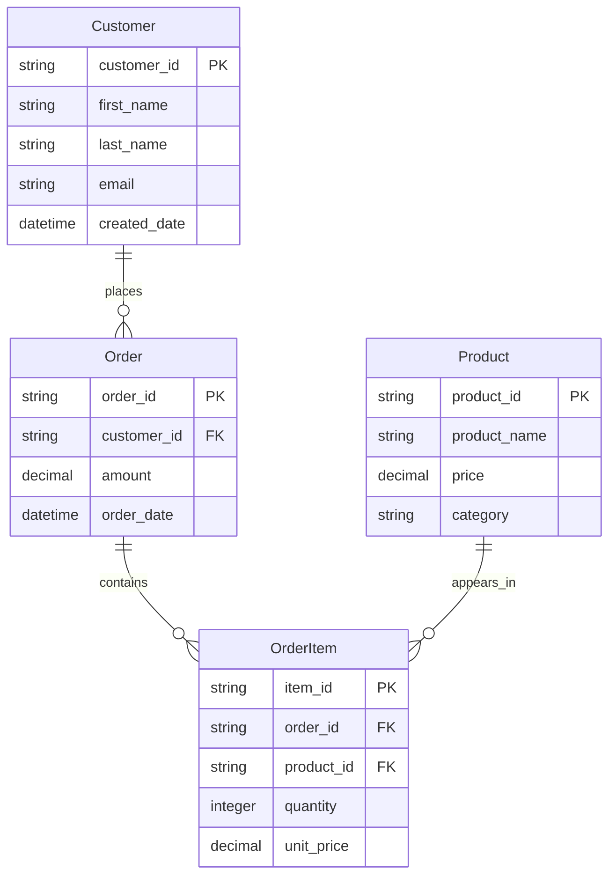
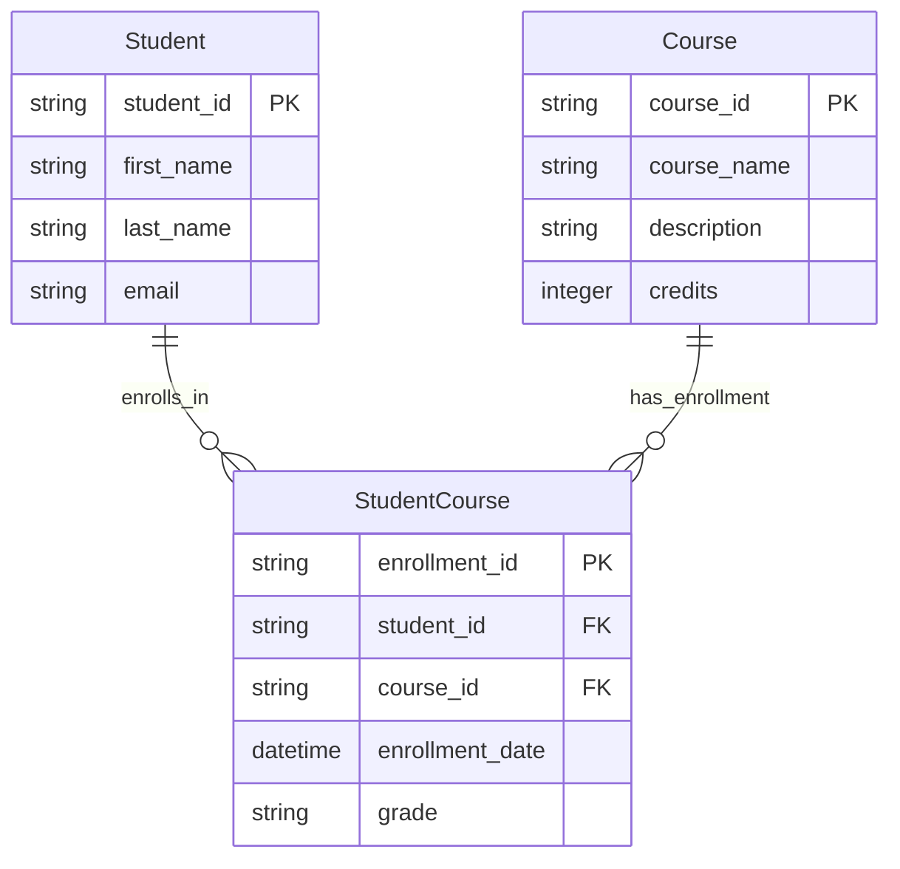
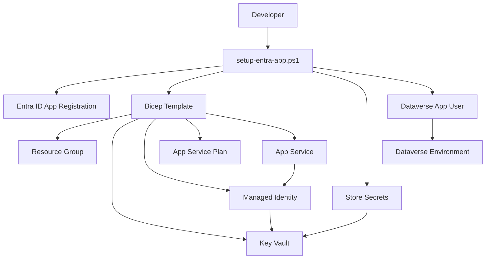
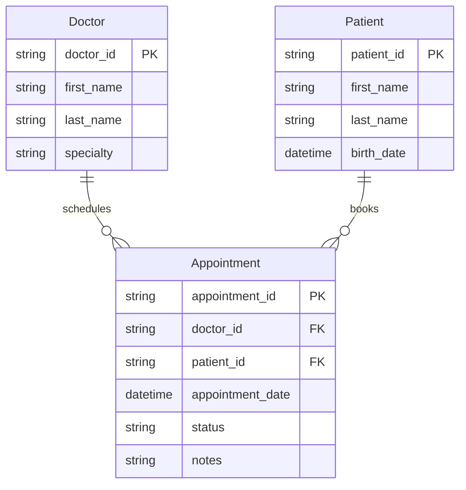

# Mermaid to Dataverse Converter

A production-ready Azure App Service application that converts Mermaid ERD diagrams into Microsoft Dataverse entities, columns, and relationships.

## Features

- **🚀 Azure App Service Deployment**: Production-ready web application with managed identity
- **🔐 Secure Authentication**: Azure Key Vault integration with managed identity for secrets
- **📊 Real-time Processing**: Upload Mermaid files and see live progress in the web UI
- **🏗️ Complete Schema Generation**: Creates publishers, solutions, entities, columns, and relationships
- **✅ Validation & Testing**: Built-in validation and dry-run modes for safe testing
- **📝 Detailed Logging**: Comprehensive logging with real-time streaming to the UI

## Architecture

### Core Files

- **`src/server.js`** - Main production server with web UI and API endpoints
- **`src/dataverse-client.js`** - Dataverse Web API client with authentication
- **`src/parser.js`** - Mermaid ERD parser with relationship filtering
- **`src/key-vault-config.js`** - Azure Key Vault configuration and secret management
- **`deploy/infrastructure.bicep`** - Azure infrastructure as code (Bicep template)
- **`scripts/setup-entra-app.ps1`** - Automated setup script for complete deployment

### Directory Structure

```
/src/            - Application source code
/deploy/         - Infrastructure as Code (Bicep templates)
/docs/           - Documentation and guides
/examples/       - Sample Mermaid ERD files
/tests/          - Integration tests
/scripts/        - Setup and utility scripts
```

## Prerequisites

1. **Azure Subscription** with App Service and Key Vault access
2. **Microsoft Dataverse Environment** with admin permissions  
3. **PowerShell 7+** for deployment scripts
4. **Node.js 20+** for local development

## Quick Start

### Automated Setup (Recommended)

The fastest way to get started is using the automated setup script:

```powershell
# Clone the repository
git clone https://github.com/LuiseFreese/mermaid.git
cd mermaid

# Run automated setup (creates all Azure resources)
.\scripts\setup-entra-app.ps1
```

**What this does:**
- Creates Entra ID app registration with proper permissions
- Deploys Azure infrastructure using Bicep templates
- Configures Key Vault with managed identity authentication
- Creates Dataverse application user with security roles
- Tests the complete setup end-to-end

### Local Development Commands

```bash
# Start the web server (production mode)
npm start
# → Starts the web server at http://localhost:3000

# Start with auto-restart on file changes
npm run dev  
# → Starts with auto-restart on file changes for development

# Run integration tests
npm test
# → Runs the schema generation test

# Lint code for quality and style
npm run lint
# → Runs ESLint to check code quality
```

## Deployment

### Automated Deployment (Recommended)

Use the PowerShell setup script for complete automation:

```powershell
# Interactive mode (prompts for configuration)
.\scripts\setup-entra-app.ps1

# Dry run mode (test without making changes)
.\scripts\setup-entra-app.ps1 -DryRun

# Unattended mode (provide all parameters)
.\scripts\setup-entra-app.ps1 -Unattended `
  -EnvironmentUrl "https://yourorg.crm.dynamics.com" `
  -ResourceGroup "rg-mermaid-dataverse" `
  -Location "East US"
```

**What gets deployed:**
- **Azure Resource Group** - Container for all resources
- **App Service & App Service Plan** - Web application hosting (B1 tier)
- **Key Vault** - Secure secret storage with RBAC
- **User-Assigned Managed Identity** - Secure authentication without passwords
- **Entra ID App Registration** - Service principal for Dataverse access
- **Dataverse Application User** - Configured with appropriate security roles

### Infrastructure as Code

All Azure resources are defined in `deploy/infrastructure.bicep`:

```bicep
// Key components deployed:
resource keyVault 'Microsoft.KeyVault/vaults@2023-07-01'
resource managedIdentity 'Microsoft.ManagedIdentity/userAssignedIdentities@2023-01-31'  
resource appServicePlan 'Microsoft.Web/serverfarms@2023-01-01'
resource appService 'Microsoft.Web/sites@2023-01-01'
resource roleAssignment 'Microsoft.Authorization/roleAssignments@2022-04-01'
```

The Bicep template ensures:
- **Idempotent deployments** - Can be run multiple times safely
- **Secure configuration** - RBAC-enabled Key Vault with least privilege access
- **Production-ready settings** - HTTPS-only, TLS 1.2+, Node.js 18 LTS
- **Managed identity integration** - No passwords or connection strings in code

### Manual Setup (Alternative)

If you prefer manual setup or need to understand the individual steps, see the [Entra ID Setup Guide](docs/ENTRA-ID-SETUP.md) for detailed instructions.

The manual process involves:
- Creating Entra ID app registration with proper permissions
- Deploying infrastructure using the Bicep template
- Configuring Key Vault secrets and permissions
- Creating Dataverse application user with security roles

> **Recommendation**: Use the automated setup script (`scripts/setup-entra-app.ps1`) as it handles all configuration automatically and includes validation.
## Usage

### Web Interface

1. **Access the Application**: Navigate to your deployed App Service URL
2. **Upload Mermaid File**: Select a `.mmd` file containing an ERD diagram
3. **Configure Options**:
   - **Solution Name**: Name for the Dataverse solution
   - **Publisher Prefix**: 3-8 character prefix for custom entities
   - **Dry Run**: Enable to validate without creating entities
   - **Create Publisher**: Auto-create publisher if it doesn't exist
4. **Process**: Click "Convert & Deploy" to start processing
5. **Monitor Progress**: Watch real-time logs in the web interface

### API Endpoints

- **`GET /`** - Web interface for file upload
- **`POST /upload`** - File upload and processing with streaming logs
- **`GET /health`** - Health check endpoint
- **`GET /keyvault`** - Key Vault connection test
- **`GET /managed-identity`** - Managed identity test
- **`POST /api/validate`** - Validate Mermaid entities without creation
- **`POST /api/test-dataverse`** - Test Dataverse operations

## Supported Mermaid ERD Syntax



### Many-to-Many Relationships via Junction Tables

The application supports many-to-many relationships through junction tables (associative entities):



**How it works:**
- Create a junction table (e.g., `StudentCourse`) with foreign keys to both related entities
- Each foreign key creates a **lookup relationship** in Dataverse
- Add additional fields to the junction table as needed (enrollment date, grade, etc.)
- The result is a proper many-to-many relationship with full relationship metadata

### Supported Data Types

The application supports **all standard Dataverse data types**, including:

- **Text fields** (string, text, email, phone, url)
- **Numeric fields** (integer, decimal, currency, float)
- **Date/Time fields** (datetime, date, time)
- **Boolean fields** (boolean, yes/no)
- **Lookup fields** (via foreign key relationships)
- **File and image fields**
- **And many more standard types**

**Exceptions** (not supported via Mermaid ERD):
- **Choice columns** (picklists) - require predefined option sets
- **Calculated columns** - require formula expressions
- **Formula columns** - require Power Fx formulas

> **Note**: Choice columns can be added manually after entity creation, or use global choice sets as documented in the guides.

### Supported Constraints

- **PK** - Primary key (automatically creates primary name field)
- **FK** - Foreign key (creates lookup relationship)

### Relationship Patterns

- **One-to-Many**: Direct foreign key relationships
- **Many-to-Many**: Junction tables with dual foreign keys (e.g., StudentCourse table linking Student and Course)
- **Self-Referencing**: Foreign key pointing to the same entity (hierarchical data)

## Features

### Publisher & Solution Management

- Automatically creates publishers based on the specified prefix
- Creates or uses existing solutions
- Manages entity prefixes consistently across the solution

### Entity Creation

- Converts Mermaid entities to Dataverse custom entities
- Creates primary name fields automatically
- Generates proper display names and descriptions

### Column Generation

- Creates columns for all non-primary key attributes
- Supports multiple data types with proper metadata
- Handles required/optional field configurations

### Relationship Creation

- Parses Mermaid relationship syntax
- Creates one-to-many relationships with lookup fields
- **Supports many-to-many relationships** via junction tables with dual foreign keys
- Generates practical lookup column names (e.g., "Customer" instead of "CUSTOMER")
- Handles complex relationship metadata and referential constraints

### Validation & Testing

- **Dry Run Mode**: Validate ERD structure without creating entities
- **Local Validation**: Test parsing and schema generation
- **Dataverse Testing**: Verify connection and permissions
- **Real-time Feedback**: Stream processing logs to the web interface

## Monitoring & Debugging

### Application Logs

View logs in Azure portal or using Azure CLI:

```powershell
# Stream live logs
az webapp log tail --name mermaid-to-dataverse --resource-group rg-mermaid-dataverse

# Download log files  
az webapp log download --name mermaid-to-dataverse --resource-group rg-mermaid-dataverse
```

### Health Checks

The application provides several health check endpoints:

- **`/health`** - Overall application health
- **`/keyvault`** - Key Vault connectivity  
- **`/managed-identity`** - Managed identity status
- **`/api/test-dataverse`** - Dataverse connection test

## Documentation

- **[Architecture Guide](docs/ARCHITECTURE.md)** - Detailed system architecture and design patterns
- **[Developer Guide](docs/DEVELOPER.md)** - Development setup, testing, and contribution guidelines  
- **[Entra ID Setup](docs/ENTRA-ID-SETUP.md)** - Automated setup and authentication configuration
- **[Usage Guide](docs/USAGE-GUIDE.md)** - Comprehensive usage examples and API reference
- **[Mermaid Guide](docs/MERMAID-GUIDE.md)** - ERD syntax and data modeling guide
- **[Relationship Types](docs/RELATIONSHIP_TYPES.md)** - Relationship patterns and best practices

## Infrastructure

### Bicep Template (`deploy/infrastructure.bicep`)

The infrastructure is defined as code using Azure Bicep:

```bicep
// Key components:
- User-Assigned Managed Identity (for passwordless authentication)
- Key Vault with RBAC (secure secret storage)
- App Service Plan (B1 Basic tier for production workloads)  
- App Service (Node.js 18 LTS with managed identity)
- Role Assignments (Key Vault Secrets User for runtime access)
```

**Key features:**
- **Idempotent**: Safe to run multiple times
- **Secure**: RBAC-enabled Key Vault, HTTPS-only App Service
- **Production-ready**: Proper SKUs, TLS 1.2+, always-on settings
- **Integrated**: Managed identity eliminates password management

### Deployment Architecture



## Examples

See the `examples/` directory for sample Mermaid ERD files:

- **`simple-sales.mmd`** - Basic sales entities with relationships
- **`department-employee.mmd`** - HR-style hierarchical relationships  
- **`event-erd.mmd`** - Event management system example
- **`many-to-many-junction.mmd`** - Many-to-many relationships via junction tables

### Junction Table Pattern Example

For many-to-many relationships, use junction tables like this:



This creates:
- Two **lookup relationships** in the Appointment entity
- Many-to-many relationship between Doctor and Patient
- Additional fields for appointment-specific data

## Contributing

1. Fork the repository
2. Create a feature branch
3. Make your changes
4. Test thoroughly using the validation endpoints
5. Submit a pull request

## License

This project is licensed under the MIT License - see the [LICENSE](LICENSE) file for details.

## Note on AI Usage

GitHub Copilot was helpful during this project, not so much for the entire logic of this project, but for pretty specific tasks, like:

- Creating tests
- Outlining documentation 
- Drafting the Mermaid diagrams in the documentation
- Commenting the code (yeah I know, some people dislike comments, just hide them with [Hide Comments VS Code extension](https://marketplace.visualstudio.com/items?itemName=eliostruyf.vscode-hide-comments), but you never know who wants to benefit from your code)

