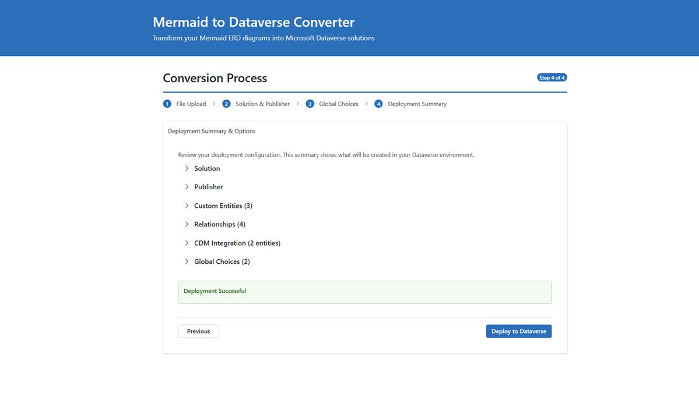

# Mermaid to Dataverse Converter

A modern React-based Azure App Service application that converts [Mermaid](https://www.mermaidchart.com/) ERD diagrams into Microsoft Dataverse entities, columns, and relationships. Built with React 18, Fluent UI v9, and automated Azure deployment.



## Key Features

- **Simple Web Interface**: Upload Mermaid files and deploy with a few clicks
- **Complete Schema Generation**: Creates publishers, solutions, entities, columns, and relationships
- **CDM Integration**: Automatically detects and maps to Microsoft Common Data Model entities
- **Relationship Support**: One-to-many relationships and junction tables for many-to-many
- **Global Choice Integration**: Map to existing choice sets or create new ones
- **Azure Security**: Key Vault integration with managed identity for secure credential management

## Architecture

### Modern Tech Stack
- **Frontend**: React 18 + TypeScript + Fluent UI v9
- **Backend**: Node.js + Express
- **Build Tool**: Vite (development and production builds)
- **Cloud**: Azure App Service with Managed Identity
- **Security**: Azure Key Vault for secure credential storage
- **Infrastructure**: Azure Bicep templates for repeatable deployments

### Key Components
- **Interactive Wizard**: Step-by-step guidance for Dataverse entity-relationship modeling
- **Live Validation**: Real-time ERD syntax checking and relationship validation
- **Secure Authentication**: Azure Managed Identity eliminates hardcoded credentials
- **Automated Deployment**: PowerShell scripts for repeatable infrastructure and code deployment
- **Modern UI**: Accessible, responsive design with Microsoft Fluent UI components

## 🚀 Quick Start

**Two steps to deploy everything:**

```powershell
# Clone the repository
git clone https://github.com/LuiseFreese/mermaid.git
cd mermaid

# Step 1: Create Azure infrastructure and Entra app (interactive)
.\scripts\setup-entra-app.ps1

# Step 2: Deploy the application
.\scripts\deploy.ps1 -AppName "your-app-name" -ResourceGroup "your-resource-group" -KeyVaultName "your-keyvault-name"
```

**The setup script will:**
- Create Entra App Registration with proper API permissions
- Deploy Azure infrastructure (App Service, Key Vault, Managed Identity, etc.)
- Configure secure authentication and Key Vault access
- Set up Dataverse application user (optional)

**The deploy script will:**
- Build the React frontend locally
- Package only necessary backend files (no node_modules)
- Deploy to Azure App Service
- Configure proper static file serving


### Prerequisites
- Azure CLI installed and logged in (`az login`)
- Node.js 18+ (for local frontend build)
- Power Platform Admin or Dataverse System Admin access (for Dataverse integration)

## Usage

### Accessing the Application

1. **Open the React Wizard**: Navigate to your deployed App Service URL (e.g., `https://your-app-name.azurewebsites.net`)
2. **Modern Interface**: Use the intuitive React-based wizard with Fluent UI components

### Step-by-Step Process

#### Step 1: Upload ERD File
- **Drag & Drop or Browse**: Upload your `.mmd` file containing an ERD diagram
- **Real-time Validation**: Get immediate feedback on syntax and structure
- **Auto-corrections**: Review and apply suggested improvements
- **CDM Detection**: See if your entities match Common Data Model standards

#### Step 2: Configure Solution & Publisher
- **Solution Name**: Enter a name for your Dataverse solution
- **Publisher Selection**: Choose existing publisher or create new one
- **Publisher Prefix**: Set a 3-8 character prefix for custom entities
- **Validation**: Real-time checking for naming conflicts

#### Step 3: Global Choices (Optional)
- **Upload JSON**: Add custom global choice definitions
- **Preview Choices**: Review choice sets before deployment
- **Integration**: Map to existing Dataverse choices automatically

#### Step 4: Review & Deploy
- **Configuration Summary**: Review all settings before deployment
- **CDM Options**: Choose between CDM entities or custom entities
- **Real-time Progress**: Watch deployment progress with live updates
- **Success Confirmation**: Get detailed results of what was created

### Sample Workflow


**Result**: Creates `Customer` and `Order` entities in Dataverse with proper relationships and all specified columns.

## Troubleshooting

### Common Issues

#### Deployment Connection Issues
```powershell
# Check application health
curl https://your-app-name.azurewebsites.net/health

# Test Dataverse connectivity
.\scripts\test-connection.ps1 -AppServiceName "your-app-name" -ResourceGroup "your-resource-group"
```

#### Infrastructure Issues
```powershell
# Re-run complete setup if resources were deleted
.\scripts\setup-entra-app.ps1

# Deploy just the application code
.\scripts\deploy.ps1 -AppName "your-app-name" -ResourceGroup "your-resource-group" -KeyVaultName "your-keyvault-name"
```

#### Frontend Issues
- **Static assets not loading**: Redeploy with `.\scripts\deploy.ps1` to fix static file serving
- **React app not starting**: Check browser console for JavaScript errors
- **API calls failing**: Verify Key Vault secrets and Managed Identity configuration

#### Development Issues
```bash
# Local development setup
npm install                    # Install backend dependencies
cd src/frontend && npm install # Install frontend dependencies

# Start development servers
npm run dev                    # Both frontend and backend concurrently
# OR separately:
npm run dev:backend           # Backend only (port 8080)
npm run dev:frontend          # Frontend only (port 3003)
```

### Getting Help

1. **Check Health Endpoint**: Visit `/health` to see system status
2. **Review Logs**: Use Azure App Service logs for detailed error information
3. **Validate Configuration**: Ensure all Azure resources are properly configured
4. **Test Locally**: Use local development mode to isolate issues

## Advanced Features

### CDM Integration
- **Automatic Detection**: System identifies entities matching Common Data Model
- **Smart Mapping**: Suggests using standard Dataverse entities (Account, Contact, etc.)
- **User Choice**: Option to use CDM entities or create custom ones
- **Relationship Preservation**: Maintains relationships between CDM and custom entities

### Global Choices Management
- **Custom Choices**: Create new option sets with your ERD deployment
- **Existing Integration**: Add existing Dataverse choices to your solution
- **Validation**: Prevents duplicates and naming conflicts
- **Solution Integration**: Automatically adds choices to your target solution

### Security Features
- **Managed Identity**: Passwordless authentication with Azure services
- **Key Vault Integration**: All secrets stored securely in Azure Key Vault
- **RBAC Permissions**: Principle of least privilege access control
- **Audit Trail**: All operations logged through Azure monitoring

## Documentation

- **[Developer & Architecture Guide](docs/DEVELOPER_ARCHITECTURE.md)** - System architecture and development setup
- **[Testing Guide](docs/TESTING.md)** - Comprehensive testing strategies, tools, and workflows
- **[Deployment Guide](docs/DEPLOYMENT.md)** - Detailed deployment instructions and troubleshooting
- **[Usage Guide](docs/USAGE-GUIDE.md)** - Comprehensive usage examples
- **[Global Choices Guide](docs/GLOBAL-CHOICES-GUIDE.md)** - Working with choice columns
- **[Mermaid Guide](docs/MERMAID-GUIDE.md)** - ERD syntax reference
- **[Relationship Types](docs/RELATIONSHIP_TYPES.md)** - Supported relationship patterns
- See the `examples/` directory for sample Mermaid ERD files


## Note on AI Usage

GitHub Copilot has been incredibly helpful in this project - especially for:

* **Creating countless Mermaid diagrams** - Generated all the example ERD files and documentation diagrams
* **Fleshing out examples** - Built comprehensive test cases and real-world scenarios  
* **Outlining documentation** - Structured guides and architectural documentation
* **Writing debug and cleanup scripts** - Automated testing and maintenance utilities
* **Hardening deployments** - Made scripts idempotent and error-resilient
* **Code commenting** - Added clear explanations so others can understand and contribute
* **React development** - TypeScript interfaces, component structure, and modern patterns
* **Azure integration** - Bicep templates, PowerShell scripts, and security configurations

Still, I'm super hesitant to use `Agent` mode - I just love to stay in the driver's seat! 

### Getting Help
- **Issues**: Report bugs or request features via [GitHub Issues](https://github.com/LuiseFreese/mermaid/issues)
- **Discussions**: Join community discussions in [GitHub Discussions](https://github.com/LuiseFreese/mermaid/discussions)
- **Documentation**: Check the comprehensive guides in the `docs/` directory
- **Examples**: Review sample files in the `examples/` directory

## Contributing

I welcome contributions! This is an open-source project that benefits from community input :-)

---

**Made with ❤️ by [Luise Freese](https://linkedin.com/in/luisefreese) → Read my blog at [m365princess.com](https://m365princess.com)**