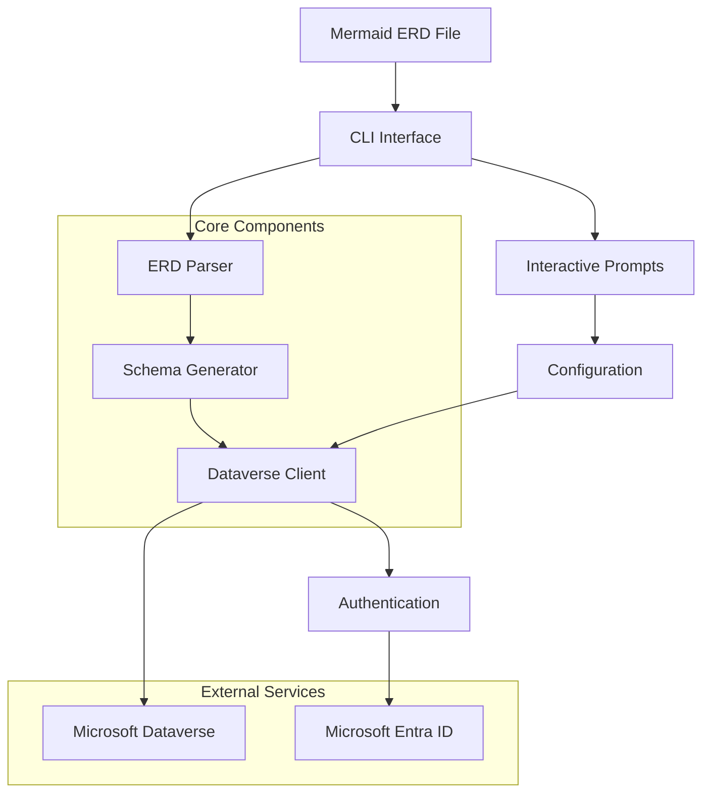
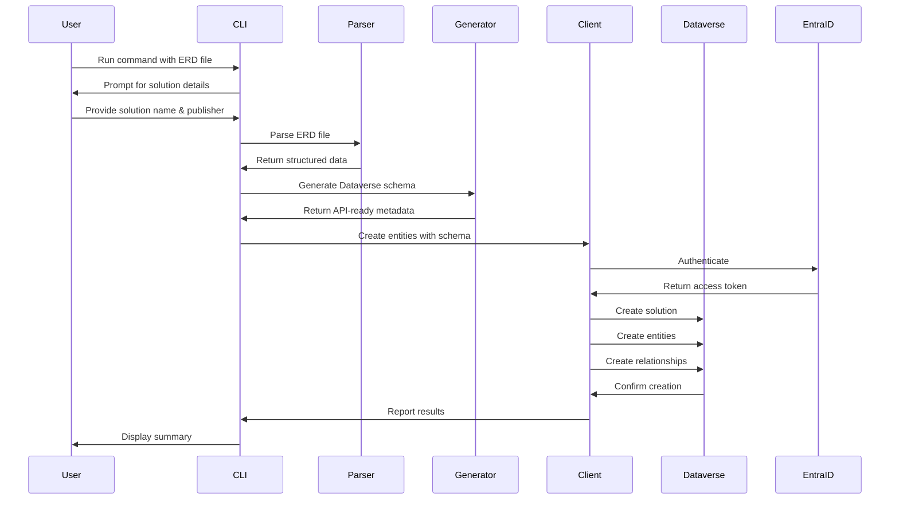
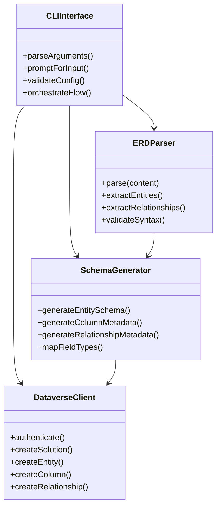

# Architecture Diagrams

## System Architecture

```mermaid
graph TB
    A[Mermaid ERD File] --> B[CLI Interface]
    B --> C[ERD Parser]
    C --> D[Schema Generator]
    D --> E[Dataverse Client]
    E --> F[Microsoft Dataverse]
    
    B --> G[Interactive Prompts]
    G --> H[Configuration]
    H --> E
    
    E --> I[Authentication]
    I --> J[Microsoft Entra ID]
    
    subgraph "Core Components"
        C
        D
        E
    end
    
    subgraph "External Services"
        F
        J
    end
```

## Data Flow Architecture

```mermaid
sequenceDiagram
    participant User
    participant CLI
    participant Parser
    participant Generator
    participant Client
    participant Dataverse
    participant EntraID

    User->>CLI: Run command with ERD file
    CLI->>User: Prompt for solution details
    User->>CLI: Provide solution name & publisher
    CLI->>Parser: Parse ERD file
    Parser->>CLI: Return structured data
    CLI->>Generator: Generate Dataverse schema
    Generator->>CLI: Return API-ready metadata
    CLI->>Client: Create entities with schema
    Client->>EntraID: Authenticate
    EntraID->>Client: Return access token
    Client->>Dataverse: Create solution
    Client->>Dataverse: Create entities
    Client->>Dataverse: Create relationships
    Dataverse->>Client: Confirm creation
    Client->>CLI: Report results
    CLI->>User: Display summary
```

## Component Relationships

```mermaid
classDiagram
    class CLIInterface {
        +parseArguments()
        +promptForInput()
        +validateConfig()
        +orchestrateFlow()
    }
    
    class ERDParser {
        +parse(content)
        +extractEntities()
        +extractRelationships()
        +validateSyntax()
    }
    
    class SchemaGenerator {
        +generateEntitySchema()
        +generateColumnMetadata()
        +generateRelationshipMetadata()
        +mapFieldTypes()
    }
    
    class DataverseClient {
        +authenticate()
        +createSolution()
        +createEntity()
        +createColumn()
        +createRelationship()
    }
    
    CLIInterface --> ERDParser
    CLIInterface --> SchemaGenerator
    CLIInterface --> DataverseClient
    ERDParser --> SchemaGenerator
    SchemaGenerator --> DataverseClient
```
