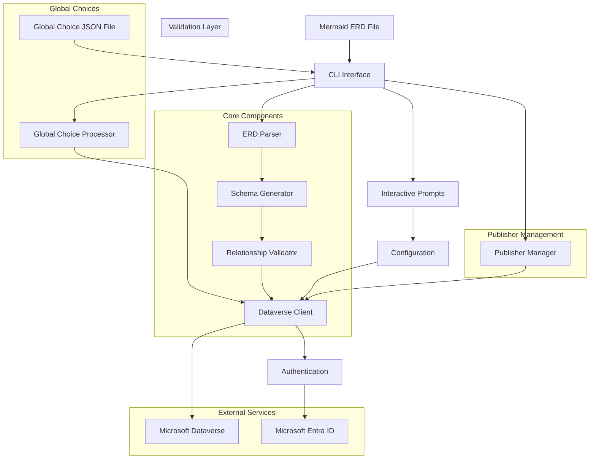
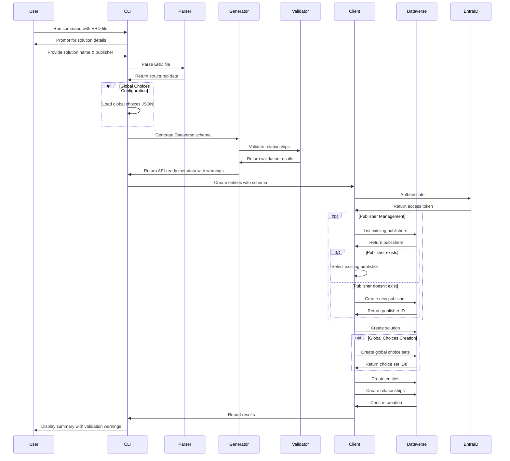
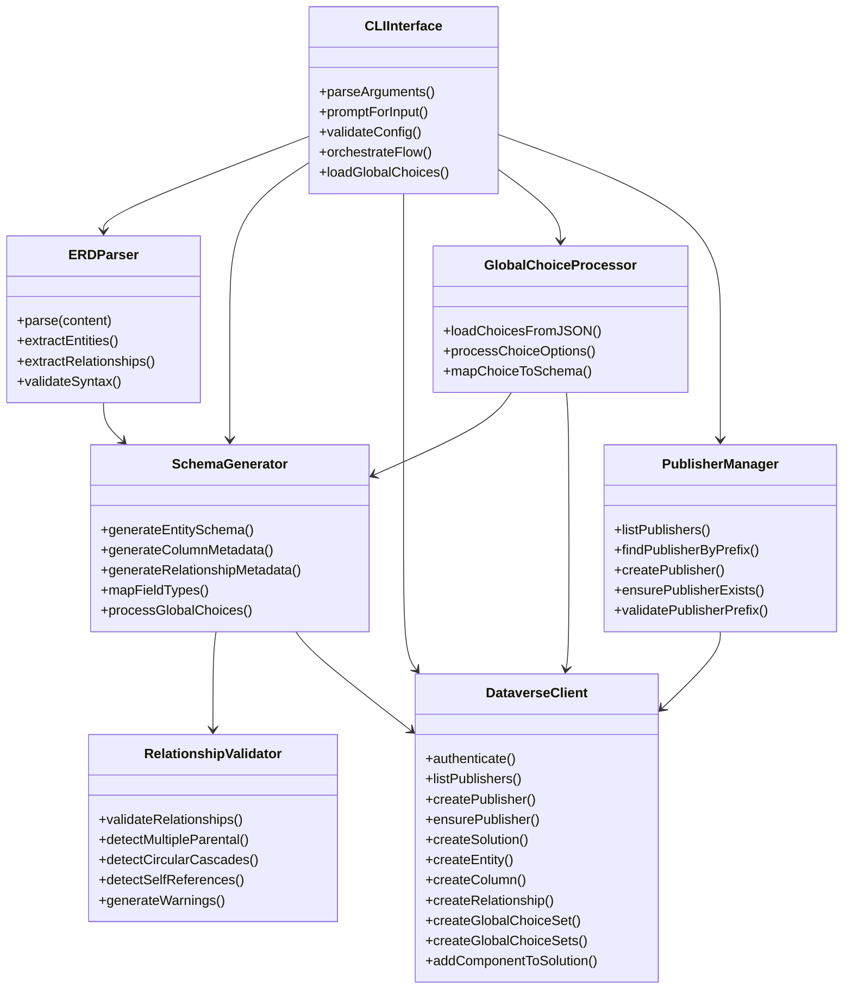

# Architecture Diagrams

## System Architecture

> **Note:** The Dataverse Client is responsible for both authentication and all API operations. After processing and validation, results and warnings are reported back to the CLI for user feedback.
>
> **Note:** The "Validation Layer" is a visual grouping for the Relationship Validator. Validation is performed during schema generation and is not a separate architectural layer.

## Data Flow Architecture

> **Note:** Error handling and reporting are integrated throughout the workflow. Any validation warnings, API errors, or configuration issues are surfaced to the user via CLI feedback at each relevant step.

## Component Relationships

> **Note:** The CLIInterface surfaces all validation warnings, errors, and results to the user, integrating feedback from every component in the workflow.
