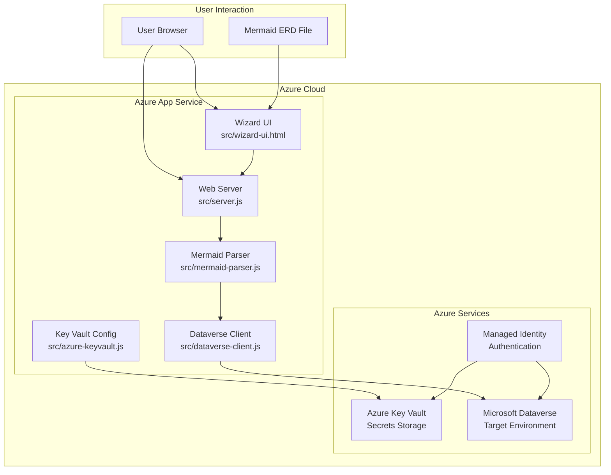
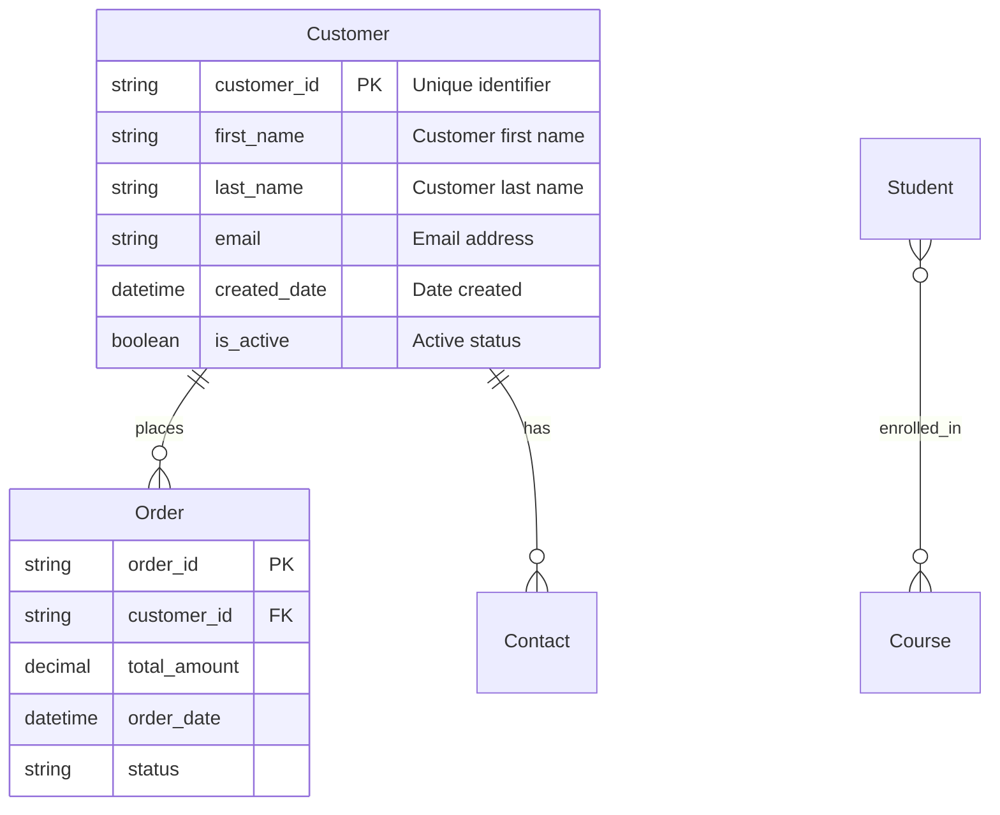
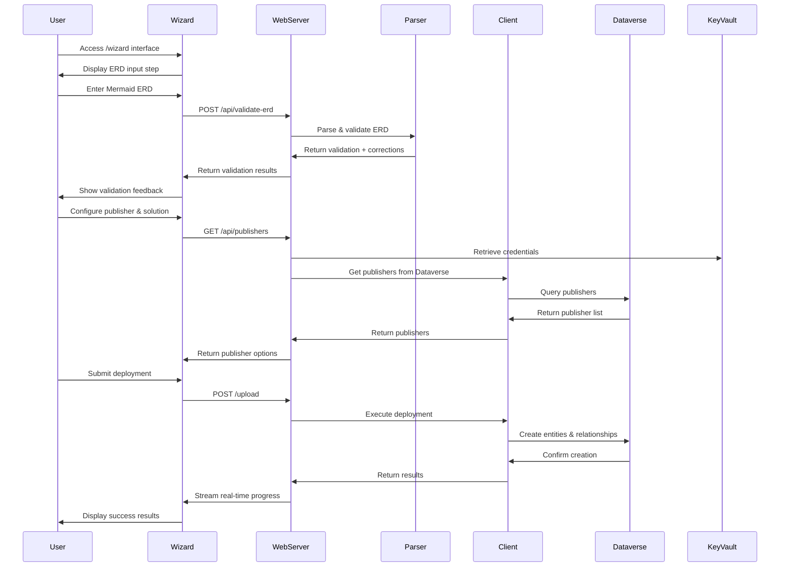
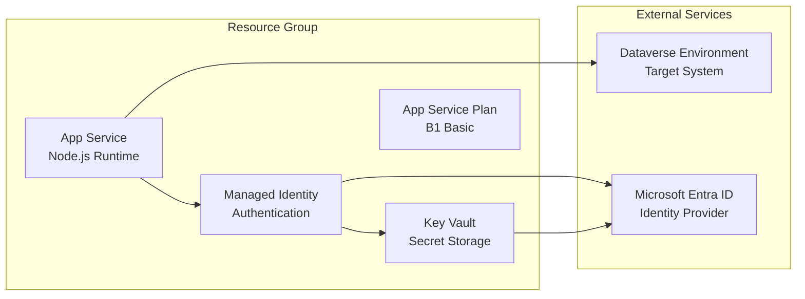

# Architecture Guide

This document provides a comprehensive overview of the Mermaid to Dataverse Converter application architecture.

## System Overview

The Mermaid to Dataverse Converter is a **Node.js web application** deployed on Azure App Service that converts Mermaid ERD diagrams into Microsoft Dataverse entities, columns, and relationships.

### Key Characteristics

- **Runtime**: Node.js (CommonJS modules)
- **Deployment**: Azure App Service with managed identity
- **Authentication**: Azure Key Vault with managed identity
- **Security**: No secrets in code, all credentials in Key Vault
- **UI**: Web-based wizard with real-time streaming logs
- **API**: RESTful endpoints for validation and testing
- **Logging**: Comprehensive logging to files and UI

## High-Level Architecture



## Application Structure

## Core Components

### 1. Web Server (`src/server.js`)

**Purpose**: Main application entry point providing web UI, wizard interface, and comprehensive API endpoints.

**Key Features**:
- HTTP server with both upload and wizard interfaces
- Real-time log streaming to frontend
- Health check and diagnostic endpoints
- CORS-enabled API for cross-origin requests
- Publisher and solution management
- Global choices integration
- CDM entity detection

**Main Endpoints**:

**UI Endpoints**:
- `GET /wizard` - **Primary wizard interface** for guided deployment

**Core API Endpoints**:
- `POST /upload` - **Primary deployment endpoint** from wizard with streaming logs
- `POST /api/validate-erd` - Enhanced ERD validation with corrections
- `POST /api/validate` - Validate Mermaid entities without creation

**Dataverse Integration**:
- `GET /api/dataverse-config` - Get Dataverse configuration
- `POST /api/test-dataverse` - Test Dataverse operations
- `GET /api/publishers` - Get available publishers from Dataverse

**Global Choices Management**:
- `POST /api/global-choices` - Create global choices from JSON
- `GET /api/global-choices-list` - List existing global choice sets

**System & Diagnostics**:
- `GET /health` - Application health status
- `GET /keyvault` - Key Vault connectivity test
- `GET /managed-identity` - Managed identity status
- `POST /api/cache/clear` - Clear system caches

**Test Endpoints** (Development):
- `POST /api/test-publisher-creation` - Test publisher creation
- `POST /api/test-fetch-uni-publisher` - Test publisher fetching
- `POST /api/test-config` - Test configuration

**Architecture Pattern**: RESTful API with wizard-driven user experience

### 2. Mermaid Parser (`src/mermaid-parser.js`)

**Purpose**: Parses Mermaid ERD syntax and extracts entities, attributes, and relationships.

**Key Features**:
- Regex-based parsing of Mermaid ERD syntax
- Entity extraction with attribute metadata and validation
- Relationship parsing with cardinality detection and validation
- Comprehensive ERD structure validation with auto-correction
- Support for primary keys (PK), foreign keys (FK), and constraints
- CDM entity detection and validation
- Warning system with categorized feedback
- Auto-correction capabilities for common issues

**Supported Syntax**:


**Validation & Auto-Correction**:
- Automatically adds missing primary keys
- Validates relationship consistency
- Suggests proper naming conventions

**Output Format**:
```javascript
{
  entities: [
    {
      name: "Customer",
      displayName: "Customer",
      attributes: [
        {
          name: "customer_id",
          type: "String",
          isPrimaryKey: true,
          isForeignKey: false,
          displayName: "Customer Id"
        }
      ]
    }
  ],
  relationships: [
    {
      fromEntity: "Customer",
      toEntity: "Order",
      cardinality: { type: "one-to-many" }
    }
  ]
}
```

### 3. Dataverse Client (`src/dataverse-client.js`)

**Purpose**: Handles all interactions with Microsoft Dataverse Web API.

**Key Features**:
- Authentication via Azure managed identity
- Publisher and solution management
- Entity creation with metadata
- Column and relationship creation
- Comprehensive error handling and logging

**Main Operations**:
- **Connection Testing**: Validates Dataverse connectivity
- **Publisher Management**: Creates or uses existing publishers with custom prefixes
- **Solution Management**: Creates or uses existing solutions with proper metadata
- **Entity Creation**: Creates custom entities with proper metadata and naming
- **Column Creation**: Adds custom columns to entities with full attribute support
- **Relationship Creation**: Establishes one-to-many and many-to-many relationships
- **Global Choice Management**: Creates and manages global choice sets
- **Logging**: Creates detailed logs in the file system and streams to UI

**Authentication Flow**:
```javascript
// Uses Azure managed identity for authentication
const credential = new ManagedIdentityCredential(clientId);
const token = await credential.getToken("https://yourorg.crm.dynamics.com/.default");
```

### 4. Azure Key Vault Configuration (`src/azure-keyvault.js`)

**Purpose**: Manages secure access to Azure Key Vault secrets.

**Key Features**:
- Managed identity authentication
- Secret retrieval with error handling
- Connection validation
- Fallback to environment variables for local development

**Required Secrets**:
- `DATAVERSE-URL` - Dataverse environment URL
- `CLIENT-ID` - App registration client ID
- `CLIENT-SECRET` - App registration secret
- `TENANT-ID` - Azure AD tenant ID
- `SOLUTION-NAME` - Default solution name

### 5. Wizard User Interface (`src/wizard-ui.html`)

**Purpose**: Modern web interface for guided Dataverse deployment.

**Key Features**:
- **Step-by-step wizard** for deployment configuration
- **Real-time ERD validation** with syntax checking
- **Publisher management** - select existing or create new
- **Global choices integration** - upload and manage global choice sets
- **CDM entity detection** - identify Common Data Model entities
- **Dry-run capabilities** - validate before actual deployment
- **Real-time progress tracking** with detailed logging

**Wizard Steps**:
1. **ERD Input** - Paste or validate Mermaid ERD syntax
2. **Publisher Selection** - Choose existing publisher or create new
3. **Solution Configuration** - Set solution name and details
4. **Global Choices** (Optional) - Upload global choice definitions
5. **Deployment** - Execute with real-time progress feedback

## Advanced Features

### Global Choices Integration

**Purpose**: Manage Dataverse global choice sets (option sets) alongside entity creation.

**Capabilities**:
- **Upload JSON definitions** of global choice sets
- **Automatic validation** of choice set structure
- **Dry-run preview** before creation
- **Solution integration** - automatically add created choices to solution
- **Conflict detection** - identify existing choices to avoid duplicates

**JSON Format**:
```json
{
  "globalChoices": [
    {
      "name": "priority_level",
      "displayName": "Priority Level",
      "description": "Priority levels for tasks",
      "options": [
        { "value": 1, "label": "High", "description": "High priority" },
        { "value": 2, "label": "Medium", "description": "Medium priority" },
        { "value": 3, "label": "Low", "description": "Low priority" }
      ]
    }
  ]
}
```

### Enhanced ERD Validation

**Purpose**: Provide comprehensive validation with auto-correction capabilities.

**Validation Features**:
- **Syntax checking** with specific error locations
- **Relationship validation** with cardinality verification
- **Naming convention enforcement** 
- **Auto-correction suggestions** for common issues
- **Warning categorization** (errors vs. warnings vs. info)

**Auto-Corrections**:
- Missing primary keys → Automatic ID field generation
- Invalid naming → Proper naming convention suggestions
- Relationship inconsistencies → Corrected relationship definitions

### Logging

**Purpose**: Provide detailed logging for debugging and auditing.

**Features**:
- **File-based logging** - Writes logs to files in `/logs` and `/src/logs` directories
- **Real-time streaming** - Sends log events to the wizard UI
- **Log levels** - ERROR, WARN, INFO, DEBUG levels for appropriate filtering
- **Log rotation** - Automatically manages log file sizes and archives old logs
- **IP and timestamp** - Records client IP and precise timestamps for audit trails

## Data Flow

### 1. Modern Wizard-Based Processing



### 2. Enhanced Schema Generation Process

1. **ERD Validation**: Real-time syntax checking with auto-corrections
2. **Parsing**: Extract entities, relationships, and attributes from Mermaid ERD
3. **Global Choices**: Process custom global choice definitions
4. **Publisher Management**: Create or validate publisher with custom prefix
5. **Solution Management**: Create or validate solution container
6. **Entity Creation**: Create custom entities with proper naming conventions
7. **Column Creation**: Add custom columns for each attribute with metadata
8. **Relationship Creation**: Establish lookup relationships between entities
9. **Global Choice Integration**: Add global choices to solution if specified
10. **Logging**: Record detailed logs of all operations

## Security Architecture

### Authentication & Authorization

- **Azure Managed Identity**: No secrets stored in application code
- **Key Vault Integration**: All sensitive configuration in Azure Key Vault
- **Least Privilege**: Managed identity has minimal required permissions

### Security Layers

1. **Transport Security**: HTTPS for all communications
2. **Identity Security**: Managed identity for Azure service authentication
3. **Secret Management**: Azure Key Vault for credential storage
4. **API Security**: Authentication required for Dataverse operations

### Environment Variables

**Production (Azure App Service)**:
```bash
KEY_VAULT_URI=https://your-keyvault.vault.azure.net/
AUTH_MODE=managed-identity
MANAGED_IDENTITY_CLIENT_ID=your-managed-identity-id
PORT=8080
```

**Local Development**:
```bash
DATAVERSE_URL=https://yourorg.crm.dynamics.com/
CLIENT_ID=xxxxxxxx-xxxx-xxxx-xxxx-xxxxxxxxxxxx
CLIENT_SECRET=your-client-secret
TENANT_ID=your-tenant-id
PORT=8080
```

## Deployment Architecture

### Azure Resources



### Deployment Process

1. **Resource Creation**: Azure App Service, Key Vault, Managed Identity
2. **Permission Assignment**: Grant managed identity access to Key Vault and Dataverse
3. **Secret Configuration**: Store Dataverse credentials in Key Vault
4. **Application Deployment**: Deploy Node.js application via PowerShell script
5. **Validation**: Test application connectivity and functionality

## Error Handling

### Error Categories

1. **Validation Errors**: Invalid Mermaid syntax or missing required fields
2. **Authentication Errors**: Key Vault or Dataverse authentication failures
3. **Network Errors**: Connectivity issues with external services
4. **Business Logic Errors**: Dataverse entity creation conflicts

### Recovery Strategies

- **Graceful Degradation**: Continue with partial functionality when possible
- **Retry Logic**: Automatic retry for transient failures
- **User Feedback**: Clear error messages with actionable guidance
- **Fallback Options**: Dry-run mode for validation without creation

## Best Practices

### Development

- **Separation of Concerns**: Each module has a single responsibility
- **Error First**: Always handle errors before success cases
- **Logging**: Comprehensive logging for debugging and monitoring
- **Testing**: Unit tests for core logic, integration tests for API

### Security

- **No Hardcoded Secrets**: All sensitive data in Key Vault
- **Principle of Least Privilege**: Minimal required permissions
- **Input Validation**: Validate all user inputs
- **Output Encoding**: Prevent injection attacks

### Performance & Caching

**Caching Strategy**:
- **Publisher Cache**: 10-minute cache for Dataverse publishers
- **Global Choices Cache**: 5-minute cache for global choice sets
- **Cache Invalidation**: Manual cache clearing via `/api/cache/clear`
- **Development Optimization**: Reduces repeated Dataverse API calls

**Memory Management**:
- In-memory caching for frequently accessed data
- Automatic cache expiration with configurable duration
- Cache hit/miss logging for performance monitoring
- **Graceful Shutdown**: Handle SIGTERM (termination request) and SIGINT (interrupt signal) properly to allow the application to finish current operations before shutting down
- **Resource Cleanup**: Clean up temporary files and connections
- **Monitoring**: Track key business and technical metrics
