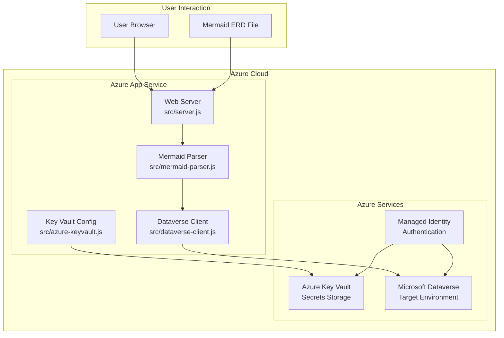
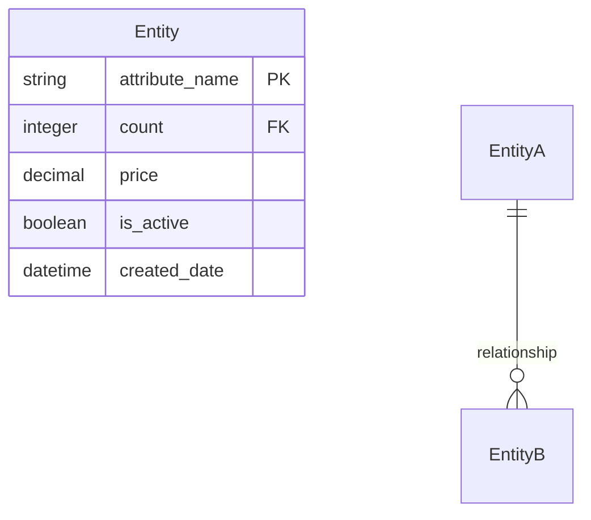
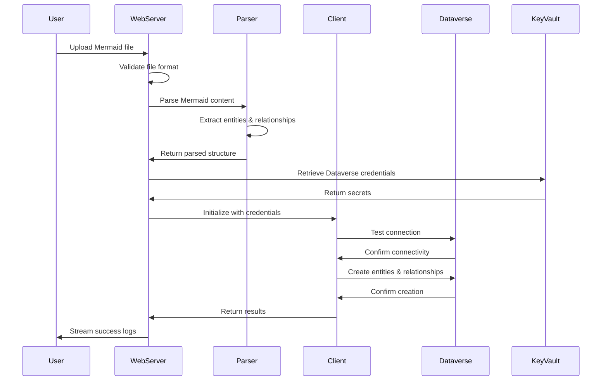
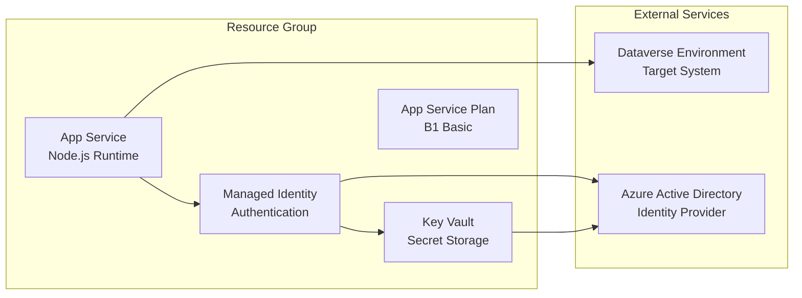

# Architecture Guide

This document provides a comprehensive overview of the Mermaid to Dataverse Converter application architecture.

## System Overview

The Mermaid to Dataverse Converter is a **production-ready Node.js web application** deployed on Azure App Service that converts Mermaid ERD diagrams into Microsoft Dataverse entities, columns, and relationships.

### Key Characteristics

- **Runtime**: Node.js (CommonJS modules)
- **Deployment**: Azure App Service with managed identity
- **Authentication**: Azure Key Vault with managed identity
- **Security**: No secrets in code, all credentials in Key Vault
- **UI**: Web-based with real-time streaming logs
- **API**: RESTful endpoints for validation and testing

## High-Level Architecture



## Application Structure

### Directory Layout

```
📁 mermaid-to-dataverse/
├── 📁 src/                    # Core application source code
│   ├── 📄 server.js           # Main web server and API endpoints
│   ├── 📄 mermaid-parser.js   # Mermaid ERD parsing logic
│   ├── 📄 dataverse-client.js # Dataverse Web API integration
│   └── 📄 azure-keyvault.js   # Azure Key Vault configuration
├── 📁 docs/                   # Documentation
├── 📁 examples/               # Sample Mermaid ERD files
├── 📁 tests/                  # Integration and unit tests
├── 📁 scripts/                # Setup and utility scripts
├── 📄 deploy.ps1              # PowerShell deployment script
├── 📄 package.json            # Node.js project configuration
└── 📄 README.md               # Project documentation
```

## Core Components

### 1. Web Server (`src/server.js`)

**Purpose**: Main application entry point providing web UI and API endpoints.

**Key Features**:
- HTTP server with file upload capabilities
- Real-time log streaming to frontend
- Health check and diagnostic endpoints
- CORS-enabled API for cross-origin requests

**Main Endpoints**:
- `GET /` - Web interface for file upload
- `POST /upload` - File upload and processing with streaming logs
- `GET /health` - Application health status
- `GET /keyvault` - Key Vault connectivity test
- `GET /managed-identity` - Managed identity status
- `POST /api/validate` - Validate Mermaid entities without creation
- `POST /api/test-dataverse` - Test Dataverse operations

**Architecture Pattern**: Event-driven with streaming responses

### 2. Mermaid Parser (`src/mermaid-parser.js`)

**Purpose**: Parses Mermaid ERD syntax and extracts entities, attributes, and relationships.

**Key Features**:
- Regex-based parsing of Mermaid ERD syntax
- Entity extraction with attribute metadata
- Relationship parsing with cardinality detection
- Validation of ERD structure
- Support for primary keys (PK) and foreign keys (FK)

**Supported Syntax**:


**Output Format**:
```javascript
{
  entities: [
    {
      name: "Customer",
      displayName: "Customer",
      attributes: [
        {
          name: "customer_id",
          type: "String",
          isPrimaryKey: true,
          isForeignKey: false,
          displayName: "Customer Id"
        }
      ]
    }
  ],
  relationships: [
    {
      fromEntity: "Customer",
      toEntity: "Order",
      cardinality: { type: "one-to-many" }
    }
  ]
}
```

### 3. Dataverse Client (`src/dataverse-client.js`)

**Purpose**: Handles all interactions with Microsoft Dataverse Web API.

**Key Features**:
- Authentication via Azure managed identity
- Publisher and solution management
- Entity creation with metadata
- Column and relationship creation
- Comprehensive error handling and logging

**Main Operations**:
- **Connection Testing**: Validates Dataverse connectivity
- **Publisher Management**: Creates or uses existing publishers
- **Solution Management**: Creates or uses existing solutions
- **Entity Creation**: Creates custom entities with proper metadata
- **Column Creation**: Adds custom columns to entities
- **Relationship Creation**: Establishes one-to-many relationships

**Authentication Flow**:
```javascript
// Uses Azure managed identity for authentication
const credential = new ManagedIdentityCredential(clientId);
const token = await credential.getToken("https://yourorg.crm.dynamics.com/.default");
```

### 4. Key Vault Configuration (`src/azure-keyvault.js`)

**Purpose**: Manages secure access to Azure Key Vault secrets.

**Key Features**:
- Managed identity authentication
- Secret retrieval with error handling
- Connection validation
- Fallback to environment variables for local development

**Required Secrets**:
- `DATAVERSE-URL` - Dataverse environment URL
- `CLIENT-ID` - App registration client ID
- `CLIENT-SECRET` - App registration secret
- `TENANT-ID` - Azure AD tenant ID
- `SOLUTION-NAME` - Default solution name

## Data Flow

### 1. File Upload and Processing



### 2. Schema Generation Process

1. **Parsing**: Extract entities and relationships from Mermaid ERD
2. **Validation**: Ensure all entities have primary keys
3. **Transformation**: Convert to Dataverse metadata format
4. **Publisher Creation**: Create or validate publisher
5. **Solution Creation**: Create or validate solution
6. **Entity Creation**: Create custom entities with primary name fields
7. **Column Creation**: Add custom columns for each attribute
8. **Relationship Creation**: Establish lookup relationships

## Security Architecture

### Authentication & Authorization

- **Azure Managed Identity**: No secrets stored in application code
- **Key Vault Integration**: All sensitive configuration in Azure Key Vault
- **Least Privilege**: Managed identity has minimal required permissions

### Security Layers

1. **Transport Security**: HTTPS for all communications
2. **Identity Security**: Managed identity for Azure service authentication
3. **Secret Management**: Azure Key Vault for credential storage
4. **API Security**: Authentication required for Dataverse operations

### Environment Variables

**Production (Azure App Service)**:
```bash
KEY_VAULT_URI=https://your-keyvault.vault.azure.net/
AUTH_MODE=managed-identity
MANAGED_IDENTITY_CLIENT_ID=your-managed-identity-id
PORT=8080
```

**Local Development**:
```bash
DATAVERSE_URL=https://yourorg.crm.dynamics.com/
CLIENT_ID=xxxxxxxx-xxxx-xxxx-xxxx-xxxxxxxxxxxx
CLIENT_SECRET=your-client-secret
TENANT_ID=your-tenant-id
PORT=8080
```

## Deployment Architecture

### Azure Resources



### Deployment Process

1. **Resource Creation**: Azure App Service, Key Vault, Managed Identity
2. **Permission Assignment**: Grant managed identity access to Key Vault and Dataverse
3. **Secret Configuration**: Store Dataverse credentials in Key Vault
4. **Application Deployment**: Deploy Node.js application via PowerShell script
5. **Validation**: Test application connectivity and functionality

## Performance Considerations

### Scalability

- **Horizontal Scaling**: App Service can scale out to multiple instances
- **Vertical Scaling**: App Service plan can be upgraded for more resources
- **Caching**: Managed identity tokens are cached automatically

### Optimization

- **Connection Pooling**: HTTP keep-alive for Dataverse API calls
- **Error Handling**: Comprehensive retry logic for transient failures
- **Resource Management**: Proper cleanup of uploaded files
- **Memory Management**: Streaming for large file uploads

## Monitoring & Observability

### Application Insights Integration

- **Request Tracking**: Monitor HTTP requests and response times
- **Dependency Tracking**: Track Dataverse API calls and Key Vault access
- **Exception Tracking**: Capture and analyze application errors
- **Custom Events**: Log business-specific events

### Logging Strategy

- **Console Logging**: Structured logging with timestamps
- **Real-time Streaming**: Live log streaming to web interface
- **Azure App Service Logs**: Native platform logging
- **Health Checks**: Multiple endpoints for system validation

### Key Metrics

- **Upload Success Rate**: Percentage of successful file uploads
- **Parse Success Rate**: Percentage of successful Mermaid parsing
- **Dataverse Creation Rate**: Percentage of successful entity creation
- **Response Times**: API endpoint performance metrics

## Error Handling

### Error Categories

1. **Validation Errors**: Invalid Mermaid syntax or missing required fields
2. **Authentication Errors**: Key Vault or Dataverse authentication failures
3. **Network Errors**: Connectivity issues with external services
4. **Business Logic Errors**: Dataverse entity creation conflicts

### Recovery Strategies

- **Graceful Degradation**: Continue with partial functionality when possible
- **Retry Logic**: Automatic retry for transient failures
- **User Feedback**: Clear error messages with actionable guidance
- **Fallback Options**: Dry-run mode for validation without creation

## Extension Points

### Adding New Data Types

1. Update parser to recognize new type syntax
2. Add type mapping in schema generation
3. Update Dataverse client to handle new metadata
4. Add validation rules for new types

### Adding New Relationship Types

1. Extend relationship parsing logic
2. Add new relationship metadata generation
3. Update Dataverse relationship creation
4. Add validation for new relationship constraints

### Adding New Output Formats

1. Create new generator class
2. Implement format-specific metadata transformation
3. Add new API endpoint for format
4. Update web interface with new options

## Best Practices

### Development

- **Separation of Concerns**: Each module has a single responsibility
- **Error First**: Always handle errors before success cases
- **Logging**: Comprehensive logging for debugging and monitoring
- **Testing**: Unit tests for core logic, integration tests for API

### Security

- **No Hardcoded Secrets**: All sensitive data in Key Vault
- **Principle of Least Privilege**: Minimal required permissions
- **Input Validation**: Validate all user inputs
- **Output Encoding**: Prevent injection attacks

### Operations

- **Health Checks**: Multiple endpoints for different system components
- **Graceful Shutdown**: Handle SIGTERM and SIGINT properly
- **Resource Cleanup**: Clean up temporary files and connections
- **Monitoring**: Track key business and technical metrics

## Future Architecture Considerations

### Potential Enhancements

1. **Message Queue Integration**: For handling large batch operations
2. **Caching Layer**: Redis for frequently accessed data
3. **API Rate Limiting**: Protect against abuse
4. **Multi-tenant Support**: Support for multiple Dataverse environments
5. **Webhook Integration**: Real-time notifications for entity changes

### Scalability Improvements

1. **Microservices**: Split parsing and deployment into separate services
2. **Event-Driven Architecture**: Use Azure Service Bus for async processing
3. **Container Deployment**: Migrate to Azure Container Apps
4. **CDN Integration**: Cache static assets for better performance
