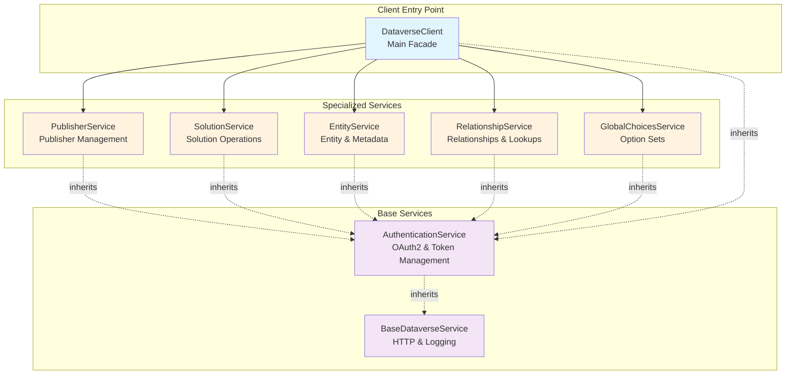

# Dataverse Modular Architecture

This document describes the current state of the Dataverse integration layer, which uses a modular service architecture to manage all Microsoft Dataverse Web API interactions.

## Table of Contents

- [Overview](#overview)
- [Architecture Principles](#architecture-principles)
- [Service Hierarchy](#service-hierarchy)
- [Core Services](#core-services)
- [Integration Patterns](#integration-patterns)
- [Usage Examples](#usage-examples)
- [Testing Strategy](#testing-strategy)
- [Best Practices](#best-practices)

---

## Overview

The Dataverse integration layer consists of **8 specialized services** organized in a hierarchical structure with clear separation of concerns. The architecture uses the **Facade pattern** with the `DataverseClient` serving as the main entry point that delegates operations to specialized services.

### Key Characteristics

- **Modular Design**: Each service has a focused responsibility
- **Shared Authentication**: All services inherit from a common authentication base
- **Facade Pattern**: `DataverseClient` provides a unified interface while delegating to specialized services
- **Clean Inheritance**: Services extend from base classes that provide common functionality
- **No Circular Dependencies**: Careful import structuring prevents dependency cycles

### Architecture Diagram



---

## Architecture Principles

### 1. Single Responsibility

Each service handles a specific domain of Dataverse operations:
- **Publishers**: Publisher creation and management
- **Solutions**: Solution lifecycle and components
- **Entities**: Entity metadata and creation
- **Relationships**: Lookup fields and relationship metadata
- **Global Choices**: Option set creation and management

### 2. Inheritance Hierarchy

```
BaseDataverseService (HTTP, logging, utilities)
    ↓
DataverseAuthenticationService (OAuth2, token management)
    ↓
├── DataverseClient (main facade + delegation)
├── DataversePublisherService
├── DataverseSolutionService
├── DataverseEntityService
├── DataverseRelationshipService
└── DataverseGlobalChoicesService
```

### 3. Delegation Pattern

The `DataverseClient` acts as a facade:
- Initializes all specialized services
- Delegates method calls to appropriate services
- Provides a simplified API for consumers
- Maintains backward compatibility

### 4. Shared State Management

Services share authentication state through parent client binding:
- Parent client provides `makeRequest` method to all services
- Services receive parent reference during construction
- No duplicate HTTP clients or authentication logic
- Consistent token management across all services

---

## Service Hierarchy

### Base Layer

#### BaseDataverseService
**Location**: `src/backend/dataverse/services/base-dataverse-service.js`

**Responsibilities**:
- HTTP client configuration
- Request/response logging
- Retry logic with exponential backoff
- Common utility methods (`sleep`, `_log`)
- Abstract `makeRequest` method definition

**Key Methods**:
```javascript
async makeRequest(method, url, data, options)  // Abstract - must be implemented
_log(...args)                                   // Logging utility
sleep(ms)                                       // Async delay utility
```

**Usage**: Never instantiated directly. Provides foundation for all other services.

---

### Authentication Layer

#### DataverseAuthenticationService
**Location**: `src/backend/dataverse/services/dataverse-authentication-service.js`

**Responsibilities**:
- OAuth2 client credentials flow
- Azure Managed Identity authentication
- Federated credential support
- Token acquisition and caching
- Token expiry management

**Authentication Modes**:
1. **Client Secret** (Development)
   - Requires: `CLIENT_ID`, `CLIENT_SECRET`, `TENANT_ID`
   - Use case: Local development, testing

2. **Managed Identity** (Production)
   - Requires: Managed Identity enabled on Azure App Service
   - Use case: Production deployments on Azure

3. **Federated Credentials** (Advanced)
   - Requires: `AZURE_FEDERATED_TOKEN_FILE`
   - Use case: Kubernetes/container workloads

**Key Methods**:
```javascript
async ensureToken()                             // Acquires/refreshes access token
async makeRequest(method, url, data, options)  // Authenticated HTTP requests
async testConnection()                          // Validates Dataverse connectivity
async whoAmI()                                  // Gets current user info
```

**Token Management**:
- Tokens cached with expiry tracking
- Automatic refresh when expired
- 5-minute buffer before actual expiry
- Scope: `{dataverseUrl}/.default`

---

### Facade Layer

#### DataverseClient
**Location**: `src/backend/dataverse/services/dataverse-client.js`

**Responsibilities**:
- Main entry point for all Dataverse operations
- Initializes and orchestrates specialized services
- Provides backward-compatible delegation methods
- Serves as parent for service `makeRequest` binding

**Initialization**:
```javascript
const client = new DataverseClient({
  dataverseUrl: 'https://org.crm.dynamics.com',
  clientId: 'your-client-id',
  clientSecret: 'your-secret',
  tenantId: 'your-tenant-id'
});
```

**Service Access**:
```javascript
// Access specialized services directly
await client.publisherService.getPublishers();
await client.solutionService.getSolutions();
await client.entityService.createEntity(payload);

// Or use delegation methods
await client.getPublishers();      // Delegates to publisherService
await client.getSolutions();        // Delegates to solutionService
await client.createEntity(payload); // Delegates to entityService
```

**Delegation Methods**:
- All high-level business methods delegate to specialized services
- Provides consistent interface for consumers
- Maintains backward compatibility with previous architecture
- Simplifies testing and mocking

---

## Core Services

### DataversePublisherService
**Location**: `src/backend/dataverse/services/dataverse-publisher-service.js`

**Responsibilities**:
- Publisher existence checking
- Publisher creation with validation
- Publisher metadata retrieval
- Customization prefix management

**Key Methods**:
```javascript
async getPublishers()                           // Lists all publishers
async createPublisher(publisherData)            // Creates new publisher
async getPublisher(identifier)                  // Gets publisher by ID or unique name
async updatePublisher(identifier, updateData)   // Updates publisher metadata
async ensurePublisher(publisherConfig)          // Creates or retrieves publisher
async checkPublisherExists(uniqueName)          // Validates publisher existence
```

**Publisher Creation**:
```javascript
const publisher = await client.createPublisher({
  uniqueName: 'mycompany',
  friendlyName: 'My Company',
  customizationPrefix: 'mc',
  description: 'Company publisher for custom solutions'
});
```

**Use Cases**:
- Setting up new Dataverse environments
- Validating publisher before solution creation
- Managing organizational publishers
- Prefix verification for custom entities

---

### DataverseSolutionService
**Location**: `src/backend/dataverse/services/dataverse-solution-service.js`

**Responsibilities**:
- Solution lifecycle management
- Solution component tracking
- Solution import/export operations
- Component addition to solutions

**Key Methods**:
```javascript
async getSolutions(options)                     // Lists solutions with filtering
async createSolution(data, prefix, name)        // Creates new solution
async updateSolution(name, updateData)          // Updates solution metadata
async deleteSolution(name, options)             // Deletes solution
async ensureSolution(config, prefix, name)      // Creates or retrieves solution
async getSolutionComponents(solutionName)       // Lists all solution components
async exportSolution(solutionName, options)     // Exports solution package
async checkSolutionExists(uniqueName)           // Validates solution existence
async addComponentToSolution(componentId, type, solutionName)  // Adds component
```

**Solution Creation**:
```javascript
const solution = await client.createSolution({
  uniqueName: 'MyCustomSolution',
  friendlyName: 'My Custom Solution',
  version: '1.0.0.0',
  description: 'Custom business solution'
}, 'mc', 'My Company');
```

**Component Types**:
- Entities (componenttype = 1)
- Option Sets (componenttype = 9)
- Relationships (componenttype = 10)
- Forms, views, charts, etc.

---

### DataverseEntityService
**Location**: `src/backend/dataverse/services/dataverse-entity-service.js`

**Responsibilities**:
- Entity metadata creation
- Custom column/attribute creation
- Entity schema management
- Primary key configuration
- Ownership type handling

**Key Methods**:
```javascript
async createEntity(entityPayload)               // Creates custom entity
async createColumn(entityName, columnPayload)   // Adds custom column
async getEntityMetadata(entityName)             // Retrieves entity metadata
async checkEntityExists(logicalName)            // Validates entity existence
async deleteEntity(entityName)                  // Deletes custom entity
async updateEntityMetadata(name, updateData)    // Updates entity metadata
```

**Entity Creation**:
```javascript
const entity = await client.createEntity({
  '@odata.type': 'Microsoft.Dynamics.CRM.EntityMetadata',
  SchemaName: 'mc_CustomEntity',
  DisplayName: { '@odata.type': 'Microsoft.Dynamics.CRM.Label',
    LocalizedLabels: [{ Label: 'Custom Entity', LanguageCode: 1033 }]
  },
  PluralDisplayName: { '@odata.type': 'Microsoft.Dynamics.CRM.Label',
    LocalizedLabels: [{ Label: 'Custom Entities', LanguageCode: 1033 }]
  },
  OwnershipType: 'UserOwned',
  HasActivities: true,
  HasNotes: true
});
```

**Column Types Supported**:
- String (Single Line, Multi-Line)
- Integer (Whole Number)
- Decimal (Decimal Number, Currency)
- DateTime (Date Only, Date and Time)
- Boolean (Two Options)
- Lookup (Customer, Single)
- Choice (Local, Global)
- File, Image

---

### DataverseRelationshipService
**Location**: `src/backend/dataverse/services/dataverse-relationship-service.js`

**Responsibilities**:
- One-to-many relationship creation
- Many-to-many relationship creation
- Lookup field management
- Relationship schema management
- Cascading behavior configuration

**Key Methods**:
```javascript
async createOneToManyRelationship(relationshipData)  // Creates 1:N relationship
async createManyToManyRelationship(relationshipData) // Creates N:N relationship
async getRelationships(entityName)                   // Lists entity relationships
async checkRelationshipExists(referencingEntity, referencedEntity, schemaName)
async deleteRelationship(schemaName)                 // Deletes relationship
async createLookupField(entityName, lookupData)      // Creates lookup column
```

**One-to-Many Relationship**:
```javascript
const relationship = await client.createOneToManyRelationship({
  '@odata.type': 'Microsoft.Dynamics.CRM.OneToManyRelationshipMetadata',
  SchemaName: 'mc_account_customentity',
  ReferencingEntity: 'mc_customentity',
  ReferencedEntity: 'account',
  ReferencingAttribute: 'mc_accountid',
  Lookup: {
    SchemaName: 'mc_accountid',
    DisplayName: { LocalizedLabels: [{ Label: 'Account', LanguageCode: 1033 }] }
  }
});
```

**Cascade Configuration**:
- `Cascade` - Child records follow parent
- `Active` - Only active records affected
- `UserOwned` - Respects user ownership
- `NoCascade` - No automatic cascade
- `RemoveLink` - Remove relationship only
- `Restrict` - Prevent deletion if children exist

---

### DataverseGlobalChoicesService
**Location**: `src/backend/dataverse/services/dataverse-global-choices-service.js`

**Responsibilities**:
- Global option set creation
- Option set metadata management
- Option value configuration
- Choice categorization
- Solution integration

**Key Methods**:
```javascript
async getGlobalChoiceSets(options)              // Lists all global choice sets
async createGlobalChoiceSet(choiceData)         // Creates new global choice set
async updateGlobalChoiceSet(name, updateData)   // Updates choice set
async deleteGlobalChoiceSet(name)               // Deletes choice set
async checkGlobalChoiceSetExists(name)          // Validates existence
async categorizeChoices(choices)                // Categorizes by system/custom
```

**Global Choice Set Creation**:
```javascript
const choiceSet = await client.createGlobalChoiceSet({
  '@odata.type': 'Microsoft.Dynamics.CRM.OptionSetMetadata',
  Name: 'mc_priority',
  DisplayName: { LocalizedLabels: [{ Label: 'Priority', LanguageCode: 1033 }] },
  OptionSetType: 'Picklist',
  Options: [
    { Value: 1, Label: { LocalizedLabels: [{ Label: 'Low', LanguageCode: 1033 }] } },
    { Value: 2, Label: { LocalizedLabels: [{ Label: 'Medium', LanguageCode: 1033 }] } },
    { Value: 3, Label: { LocalizedLabels: [{ Label: 'High', LanguageCode: 1033 }] } }
  ]
});
```

**Choice Types**:
- **Picklist**: Single selection
- **MultiSelectPicklist**: Multiple selection
- **State**: Record state (Active/Inactive)
- **Status**: Status reason codes

---

## Integration Patterns

### Pattern 1: Direct Service Usage

Access specialized services directly for fine-grained control:

```javascript
const { DataverseClient } = require('./dataverse/services/dataverse-client');

const client = new DataverseClient(config);

// Direct service access
const publishers = await client.publisherService.getPublishers();
const solutions = await client.solutionService.getSolutions({ includeComponents: true });
const entities = await client.entityService.getEntityMetadata('account');
```

**When to use**:
- Need access to service-specific methods
- Want to mock individual services in tests
- Performing batch operations on single service
- Need fine-grained error handling per service

---

### Pattern 2: Facade Delegation

Use the main client's delegation methods for simplified access:

```javascript
const client = new DataverseClient(config);

// Delegation methods - simpler API
const publishers = await client.getPublishers();
const solutions = await client.getSolutions();
const entity = await client.createEntity(payload);
```

**When to use**:
- Standard operations without special requirements
- Backward compatibility with existing code
- Simpler API surface for consumers
- Less coupling to internal service structure

---

### Pattern 3: Service Composition

Combine multiple services in orchestrated workflows:

```javascript
async function deployCustomSolution(config, entities) {
  const client = new DataverseClient(config);
  
  // 1. Ensure publisher exists
  const publisher = await client.publisherService.ensurePublisher({
    uniqueName: 'mycompany',
    friendlyName: 'My Company',
    customizationPrefix: 'mc'
  });
  
  // 2. Create solution
  const solution = await client.solutionService.createSolution({
    uniqueName: 'MyCustomSolution',
    friendlyName: 'My Custom Solution',
    version: '1.0.0.0'
  }, publisher.customizationprefix, publisher.friendlyname);
  
  // 3. Create entities and add to solution
  for (const entityDef of entities) {
    const entity = await client.entityService.createEntity(entityDef);
    
    await client.solutionService.addComponentToSolution(
      entity.MetadataId,
      1,  // Entity component type
      solution.uniquename
    );
  }
  
  // 4. Create relationships
  for (const rel of relationships) {
    const relationship = await client.relationshipService.createOneToManyRelationship(rel);
  }
  
  return solution;
}
```

**When to use**:
- Complex multi-step workflows
- Deployment orchestration
- Transaction-like operations
- Custom business logic

---

### Pattern 4: Service Extension

Extend specialized services for custom functionality:

```javascript
const { DataversePublisherService } = require('./dataverse/services/dataverse-publisher-service');

class CustomPublisherService extends DataversePublisherService {
  constructor(config, parentClient) {
    super(config, parentClient);
  }
  
  async createPublisherWithDefaults(uniqueName) {
    return this.createPublisher({
      uniqueName,
      friendlyName: uniqueName.toUpperCase(),
      customizationPrefix: uniqueName.substring(0, 5).toLowerCase(),
      description: `Auto-generated publisher for ${uniqueName}`
    });
  }
  
  async getPublishersByPrefix(prefix) {
    const allPublishers = await this.getPublishers();
    return allPublishers.filter(p => 
      p.customizationprefix.startsWith(prefix)
    );
  }
}

// Use custom service
const customService = new CustomPublisherService(config, client);
await customService.createPublisherWithDefaults('myorg');
```

**When to use**:
- Organization-specific business logic
- Custom naming conventions
- Specialized validation rules
- Domain-specific operations

---

## Usage Examples

### Example 1: Complete Entity Deployment

```javascript
const { DataverseClient } = require('./dataverse/services/dataverse-client');

async function deployContactExtension() {
  const client = new DataverseClient({
    dataverseUrl: process.env.DATAVERSE_URL,
    clientId: process.env.CLIENT_ID,
    clientSecret: process.env.CLIENT_SECRET,
    tenantId: process.env.TENANT_ID
  });
  
  // Test connection
  const connectionTest = await client.testConnection();
  if (!connectionTest.success) {
    throw new Error(`Connection failed: ${connectionTest.message}`);
  }
  
  // Create custom entity
  const entity = await client.entityService.createEntity({
    '@odata.type': 'Microsoft.Dynamics.CRM.EntityMetadata',
    SchemaName: 'mc_ContactExtension',
    DisplayName: { 
      '@odata.type': 'Microsoft.Dynamics.CRM.Label',
      LocalizedLabels: [{ Label: 'Contact Extension', LanguageCode: 1033 }]
    },
    PluralDisplayName: {
      '@odata.type': 'Microsoft.Dynamics.CRM.Label',
      LocalizedLabels: [{ Label: 'Contact Extensions', LanguageCode: 1033 }]
    },
    OwnershipType: 'UserOwned',
    HasActivities: true,
    HasNotes: true
  });
  
  console.log(`✅ Entity created: ${entity.SchemaName}`);
  
  // Add custom columns
  await client.entityService.createColumn('mc_contactextension', {
    '@odata.type': 'Microsoft.Dynamics.CRM.StringAttributeMetadata',
    SchemaName: 'mc_LinkedInProfile',
    DisplayName: {
      LocalizedLabels: [{ Label: 'LinkedIn Profile', LanguageCode: 1033 }]
    },
    MaxLength: 500,
    FormatName: { Value: 'Url' }
  });
  
  // Create relationship to Contact
  await client.relationshipService.createOneToManyRelationship({
    '@odata.type': 'Microsoft.Dynamics.CRM.OneToManyRelationshipMetadata',
    SchemaName: 'contact_mc_contactextension',
    ReferencingEntity: 'mc_contactextension',
    ReferencedEntity: 'contact',
    ReferencingAttribute: 'mc_contactid',
    Lookup: {
      SchemaName: 'mc_contactid',
      DisplayName: {
        LocalizedLabels: [{ Label: 'Contact', LanguageCode: 1033 }]
      }
    }
  });
  
  console.log('✅ Deployment complete!');
}
```

---

### Example 2: Global Choice Set Management

```javascript
async function deployPriorityChoiceSet() {
  const client = new DataverseClient(config);
  
  // Check if choice set exists
  const exists = await client.globalChoicesService.checkGlobalChoiceSetExists('mc_priority');
  
  if (!exists) {
    // Create new global choice set
    const choiceSet = await client.globalChoicesService.createGlobalChoiceSet({
      '@odata.type': 'Microsoft.Dynamics.CRM.OptionSetMetadata',
      Name: 'mc_priority',
      DisplayName: {
        '@odata.type': 'Microsoft.Dynamics.CRM.Label',
        LocalizedLabels: [{ Label: 'Priority', LanguageCode: 1033 }]
      },
      OptionSetType: 'Picklist',
      Options: [
        { Value: 1, Label: { LocalizedLabels: [{ Label: 'Low', LanguageCode: 1033 }] } },
        { Value: 2, Label: { LocalizedLabels: [{ Label: 'Medium', LanguageCode: 1033 }] } },
        { Value: 3, Label: { LocalizedLabels: [{ Label: 'High', LanguageCode: 1033 }] } },
        { Value: 4, Label: { LocalizedLabels: [{ Label: 'Critical', LanguageCode: 1033 }] } }
      ]
    });
    
    console.log(`✅ Created choice set: ${choiceSet.Name}`);
  }
  
  // Use choice set in entity column
  await client.entityService.createColumn('mc_task', {
    '@odata.type': 'Microsoft.Dynamics.CRM.PicklistAttributeMetadata',
    SchemaName: 'mc_Priority',
    DisplayName: {
      LocalizedLabels: [{ Label: 'Priority', LanguageCode: 1033 }]
    },
    OptionSet: {
      '@odata.type': 'Microsoft.Dynamics.CRM.OptionSetMetadata',
      Name: 'mc_priority',
      IsGlobal: true
    }
  });
}
```

---

### Example 3: Multi-Environment Deployment

```javascript
async function deployToMultipleEnvironments(entityDefinitions) {
  const environments = [
    { name: 'dev', url: 'https://dev-org.crm.dynamics.com' },
    { name: 'test', url: 'https://test-org.crm.dynamics.com' },
    { name: 'prod', url: 'https://prod-org.crm.dynamics.com' }
  ];
  
  for (const env of environments) {
    console.log(`\n🚀 Deploying to ${env.name}...`);
    
    const client = new DataverseClient({
      dataverseUrl: env.url,
      clientId: process.env.CLIENT_ID,
      clientSecret: process.env.CLIENT_SECRET,
      tenantId: process.env.TENANT_ID
    });
    
    try {
      // Deploy entities
      for (const entityDef of entityDefinitions) {
        await client.entityService.createEntity(entityDef);
        console.log(`  ✅ ${entityDef.SchemaName}`);
      }
      
      console.log(`✅ ${env.name} deployment complete`);
    } catch (error) {
      console.error(`❌ ${env.name} deployment failed:`, error.message);
    }
  }
}
```

---

## Testing Strategy

### Unit Testing Services

Each service can be tested independently:

```javascript
// tests/unit/services/dataverse-publisher-service.test.js
const { DataversePublisherService } = require('../../../src/backend/dataverse/services/dataverse-publisher-service');

describe('DataversePublisherService', () => {
  let service;
  let mockParentClient;
  
  beforeEach(() => {
    mockParentClient = {
      makeRequest: jest.fn()
    };
    
    service = new DataversePublisherService({
      dataverseUrl: 'https://test.crm.dynamics.com'
    }, mockParentClient);
  });
  
  test('should get all publishers', async () => {
    mockParentClient.makeRequest.mockResolvedValue({
      value: [
        { publisherid: '123', uniquename: 'test', friendlyname: 'Test' }
      ]
    });
    
    const publishers = await service.getPublishers();
    
    expect(publishers).toHaveLength(1);
    expect(mockParentClient.makeRequest).toHaveBeenCalledWith(
      'GET',
      expect.stringContaining('/publishers'),
      undefined,
      expect.any(Object)
    );
  });
});
```

---

### Integration Testing

Test service interactions:

```javascript
// tests/integration/dataverse-workflow.test.js
describe('Dataverse Deployment Workflow', () => {
  let client;
  
  beforeAll(() => {
    client = new DataverseClient({
      dataverseUrl: process.env.TEST_DATAVERSE_URL,
      clientId: process.env.TEST_CLIENT_ID,
      clientSecret: process.env.TEST_CLIENT_SECRET,
      tenantId: process.env.TEST_TENANT_ID
    });
  });
  
  test('should complete full deployment workflow', async () => {
    // Publisher → Solution → Entity → Relationship
    const publisher = await client.publisherService.ensurePublisher({
      uniqueName: 'testpub',
      friendlyName: 'Test Publisher',
      customizationPrefix: 'test'
    });
    
    const solution = await client.solutionService.createSolution({
      uniqueName: 'TestSolution',
      friendlyName: 'Test Solution',
      version: '1.0.0.0'
    }, publisher.customizationprefix, publisher.friendlyname);
    
    const entity = await client.entityService.createEntity({
      SchemaName: 'test_CustomEntity',
      DisplayName: { LocalizedLabels: [{ Label: 'Test', LanguageCode: 1033 }] }
    });
    
    await client.solutionService.addComponentToSolution(
      entity.MetadataId,
      1,
      solution.uniquename
    );
    
    const components = await client.solutionService.getSolutionComponents(solution.uniquename);
    expect(components.some(c => c.objectid === entity.MetadataId)).toBe(true);
  });
});
```

---

### Mocking for External Tests

Mock the entire client for higher-level tests:

```javascript
// tests/unit/deployment-service.test.js
jest.mock('../../../src/backend/dataverse/services/dataverse-client');

const { DataverseClient } = require('../../../src/backend/dataverse/services/dataverse-client');
const { DeploymentService } = require('../../../src/backend/services/deployment-service');

describe('DeploymentService', () => {
  let deploymentService;
  let mockClient;
  
  beforeEach(() => {
    mockClient = {
      publisherService: {
        ensurePublisher: jest.fn().mockResolvedValue({ uniquename: 'test' })
      },
      solutionService: {
        createSolution: jest.fn().mockResolvedValue({ uniquename: 'testsolution' })
      },
      entityService: {
        createEntity: jest.fn().mockResolvedValue({ MetadataId: '123' })
      }
    };
    
    DataverseClient.mockImplementation(() => mockClient);
    deploymentService = new DeploymentService();
  });
  
  test('should deploy entities successfully', async () => {
    const result = await deploymentService.deploy({
      entities: [{ SchemaName: 'test_Entity' }],
      publisher: { uniqueName: 'test' },
      solution: { uniqueName: 'testsolution' }
    });
    
    expect(result.success).toBe(true);
    expect(mockClient.entityService.createEntity).toHaveBeenCalled();
  });
});
```

---

## Best Practices

### 1. Always Use Parent Client for makeRequest

Services should **never** implement their own HTTP logic. Always use the parent client's `makeRequest`:

```javascript
// ✅ CORRECT - Use parent's makeRequest
class CustomService extends DataverseAuthenticationService {
  constructor(config, parentClient) {
    super(config);
    if (parentClient && typeof parentClient.makeRequest === 'function') {
      this.makeRequest = parentClient.makeRequest.bind(parentClient);
    }
  }
}

// ❌ INCORRECT - Don't override makeRequest with custom logic
class BadService extends DataverseAuthenticationService {
  async makeRequest(method, url, data) {
    // Custom HTTP logic - creates inconsistent behavior!
    return axios.request({ method, url, data });
  }
}
```

---

### 2. Use ensureX Methods for Idempotent Operations

Prefer `ensure` methods that are safe to call multiple times:

```javascript
// ✅ CORRECT - Idempotent, safe to retry
const publisher = await client.publisherService.ensurePublisher({
  uniqueName: 'mycompany',
  friendlyName: 'My Company',
  customizationPrefix: 'mc'
});

// ❌ RISKY - Will fail if publisher exists
const publisher = await client.publisherService.createPublisher({
  uniqueName: 'mycompany',
  friendlyName: 'My Company',
  customizationPrefix: 'mc'
});
```

---

### 3. Handle Errors Appropriately

Catch and handle errors at the appropriate level:

```javascript
async function deployEntity(entityDef) {
  try {
    const entity = await client.entityService.createEntity(entityDef);
    return { success: true, entity };
  } catch (error) {
    // Log error with context
    console.error(`Failed to create entity ${entityDef.SchemaName}:`, error);
    
    // Return structured error response
    return {
      success: false,
      error: error.message,
      entityName: entityDef.SchemaName
    };
  }
}
```

---

### 4. Use Service Composition for Complex Workflows

Break complex operations into service-specific steps:

```javascript
async function deployCompleteERD(erdDefinition) {
  const client = new DataverseClient(config);
  const results = {
    publisher: null,
    solution: null,
    entities: [],
    relationships: [],
    errors: []
  };
  
  try {
    // Step 1: Publisher
    results.publisher = await client.publisherService.ensurePublisher(
      erdDefinition.publisher
    );
    
    // Step 2: Solution
    results.solution = await client.solutionService.createSolution(
      erdDefinition.solution,
      results.publisher.customizationprefix,
      results.publisher.friendlyname
    );
    
    // Step 3: Entities
    for (const entityDef of erdDefinition.entities) {
      try {
        const entity = await client.entityService.createEntity(entityDef);
        results.entities.push(entity);
      } catch (error) {
        results.errors.push({ entity: entityDef.SchemaName, error: error.message });
      }
    }
    
    // Step 4: Relationships
    for (const relDef of erdDefinition.relationships) {
      try {
        const rel = await client.relationshipService.createOneToManyRelationship(relDef);
        results.relationships.push(rel);
      } catch (error) {
        results.errors.push({ relationship: relDef.SchemaName, error: error.message });
      }
    }
    
  } catch (error) {
    results.errors.push({ step: 'deployment', error: error.message });
  }
  
  return results;
}
```

---

### 5. Leverage TypeScript for Better IntelliSense

Consider adding TypeScript definitions for better IDE support:

```typescript
// src/backend/dataverse/types/index.d.ts
export interface DataverseConfig {
  dataverseUrl: string;
  clientId?: string;
  clientSecret?: string;
  tenantId?: string;
  useManagedIdentity?: boolean;
  verbose?: boolean;
}

export interface Publisher {
  publisherid: string;
  uniquename: string;
  friendlyname: string;
  customizationprefix: string;
  description?: string;
}

export interface Solution {
  solutionid: string;
  uniquename: string;
  friendlyname: string;
  version: string;
  publisherid: string;
}

export class DataverseClient {
  constructor(config: DataverseConfig);
  
  publisherService: DataversePublisherService;
  solutionService: DataverseSolutionService;
  entityService: DataverseEntityService;
  relationshipService: DataverseRelationshipService;
  globalChoicesService: DataverseGlobalChoicesService;
  
  testConnection(): Promise<{ success: boolean; message: string }>;
  getPublishers(): Promise<Publisher[]>;
  getSolutions(): Promise<Solution[]>;
}
```

---

## Service Method Reference

### Quick Reference Table

| Service | Key Methods | Primary Use Cases |
|---------|-------------|-------------------|
| **DataverseClient** | `testConnection()`, `getPublishers()`, `getSolutions()` | Main entry point, connection testing |
| **PublisherService** | `createPublisher()`, `ensurePublisher()`, `getPublishers()` | Publisher management, validation |
| **SolutionService** | `createSolution()`, `addComponentToSolution()`, `getSolutionComponents()` | Solution lifecycle, component tracking |
| **EntityService** | `createEntity()`, `createColumn()`, `getEntityMetadata()` | Entity creation, schema management |
| **RelationshipService** | `createOneToManyRelationship()`, `createManyToManyRelationship()` | Relationship creation, lookup fields |
| **GlobalChoicesService** | `createGlobalChoiceSet()`, `getGlobalChoiceSets()` | Option set management |
| **AuthenticationService** | `ensureToken()`, `whoAmI()`, `testConnection()` | Authentication, token management |
| **BaseDataverseService** | `makeRequest()`, `_log()`, `sleep()` | Base functionality (inherited) |

---

## Migration Guide

### From Legacy Monolithic Client

If you have code using the old monolithic client:

```javascript
// OLD - Monolithic client
const DataverseClient = require('./dataverse-client');
const client = new DataverseClient(config);
const publishers = await client.getPublishers();
```

**No changes needed!** The new modular architecture maintains backward compatibility through delegation methods. However, you can optionally refactor to use services directly:

```javascript
// NEW - Modular architecture (optional)
const { DataverseClient } = require('./dataverse/services/dataverse-client');
const client = new DataverseClient(config);

// Option 1: Use delegation (backward compatible)
const publishers = await client.getPublishers();

// Option 2: Use services directly (recommended for new code)
const publishers = await client.publisherService.getPublishers();
```

---

## Troubleshooting

### Issue: "makeRequest must be implemented by derived class"

**Cause**: Service not receiving parent client reference

**Solution**: Ensure services are instantiated with parent client:

```javascript
// ✅ CORRECT
const service = new DataversePublisherService(config, parentClient);

// ❌ INCORRECT
const service = new DataversePublisherService(config);  // Missing parent!
```

---

### Issue: "Cannot read property 'makeRequest' of undefined"

**Cause**: Parent client not bound correctly in service constructor

**Solution**: Check service constructor accepts and binds parent:

```javascript
class MyService extends DataverseAuthenticationService {
  constructor(config, parentClient) {
    super(config);
    
    // Must bind parent's makeRequest
    if (parentClient && typeof parentClient.makeRequest === 'function') {
      this.makeRequest = parentClient.makeRequest.bind(parentClient);
    }
  }
}
```

---

### Issue: Circular dependency errors

**Cause**: Services importing each other directly

**Solution**: Use dynamic imports in methods, not at module level:

```javascript
// ✅ CORRECT - Dynamic import
class DataverseClient {
  _initializeServices(config) {
    const { DataversePublisherService } = require('./dataverse-publisher-service');
    this.publisherService = new DataversePublisherService(config, this);
  }
}

// ❌ INCORRECT - Top-level import creates circular dependency
const { DataversePublisherService } = require('./dataverse-publisher-service');
class DataverseClient {
  _initializeServices(config) {
    this.publisherService = new DataversePublisherService(config, this);
  }
}
```

---

## Performance Considerations

### Connection Pooling

The HTTP client is shared across all services through the parent client:

```javascript
// Single HTTP client instance shared by all services
const client = new DataverseClient(config);

// All services use the same underlying HTTP client
await client.publisherService.getPublishers();  // Uses client.httpClient
await client.solutionService.getSolutions();    // Uses client.httpClient
```

**Benefits**:
- Connection reuse across services
- Consistent retry logic
- Single token cache
- Reduced memory overhead

---

### Token Caching

Tokens are cached at the parent client level:

```javascript
// First call acquires token
await client.testConnection();  // Acquires token

// Subsequent calls reuse token (if not expired)
await client.getPublishers();   // Uses cached token
await client.getSolutions();    // Uses cached token

// Token automatically refreshed when expired
await client.createEntity(...); // May acquire new token if old one expired
```

---

### Batch Operations

For bulk operations, batch requests when possible:

```javascript
// ❌ INEFFICIENT - Individual requests
for (const entity of entities) {
  await client.entityService.createEntity(entity);  // N requests
}

// ✅ BETTER - Batch preparation
const entityCreations = entities.map(entity => ({
  method: 'POST',
  url: '/api/data/v9.2/EntityDefinitions',
  body: entity
}));

// Use $batch endpoint (if supported by your version)
await client.makeRequest('POST', '/$batch', { requests: entityCreations });
```

---

## Additional Resources

- [Dataverse Web API Reference](https://docs.microsoft.com/en-us/power-apps/developer/data-platform/webapi/reference)
- [Authentication Options](./AZURE-MULTI-ENVIRONMENT.md)
- [Testing Guide](./TESTING.md)
- [Deployment Guide](./DEPLOYMENT.md)

---

## Support & Contributing

For questions, issues, or contributions:
- Review existing code in `src/backend/dataverse/services/`
- Check tests in `tests/unit/clients/` and `tests/integration/`
- Follow the architecture patterns outlined in this document
- Ensure backward compatibility when making changes

---

**Document Version**: 1.0  
**Last Reviewed**: November 11, 2025  
**Status**: Production-ready modular architecture
