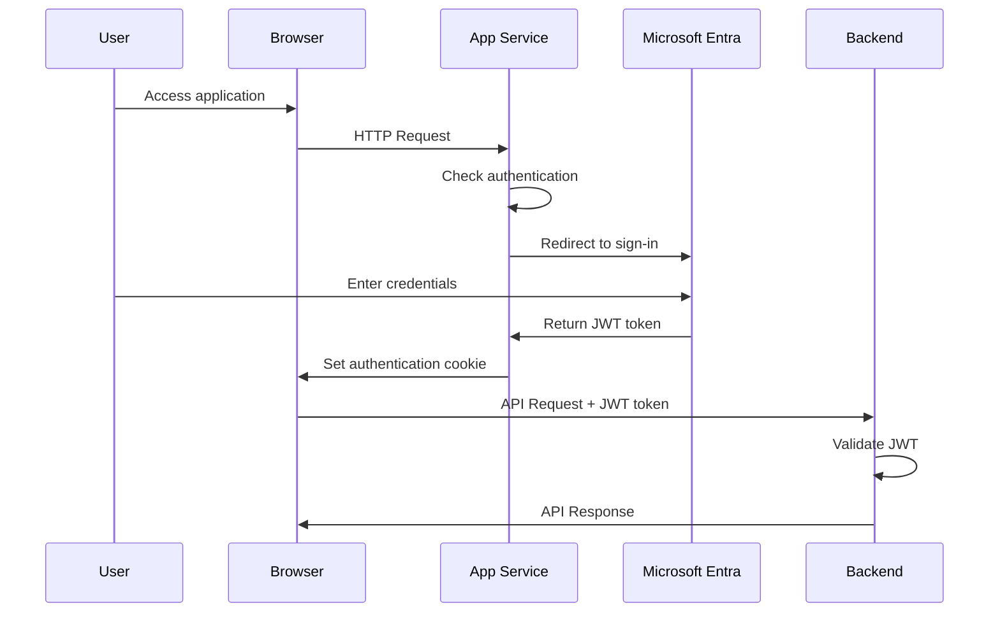
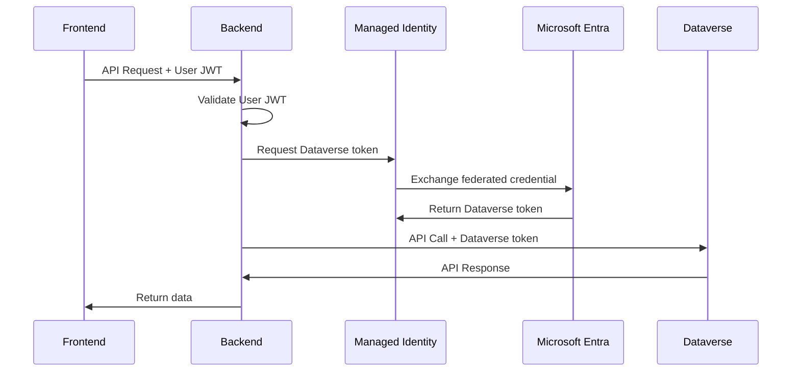

# Deployment Guide - Azure Production Deployment

This guide explains how to deploy the Mermaid to Dataverse Converter to Azure for production use with enterprise-grade security.

> **Note**: For local development setup, see [Local Development Guide](./LOCAL-DEVELOPMENT.md)

## Table of Contents

1. [Quick Start - Azure Deployment](#quick-start---azure-deployment)
2. [Prerequisites](#prerequisites)
3. [Security Architecture](#security-architecture)
4. [Deployment Process](#deployment-process)
5. [Authentication & Authorization](#authentication--authorization)
6. [Post-Deployment Configuration](#post-deployment-configuration)
7. [Troubleshooting](#troubleshooting)

## Quick Start - Azure Deployment

**Two steps to deploy everything:**

```powershell
# Clone the repository
git clone https://github.com/LuiseFreese/mermaid.git
cd mermaid

# Step 1: Create Azure infrastructure and identity setup
.\scripts\setup-secretless.ps1 -EnvironmentSuffix "myapp" -DataverseUrl "https://your-org.crm.dynamics.com" -Unattended

# Step 2: Deploy the application code
.\scripts\deploy-secretless.ps1 -EnvironmentSuffix "myapp"
```

**The setup script will:**
- Create Backend App Registration with federated credentials (linked to managed identity)
- Create Frontend App Registration with Microsoft Entra authentication for user sign-in
- Deploy Azure infrastructure (App Service, Managed Identity, etc.)
- Configure secure managed identity authentication for backend
- Set up Dataverse Application User (linked to backend App Registration)
- Assign System Customizer security role to Application User (grants table access)
- Configure Power Platform Environment ID for deployment history solution links
- Enable Azure App Service authentication for frontend protection
- Configure SPA platform for frontend authentication (MSAL integration)

**The deployment script will:**
- Build the React frontend locally using Vite
- Package only necessary backend files (no node_modules)
- Deploy to Azure App Service with proper static file serving
- Configure runtime settings for optimal performance
- Enable deployment history tracking with Power Platform integration
- Inject Azure AD authentication configuration into frontend build
- Configure authentication middleware for API protection

## Local Development Setup

**For local development with real Dataverse authentication:**

```powershell
# Clone the repository
git clone https://github.com/LuiseFreese/mermaid.git
cd mermaid

# Step 1: Create App Registration and Dataverse Application User
.\scripts\setup-local-dataverse-user.ps1

# Step 2: Start development servers
.\scripts\dev-local.ps1
```

**The local setup process will:**
- Create App Registration with a client secret (if needed)
- Set up Dataverse Application User with a System Customizer role
- Generate `.env.local` file with authentication configuration
- Configure local environment for development

**The dev script will:**
- Load environment variables from `.env.local`
- Start a backend server with real Dataverse authentication
- Start a frontend development server with hot reload
- Enable API proxy for seamless development
=======
- Configure authentication middleware for API protection
>>>>>>> feature/github-pages-docs

## Prerequisites

1. **Azure subscription** with permissions to create resources
2. **PowerShell 7+** (recommended) or Windows PowerShell 5.1
3. **Azure CLI** installed and logged in (`az login`)
4. **Node.js 18+** (required for local frontend build)
5. **Access to Dataverse environment** where you want to create entities
6. **Appropriate permissions**:
   - **Azure**: Contributor or Owner on subscription
   - **Microsoft Entra ID**: Application Administrator (to create app registrations)
   - **Dataverse**: System Administrator (to create application users and assign System Customizer role)

## Security Architecture

The deployment implements **defense-in-depth** with multiple layers of security:

### 1. Frontend Protection - Azure App Service Authentication

**User Sign-In with Microsoft Entra:**
- Users must sign in with their Microsoft Entra (Azure AD) account to access the application
- Azure App Service Easy Auth provides automatic authentication
- JWT tokens are issued to authenticated users
- No anonymous access to the application

> Learn more: [Azure App Service Authentication and Authorization](https://learn.microsoft.com/en-us/azure/app-service/overview-authentication-authorization)

**Configuration:**
```json
{
  "platform": {
    "enabled": true
  },
  "globalValidation": {
    "requireAuthentication": true,
    "unauthenticatedClientAction": "RedirectToLoginPage"
  },
  "identityProviders": {
    "azureActiveDirectory": {
      "enabled": true,
      "registration": {
        "clientId": "your-frontend-app-id"
      }
    }
  }
}
```

**Key point**: No client secret needed! Azure App Service Easy Auth handles authentication without storing secrets.

### 2. Backend Protection - JWT Token Validation

**API Endpoint Security:**
- All API endpoints require valid JWT tokens from authenticated users
- JWT middleware validates tokens on every request
- Token validation includes:
  - Signature verification
  - Expiration check
  - Issuer validation
  - Audience validation

**Protected Endpoints:**
```javascript
// Authentication middleware on all API routes
app.use('/api/*', authenticateToken);
app.use('/upload', authenticateToken);
app.use('/wizard', authenticateToken);
```

**JWT Token Flow:**
1. User signs in via Azure App Service authentication
2. Azure issues JWT token to the user
3. Frontend sends JWT token with every API request (via `X-MS-TOKEN-AAD-ACCESS-TOKEN` header)
4. Backend validates JWT token before processing request
5. Invalid or missing tokens receive 401 Unauthorized response

### 3. Backend-to-Dataverse - Managed Identity

**Passwordless Authentication:**
- Backend uses User-Assigned Managed Identity for Dataverse access
- Federated credentials enable secure token exchange with backend App Registration
- Backend App Registration linked to Dataverse Application User
- Access to tables controlled by System Customizer security role (not API permissions)
- Automatic token refresh and management

**Token Flow:**
1. Backend requests token from Azure Managed Identity endpoint
2. Managed Identity exchanges federated credential for Dataverse token
3. Backend calls Dataverse API with access token
4. Dataverse validates token and maps to Application User
5. Security role (System Customizer) determines what tables/operations are allowed


## Deployment Process

### Step 1: Infrastructure Setup

The setup script creates all necessary Azure resources and configures authentication:

```powershell
# Interactive mode (prompts for configuration)
.\scripts\setup-secretless.ps1

# OR unattended mode (provide all parameters)
.\scripts\setup-secretless.ps1 -Unattended `
  -EnvironmentSuffix "myapp" `
  -DataverseUrl "https://orgXXXXX.crm4.dynamics.com"
```

**What gets created:**
1. **Frontend App Registration** - For user sign-in with Microsoft Entra
   - Configured for web application authentication
   - Redirect URIs set for your App Service
   - Integrated with Azure App Service Easy Auth (no client secret needed)

2. **Backend App Registration** - For Dataverse authentication
   - Configured with federated credentials (passwordless)
   - Linked to managed identity for token exchange
   - No API permissions needed (access controlled by Dataverse Application User security role)

3. **Azure Resources**:
   - Resource Group
   - App Service + App Service Plan (Linux, Node.js 20)
   - User-Assigned Managed Identity

4. **Dataverse Configuration**:
   - Application User created (linked to backend App Registration)
   - System Customizer security role assigned (grants access to tables)
   - Security role determines what tables and operations are allowed

5. **App Service Authentication**:
   - Azure App Service Easy Auth configured
   - Microsoft Entra identity provider enabled
   - Requires authentication for all requests

### Step 2: Application Deployment

Deploy your application code to the configured infrastructure:

```powershell
# Deploy code to existing infrastructure
.\scripts\deploy-secretless.ps1 -EnvironmentSuffix "myapp"
```

**Deployment steps:**
1. **Build Frontend**: Vite builds React app for production
2. **Package Backend**: Excludes node_modules and source files
3. **Deploy to App Service**: Uses Azure CLI with ZIP deploy
4. **Configure Settings**: Updates App Service configuration
5. **Validate**: Tests endpoints and authentication


## Authentication & Authorization

### Frontend Authentication Flow



### Backend Authentication Flow



### Authentication Middleware

The backend implements three levels of authentication:

**1. Token Validation (authenticateToken)**
```javascript
// Validates JWT token on every request
// Extracts user information from token
// Attaches user to request object
```

**2. Optional Authentication (optionalAuth)**
```javascript
// Allows both authenticated and anonymous requests
// Used for health checks and public endpoints
// Still validates token if present
```

**3. Role-Based Authorization (requireRole)**
```javascript
// Requires specific roles for access
// Returns 403 Forbidden if role not present
// Supports multiple role requirements
```

### Token Headers

The application uses standard Azure App Service authentication headers:

```http
X-MS-TOKEN-AAD-ACCESS-TOKEN: <user-jwt-token>
X-MS-CLIENT-PRINCIPAL-ID: <user-object-id>
X-MS-CLIENT-PRINCIPAL-NAME: <user-email>
```

## Post-Deployment Configuration

### Configure Allowed Users

By default, any user in your Azure tenant can sign in. To restrict access:

**Option 1: App Registration (Recommended)**
1. Go to Azure Portal → App Registrations
2. Select your frontend App Registration
3. Go to "Enterprise applications" → "Properties"
4. Set "User assignment required?" to **Yes**
5. Go to "Users and groups"
6. Add specific users or groups

**Option 2: App Service Access Restrictions**
1. Go to Azure Portal → App Service
2. Navigate to "Authentication" → "Microsoft"
3. Configure "Allowed token audiences"
4. Add specific user groups

### Enable Deployment History

💡 Only in case you did not provide the Power Platform Enbvironment ID during deployment: 


1. **Find your Environment ID**:
   - Go to [make.powerapps.com](https://make.powerapps.com)
   - Click settings gear → "Session details"
   - Copy the "Environment ID"

2. **Add to App Service Configuration**:
   ```powershell
   az webapp config appsettings set `
     --name "app-mermaid-dv-we-{suffix}" `
     --resource-group "rg-mermaid-dv-we-{suffix}" `
     --settings POWER_PLATFORM_ENVIRONMENT_ID="your-environment-id"
   ```


## Updating the Application

### Deploy Code Changes

After making code changes, deploy updates:

```powershell
# Rebuild and redeploy
.\scripts\deploy-secretless.ps1 -EnvironmentSuffix "myapp"
```

**The deployment is idempotent:**
- Safe to run multiple times
- Only updates application code
- Preserves configuration and secrets
- No downtime during deployment

### Update Configuration

Update App Service settings without redeployment:

```powershell
# Update environment variables
az webapp config appsettings set `
  --name "app-mermaid-dv-we-{suffix}" `
  --resource-group "rg-mermaid-dv-we-{suffix}" `
  --settings LOG_LEVEL="debug"
```

### Rotate Credentials

**No secrets to rotate!** This deployment is completely passwordless:
- **Frontend authentication**: Handled by Azure App Service Easy Auth (no client secrets)
- **Backend-to-Dataverse authentication**: Uses managed identity with federated credentials (no secrets)

The only credentials that exist are Azure-managed and rotate automatically.

## Troubleshooting

### Authentication Issues

**Problem: "401 Unauthorized" when accessing the application**
- **Cause**: Azure App Service authentication not configured correctly
- **Solution**:
  ```powershell
  # Check authentication configuration
  az webapp auth show `
    --name "app-mermaid-dv-we-{suffix}" `
    --resource-group "rg-mermaid-dv-we-{suffix}"
  
  # Verify App Registration exists and has correct redirect URIs
  az ad app show --id "your-frontend-app-id"
  ```

**Problem: "Invalid JWT token" in backend logs**
- **Cause**: Token validation failing
- **Solution**: Check that the JWT token headers are being sent correctly and the token hasn't expired

**Problem: Users can't sign in**
- **Cause**: App Registration not configured for user assignment
- **Solution**: Go to Enterprise Application → Properties → Set "User assignment required" and add users

### Deployment Issues

**Problem: Build fails during deployment**
- **Cause**: Node.js version mismatch or missing dependencies
- **Solution**:
  ```powershell
  # Ensure Node.js 18+ is installed locally
  node --version
  
  # Clean and reinstall dependencies
  Remove-Item -Path "node_modules" -Recurse -Force
  npm install
  
  # Try deployment again
  .\scripts\deploy-secretless.ps1 -EnvironmentSuffix "myapp"
  ```

**Problem: "Managed Identity not found"**
- **Cause**: Infrastructure setup didn't complete successfully
- **Solution**:
  ```powershell
  # Re-run infrastructure setup
  .\scripts\setup-secretless.ps1 -EnvironmentSuffix "myapp"
  ```

### Dataverse Issues

**Problem: "Application User not found" in Dataverse calls**
- **Cause**: Application User not created or not linked correctly
- **Solution**:
  ```powershell
  # Verify Application User exists in Power Platform Admin Center
  # Go to Environments → Your Environment → Settings → Users + permissions → Application users
  
  # Re-run setup to recreate Application User
  .\scripts\setup-local-dataverse-user.ps1
  ```

**Problem: "Insufficient permissions" when creating tables**
- **Cause**: Application User doesn't have System Customizer role
- **Solution**: In Power Platform Admin Center, assign System Customizer role to the Application User

### Monitoring and Diagnostics

**Enable detailed logging:**
```powershell
az webapp config appsettings set `
  --name "app-mermaid-dv-we-{suffix}" `
  --resource-group "rg-mermaid-dv-we-{suffix}" `
  --settings LOG_LEVEL="debug" LOG_REQUEST_BODY="true"
```

**View application logs:**
```powershell
# Stream logs in real-time
az webapp log tail `
  --name "app-mermaid-dv-we-{suffix}" `
  --resource-group "rg-mermaid-dv-we-{suffix}"

# Download logs
az webapp log download `
  --name "app-mermaid-dv-we-{suffix}" `
  --resource-group "rg-mermaid-dv-we-{suffix}" `
  --log-file "app-logs.zip"
```

## Security Best Practices

1. **No Secrets to Manage**: This deployment is completely passwordless - both frontend and backend use managed authentication
2. **Monitor Authentication**: Use Application Insights to track authentication failures
3. **Restrict User Access**: Only assign access to users who need it
4. **Enable Audit Logging**: Track who deploys what and when
5. **Keep Dependencies Updated**: Regularly update npm packages for security patches
6. **Review Access Control**: Periodically review user assignments and roles

## Related Documentation

- [Local Development Guide](./LOCAL-DEVELOPMENT.md) - Set up local development environment
- [Architecture Guide](./DEVELOPER_ARCHITECTURE.md) - Understanding the system design
- [Testing Guide](./TESTING.md) - Running and writing tests

## Getting Help

If you encounter issues not covered here:

1. **Check the logs**: Azure App Service logs contain detailed error messages
2. **Verify prerequisites**: Ensure all required tools and permissions are available
3. **Review security configuration**: Check both frontend and backend authentication settings
4. **Test authentication flow**: Use browser dev tools to inspect JWT tokens
5. **Consult documentation**: Review related documentation for specific features


