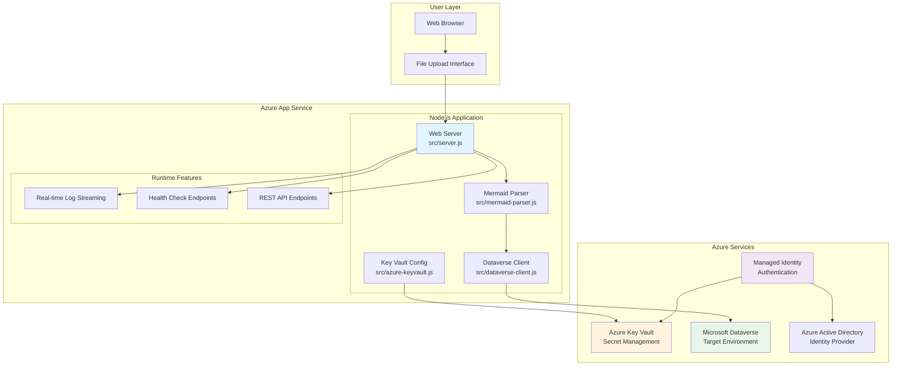
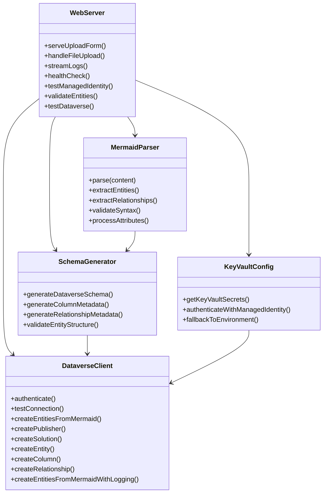
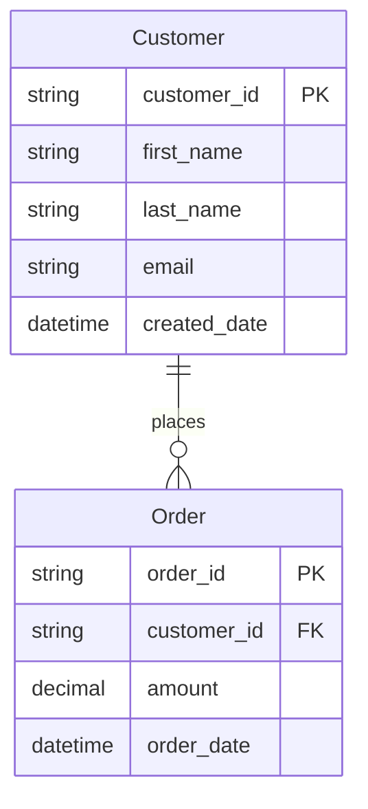
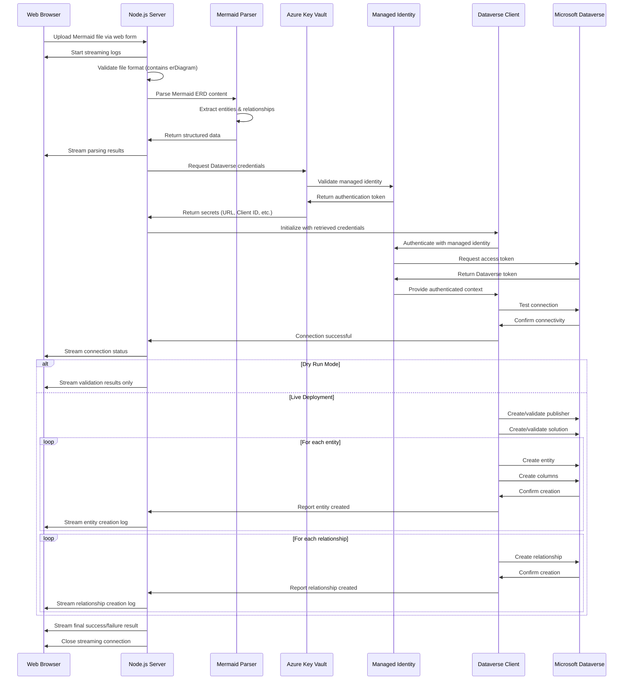
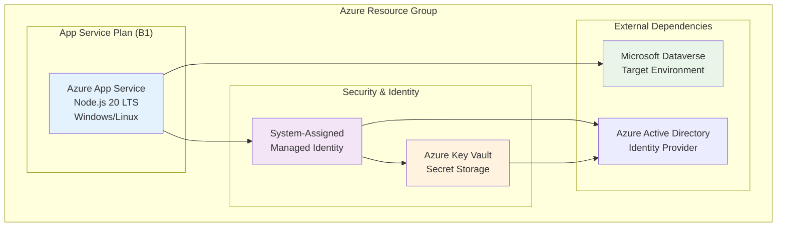
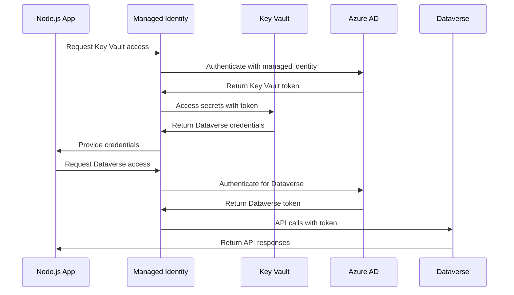
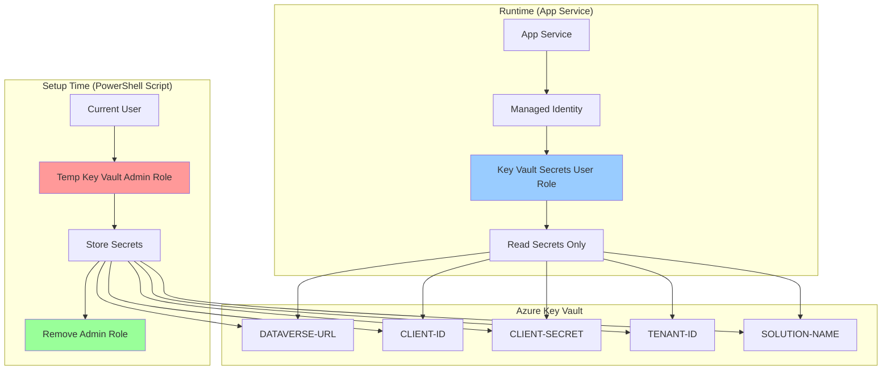
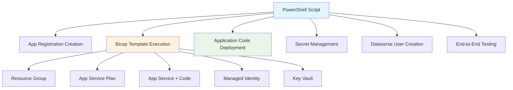

# Developer Documentation

This is a **production-ready Node.js web application** deployed on Azure App Service that automates Microsoft Dataverse solution, entity, and relationship creation from Mermaid ERD files. It provides a web interface for uploading Mermaid files and real-time processing with comprehensive logging.

## Mermaid to Dataverse Converter - Technical Architecture

This document provides a comprehensive overview of the web application's architecture, design decisions, and implementation details for developers who want to understand, maintain, or contribute to the project.

## Table of Contents

- [Architecture Overview](#architecture-overview)
- [Core Components](#core-components)
- [Data Flow](#data-flow)
- [Azure Integration](#azure-integration)
- [Authentication Strategy](#authentication-strategy)
- [Field Type Mapping](#field-type-mapping)
- [Error Handling](#error-handling)
- [Testing Strategy](#testing-strategy)
- [Development Setup](#development-setup)
- [Deployment](#deployment)
- [Troubleshooting](#troubleshooting)

## Architecture Overview

The application follows a **web server architecture** with real-time processing and Azure cloud integration:

```
Web Browser → Azure App Service → Mermaid Parser → Dataverse Client → Microsoft Dataverse
```



### High-Level Flow
1. **Web Interface**: User uploads Mermaid ERD file via web browser
2. **File Processing**: Server validates and parses the uploaded file
3. **Real-time Feedback**: Live log streaming to the web interface
4. **Authentication**: Managed identity for secure Azure service access
5. **Entity Creation**: Automated Dataverse schema creation
6. **Result Display**: Success/failure feedback with detailed logs

## Core Components



### 1. Web Server (`src/server.js`)

**Purpose**: Main HTTP server providing web interface and API endpoints

**Key Features**:
- **File Upload Handling**: Multipart form processing with `formidable`
- **Real-time Log Streaming**: Live feedback via chunked HTTP responses
- **Health Monitoring**: Multiple diagnostic endpoints
- **API Endpoints**: RESTful validation and testing endpoints
- **Static Web UI**: Embedded HTML interface with JavaScript

**Main Endpoints**:
```javascript
// Web Interface
GET  /                     // Upload form and status dashboard
POST /upload               // File upload with streaming logs

// Health & Diagnostics
GET  /health               // Application health status
GET  /keyvault             // Key Vault connectivity test
GET  /managed-identity     // Managed identity status

// API Endpoints
POST /api/validate         // Validate Mermaid entities
POST /api/test-dataverse   // Test Dataverse operations
GET  /api/dataverse-config // Get Dataverse configuration
```

**Real-time Logging Implementation**:
```javascript
// Streaming logs to frontend
function sendLog(message) {
  const logData = JSON.stringify({ type: 'log', message: message }) + '\n';
  res.write(logData);
}

// Final result
function sendResult(success, data) {
  const resultData = JSON.stringify({ type: 'result', success: success, ...data }) + '\n';
  res.write(resultData);
  res.end();
}
```

### 2. Mermaid Parser (`src/mermaid-parser.js`)

**Purpose**: Parse Mermaid ERD syntax into structured JavaScript objects

**Key Features**:
- **CommonJS Module**: Compatible with Node.js server environment
- **Regex-based Parsing**: Robust extraction of entities and relationships
- **Attribute Processing**: Support for types, constraints (PK, FK)
- **Relationship Detection**: One-to-many relationship parsing
- **Error Handling**: Comprehensive validation and error reporting

**Supported Syntax**:


**Output Structure**:
```javascript
{
  entities: [
    {
      name: "Customer",
      displayName: "Customer",
      attributes: [
        {
          name: "customer_id",
          type: "String",
          isPrimaryKey: true,
          isForeignKey: false,
          displayName: "Customer Id"
        }
      ]
    }
  ],
  relationships: [
    {
      fromEntity: "Customer",
      toEntity: "Order",
      cardinality: { type: "one-to-many" },
      label: "places"
    }
  ]
}
```

### 3. Dataverse Client (`src/dataverse-client.js`)

**Purpose**: Handle all Microsoft Dataverse Web API interactions

**Key Features**:
- **Managed Identity Authentication**: Secure Azure service-to-service auth
- **Complete CRUD Operations**: Entities, columns, relationships, solutions
- **Publisher Management**: Automatic publisher creation and validation
- **Idempotent Operations**: Safe to run multiple times
- **Comprehensive Logging**: Detailed operation feedback
- **Error Recovery**: Retry logic and graceful error handling

**Authentication with Managed Identity**:
```javascript
// Managed Identity authentication
const credential = clientId 
  ? new ManagedIdentityCredential(clientId)
  : new ManagedIdentityCredential();

const token = await credential.getToken(`${dataverseUrl}/.default`);
```

**Entity Creation Flow**:
```javascript
async createEntitiesFromMermaidWithLogging(entities, options, logFunction) {
  // 1. Create/validate publisher
  const publisherResult = await this.ensurePublisher(options.publisherPrefix);
  logFunction(`Publisher: ${publisherResult.uniqueName}`);
  
  // 2. Create/validate solution
  const solutionResult = await this.createSolution(options.solutionName);
  logFunction(`Solution: ${solutionResult.uniqueName}`);
  
  // 3. Create entities
  for (const entity of entities) {
    const entityResult = await this.createEntity(entity);
    logFunction(`Entity created: ${entityResult.LogicalName}`);
  }
  
  // 4. Create additional columns
  // 5. Create relationships
}
```

### 4. Key Vault Configuration (`src/azure-keyvault.js`)

**Purpose**: Secure credential management via Azure Key Vault

**Key Features**:
- **Managed Identity Integration**: No secrets in application code
- **Fallback Support**: Environment variables for local development
- **Secret Caching**: Efficient credential retrieval
- **Error Handling**: Graceful degradation when Key Vault unavailable

**Secret Retrieval**:
```javascript
async getKeyVaultSecrets() {
  try {
    const keyVaultUrl = process.env.KEY_VAULT_URI;
    const authType = process.env.AUTH_MODE || 'default';
    
    let credential;
    if (authType === 'managed-identity') {
      credential = new ManagedIdentityCredential(clientId);
    } else {
      credential = new DefaultAzureCredential();
    }
    
    const secretClient = new SecretClient(keyVaultUrl, credential);
    const secrets = await this.retrieveAllSecrets(secretClient);
    
    return { success: true, secrets };
  } catch (error) {
    return { success: false, message: error.message };
  }
}
```

## Data Flow



## Azure Integration

### Azure App Service Configuration



### Required Azure Resources

1. **App Service**: Hosts the Node.js application
2. **App Service Plan**: Compute resources (B1 Basic or higher)
3. **Managed Identity**: Service authentication
4. **Key Vault**: Secure secret storage
5. **Key Vault Access Policy**: Grant managed identity access

### Environment Variables (Azure App Service)

```bash
# Azure Key Vault Configuration
KEY_VAULT_URI=https://your-keyvault.vault.azure.net/
AUTH_MODE=managed-identity
MANAGED_IDENTITY_CLIENT_ID=your-managed-identity-client-id

# Application Configuration
PORT=8080
NODE_ENV=production
```

### Key Vault Secrets

```bash
# Dataverse Connection
DATAVERSE-URL=https://yourorg.crm.dynamics.com
CLIENT-ID=xxxxxxxx-xxxx-xxxx-xxxx-xxxxxxxxxxxx
CLIENT-SECRET=your-client-secret
TENANT-ID=your-tenant-id
SOLUTION-NAME=MermaidSolution
```

## Authentication Strategy

### Current Implementation: Managed Identity + Key Vault

**Architecture Benefits**:
- **Zero Secrets in Code**: All credentials stored in Key Vault
- **Automatic Token Management**: Azure handles token lifecycle
- **Role-Based Access**: Fine-grained permissions
- **Audit Trail**: Complete access logging

**Authentication Flow**:


### Security Advantages

1. **No Secret Rotation in Code**: Secrets managed in Key Vault
2. **Principle of Least Privilege**: Minimal required permissions
3. **Network Isolation**: Private endpoints supported
4. **Compliance Ready**: Meets enterprise security requirements

### Local Development Authentication

For local development, the application supports environment variables:

```bash
# Local .env file (development only)
DATAVERSE_URL=https://yourorg.crm.dynamics.com
CLIENT_ID=xxxxxxxx-xxxx-xxxx-xxxx-xxxxxxxxxxxx
CLIENT_SECRET=your-client-secret
TENANT_ID=your-tenant-id
SOLUTION_NAME=MermaidSolution
```

## Security Model & Permission Architecture

### Overview

The application implements a **multi-layered security model** with distinct permissions for setup time and runtime operations. This follows Azure security best practices with principle of least privilege and time-bound access.

### Permission Model

#### 🔐 Setup Time Permissions (Temporary)

**Who**: PowerShell script user (DevOps/Admin)  
**When**: During initial setup and configuration  
**Duration**: Temporary (automatically cleaned up)

```powershell
# Grants temporary Key Vault Administrator role
az role assignment create --assignee $currentUser --role "Key Vault Administrator" --scope $keyVaultScope

# Store secrets in Key Vault
az keyvault secret set --vault-name $KeyVaultName --name "CLIENT-SECRET" --value $ClientSecret

# Clean up: Remove temporary role
az role assignment delete --assignee $currentUser --role "Key Vault Administrator" --scope $keyVaultScope
```

#### 🔑 Runtime Permissions (Permanent)

**Who**: Managed Identity (App Service)  
**When**: Application runtime  
**Duration**: Permanent (for application lifetime)

```bicep
// Managed Identity gets read-only access to secrets
resource keyVaultSecretsUserRoleAssignment 'Microsoft.Authorization/roleAssignments@2022-04-01' = {
  properties: {
    roleDefinitionId: '4633458b-17de-408a-b874-0445c86b69e6' // Key Vault Secrets User
    principalId: managedIdentity.properties.principalId
  }
}
```

### Azure RBAC Roles Reference

| **Role** | **Role ID** | **Permissions** | **Use Case** |
|----------|-------------|-----------------|--------------|
| **Key Vault Administrator** | `00482a5a-887f-4fb3-b363-3b7fe8e74483` | Full access to secrets, keys, certificates, policies | Setup, emergency access |
| **Key Vault Secrets User** | `4633458b-17de-408a-b874-0445c86b69e6` | Read secrets only | Application runtime |
| **Key Vault Secrets Officer** | `b86a8fe4-44ce-4948-aee5-eccb2c155cd7` | Read, write secrets (no policies) | CI/CD pipelines |

### Secret Flow Architecture



### Infrastructure as Code (Bicep)

The infrastructure deployment creates the necessary resources with proper RBAC configuration:

```bicep
// Key Vault with RBAC enabled
resource keyVault 'Microsoft.KeyVault/vaults@2023-07-01' = {
  properties: {
    enableRbacAuthorization: true  // Uses RBAC instead of access policies
    tenantId: tenant().tenantId
  }
}

// User-assigned managed identity
resource managedIdentity 'Microsoft.ManagedIdentity/userAssignedIdentities@2023-01-31' = {
  name: managedIdentityName
  location: location
}

// App Service with managed identity attached
resource appService 'Microsoft.Web/sites@2023-01-01' = {
  identity: {
    type: 'UserAssigned'
    userAssignedIdentities: {
      '${managedIdentity.id}': {}
    }
  }
  properties: {
    siteConfig: {
      appSettings: [
        {
          name: 'KEY_VAULT_URI'
          value: keyVault.properties.vaultUri
        }
        {
          name: 'MANAGED_IDENTITY_CLIENT_ID'
          value: managedIdentity.properties.clientId
        }
      ]
    }
  }
}

// Runtime permissions: Managed Identity → Key Vault
resource keyVaultSecretsUserRoleAssignment 'Microsoft.Authorization/roleAssignments@2022-04-01' = {
  scope: keyVault
  properties: {
    roleDefinitionId: '4633458b-17de-408a-b874-0445c86b69e6' // Key Vault Secrets User
    principalId: managedIdentity.properties.principalId
    principalType: 'ServicePrincipal'
  }
}
```

### Security Benefits

#### 1. **Separation of Concerns**
- ✅ **Infrastructure**: Managed by Bicep (declarative)
- ✅ **Identity Management**: Handled by PowerShell (imperative)
- ✅ **Secret Storage**: Automated with proper permissions

#### 2. **Time-Bound Access**
- ✅ **Setup permissions**: Granted → Used → Removed automatically
- ✅ **Runtime permissions**: Minimal and permanent
- ✅ **Audit trail**: All operations logged

#### 3. **Principle of Least Privilege**
- ✅ **Admin access**: Only during setup
- ✅ **Read access**: Only for application runtime
- ✅ **No secrets in code**: All credentials in Key Vault

#### 4. **Compliance & Governance**
- ✅ **Azure Activity Log**: All role assignments tracked
- ✅ **Key Vault Diagnostics**: Secret access logged
- ✅ **Managed Identity**: No credential management needed

### Interactive Setup Process

The automated setup script (`scripts/setup-entra-app.ps1`) handles the complete security configuration:

```powershell
# 1. Interactive prompts for all configuration
$config = Get-Configuration

# 2. Create App Registration and generate secret
$app = Get-OrCreateAppRegistration -AppRegistrationName $config.AppRegistrationName
$clientSecret = Get-OrCreateClientSecret -AppId $app.appId

# 3. Deploy infrastructure (Bicep)
$infrastructure = Invoke-InfrastructureDeployment -Config $config

# 4. Temporarily elevate permissions and store secrets
Set-KeyVaultSecrets -KeyVaultName $infrastructure.keyVaultName -AppId $app.appId -ClientSecret $clientSecret

# 5. Create Dataverse Application User
New-DataverseApplicationUser -AppId $app.appId -SecurityRole $config.SecurityRole

# 6. Test end-to-end functionality
Test-Setup -KeyVaultUri $infrastructure.keyVaultUri -AppId $app.appId
```

### Idempotent Operations

All setup operations are **idempotent** - safe to run multiple times:

- ✅ **Resource Group**: Uses existing or creates new
- ✅ **App Registration**: Finds existing by name or creates new
- ✅ **Azure Resources**: Bicep handles idempotent deployment
- ✅ **Application User**: Checks existence before creating
- ✅ **Role Assignments**: Azure prevents duplicates

### Local Development Security

For local development, the application supports both approaches:

```javascript
// Development: Environment variables
if (process.env.NODE_ENV === 'development') {
  config = {
    dataverseUrl: process.env.DATAVERSE_URL,
    clientId: process.env.CLIENT_ID,
    clientSecret: process.env.CLIENT_SECRET,
    tenantId: process.env.TENANT_ID
  };
}

// Production: Key Vault + Managed Identity
else {
  const credential = new ManagedIdentityCredential(process.env.MANAGED_IDENTITY_CLIENT_ID);
  const secretClient = new SecretClient(process.env.KEY_VAULT_URI, credential);
  config = await getSecretsFromKeyVault(secretClient);
}
```

## Field Type Mapping

### Supported Mermaid Types → Dataverse Types

| Mermaid Type | Dataverse Type | Notes |
|-------------|----------------|-------|
| `string` | StringAttributeMetadata | Single line text (255 chars) |
| `integer`, `int` | IntegerAttributeMetadata | Whole number |
| `decimal` | DecimalAttributeMetadata | Decimal number with precision |
| `boolean` | BooleanAttributeMetadata | Yes/No field |
| `datetime` | DateTimeAttributeMetadata | Date and time |

### Constraint Handling

| Constraint | Implementation | Dataverse Behavior |
|-----------|----------------|-------------------|
| `PK` | Primary key | Creates GUID primary key + name field |
| `FK` | Foreign key | Creates lookup relationship |

### Schema Generation Logic

```javascript
function generateColumnMetadata(attribute, publisherPrefix) {
  const baseMetadata = {
    LogicalName: `${publisherPrefix.toLowerCase()}_${attribute.name.toLowerCase()}`,
    DisplayName: { LocalizedLabels: [{ Label: attribute.displayName, LanguageCode: 1033 }] },
    RequiredLevel: { Value: attribute.isRequired ? 'ApplicationRequired' : 'None' }
  };
  
  switch (attribute.type.toLowerCase()) {
    case 'string':
      return {
        '@odata.type': 'Microsoft.Dynamics.CRM.StringAttributeMetadata',
        ...baseMetadata,
        AttributeType: 'String',
        MaxLength: 255
      };
    // ... other types
  }
}
```

## Error Handling

### Error Categories

1. **File Upload Errors**: Invalid files, size limits, format issues
2. **Parsing Errors**: Malformed Mermaid syntax
3. **Authentication Errors**: Key Vault or Dataverse access failures
4. **API Errors**: Dataverse operation failures
5. **Network Errors**: Connectivity issues

### Error Response Strategy

```javascript
// Streaming error handling
try {
  // Process file
  const result = await processMermaidFile(fileContent, options);
  sendResult(true, result);
} catch (error) {
  sendLog(`Error: ${error.message}`);
  sendResult(false, { error: error.message });
}
```

### User-Friendly Error Messages

- **Clear descriptions** of what went wrong
- **Actionable guidance** for fixing issues
- **Real-time feedback** during processing
- **Detailed logs** for debugging

## Testing Strategy

### 1. Integration Testing

**Test File**: `tests/test-schema-generation.js`

```bash
# Run integration tests
npm test

# Test with specific file
node tests/test-schema-generation.js examples/simple-sales.mmd

# Test with custom prefix
node tests/test-schema-generation.js examples/simple-sales.mmd myprefix
```

**What It Tests**:
- Mermaid file parsing
- Entity extraction and validation
- Relationship detection
- Dataverse naming conventions
- Primary key validation

### 2. API Testing

**Built-in Endpoints**:
```bash
# Health check
GET /health

# Key Vault connectivity
GET /keyvault

# Managed identity status
GET /managed-identity

# Dataverse connection test
POST /api/test-dataverse
```

### 3. Manual Testing Workflow

1. **Upload Test File**: Use web interface with sample files
2. **Dry Run Mode**: Validate without creating entities
3. **Live Deployment**: Test actual Dataverse creation
4. **Error Scenarios**: Test with invalid files, wrong credentials

## Development Setup

## Development Setup

### Prerequisites

**For Automated Deployment:**
- **Azure subscription** with Dataverse environment access
- **PowerShell 7+** (includes Azure CLI integration)
- **Appropriate permissions** in Azure AD (to create App Registrations)
- **Dataverse admin rights** (to create application users)

**For Local Development (optional):**
- **Node.js 20+** (for running locally)
- **.env file** with development credentials

> 📝 **Note**: The automated setup script handles all Azure resource creation, so you don't need to create anything manually in the Azure portal.

### Local Development

1. **Clone Repository**:
   ```bash
   git clone https://github.com/LuiseFreese/mermaid.git
   cd mermaid
   ```

2. **Install Dependencies**:
   ```bash
   npm install
   ```

3. **Setup Environment**:
   ```bash
   cp .env.example .env
   # Edit .env with your development credentials
   ```

4. **Start Development Server**:
   ```bash
   npm run dev
   # Server runs with auto-restart on file changes
   ```

5. **Access Application**:
   ```
   http://localhost:8080
   ```

### Development Commands

```bash
# Start production mode locally
npm start

# Start with file watching
npm run dev

# Run tests
npm test

# Deploy to Azure
npm run deploy
```

## Deployment

### ⚡ Automated One-Click Setup

**No manual Azure resource creation needed!** The entire deployment is fully automated through a single PowerShell script.

### Quick Start

```powershell
# Clone repository
git clone https://github.com/LuiseFreese/mermaid.git
cd mermaid

# Run automated setup (interactive prompts)
./scripts/setup-entra-app.ps1
```

**What it does automatically**:
- ✅ Creates App Registration with secret
- ✅ **Calls Bicep template** (`deploy/infrastructure.bicep`) to deploy Azure resources
- ✅ **Deploys complete Node.js application** (not just empty webapp)
- ✅ Configures managed identity & RBAC
- ✅ Stores secrets in Key Vault
- ✅ Creates Dataverse application user
- ✅ Tests end-to-end functionality

> 🎯 **Complete Application Deployment**: This deploys the **full Mermaid-to-Dataverse application** with all source code, not just infrastructure. The deployed app is ready to transform Mermaid ERD files into Dataverse tables immediately.

### Interactive Setup Process

The setup script guides you through configuration with prompts:

```powershell
Interactive Setup for Mermaid-to-Dataverse Solution
==================================================

Resource Group Name (or 'new' to create): rg-mermaid-prod
Location for new resources: East US
App Registration Name: MermaidToDataverse-Prod
App Service Name: mermaid-dataverse-prod
Key Vault Name: kv-mermaid-prod-001
Dataverse URL: https://yourorg.crm.dynamics.com
Solution Name: MermaidSolution
Publisher Prefix (3-8 chars): mmrd
Security Role Name: System Administrator

Step 1: Creating App Registration and secret...
Step 2: Deploying infrastructure via Bicep template...
Step 3: Deploying application source code to App Service...
Step 4: Storing secrets securely in Key Vault...
Step 5: Creating Dataverse application user...
Step 6: Testing end-to-end functionality...

✅ Setup complete! Application ready at: https://mermaid-dataverse-prod.azurewebsites.net
```

**Deployment Architecture**:


### What Gets Created Automatically

#### 🏗️ Azure Infrastructure (via `deploy/infrastructure.bicep`)
- **Resource Group** (optional - uses existing or creates new)
- **App Service Plan** (B1 Basic tier)
- **App Service** (Node.js 20 LTS with **complete application code**)
- **User-Assigned Managed Identity**
- **Azure Key Vault** (RBAC-enabled)
- **RBAC Role Assignments** (Key Vault Secrets User)

#### 🔐 Identity & Security (via PowerShell automation)
- **App Registration** (Azure AD application)
- **Client Secret** (stored securely in Key Vault)
- **Managed Identity RBAC** (read-only Key Vault access)
- **Application User** (in Dataverse environment)

#### 📋 Application Deployment & Configuration
- **Complete Node.js Application** (all source code deployed to App Service)
- **Environment Variables** (set in App Service)
- **Secret Storage** (all credentials in Key Vault)
- **Connection Testing** (end-to-end validation)
- **Health Monitoring** (diagnostic endpoints enabled)

> 💡 **Key Point**: The Bicep template (`deploy/infrastructure.bicep`) deploys the **complete working application**, not just empty Azure resources. After deployment, you can immediately upload Mermaid files and create Dataverse entities.

### Advanced Configuration

#### Custom Resource Names
```powershell
# Use specific names (non-interactive)
./scripts/setup-entra-app.ps1 -ResourceGroupName "rg-production" -AppServiceName "mermaid-prod"
```

#### Deployment to Existing Resource Group
```powershell
# Deploy to existing infrastructure (replace with your actual resource group name)
./scripts/setup-entra-app.ps1 -ResourceGroupName "rg-my-existing-group"

# Example: Deploy to company's shared resource group
./scripts/setup-entra-app.ps1 -ResourceGroupName "rg-company-shared-resources"
```

#### Development vs Production
```powershell
# Development environment
./scripts/setup-entra-app.ps1 -Environment "dev"

# Production environment  
./scripts/setup-entra-app.ps1 -Environment "prod"
```

### Zero-Downtime Deployment

For updates to existing deployments:

```powershell
# Update application code only
./scripts/setup-entra-app.ps1 -UpdateCodeOnly

# Full infrastructure update (idempotent)
./scripts/setup-entra-app.ps1 -Force
```

### Deployment Validation

After deployment, the script automatically tests:

```powershell
✅ Resource Group: rg-mermaid-prod
✅ App Service: mermaid-dataverse-prod (running)
✅ Key Vault: kv-mermaid-prod-001 (accessible)
✅ Managed Identity: mi-mermaid-prod (assigned)
✅ App Registration: MermaidToDataverse-Prod (active)
✅ Dataverse User: MermaidToDataverse-Prod (system admin)
✅ Application Health: https://mermaid-dataverse-prod.azurewebsites.net/health
✅ End-to-End Test: Upload → Parse → Validate ✅

🎉 Deployment successful! Ready for production use.
```

## Troubleshooting

### Common Issues

**1. File Upload Failures**
```
Error: File upload failed: File too large
```
**Solution**: Check file size limit in `formidable` configuration

**2. Authentication Failures**
```
❌ Failed to load Azure SDK: Cannot find module '@azure/identity'
```
**Solutions**:
- Verify all Azure SDK packages installed: `npm install`
- Check package.json dependencies are correct
- Restart the application after installing packages

**3. Key Vault Access Errors**
```
❌ Key Vault access failed: Forbidden
```
**Solutions**:
- Verify managed identity has Key Vault access policy
- Check Key Vault URI environment variable
- Ensure managed identity is system-assigned
- Verify RBAC roles for Key Vault access

**4. Dataverse Connection Failures**
```
❌ Dataverse connection failed: Unauthorized
```
**Solutions**:
- Verify Dataverse app registration exists
- Check client secret hasn't expired
- Ensure app user exists in Dataverse environment
- Verify security role assignments

**5. Entity Creation Errors**
```
❌ Entity creation failed: Publisher prefix invalid
```
**Solutions**:
- Publisher prefix must be 3-8 characters
- Only lowercase letters allowed
- Must not conflict with existing prefixes
- Check publisher creation permissions

### Debug Mode

**Enable Verbose Logging**:
```bash
# Set environment variable
NODE_ENV=development
```

**Health Check Endpoints**:
```bash
# Application health
curl http://localhost:8080/health

# Key Vault status
curl http://localhost:8080/keyvault

# Managed identity status
curl http://localhost:8080/managed-identity
```

### Log Analysis

**Azure App Service Logs**:
```bash
# Stream live logs
az webapp log tail --name mermaid-to-dataverse --resource-group rg-mermaid-dataverse

# Download log files
az webapp log download --name mermaid-to-dataverse --resource-group rg-mermaid-dataverse
```

**Application Insights Integration**:
- Request tracking and performance
- Dependency calls to Dataverse
- Exception tracking and analysis
- Custom event logging

### Performance Optimization

**File Upload Optimization**:
- Increase upload size limits for large ERD files
- Implement file compression for faster uploads
- Add progress indicators for user feedback

**API Performance**:
- Implement connection pooling for Dataverse API
- Add caching for frequently accessed data
- Optimize batch operations for large schemas

**Memory Management**:
- Stream large file uploads to prevent memory issues
- Clean up temporary files after processing
- Monitor memory usage in production
