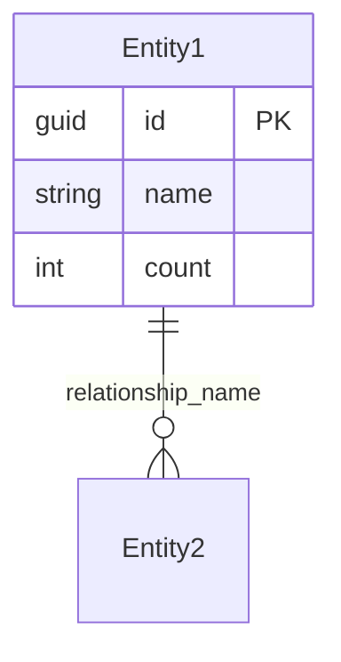

# Developer Documentation

This is a Node.js-based application that automates Microsoft Dataverse solution, entity, and relationship creation from Mermaid ERD files. It is designed for developers who want to streamline Dataverse schema setup using a simple, scriptable workflow.

## Mermaid to Dataverse Converter - Technical Architecture

This document provides a comprehensive overview of the tool's architecture, design decisions, and implementation details for developers who want to understand, maintain, or contribute to the project.

## Table of Contents

- [Architecture Overview](#architecture-overview)
- [Core Components](#core-components)
- [Data Flow](#data-flow)
- [Key Design Decisions](#key-design-decisions)
- [Authentication Strategy](#authentication-strategy)
- [Field Type Mapping](#field-type-mapping)
- [Error Handling](#error-handling)
- [Testing Strategy](#testing-strategy)
- [Contributing](#contributing)
- [Troubleshooting](#troubleshooting)

## Architecture Overview

The tool follows a modular, pipeline-based architecture:

```
Mermaid ERD File → Parser → Schema Generator → Dataverse Client → Dataverse API
```

For detailed architecture diagrams and component relationships, see [ARCHITECTURE.md](ARCHITECTURE.md).

### High-Level Flow
1. **Input Processing**: Parse command-line arguments and validate input files
2. **ERD Parsing**: Convert Mermaid ERD syntax into structured data
3. **Schema Generation**: Transform parsed data into Dataverse-compatible schema
4. **Authentication**: Handle Microsoft Entra ID authentication
5. **API Operations**: Create solutions, entities, columns, and relationships
6. **Result Reporting**: Provide detailed feedback on operations

## Core Components

### 1. CLI Interface (`src/index.js`)

**Purpose**: Main entry point handling command-line interface and orchestration

**Key Responsibilities**:
- Command-line argument parsing using `commander.js`
- Interactive prompts for user input
- Solution naming convention handling
- Publisher prefix management
- Dry-run mode implementation
- Configuration validation

**Design Patterns**:
- Command pattern for CLI commands
- Factory pattern for configuration objects
- Strategy pattern for interactive vs. non-interactive modes

### 2. ERD Parser (`src/parser.js`)

**Purpose**: Parse Mermaid ERD syntax into structured JavaScript objects

**Key Features**:
- Regex-based parsing for entity definitions
- Relationship extraction with cardinality detection
- Field type and constraint parsing
- Comprehensive error handling for malformed syntax

**Supported Syntax**:


**Output Structure**:
```javascript
{
  entities: [
    {
      name: "Entity1",
      fields: [
        { name: "id", type: "guid", constraints: ["PK"] },
        { name: "name", type: "string", constraints: [] }
      ]
    }
  ],
  relationships: [
    {
      from: "Entity1",
      to: "Entity2",
      cardinality: "one-to-many",
      name: "relationship_name"
    }
  ]
}
```

### 3. Schema Generator (`src/schema-generator.js`)

**Purpose**: Transform parsed ERD data into Dataverse-compatible schema definitions

**Key Responsibilities**:
- Map Mermaid field types to Dataverse metadata types
- Generate entity metadata with proper naming conventions
- Create column definitions with constraints
- Handle choice fields and global choice sets
- Generate relationship metadata

**Type Mapping Strategy**:
```javascript
const typeMapping = {
  'string': 'StringAttributeMetadata',
  'int': 'IntegerAttributeMetadata',
  'decimal': 'DecimalAttributeMetadata',
  'bool': 'BooleanAttributeMetadata',
  'datetime': 'DateTimeAttributeMetadata',
  'guid': 'UniqueidentifierAttributeMetadata',
  'money': 'MoneyAttributeMetadata'
};
```

### 4. Relationship Validator (`src/relationship-validator.js`)

**Purpose**: Validate ERD relationships and detect potential Dataverse conflicts

**Key Features**:
- Multiple parental relationship detection (validates Dataverse constraint: max 1 parental per entity)
- Circular cascade delete detection  
- Self-reference validation
- Missing primary key validation
- Naming conflict detection

**Current Behavior**:
Since the tool defaults to referential relationships, the validator typically finds no parental relationship conflicts. However, it's designed to catch issues if:
- Future enhancements allow parental relationship specification
- Configuration changes create parental relationships
- ERD structure has inherent logical issues

**Validation Rules**:
```javascript
const validationRules = {
  multipleParentalRelationships: true,  // Usually passes (no parental rels created)
  circularCascadeDeletes: true,         // Usually passes (no cascade deletes)
  selfReferences: true,                 // Validates ERD structure
  missingPrimaryKeys: true,            // Validates ERD completeness
  namingConflicts: true                // Validates unique naming
};
```

**Integration**:
- Called automatically by Schema Generator after relationship generation
- Returns validation results with warnings and suggestions
- Supports interactive and non-interactive modes
- Can be disabled with `--no-validation` flag

### 5. Dataverse Client (`src/dataverse-client.js`)

**Purpose**: Handle all Dataverse Web API interactions

**Key Features**:
- Microsoft Entra ID authentication using client credentials flow
- RESTful API operations for entities, columns, relationships
- Solution and publisher management
- Global choice set handling
- Comprehensive error handling and retry logic
- Idempotent operations (safe to run multiple times)

**Authentication Flow**:
```javascript
// Client credentials flow for service-to-service authentication
const tokenResponse = await axios.post(tokenEndpoint, {
  grant_type: 'client_credentials',
  client_id: clientId,
  client_secret: clientSecret,
  scope: `${dataverseUrl}/.default`
});
```

## Data Flow

### 1. Input Processing
```
CLI Args → Validation → Interactive Prompts → Configuration Object
```

### 2. Parsing Pipeline
```
Mermaid File → Text Processing → Regex Parsing → Structured Data
```

### 3. Schema Generation
```
Parsed Data → Type Mapping → Metadata Generation → Dataverse Schema
```

### 4. API Operations
```
Schema → Authentication → Solution Creation → Entity Creation → Relationship Creation
```

## Key Design Decisions

### 1. Solution Naming Convention

**Problem**: Users want readable solution names with spaces, but Dataverse API requires technical names without spaces.

**Solution**: Dual naming approach
- **Display Name**: Preserve user input exactly (e.g., "Customer Management System")
- **Technical Name**: Auto-generate PascalCase name (e.g., "CustomerManagementSystem")

**Implementation**:
```javascript
function generateSolutionUniqueName(displayName) {
  return displayName
    .replace(/[^a-zA-Z0-9\s]/g, '')
    .split(/\s+/)
    .filter(word => word.length > 0)
    .map(word => word.charAt(0).toUpperCase() + word.slice(1).toLowerCase())
    .join('');
}
```

### 2. Idempotent Operations

**Problem**: Users may run the tool multiple times, causing API errors for duplicate entities.

**Solution**: Check for existence before creation
- Query existing entities/relationships before creating
- Skip creation with informative messages
- Only create what doesn't exist

**Benefits**:
- Safe to re-run after failures
- Supports iterative development
- Reduces API errors

### 3. Publisher Management

**Problem**: Dataverse requires entities to belong to a publisher, but users may not have one.

**Solution**: Automatic publisher creation with validation
- Interactive prompt for publisher prefix
- Validate prefix meets Dataverse requirements (2-8 chars, lowercase, letters only)
- Auto-create publisher if it doesn't exist
- Provide option to list existing publishers

### 4. Choice Field Handling

**Problem**: Choice fields can use global choice sets or inline options.

**Solution**: Fallback strategy
1. First, try to create/use global choice set
2. If that fails, fall back to inline choice field
3. Provide clear error messages

**Global Choice Set Naming**:
```javascript
const globalChoiceSetName = `${publisherPrefix}_${entityName}_${fieldName}_choices`;
```

### 5. Error Handling Strategy

**Principles**:
- **Fail Fast**: Validate configuration early
- **Graceful Degradation**: Continue with warnings when possible
- **Detailed Logging**: Provide actionable error messages
- **Recovery**: Suggest fixes for common issues

**Error Categories**:
- **Configuration Errors**: Missing environment variables, invalid credentials
- **API Errors**: Network issues, permission problems, quota limits
- **Data Errors**: Invalid ERD syntax, unsupported field types
- **Business Logic Errors**: Duplicate names, constraint violations

## Authentication Strategy

### Current Implementation: Service Principal (Client Credentials)

**Advantages**:
- No user interaction required
- Suitable for automation and CI/CD
- Consistent permissions
- Supports long-running operations

**Setup Process**:
1. Create Azure app registration
2. Generate client secret
3. Create Dataverse application user
4. Assign appropriate security roles

**Security Considerations**:
- Client secrets stored in environment variables
- Principle of least privilege for permissions
- Regular secret rotation recommended

### Alternative Approaches Considered

1. **Interactive Authentication (Device Code Flow)**
   - Pros: No secret management, user permissions
   - Cons: Requires user interaction, not suitable for automation

2. **Certificate-Based Authentication**
   - Pros: More secure than secrets, longer validity
   - Cons: More complex setup, certificate management

## Field Type Mapping

### Supported Mermaid Types → Dataverse Types

> **Note:** The tool supports all Dataverse field types except choice/picklist, because Mermaid syntax does not support specifying choice fields or their options. For all other types, use the Dataverse logical type name as the Mermaid field type.

| Mermaid Type / Alias      | Dataverse Type                | Status      | Notes |
|--------------------------|-------------------------------|-------------|-------|
| `string`                 | StringAttributeMetadata       | Supported   | Single line of text (plain text) |
| `textarea`               | MemoAttributeMetadata         | Supported   | Text area |
| `richtext`               | MemoAttributeMetadata         | Supported   | Rich text |
| `email`                  | EmailAttributeMetadata        | Supported   | Email address |
| `phone`                  | PhoneAttributeMetadata        | Supported   | Phone number |
| `ticker`                 | TickerSymbolAttributeMetadata | Supported   | Ticker symbol |
| `url`                    | UrlAttributeMetadata          | Supported   | URL |
| `multiline`              | MemoAttributeMetadata         | Supported   | Multiple lines of text |
| `int`, `whole`           | IntegerAttributeMetadata      | Supported   | Whole number |
| `decimal`                | DecimalAttributeMetadata      | Supported   | Decimal |
| `float`                  | DoubleAttributeMetadata       | Supported   | Float |
| `languagecode`           | LanguageCodeAttributeMetadata | Supported   | Language code |
| `duration`               | DurationAttributeMetadata     | Supported   | Duration |
| `timezone`               | TimeZoneAttributeMetadata     | Supported   | Time zone |
| `datetime`               | DateTimeAttributeMetadata     | Supported   | Date and Time |
| `dateonly`               | DateTimeAttributeMetadata     | Supported   | Date Only |
| `money`                  | MoneyAttributeMetadata        | Supported   | Currency |
| `autonumber`             | AutoNumberAttributeMetadata   | Supported   | Autonumber |
| `file`                   | FileAttributeMetadata         | Supported   | File uploads |
| `image`                  | ImageAttributeMetadata        | Supported   | Image fields |
| `lookup`                 | LookupAttributeMetadata       | Supported   | Explicit relationship definition |
| `choice`                 | PicklistAttributeMetadata     | Not Supported | Mermaid syntax does not support specifying options.


### Constraint Handling

| Constraint | Implementation | Notes |
|-----------|----------------|-------|
| `PK` | Primary key | Auto-generated GUID |
| `FK` | Foreign key | Creates lookup relationship |
| `UK` | Unique key | Not directly supported, documented |
| `NN` | Not null | Required field |

### Future Type Support

**Planned Additions**:

- `lookup` → Explicit relationship definition

## Testing Strategy

### Current Test Coverage

1. **Unit Tests**: Individual function testing
2. **Integration Tests**: API interaction testing
3. **End-to-End Tests**: Complete workflow validation
4. **Dry Run Tests**: Schema generation without API calls

### Test Categories

**Parser Tests**:
```javascript
describe('MermaidERDParser', () => {
  it('should parse entity with fields', () => {
    const input = `
      Entity {
        string name
        int count
      }
    `;
    const result = parser.parse(input);
    expect(result.entities).toHaveLength(1);
    expect(result.entities[0].fields).toHaveLength(2);
  });
});
```

**Schema Generator Tests**:
```javascript
describe('DataverseSchemaGenerator', () => {
  it('should map string to StringAttributeMetadata', () => {
    const field = { name: 'test', type: 'string' };
    const metadata = generator.generateColumnMetadata(field, 'prefix');
    expect(metadata['@odata.type']).toBe('Microsoft.Dynamics.CRM.StringAttributeMetadata');
  });
});
```


## Contributing

### Development Setup

1. **Clone Repository**:
   ```bash
   git clone https://github.com/LuiseFreese/mermaid.git
   cd mermaid
   ```

2. **Install Dependencies**:
   ```bash
   npm install
   ```

3. **Setup Environment**:
   ```bash
   cp .env.example .env
   # Edit .env with your test environment details
   ```

4. **Run Tests**:
   ```bash
   npm test
   ```


## Troubleshooting

### Common Issues

**Authentication Failures**:
```
❌ Error: Authentication failed
```
**Solutions**:
- Verify CLIENT_ID, CLIENT_SECRET, TENANT_ID in .env
- Check Dataverse Application User exists
- Verify security role assignments

**Entity Creation Errors**:
```
❌ Entity with name 'entity_name' already exists
```
**Solutions**:
- This is expected behavior (idempotent operation)
- Tool will skip existing entities automatically
- Check entity customization permissions

**Relationship Creation Failures**:
```
❌ Failed to create relationship: Payload error
```
**Solutions**:
- Known issue with relationship API payload format
- Entities and columns will still be created successfully
- Relationships can be created manually in Power Apps

**Permission Errors**:
```
❌ Principal user is missing privilege
```
**Solutions**:
- Assign "System Administrator" role to Application User
- Verify environment access permissions
- Check solution-level permissions

### Debug Mode

**Enable Verbose Logging**:
```bash
node src/index.js create examples/event-erd.mmd --verbose
```

**Dry Run for Testing**:
```bash
node src/index.js create examples/event-erd.mmd --dry-run
```
