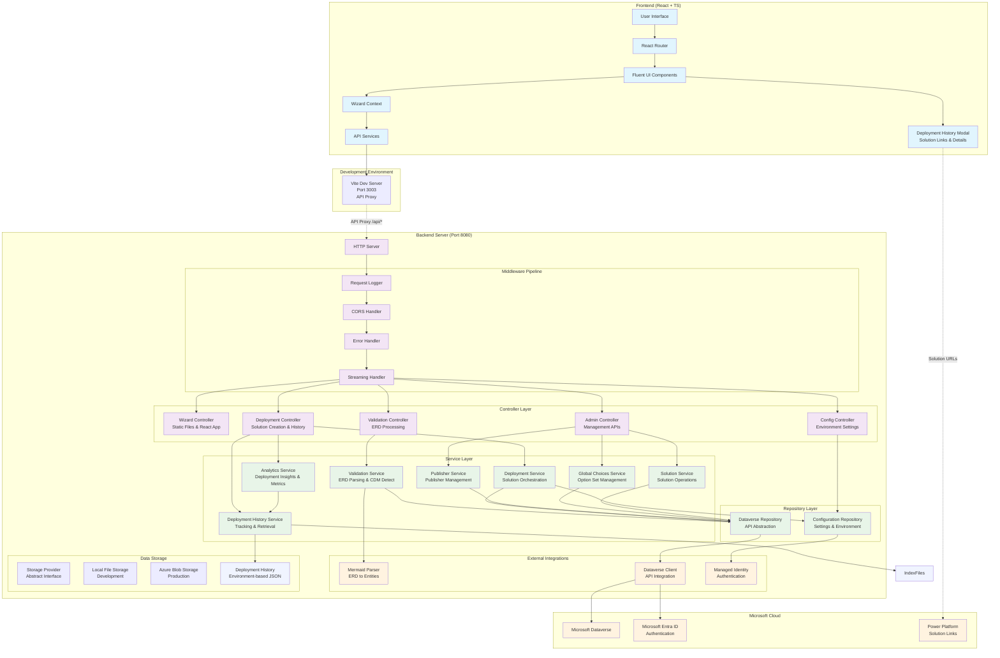
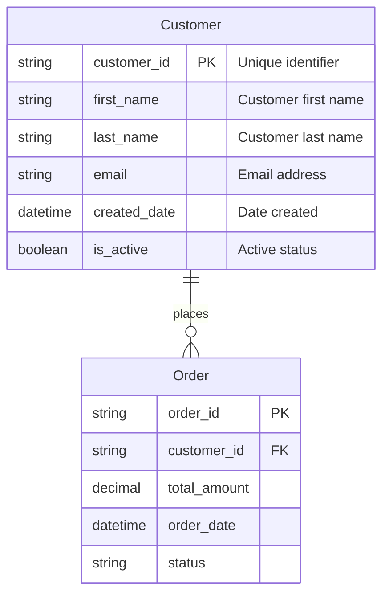
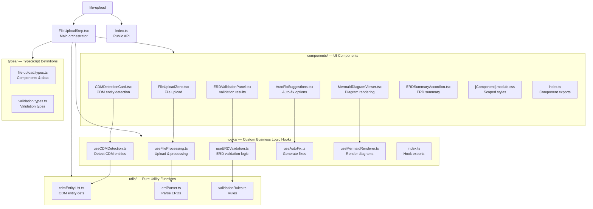
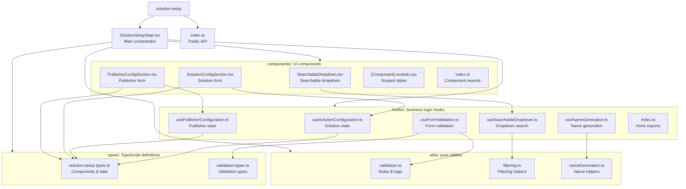
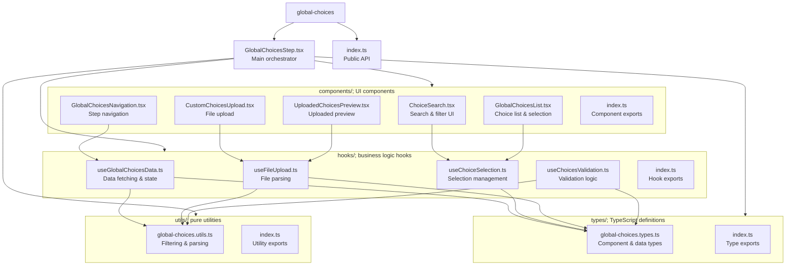
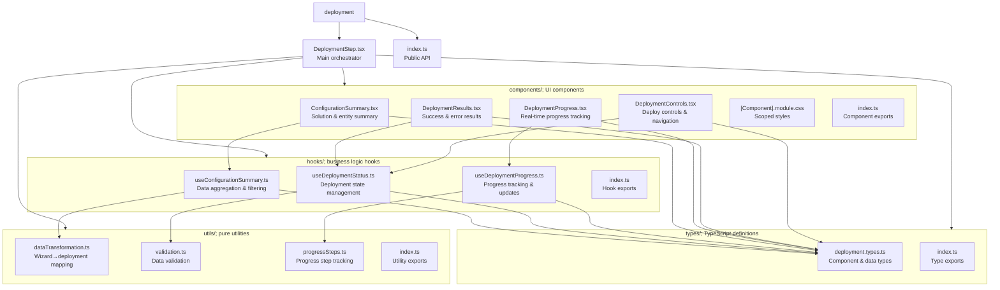
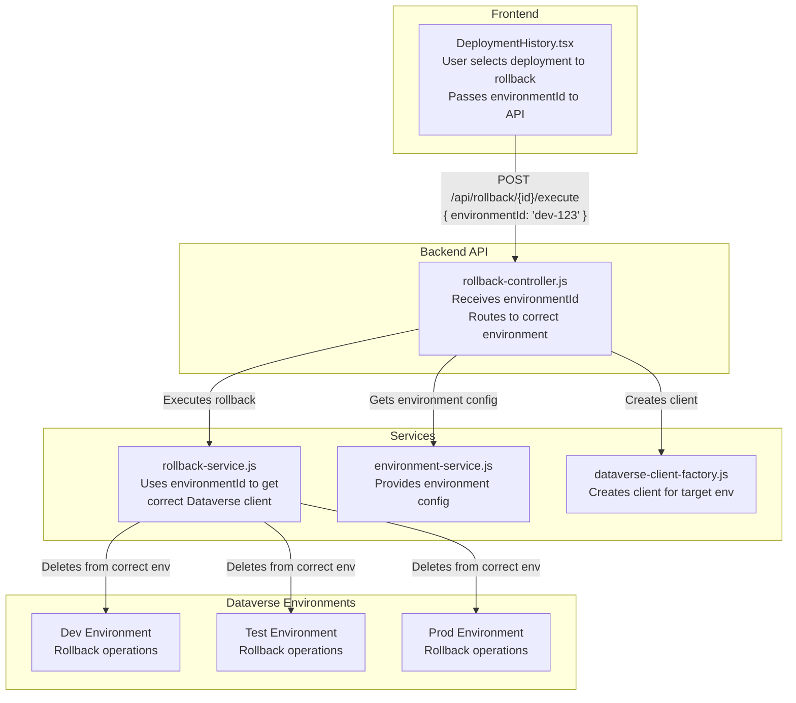
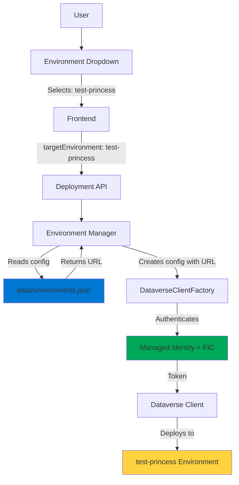
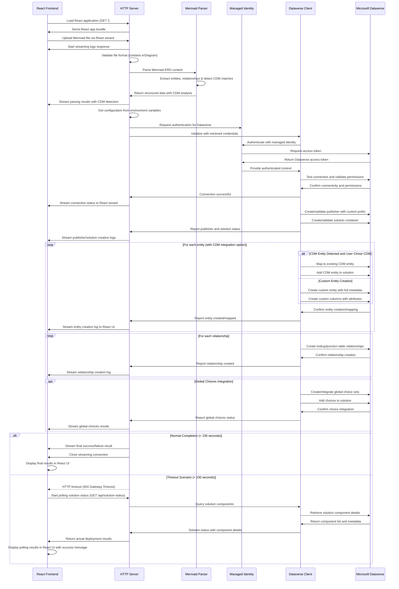

# Developer & Architecture Guide

This document provides a comprehensive overview of the Mermaid to Dataverse Converter application architecture, design decisions, and implementation details for developers who want to understand, maintain, or contribute to the project. Because after all - this is open-source - which is not only free, but I'd love to invite you to join me in this and make a good thing even better!

## System Overview

The Mermaid to Dataverse Converter is a modern React-based web application deployed on Azure App Service that converts Mermaid ERD diagrams into Microsoft Dataverse entities, columns, and relationships. The application features a React 18 frontend with Fluent UI v9 components and a custom Node.js HTTP server backend.

### Key Features

- **Modern React Frontend** - React 18 + TypeScript + Fluent UI v9 wizard interface
- **Real-time ERD Validation** - Auto-correction and syntax checking
- **CDM Integration** - Automatic detection and mapping to Microsoft Common Data Model entities
- **Global Choices Integration** - Upload and manage option sets
- **Publisher Management** - Create or select existing publishers
- **Multi-Environment Support** - Deploy to multiple Dataverse environments (dev/test/prod) from single deployment
- **Deployment History** - Comprehensive tracking with solution links and Power Platform integration
- **Azure AD Authentication** - Enterprise-grade user authentication with MSAL
- **Backend API Protection** - JWT token validation on all API endpoints
- **Enterprise Security** - Managed Identity authentication for Dataverse access
- **Two-Step Deployment** - Separate infrastructure setup and application deployment

### Architecture Overview

- **Frontend**: React 18 + TypeScript + Fluent UI v9 (built with Vite)
  - **Modular Architecture**: All wizard steps are fully modularized with clean separation of concerns
  - **FileUploadStep**: Modular components, hooks, types, and utilities for ERD processing
  - **SolutionSetupStep**: Modular configuration forms with reusable components and business logic
  - **DeploymentStep**: Modular deployment interface with summary, progress, and results components
  - **Comprehensive Testing**: 100% test coverage across all modular components and hooks
- **Backend**: Node.js + Custom HTTP Server
- **Build System**: Vite for frontend, npm for backend
- **Deployment**: Azure App Service with Managed Identity
- **Security**: Managed Identity for secure authentication
- **Infrastructure**: Azure Bicep templates for repeatable deployments


### Architecture Overview Diagram




## Core Components

### 1. React Frontend (`src/frontend/`)

**Purpose**: Modern React 18 application providing the primary user interface with step-by-step wizard functionality.

**Technology Stack**:
- **React 18** with TypeScript
- **Fluent UI v9** 
- **Vite** for fast development and optimized production builds

**Key Features**:
- Multistep wizard interface with progress tracking
- Real-time form validation and user feedback
- File upload with drag-and-drop support
- Publisher and solution management UI
- Global choices integration interface
- Responsive design for all device sizes

**Main Components**:
- `App.tsx` - Main application component with wizard orchestration
- `components/` - Reusable Fluent UI components
- `types/` - TypeScript type definitions
- `services/` - API client services for backend communication

**Build Process**:
```bash
cd src/frontend
npm install
npm run build  # Creates optimized dist/ folder
```

### 2. Node.js Backend (`src/backend/`)

**Purpose**: Service-oriented Node.js HTTP server with controllers, services, repositories, and middleware layers.

**Architecture Pattern**: Clean architecture with dependency injection and separation of concerns.

**Technology Stack**:
- **Node.js HTTP Server** for HTTP handling and custom routing
- **Node.js** with modern ES6+ patterns
- **Dependency Injection** for testable components
- **Repository Pattern** for data access abstraction

**Layer Structure**:
```
src/backend/
├── controllers/          # HTTP request/response handling
│   ├── base-controller.js
│   ├── wizard-controller.js
│   ├── validation-controller.js
│   ├── deployment-controller.js
│   └── admin-controller.js
├── services/            # Business logic layer
│   ├── base-service.js
│   ├── validation-service.js
│   ├── deployment-service.js
│   ├── publisher-service.js
│   ├── global-choices-service.js
│   └── solution-service.js
├── repositories/        # Data access layer
│   ├── base-repository.js
│   ├── dataverse-repository.js
│   └── configuration-repository.js
├── middleware/          # Cross-cutting concerns
│   ├── request-logger-middleware.js
│   ├── error-handler-middleware.js
│   ├── cors-middleware.js
│   └── streaming-middleware.js
└── server.js           # Application bootstrapping and DI container
```

**Key Features**:
- **Controllers**: Handle HTTP requests, validate input, format responses
- **Services**: Implement business logic and coordinate between repositories
- **Repositories**: Abstract data access to Dataverse and configuration sources
- **Middleware**: Provide logging, error handling, CORS, and streaming capabilities
- **Dependency Injection**: Full IoC pattern for testable and maintainable code

**Main Files**:
- `server.js` - Application bootstrap with dependency injection container
- `controllers/` - HTTP layer with request/response handling
- `services/` - Business logic and workflow orchestration
- `repositories/` - Data access abstraction over external APIs
- `middleware/` - Shared functionality across requests

### 3. Application Server (`src/backend/server.js`)

**Purpose**: Application bootstrap that initializes the service-oriented architecture with dependency injection.

**Key Responsibilities**:
- **Dependency Container**: Initializes and wires all services, repositories, and controllers
- **HTTP Routing**: Routes requests to appropriate controllers
- **Middleware Pipeline**: Applies logging, CORS, error handling, and streaming
- **Static File Serving**: Serves React frontend files

**Architecture Pattern**: Uses dependency injection with repositories → services → controllers pattern

**Main Routes**:
- `GET /` - Redirects to React wizard
- `GET /wizard` - Serves React application  
- `POST /api/*` - API endpoints routed to controllers
- `GET /health` - Health check endpoint


### 4. Mermaid Parser (`src/backend/mermaid-parser.js`)

**Purpose**: Parses Mermaid ERD syntax into structured JavaScript objects for Dataverse entity creation.

**Key Features**:
- **CommonJS Module**: Compatible with Node.js server environment
- **Regex-based Parsing**: Robust extraction of entities and relationships
- **Attribute Processing**: Support for types, constraints (PK, FK)
- **Relationship Detection**: One-to-many relationship parsing (many-to-many via junction tables)
- **Error Handling**: Comprehensive validation and error reporting

**Supported Syntax**:


**Validation & Auto-Correction**:
- Automatically adds missing primary keys
- Validates relationship consistency
- Suggests proper naming conventions
- Detects Common Data Model (CDM) entities


### 5. React Wizard Interface (`src/frontend/src/App.tsx`)

**Purpose**: Modern React-based user interface providing step-by-step guided deployment experience with Fluent UI components.

**Technology Stack**:
- **React 18** with functional components and hooks
- **TypeScript** for type safety and better developer experience
- **Fluent UI v9** for Microsoft-consistent design system
- **Modern CSS** with responsive design patterns

**Key Features**:
- **Multistep Wizard**: Progressive disclosure with clear navigation
- **Real-time Validation**: Live ERD syntax checking with auto-corrections
- **File Upload**: Drag-and-drop support with validation
- **Publisher Management**: Visual selection and creation interface
- **Global Choices Integration**: Upload and preview functionality
- **Responsive Design**: Works on desktop, tablet, and mobile devices

**Wizard Steps Flow**:

**Step 1: ERD Upload & Validation**
- Modern file upload with drag-and-drop support
- Real-time syntax validation with detailed error messages
- Autocorrection suggestions with preview
- **CDM Detection**: Visual indication of Common Data Model matches
- **ERD Rendering**: Live Mermaid diagram display after validation
- Entity and relationship preview with expandable details

**Modular Architecture**: The FileUploadStep has been completely modularized using modern React patterns with clean separation of concerns. See [The FileUploadStep Modular Architecture](#fileuploadstep-modular-architecture) section for detailed implementation.

**Step 2: Solution & Publisher Configuration**
- Clean form design with Fluent UI components
- Publisher selection with search and filter capabilities
- New publisher creation with prefix validation
- Solution name validation and conflict checking

**Modular Architecture**: The SolutionSetupStep has been completely modularized using modern React patterns with extracted components and business logic hooks. See [The SolutionSetupStep Modular Architecture](#solutionsetupstep-modular-architecture) section for detailed implementation.

**Step 3: Global Choices Management (Optional)**
- Modular global choices step with comprehensive choice management
- File upload for custom global choice definitions
- Preview table with sortable columns
- Integration with existing Dataverse choices
- Search and filter functionality
- Modular architecture with separate components for search, selection, and upload

**Step 4: Review & Deploy**
- Modular deployment step with comprehensive configuration summary
- **CDM Integration Options**: Clear choice between CDM and custom entities
- Real-time deployment progress with streaming logs
- Success/error handling with detailed feedback
- Modular architecture with separate components for review and deployment

**Component Structure**:

```typescript
// Main application component
export const App: React.FC = () => {
  const [currentStep, setCurrentStep] = useState(1);
  const [erdData, setErdData] = useState<ERDData | null>(null);
  const [publishers, setPublishers] = useState<Publisher[]>([]);
  
  return (
    <FluentProvider theme={webLightTheme}>
      <div className="wizard-container">
        <ProgressIndicator currentStep={currentStep} totalSteps={4} />
        {renderCurrentStep()}
      </div>
    </FluentProvider>
  );
};
```

**Modern React Patterns**:
- **Hooks**: useState, useEffect, useCallback for state management
- **Context**: For sharing state across components
- **Error Boundaries**: Graceful error handling
- **Code Splitting**: Lazy loading for optimal performance

### 6. Deployment History Feature (`src/frontend/src/components/deployment-history/`)

**Purpose**: Comprehensive deployment tracking and management system that provides users with detailed visibility into their Dataverse solution deployments **across multiple environments**.

**Technology Stack**:
- **React 18** with TypeScript and Fluent UI v9 components
- **Modal Dialog Interface** with expandable accordions for deployment details
- **Multi-Environment Support** with environment filtering and colored indicators
- **API Integration** with backend deployment history service
- **Power Platform Integration** with direct solution links

**Key Features**:
- **Multi-Environment Support**: Filter and view deployments across multiple Dataverse environments
- **Environment Selector**: Dropdown with colored environment indicators (dev, test, prod)
- **Environment-Specific Filtering**: View deployments for individual environments or all environments combined
- **Colored Environment Badges**: Visual indicators showing which environment each deployment belongs to
- **Complete Deployment Tracking**: Records all deployments with timestamps, status, and detailed entity information
- **Solution Links**: Direct links to Power Platform solutions with dynamic environment ID configuration
- **Deployment Details**: Expandable accordions showing deployed entities, columns, and relationships
- **Status Visualization**: Clear success/failure indicators with detailed error information
- **Table Styling**: Alternating row backgrounds and professional column formatting

**Multi-Environment Architecture**:
```typescript
// Main deployment history modal component with environment support
export const DeploymentHistory: React.FC = () => {
  const [selectedEnvironment, setSelectedEnvironment] = useState<string>('all');
  const [environments, setEnvironments] = useState<Environment[]>([]);
  const [deployments, setDeployments] = useState<Deployment[]>([]);
  
  // Load environments on mount
  useEffect(() => {
    const loadEnvironments = async () => {
      const response = await fetch('/api/environments');
      const data = await response.json();
      setEnvironments(data.environments);
    };
    loadEnvironments();
  }, []);
  
  // Load deployments filtered by selected environment
  useEffect(() => {
    const loadDeployments = async () => {
      const params = selectedEnvironment !== 'all' 
        ? `?environmentId=${selectedEnvironment}` 
        : '';
      const response = await fetch(`/api/deployments${params}`);
      const data = await response.json();
      setDeployments(data.deployments);
    };
    loadDeployments();
  }, [selectedEnvironment]);
  
  // Environment selector with colored options
  return (
    <Dialog modal open={isOpen} onOpenChange={onOpenChange}>
      <DialogSurface>
        <Select value={selectedEnvironment} onChange={handleEnvironmentChange}>
          <option value="all">All Environments</option>
          {environments.map(env => (
            <option key={env.id} value={env.id}>
              <Badge color={getEnvironmentColor(env.type)} />
              {env.name}
            </option>
          ))}
        </Select>
        
        {/* Deployment table with environment badges */}
        <Table>
          {deployments.map(deployment => (
            <TableRow key={deployment.id}>
              <TableCell>
                <Badge color={getEnvironmentColor(deployment.environmentType)}>
                  {deployment.environmentName}
                </Badge>
              </TableCell>
              {/* Other deployment details */}
            </TableRow>
          ))}
        </Table>
      </DialogSurface>
    </Dialog>
  );
};
```

**Backend Multi-Environment Support**:
- **Environment-Specific Storage**: Deployment history stored persistently in Azure Blob Storage (production) or local files (development)
- **Storage Abstraction**: Unified storage interface supporting both local and Azure backends
- **Filtered Queries**: API endpoint supports `?environmentId=xxx` query parameter
- **Environment Metadata**: Each deployment record includes `environmentId`, `environmentName`, and `environmentUrl`
- **Merged View**: "All Environments" option combines deployments from all environment index files

**API Endpoints**:
```
GET /api/environments                          # List all configured environments
GET /api/deployments                           # Get all deployments (merged from all environments)
GET /api/deployments?environmentId={id}        # Get deployments for specific environment
GET /api/config                                # Get Power Platform environment configuration
```

**Environment Color Coding**:
- **Development**: Blue badges and indicators
- **Test**: Purple badges and indicators  
- **Production**: Green badges and indicators
- **Other**: Gray badges and indicators

**User Experience Features**:
- **Environment Filtering**: Quick switching between environments with visual feedback
- **Colored Indicators**: Instant visual recognition of deployment environment
- **Professional Table Design**: Alternating row backgrounds and bold column headers
- **Expandable Details**: Deployment and entity accordions for comprehensive information viewing
- **Direct Navigation**: Solution links open Power Platform in new tabs for seamless workflow
- **Responsive Design**: Modal scales appropriately for different screen sizes
- **Loading States**: Proper loading indicators during data fetching

This deployment history system provides enterprise-grade deployment tracking with **multi-environment support** and seamless Power Platform integration, enabling users to effectively manage and monitor their Dataverse solution deployments across development, test, and production environments.

## FileUploadStep Modular Architecture

**Purpose**: The FileUploadStep has been modularized

### Architecture Overview



### Design Principles

**1. Single Responsibility Principle**
- Each component has one focused purpose
- Each hook manages one aspect of business logic
- Each utility handles one specific operation

**2. Separation of Concerns**
- **UI Components**: Pure presentation with props-based interface
- **Custom Hooks**: Business logic and state management
- **Utilities**: Pure functions with no side effects
- **Types**: Comprehensive TypeScript definitions

**3. Dependency Inversion**
- Components depend on abstractions (props interfaces)
- Hooks abstract complex business logic
- Clean interfaces between layers

### Component Architecture

#### UI Components (Presentation Layer)

**FileUploadZone**
```typescript
interface FileUploadZoneProps {
  onFileSelected: (file: File, content: string) => void;
  disabled?: boolean;
  className?: string;
}
```
- Pure presentation component for file upload
- Drag-and-drop functionality with visual feedback
- Scoped CSS modules for styling isolation

**MermaidDiagramViewer**
```typescript
interface MermaidDiagramViewerProps {
  content: string;
  onRenderError?: (error: string) => void;
  className?: string;
}
```
- Mermaid.js integration for ERD visualization
- Error boundary handling for render failures
- Responsive design with proper scaling

**CDMDetectionCard**
```typescript
interface CDMDetectionCardProps {
  detectionResult: CDMDetectionResult;
  onChoiceSelected: (choice: 'cdm' | 'custom') => void;
  onChoiceChanged: () => void;
  className?: string;
}
```
- Visual presentation of CDM entity matches
- User choice interface for CDM vs. custom entities
- Confidence indicators and entity details

**ERDValidationPanel**
```typescript
interface ERDValidationPanelProps {
  validationResult: ERDValidationResult;
  className?: string;
}
```
- Comprehensive validation results display
- Severity-based issue categorization (error, warning, info)
- Visual indicators and detailed descriptions

**AutoFixSuggestions**
```typescript
interface AutoFixSuggestionsProps {
  autoFixes: AutoFix[];
  onApplyFix: (fixId: string) => void;
  onApplyAllFixes: () => void;
  isLoading?: boolean;
  className?: string;
}
```
- Interactive auto-fix recommendations
- Preview of changes before application
- Batch operations for multiple fixes

**ERDSummaryAccordion**
```typescript
interface ERDSummaryAccordionProps {
  erdStructure: ERDStructure;
  className?: string;
}
```
- Collapsible summary of parsed ERD structure
- DataGrid components for entities and relationships
- Sortable and filterable content

#### Custom Hooks (Business Logic Layer)

**useFileProcessing**
```typescript
export const useFileProcessing = () => {
  const [isLoading, setIsLoading] = useState(false);
  
  const processFile = useCallback(async (file: File, content: string) => {
    // File validation and processing logic
  }, []);
  
  return { processFile, isLoading };
};
```
- File upload handling and validation
- Content extraction and format checking
- Error handling and loading states

**useCDMDetection**
```typescript
export const useCDMDetection = () => {
  const [cdmDetection, setCdmDetection] = useState<CDMDetectionResult | null>(null);
  
  const detectCDMEntities = useCallback(async (content: string) => {
    // CDM entity detection algorithm
  }, []);
  
  return { detectCDMEntities, cdmDetection, setCDMChoice };
};
```
- CDM entity matching algorithm
- Confidence scoring and entity analysis
- User choice management

**useERDValidation**
```typescript
export const useERDValidation = () => {
  const [validationResult, setValidationResult] = useState<ERDValidationResult | null>(null);
  
  const validateERD = useCallback(async (content: string, isCdm: boolean) => {
    // ERD validation logic with severity categorization
  }, []);
  
  return { validateERD, validationResult };
};
```
- Comprehensive ERD structure validation
- Issue detection with severity levels
- Integration with the validation rules engine

**useAutoFix**
```typescript
export const useAutoFix = () => {
  const [autoFixes, setAutoFixes] = useState<AutoFix[]>([]);
  const [isApplying, setIsApplying] = useState(false);
  
  const generateAutoFixes = useCallback(async (validation: ERDValidationResult, content: string) => {
    // Auto-fix generation logic
  }, []);
  
  return { generateAutoFixes, applyFix, applyAllFixes, autoFixes, isApplying };
};
```
- Intelligent fix suggestion generation
- Content modification and validation
- Progress tracking for a fix application

**useMermaidRenderer**
```typescript
export const useMermaidRenderer = () => {
  const [renderResult, setRenderResult] = useState<MermaidRenderResult | null>(null);
  
  const renderDiagram = useCallback(async (content: string) => {
    // Mermaid.js integration and error handling
  }, []);
  
  return { renderDiagram, renderResult };
};
```
- Mermaid.js diagram generation
- SVG output management
- Render error handling and fallbacks

### Integration Pattern

**Main Orchestrator Component**
```typescript
export const FileUploadStep: React.FC = () => {
  // State management
  const [currentFile, setCurrentFile] = useState<UploadedFile | null>(null);
  const [isProcessing, setIsProcessing] = useState(false);
  const [error, setError] = useState<string | null>(null);

  // Custom hooks integration
  const { processFile, isLoading: isFileProcessing } = useFileProcessing();
  const { detectCDMEntities, cdmDetection, setCDMChoice } = useCDMDetection();
  const { validateERD, validationResult } = useERDValidation();
  const { generateAutoFixes, applyFix, autoFixes } = useAutoFix();
  const { renderDiagram, renderResult } = useMermaidRenderer();

  // Orchestrated workflow
  const handleFileSelected = useCallback(async (file: File, content: string) => {
    const result = await processFile(file, content);
    if (result.success) {
      setCurrentFile({ file, content, processed: true });
      await detectCDMEntities(content);
      await renderDiagram(content);
    }
  }, [processFile, detectCDMEntities, renderDiagram]);

  return (
    <div className={styles.fileUploadStep}>
      <FileUploadZone onFileSelected={handleFileSelected} disabled={isProcessing} />
      {cdmDetection && <CDMDetectionCard detectionResult={cdmDetection} onChoiceSelected={handleCDMChoice} />}
      {renderResult && <MermaidDiagramViewer content={currentFile.content} />}
      {validationResult && <ERDValidationPanel validationResult={validationResult} />}
      {autoFixes?.length > 0 && <AutoFixSuggestions autoFixes={autoFixes} onApplyFix={handleApplyFix} />}
      {erdStructure && <ERDSummaryAccordion erdStructure={erdStructure} />}
    </div>
  );
};
```

### Testing Strategy

**Unit Tests**: Each hook and utility function has dedicated unit tests
**Component Tests**: UI components tested with React Testing Library
**Integration Tests**: Full workflow tested with mocked dependencies
**Validation**: All 317 tests pass, confirming architectural integrity

**Test Coverage**:
- **Utilities**: 100% coverage of pure functions
- **Hooks**: State management and business logic validation
- **Components**: Props interface and rendering behavior
- **Integration**: End-to-end workflow validation

### Usage Examples

**Simple Component Import**:
```typescript
import { FileUploadZone } from './components/wizard/steps/file-upload';

<FileUploadZone onFileSelected={handleFile} disabled={isLoading} />
```

**Business Logic Hook Usage**:
```typescript
import { useFileProcessing, useCDMDetection } from './components/wizard/steps/file-upload';

const { processFile } = useFileProcessing();
const { detectCDMEntities, cdmDetection } = useCDMDetection();
```

**Complete Module Import**:
```typescript
import { FileUploadStep } from './components/wizard/steps/file-upload';

// Fully integrated, production-ready component
<FileUploadStep />
```

## SolutionSetupStep Modular Architecture

**Purpose**: The SolutionSetupStep has been modularized using clean architecture principles with extracted components and business logic hooks.

### Architecture Overview



### Design Principles

**1. Separation of Concerns**
- **UI Components**: Pure presentation with props-based interface
- **Business Logic Hooks**: State management and API integration
- **Utilities**: Pure functions for validation and data transformation
- **Types**: Comprehensive TypeScript definitions

**2. Reusability**
- SearchableDropdown extracted as a reusable component
- Configuration hooks usable across different forms
- Validation utilities applicable to other wizard steps

**3. Testability**
- Each hook independently testable
- Components tested in isolation
- 97 passing tests validate all functionality

### Testing Strategy

**Comprehensive Test Coverage**: 97/97 tests passing across all components and hooks
- **SearchableDropdown**: 21 tests covering ARIA, keyboard navigation, error states
- **useSearchableDropdown**: 23 tests for search logic and state management
- **useSolutionConfiguration**: 12 tests for solution state and validation
- **usePublisherConfiguration**: 11 tests for publisher state and form handling
- **useNameGeneration**: 13 tests for name generation utilities
- **SolutionSetupStep**: 17 tests for integration and accessibility

This modular architecture ensures the SolutionSetupStep is **maintainable**, **testable**, **reusable**, and **scalable** while providing robust form validation and user experience.

## GlobalChoicesStep Modular Architecture

**Purpose**: The GlobalChoicesStep has been completely modularized using clean architecture principles, transforming a 372-line monolithic component into a maintainable modular structure with separated components for choice search, selection, file upload, and navigation.

### Architecture Overview



### Design Principles

**1. Component Separation**
- **ChoiceSearch**: Clean search interface with debounced filtering
- **GlobalChoicesList**: Organized choice display with grouping by prefix
- **CustomChoicesUpload**: File upload with progress and error handling
- **UploadedChoicesPreview**: Display and management of uploaded choices
- **GlobalChoicesNavigation**: Step navigation with validation state

**2. Business Logic Abstraction**
- **useGlobalChoicesData**: Integrates with existing useGlobalChoices service hook
- **useChoiceSelection**: Manages selection state and choice management logic
- **useFileUpload**: Handles file upload, JSON parsing, and error handling
- **useChoicesValidation**: Validates step completion (always valid since optional)

**3. Data Flow Management**
- **Types**: Comprehensive TypeScript definitions for all component and hook interfaces
- **Clean Dependencies**: Each component depends only on its required props
- **State Management**: Centralized through wizard context with hook abstractions

### Key Component Interfaces

**ChoiceSearch Component**
```typescript
interface ChoiceSearchProps {
  value: string;
  onChange: (value: string) => void;
  placeholder?: string;
  disabled?: boolean;
}
```

**GlobalChoicesList Component**
```typescript
interface GlobalChoicesListProps {
  choices: GlobalChoice[];
  selectedChoices: GlobalChoice[];
  onChoiceSelect: (choiceId: string, selected: boolean) => void;
  searchTerm?: string;
  loading?: boolean;
}
```

**CustomChoicesUpload Component**
```typescript
interface CustomChoicesUploadProps {
  onFileUpload: (file: File) => void;
  uploadedFile?: File | null;
  isUploading?: boolean;
  error?: string | null;
}
```

### Hook Architecture

**useGlobalChoicesData**: Data fetching and integration
- Integrates with existing `useGlobalChoices` service hook
- Provides built-in and custom choices with loading states
- Maps service data to component-compatible formats

**useChoiceSelection**: Selection state management
- Manages selected choices in the wizard context
- Provides selection, deselection, and bulk operations
- Validates selection state and provides error feedback

**useFileUpload**: File processing and validation
- Handles file upload with progress tracking
- Parses JSON files and validates a format
- Integrates uploaded choices with the wizard state

**useChoicesValidation**: Step validation logic
- Always returns valid since global choices are optional
- Provides informational messages about current selections
- Supports future enhancement for required choice scenarios

### User Experience Enhancements

**1. Search and Filtering**
- Real-time search across choice names and logical names
- Prefix-based grouping for better organization
- Clear visual feedback for empty states

**2. File Upload Experience**
- Drag-and-drop file upload interface
- Real-time upload progress indication
- Clear error messaging for invalid files
- Preview of uploaded choices before confirmation

**3. Selection Management**
- Visual selection state with checkboxes
- Bulk selection/deselection capabilities
- Selection count and validation feedback
- Persistent selection state across navigation

### Testing Strategy

**Comprehensive Test Coverage**: 19/19 tests passing across all components and utilities

**Component Tests (8 tests)**:
- **ChoiceSearch**: Search functionality and user input handling
- **GlobalChoicesList**: Choice rendering, selection, and filtering
- **CustomChoicesUpload**: File upload interface and error states
- **UploadedChoicesPreview**: Choice preview and removal functionality
- **GlobalChoicesNavigation**: Navigation controls and validation display

**Hook Tests (5 tests)**:
- **useGlobalChoicesData**: Data fetching and state management
- **useChoiceSelection**: Selection logic and wizard context integration
- **useFileUpload**: File processing, parsing, and error handling
- **useChoicesValidation**: Validation logic and message generation

**Integration Tests (6 tests)**:
- **GlobalChoicesStep**: Full component integration and workflow
- **Wizard Context**: State persistence and cross-step data flow
- **Error Handling**: File upload errors and recovery scenarios
- **User Workflows**: Complete selection and upload scenarios

**Test Categories**:
- **Unit Tests**: Individual component and hook behavior with mock dependencies
- **Integration Tests**: Component interaction and wizard context integration
- **Error Handling**: File upload errors, validation edge cases, and error recovery
- **User Interaction**: Search, selection, upload, and navigation workflows
- **Accessibility**: Screen reader support and keyboard navigation

### Migration Impact

**Before Modularization**: 372-line monolithic component with mixed concerns
**After Modularization**: Clean separation across 5 components and 4 hooks

**Benefits Achieved**:
- **Maintainability**: Each component has a single responsibility
- **Testability**: Comprehensive test coverage with isolated testing
- **Reusability**: Components can be used independently or in other contexts
- **Scalability**: Easy to extend with new features or choice types
- **Type Safety**: Comprehensive TypeScript definitions prevent runtime errors

This modular architecture ensures the GlobalChoicesStep is **production-ready**, **maintainable**, **testable**, and **scalable** while preserving all existing functionality and enhancing the user experience.

## DeploymentStep Modular Architecture

**Purpose**: The DeploymentStep has been completely modularized using clean architecture principles with separated components for configuration summary, deployment progress, and result handling.

### Architecture Overview



### Design Principles

**1. Component Separation**
- **ConfigurationSummary**: Pure presentation of a solution, publisher, entities, and relationships
- **DeploymentProgress**: Real-time streaming deployment progress with logs
- **DeploymentResults**: Success/error result display with detailed feedback
- **DeploymentControls**: Navigation buttons and deployment trigger

**2. Business Logic Abstraction**
- **useConfigurationSummary**: Aggregates wizard data into a deployment-ready format
- **useDeploymentStatus**: Manages deployment state and API integration
- **useDeploymentProgress**: Handles streaming progress updates and error states

**3. Data Flow Management**
- **Utils**: Pure functions for data transformation and validation
- **Types**: Comprehensive TypeScript definitions for all interfaces
- **Clean Dependencies**: Each component depends only on its required props

### Testing Strategy

**Comprehensive Test Coverage**: 19/19 tests passing across all components and utilities
- **Utils Tests (11 tests)**: Data transformation, validation, and filtering functions
- **Hooks Tests (4 tests)**: Configuration summary and business logic validation  
- **Integration Tests (4 tests)**: Full component integration and rendering behavior

**Test Categories**:
- **Unit Tests**: Pure utility functions with 100% coverage
- **Hook Tests**: State management and wizard context integration
- **Component Tests**: UI rendering and props interface validation
- **Integration Tests**: End-to-end deployment step workflow

This modular architecture ensures the DeploymentStep is **production-ready**, **maintainable**, **testable**, and **scalable** while providing comprehensive deployment functionality with real-time progress tracking.

## API Endpoints Reference

This section provides detailed documentation for all available API endpoints implemented through the controller-based architecture.

### Core Endpoints

| Endpoint | Method | Controller | Description |
|----------|--------|------------|-------------|
| `GET /` | GET | WizardController | Redirects to React wizard interface |
| `GET /wizard` | GET | WizardController | Serves React application |
| `GET /health` | GET | AdminController | Application health status and diagnostics |
| `POST /upload` | POST | DeploymentController | Primary deployment with streaming response |
| `POST /api/validate-erd` | POST | ValidationController | ERD validation with auto-corrections |
| `GET /api/publishers` | GET | AdminController | Lists available publishers in Dataverse |
| `GET /api/global-choices-list` | GET | AdminController | Lists available global choice sets |
| `GET /api/solution-status` | GET | AdminController | Solution component status verification |
| `GET /api/health-detailed` | GET | AdminController | Detailed health check with components |
| `GET /api/logs` | GET | AdminController | Recent application logs |

### Architecture Implementation

**Request Flow**:
1. **Middleware Pipeline**: Request logging, CORS handling
2. **Controller Layer**: HTTP request/response handling
3. **Service Layer**: Business logic execution
4. **Repository Layer**: Data access to Dataverse/configuration
5. **Response**: Formatted JSON or streaming data

**Error Handling**: Centralized through ErrorHandlerMiddleware with proper HTTP status codes and structured error responses.

### Frontend Routes

```
GET /
GET /wizard
```

**Purpose**: Serves the React application for all frontend routes.

**Response**: Returns the React application HTML with proper SPA routing support.

**Static Assets**: 
- `/static/css/*` - Compiled CSS from Vite build
- `/static/js/*` - Compiled JavaScript bundles
- `/static/assets/*` - Images, fonts, and other assets

### Health Endpoint

```
GET /health
```

**Purpose**: Comprehensive health check including managed identity authentication and Dataverse connectivity.

**Response**:
```json
{
  "status": "healthy",
  "timestamp": "2025-09-07T14:30:00.000Z",
  "version": "2.0.0",
  "managedIdentity": {
    "authenticated": true,
    "tokenValid": true
  },
  "dataverse": {
    "authenticated": true,
    "connectionTest": "passed"
  }
}
```

### Upload Endpoint (Primary Deployment)

```
POST /api/upload
```

**Purpose**: Deploys entities and relationships to Dataverse with real-time streaming progress updates.

**Request**: JSON with mermaidContent, entities, relationships, solutionName, publisherInfo, and deploymentOptions
**Response**: Streaming JSON with real-time progress updates and final deployment results

### Rollback System

**Purpose**: Comprehensive rollback functionality that allows users to safely reverse Dataverse deployments with step-by-step progress tracking matching the deployment experience, **with full multi-environment support**.

**Key Features**:
- **Multi-Environment Rollback**: Delete deployments from the correct Dataverse environment
- **Environment-Aware Operations**: Automatically routes rollback to the environment where deployment was created
- **Enhanced Progress Tracking**: Real-time step-by-step progress indicators with pink pulsing animations
- **Safe Rollback Operations**: Validates rollback eligibility and preserves data integrity
- **Dependency-Aware Deletion**: Gracefully handles entities with dependencies - continues rollback instead of failing, skipping blocked entities and providing detailed reporting
- **Comprehensive Component Removal**: Handles entities, relationships, global choices, solutions, and publishers
- **Retry Logic**: Robust handling of Dataverse API concurrency conflicts
- **Deployment History Integration**: Seamless rollback initiation from deployment history modal with environment context

**Multi-Environment Rollback Architecture**:



**Environment-Aware Rollback Flow**:

1. **User Action**: User clicks rollback button in deployment history modal
2. **Environment Context**: Selected environment ID is passed to rollback API
3. **Environment Resolution**: Backend retrieves full environment configuration
4. **Client Creation**: Dataverse client created for the target environment
5. **Rollback Execution**: All operations execute against the correct environment
6. **History Update**: Deployment status updated in environment-specific history file

**API Endpoint with Environment Support**:

```typescript
// Rollback controller - accepts environmentId
POST /api/rollback/:deploymentId/execute
Body: {
  environmentId: "dev-princess-123",  // ID of target environment
  confirmed: true
}

// Controller extracts environment and creates client
const rollbackController = {
  async executeRollback(req, res) {
    const { deploymentId } = req.params;
    const { environmentId, confirmed } = req.body;
    
    // Get environment configuration
    const environment = environmentService.getEnvironment(environmentId);
    if (!environment) {
      return res.status(404).json({ error: 'Environment not found' });
    }
    
    // Create Dataverse client for this environment
    const dataverseClient = await dataverseClientFactory.createClient(
      environment.url,
      environment.clientId,
      environment.clientSecret,
      environment.tenantId
    );
    
    // Execute rollback using environment-specific client
    const result = await rollbackService.executeRollback(
      deploymentId,
      dataverseClient,
      confirmed
    );
    
    res.json(result);
  }
};
```

**Frontend Integration with Environment**:

```typescript
// DeploymentHistory.tsx - passes environment to rollback
const handleRollback = async (deployment: Deployment) => {
  const confirmed = window.confirm(
    `Rollback deployment "${deployment.solutionName}" from ${deployment.environmentName}?`
  );
  
  if (!confirmed) return;
  
  try {
    const response = await fetch(
      `/api/rollback/${deployment.id}/execute`,
      {
        method: 'POST',
        headers: { 'Content-Type': 'application/json' },
        body: JSON.stringify({
          environmentId: deployment.environmentId,  // Pass environment
          confirmed: true
        })
      }
    );
    
    const result = await response.json();
    
    // Refresh deployments for current environment filter
    await loadDeployments(selectedEnvironment);
    
    alert(`Rollback ${result.success ? 'completed' : 'failed'}`);
  } catch (error) {
    console.error('Rollback failed:', error);
    alert('Rollback failed');
  }
};
```

**Rollback Process Flow** (Environment-Aware):

1. **Eligibility Check**: Validates that deployment can be safely rolled back
2. **Environment Validation**: Confirms environment exists and is accessible
3. **Preparation**: Initializes rollback tracker and validates stored rollback data
4. **Component Removal**: Step-by-step removal in reverse dependency order from the **correct environment**:
   - Relationships (dependencies first)
   - Custom Entities (data preservation)
   - Global Choices (solution integration)
   - Solution (if empty)
   - Publisher (if empty)
   - Cleanup Operations
5. **Finalization**: Updates deployment status in **environment-specific** history file

**Enhanced Progress Features**:
- **Step Activation**: Each step shows as "active" with pink pulsing background during execution
- **Real-time Updates**: Progress percentage, elapsed time, and estimated remaining time
- **Status Badges**: "In Progress", "Done", and "Failed" badges for each step
- **Spinner Animations**: Active steps display animated spinners
- **Time Estimation**: Intelligent time predictions based on operation complexity

**API Endpoints**:

```
GET /api/rollback/capability/{deploymentId}    # Check rollback eligibility
POST /api/rollback/{deploymentId}/execute      # Start rollback operation  
GET /api/rollback/{rollbackId}/status          # Get real-time rollback progress
```

**Rollback Eligibility Requirements**:
- Deployment status must be "success" or "partial"
- Rollback data must be stored and accessible
- No dependent deployments exist
- Solution components must be removable

**Error Handling & Retry Logic**:
- **Dataverse Concurrency**: Specialized retry logic for EntityCustomization conflicts (error 0x80071151)
- **Progressive Delays**: Increased delays (10s, 15s, 20s, 25s, 30s) for concurrency conflicts
- **Component Dependencies**: Handles relationship dependencies and component ordering
- **Graceful Degradation**: Continues rollback even if some components fail to delete

**Frontend Integration**:
- **Deployment History Modal**: Rollback buttons for eligible deployments
- **Progress Tracking**: Same EnhancedProgress component used for deployments
- **Real-time Updates**: Status polling with 3-second intervals
- **Error Display**: Comprehensive error handling and user feedback

**Security & Safety**:
- **Confirmation Required**: Explicit user confirmation before rollback execution
- **Data Validation**: Validates rollback data integrity before proceeding
- **Audit Trail**: Complete logging of all rollback operations
- **Status Tracking**: Persistent status tracking for long-running operations

This rollback system provides enterprise-grade deployment reversal capabilities with the same professional user experience as deployment operations, ensuring users can confidently manage their Dataverse solution lifecycle.

### ERD Validation Endpoint

```
POST /api/validate-erd
```

**Purpose**: Validates Mermaid ERD syntax, provides auto-corrections, and detects CDM entities.

**Request**: JSON with mermaid ERD content
**Response**: JSON with validation results, entities, relationships, CDM matches, and corrections

#### Publishers Endpoint

```
GET /api/publishers
```

**Purpose**: Retrieves available publishers from Dataverse for frontend selection.

### Global Choices Endpoint

```
GET /api/global-choices
```

**Purpose**: Retrieves available global choice sets with grouping and filtering support.


### Solution Status Endpoint (Timeout Handling)

```
GET /api/solution-status?solution=SolutionName
```

**Purpose**: Retrieves solution components for deployment verification, especially after HTTP timeouts.

**Query Parameters**:
- `solution` (required): The unique name of the solution to check

**Response**:

```json
{
  "success": true,
  "solution": {
    "uniqueName": "CustomerSolution",
    "friendlyName": "Customer Management Solution",
    "solutionId": "guid-value"
  },
  "components": {
    "entities": [
      {
        "logicalName": "myp_customer",
        "displayName": "Customer",
        "type": "entity"
      }
    ],
    "optionSets": [
      {
        "logicalName": "myp_priority_level",
        "displayName": "Priority Level",
        "type": "optionset"
      }
    ],
    "others": [],
    "totalCount": 2
  },
  "lastModified": "2025-09-07T14:30:00.000Z"
}
```


## Dataverse Client

**Purpose**: Handle all Microsoft Dataverse Web API interactions with comprehensive entity, relationship, and solution management.

**Location**: `src/backend/dataverse/index.js` (modular service architecture)

**Key Features**:
- **Managed Identity Authentication**: Passwordless authentication via Azure
- **Publisher and Solution Management**: Create or use existing resources
- **Entity Creation**: Full metadata support with proper naming conventions
- **Column and Relationship Creation**: Complete attribute and relationship support
- **Global Choice Management**: Create and integrate option sets
- **Solution Introspection**: Verify deployment results and component status
- **Comprehensive Error Handling**: Robust error recovery and logging

**Main Operations**:
- **Connection Testing**: Validates Dataverse connectivity and authentication
- **Publisher Management**: Creates or uses existing publishers with custom prefixes
- **Solution Management**: Creates or uses existing solutions with proper metadata
- **Entity Creation**: Creates custom entities with full metadata and naming conventions
- **Column Creation**: Adds custom columns with complete attribute support
- **Relationship Creation**: Establishes one-to-many and many-to-many relationships
- **Global Choice Management**: Creates and manages global choice sets with solution integration
- **Solution Component Verification**: Retrieves and validates deployment results

**Authentication**: Uses Azure Managed Identity for passwordless authentication with proper headers and token management

**Entity Creation Flow**: Validates connection → Creates/validates publisher → Creates/validates a solution → Creates entities with metadata → Adds to a solution → Creates columns and relationships

**Solution Status Verification**: Retrieves solution metadata and enumerates all components (entities, option sets, etc.) for deployment verification 
           

### 7. User Authentication & API Protection (`src/backend/middleware/auth.js`, `src/frontend/src/auth/`)

**Purpose**: Protect all backend API endpoints with Azure AD authentication using MSAL (Microsoft Authentication Library) for enterprise-grade user authentication.

**Key Features**:
- **Azure AD Integration**: Enterprise Single Sign-On with Microsoft Entra ID
- **JWT Token Validation**: Backend validates ID tokens on all `/api/*` routes
- **Automatic Token Management**: MSAL handles token acquisition, caching, and refresh
- **Protected API Client**: All frontend services use authenticated HTTP client
- **Zero Trust Architecture**: No API access without valid authentication token

**Frontend Authentication** (`src/frontend/src/auth/`):
- **MSAL Browser**: @azure/msal-browser v3.7.1 for SPA authentication
- **Auth Provider**: React context provider wraps entire application
- **Auth Config**: Environment-specific Azure AD app registration configuration
- **API Client**: Authenticated axios instance with request interceptor (`src/frontend/src/api/apiClient.ts`)

**Backend Protection** (`src/backend/middleware/auth.js`):
- **JWT Validation**: Validates Azure AD ID tokens on every request
- **Protected Routes**: All `/api/*` endpoints require valid Bearer token
- **401 Response**: Returns `{ "success": false, "error": "Unauthorized: Authentication token required" }` when token missing/invalid
- **Token Extraction**: Parses `Authorization: Bearer ${token}` header

**Authentication Flow**:
```javascript
// Frontend: API client automatically adds auth token
import { apiClient } from '../api/apiClient';

// All requests automatically include Authorization header
const publishers = await apiClient.get('/publishers');
const solutions = await apiClient.post('/solutions', data);

// For streaming endpoints (manual token required)
const msalInstance = getMsalInstance();
const accounts = msalInstance.getAllAccounts();
const response = await msalInstance.acquireTokenSilent({
  account: accounts[0],
  scopes: ['User.Read']
});
const authToken = response.idToken;

// Include token in streaming request
const streamResponse = await fetch('/upload', {
  method: 'POST',
  headers: {
    'Authorization': `Bearer ${authToken}`,
    'Content-Type': 'application/json'
  },
  body: JSON.stringify(data)
});
```

**Required Environment Variables** (Frontend):
- `VITE_AZURE_CLIENT_ID` - Azure AD app registration client ID
- `VITE_AZURE_TENANT_ID` - Azure AD tenant ID
- `VITE_AZURE_REDIRECT_URI` - OAuth redirect URI (app URL)

**Backend Middleware Implementation**:
```javascript
// All /api/* routes protected
if (pathname.startsWith('/api/')) {
  const authHeader = req.headers['authorization'];
  if (!authHeader || !authHeader.startsWith('Bearer ')) {
    res.writeHead(401, { 'Content-Type': 'application/json' });
    res.end(JSON.stringify({ 
      success: false, 
      error: 'Unauthorized: Authentication token required' 
    }));
    return;
  }
  
  const token = authHeader.substring(7);
  const isValid = await validateJwtToken(token);
  
  if (!isValid) {
    res.writeHead(401, { 'Content-Type': 'application/json' });
    res.end(JSON.stringify({ 
      success: false, 
      error: 'Unauthorized: Invalid token' 
    }));
    return;
  }
}
```

**Security Benefits**:
- **Enterprise SSO**: Users authenticate with existing Microsoft credentials
- **No Password Storage**: Authentication handled entirely by Azure AD
- **Token-Based Access**: Short-lived JWT tokens with automatic refresh
- **API Protection**: Backend validates every request before processing
- **Audit Trail**: All authentication events logged in Azure AD

**Testing Authentication**:
```powershell
# Test unauthenticated access (should return 401)
Invoke-WebRequest -Uri "https://your-app.azurewebsites.net/api/publishers"

# Test authenticated access (should return 200)
$token = "your-id-token-from-browser"
$headers = @{ "Authorization" = "Bearer $token" }
Invoke-WebRequest -Uri "https://your-app.azurewebsites.net/api/publishers" -Headers $headers
```


### 8. Managed Identity Authentication (`src/backend/dataverse/index.js`)

**Purpose**: Secure, passwordless authentication using Azure Managed Identity for Dataverse access.

**Location**: `src/backend/dataverse/index.js` (modular service architecture)

**Key Features**:
- **Zero Secrets**: No client secrets, passwords, or certificates required
- **Automatic Token Management**: Managed Identity handles token lifecycle
- **Environment Variable Configuration**: Simple configuration via environment variables
- **Comprehensive Error Handling**: Robust error recovery and logging
- **Multiple Authentication Methods**: Support for both user-assigned and system-assigned managed identity

**Required Environment Variables**:
- `DATAVERSE_URL` - Target Dataverse environment URL
- `CLIENT_ID` - Entra ID app registration client ID (for user-assigned managed identity)
- `TENANT_ID` - Azure Active Directory tenant ID
- `SOLUTION_NAME` - Default solution name for deployments

**Authentication Implementation**:

```javascript
async authenticateWithManagedIdentity() {
  try {
    // Use user-assigned managed identity if CLIENT_ID is provided
    const clientId = process.env.CLIENT_ID;
    
    let credential;
    if (clientId) {
      credential = new ManagedIdentityCredential(clientId);
    } else {
      credential = new ManagedIdentityCredential(); // System-assigned
    }
    
    // Get token for Dataverse
    const tokenResponse = await credential.getToken('https://cds.dynamics.com/.default');
    
    if (!tokenResponse) {
      throw new Error('Failed to obtain access token from managed identity');
    }
    
    return {
      accessToken: tokenResponse.token,
      expiresOn: tokenResponse.expiresOnTimestamp
    };
  } catch (error) {
    console.error('Managed Identity authentication failed:', error.message);
    throw error;
  }
}

// Environment configuration validation
validateConfiguration() {
  const required = ['DATAVERSE_URL', 'CLIENT_ID', 'TENANT_ID', 'SOLUTION_NAME'];
  const missing = required.filter(env => !process.env[env]);
  
  if (missing.length > 0) {
    throw new Error(`Missing required environment variables: ${missing.join(', ')}`);
  }
}
```

**Security Benefits**:
- **Zero Hardcoded Secrets**: No sensitive data in code or configuration files
- **Managed Identity**: Azure handles all credential lifecycle management
- **Audit Trail**: All authentication events logged through Azure monitoring
- **RBAC Integration**: Fine-grained access control via Azure role assignments
- **Rotation Support**: Supports secret rotation without application changes

## Advanced Features

### CDM Integration

**Purpose**: Automatically detect and map Mermaid entities to Microsoft Common Data Model (CDM) standard entities to leverage existing Dataverse capabilities.

**Key Capabilities**:
- **Automatic Detection**: Analyzes entity names and attributes to identify potential CDM matches
- **Smart Mapping**: Matches entities like "Contact" → "contact"
- **Attribute Analysis**: Compares entity attributes against CDM entity schemas
- **User Choice**: Provides an option to use CDM entities or create custom entities
- **Relationship Preservation**: Maintains relationships between CDM and custom entities

**Detection Algorithm**:
1. **Name-based Matching**: Fuzzy string matching against CDM entity names and display names
2. **Attribute Analysis**: Compares common attributes (name, email, phone) for validation
3. **Confidence Scoring**: Rates match quality based on name similarity and attribute overlap
4. **User Presentation**: Shows detected matches with confidence levels for user decision

**CDM Entity Examples**:
- `Customer` → `account` (Customer entity with business attributes)
- `Contact` → `contact` (Individual person contacts)
- `Opportunity` → `opportunity` (Sales opportunities)
- `Lead` → `lead` (Potential customers)

**Integration Benefits**:
- **Standard Fields**: Leverage pre-built CDM attributes and relationships
- **Business Processes**: Access to standard Dataverse business processes
- **Integration Ready**: Compatible with Power Platform and Dynamics 365
- **Future-Proof**: Benefits from ongoing CDM standard updates

### Global Choices Integration

**Purpose**: Manage Dataverse global choice sets (option sets) alongside entity creation with robust creation, verification, and solution integration processes.

**Key Features**:
- **Custom Global Choices**: Upload and create custom global choice sets with user-defined options
- **Duplicate Detection**: Case-insensitive duplicate checking to prevent conflicts
- **Solution Integration**: Automatic addition of created choices to the target solution
- **Robust Verification**: Multi-attempt verification with fallback mechanisms
- **API Constraint Handling**: Workarounds for Dataverse API limitations

**Supported Operations**:
1. Create new global choice sets in Dataverse
2. Add existing global choices to solutions
3. Verify creation success with retry logic
4. Handle API timing and caching issues

**JSON Format**:
```json
[
  {
    "name": "Status",
    "displayName": "Status",
    "description": "Simple status options",
    "options": [
      {
        "value": 1,
        "label": "Active"
      },
      {
        "value": 2,
        "label": "Inactive"
      }
    ]
  }
]
```

**Required Fields**:
- `name`: Logical name of the choice set
- `displayName`: Display name shown in UI
- `options`: Array of choice options

**Optional Fields**:
- `description`: Description of the choice set
- `value`: Numeric value for each option (auto-generated if not provided)

### 9. Multi-Environment Support (`src/backend/environment-manager.js`, `data/environments.json`)

**Purpose**: Enable deployments to multiple Dataverse environments (dev/test/prod) from a single Azure deployment with dynamic environment selection at deployment time.

**Location**: 
- Backend: `src/backend/environment-manager.js`, `src/backend/dataverse-client-factory.js`
- Frontend: `src/frontend/src/components/wizard/steps/SolutionSetupStep.tsx`
- Configuration: `data/environments.json`
- API: `src/backend/controllers/environment-controller.js`

**Key Features**:
- **Single Deployment**: One Azure App Service serves all environments
- **User Selection**: Environment dropdown in wizard UI
- **Dynamic Routing**: Backend routes to selected environment URL
- **Managed Identity**: Same managed identity authenticates to all environments
- **No Secrets**: Secretless architecture using managed identity with federated credentials
- **Configuration-Driven**: All environments defined in `data/environments.json`

**Architecture Overview**:



**Environment Configuration** (`data/environments.json`):

```json
{
  "version": "1.0.0",
  "environments": [
    {
      "id": "env-guid-1",
      "name": "dev-princess",
      "url": "https://org4caa9250.crm4.dynamics.com",
      "powerPlatformEnvironmentId": "env-guid-1",
      "color": "blue",
      "isDefault": true,
      "metadata": {
        "organizationName": "org4caa9250",
        "region": "Europe",
        "purpose": "Development and testing"
      }
    },
    {
      "id": "env-guid-2",
      "name": "test-princess",
      "url": "https://org32dda8c3.crm4.dynamics.com",
      "powerPlatformEnvironmentId": "env-guid-2",
      "color": "yellow",
      "metadata": {
        "purpose": "Integration and UAT"
      }
    }
  ],
  "defaultEnvironmentId": "env-guid-1"
}
```

**Backend Implementation**:

**EnvironmentManager** (`src/backend/environment-manager.js`):
```javascript
class EnvironmentManager {
  async initialize() {
    // Load environments.json from data/ directory
    const configData = await fs.readFile(this.configPath, 'utf8');
    const config = JSON.parse(configData);
    
    // Store environments in memory
    config.environments.forEach(env => {
      this.environments.set(env.id, env);
    });
  }
  
  getEnvironmentByName(name) {
    // Find environment by name (e.g., "test-princess")
    return Array.from(this.environments.values())
      .find(env => env.name === name);
  }
}
```

**DataverseClientFactory** (`src/backend/dataverse-client-factory.js`):
```javascript
class DataverseClientFactory {
  createClient(config = {}) {
    // Override Dataverse URL if specified
    const dataverseConfig = {
      dataverseUrl: config.dataverseUrl || process.env.DATAVERSE_URL,
      useManagedIdentity: true,
      useFederatedCredential: true,
      // ... other auth config
    };
    
    return new DataverseClient(dataverseConfig);
  }
}
```

**Deployment Flow**:

1. **User Selection**: User selects environment from dropdown in Solution Setup step
2. **Frontend Sends**: `POST /upload` with `targetEnvironment: "test-princess"` in request body
3. **Backend Processes**:
   ```javascript
   // deployment-service.js
   async processDeployment(deploymentRequest) {
     const { targetEnvironment, erdContent, solutionName } = deploymentRequest;
     
     // Get environment details
     const env = environmentManager.getEnvironmentByName(targetEnvironment);
     
     // Create Dataverse client with environment-specific URL
     const dataverseConfig = {
       dataverseUrl: env.url,
       useManagedIdentity: true,
       useFederatedCredential: true
     };
     
     const client = dataverseClientFactory.createClient(dataverseConfig);
     
     // Deploy to selected environment
     await this.deployToDataverse(client, erdContent, solutionName);
   }
   ```
4. **Authentication**: Managed identity authenticates to target environment
5. **Deployment**: Tables/relationships created in selected environment

**Frontend Integration**:

```typescript
// SolutionSetupStep.tsx
const [environments, setEnvironments] = useState<DataverseEnvironment[]>([]);
const [selectedEnvironment, setSelectedEnvironment] = useState<string | undefined>();

useEffect(() => {
  // Load available environments from API
  fetch('/api/environments')
    .then(res => res.json())
    .then(data => setEnvironments(data));
}, []);

// Environment dropdown
<Dropdown
  placeholder="Select target environment"
  value={selectedEnvironment}
  onOptionSelect={(_, data) => {
    setSelectedEnvironment(data.optionValue);
    // Update wizard context with selected environment
    updateWizardState({
      targetEnvironment: environments.find(e => e.id === data.optionValue)
    });
  }}
>
  {environments.map(env => (
    <Option key={env.id} value={env.id} text={env.name}>
      <div style={{ display: 'flex', alignItems: 'center', gap: '8px' }}>
        <div style={{
          width: '12px',
          height: '12px',
          borderRadius: '50%',
          backgroundColor: env.color === 'blue' ? '#0078d4' : 
                          env.color === 'yellow' ? '#ffd23f' : '#d13438'
        }}></div>
        <div>
          <div style={{ fontWeight: '600' }}>{env.name}</div>
          <div style={{ fontSize: '12px' }}>{env.url}</div>
        </div>
      </div>
    </Option>
  ))}
</Dropdown>
```

**Authentication Architecture**:

The managed identity is **organization-wide**, not environment-specific:

1. **Setup Phase** (`setup-from-config.ps1`):
   - Creates app registration with federated credentials
   - Creates application users in ALL configured environments
   - Application users have `accessmode=4` (Non-interactive)
   - Assigns System Administrator role in each environment

2. **Runtime Authentication**:
   - User selects environment → Backend gets environment URL
   - Dataverse client uses managed identity + federated credentials
   - Token request includes target environment URL as resource
   - Same managed identity, different tokens for each environment

**Benefits**:

**No Per-Environment Configuration**: Single Azure deployment serves all environments
**User-Controlled Targeting**: Explicit environment selection, no accidents
**Secretless**: Managed identity authentication, no client secrets
**Easy to Add Environments**: Just update `data/environments.json`
**Environment Isolation**: Each deployment tracked separately per environment
**Scalable**: Add unlimited environments without infrastructure changes

**Related Documentation**:
- Complete setup guide: [Azure Multi-Environment Guide](./AZURE-MULTI-ENVIRONMENT.md)
- Local testing: [Local Development Guide](./LOCAL-DEVELOPMENT.md#multi-environment-testing-optional)
- Deployment guide: [Deployment Guide](./DEPLOYMENT.md#multi-environment-support)

### Global Choice Creation & Verification Process

**Duplicate Detection Process**:
1. Fetch all existing global choices using `GlobalOptionSetDefinitions?$select=Name`
2. Convert existing names to lowercase for case-insensitive comparison
3. Check if a choice name (with publisher prefix) already exists
4. If a duplicate is found, skip creation but attempt to add the existing choice to a solution

**Creation and Verification Workflow**:
1. **Create Choice Set**: POST to `/GlobalOptionSetDefinitions` with choice metadata
2. **Multi-Attempt Verification**: Try up to 5 times with progressive delays (3s, 5s, 7s, 9s, 10s)
3. **Fallback Verification**: Use a comprehensive global choices list if a direct lookup fails
4. **Solution Addition**: Add successfully created/found choices to target a solution

**API Constraints and Workarounds**:

The Dataverse API has several limitations that require specific workarounds:

| **Issue** | **Problem** | **Workaround** |
|-----------|-------------|----------------|
| **No Filter Support** | `$filter` parameter not supported on `GlobalOptionSetDefinitions` | Fetch all choices and filter client-side |
| **Property Limitations** | `IsCustom` property not available on `OptionSetMetadataBase` | Use `IsManaged` property instead |
| **Caching Delays** | Created choices may not be immediately discoverable | Progressive retry with increasing delays |


### ERD Validation

**Purpose**: Provide comprehensive validation with autocorrection capabilities.

**Validation Features**:
- **Syntax checking** with specific error locations
- **Relationship validation** with cardinality verification
- **Naming convention enforcement** 
- **Auto-correction suggestions** for common issues
- **Warning categorization** (errors vs. warnings vs. info)

**Auto-Corrections**:
- Missing primary keys → Automatic ID field generation
- Invalid naming → Proper naming convention suggestions
- Relationship inconsistencies → Corrected relationship definitions

### ERD Visual Rendering

**Purpose**: Provide visual diagram rendering of Mermaid ERDs after validation and correction to enhance user understanding and verification.

**Key Features**:
- **Mermaid.js Integration**: Client-side rendering using the official Mermaid.js library in React components
- **Post-Correction Rendering**: Diagrams appear only after users apply corrected ERD
- **Strategic Placement**: Positioned between validation results and parsed schema overview
- **Clean UI Flow**: No overwhelming red/green comparisons, just clean visualization
- **React Integration**: Seamless integration with Fluent UI components

**Implementation Details**:
- **Library**: Mermaid.js loaded as a npm dependency in React frontend
- **Trigger**: Diagram renders when the "Use Corrected ERD" button is clicked
- **Container**: Dedicated React component with proper styling
- **Error Handling**: Graceful fallback if diagram cannot be rendered

**User Experience Flow**:
1. **Upload & Validate**: User uploads ERD, sees validation results with corrections
2. **Apply Corrections**: User clicks the "Use Corrected ERD" button
3. **Visual Confirmation**: React component displays the rendered Mermaid diagram above schema overview
4. **Proceed**: User can visually verify structure before deployment

**Technical Implementation** (React + TypeScript):
```typescript
// ERD Diagram React Component
import mermaid from 'mermaid';
import { useEffect, useRef } from 'react';

interface ERDDiagramProps {
  mermaidCode: string;
  diagramId: string;
}

export const ERDDiagram: React.FC<ERDDiagramProps> = ({ mermaidCode, diagramId }) => {
  const diagramRef = useRef<HTMLDivElement>(null);

  useEffect(() => {
    const renderDiagram = async () => {
      if (diagramRef.current && mermaidCode) {
        try {
          mermaid.initialize({ 
            startOnLoad: false,
            theme: 'default',
            er: { useMaxWidth: true }
          });
          
          const { svg } = await mermaid.render(diagramId, mermaidCode);
          diagramRef.current.innerHTML = svg;
        } catch (error) {
          console.error('Failed to render diagram:', error);
          diagramRef.current.innerHTML = '<p>Failed to render diagram</p>';
        }
      }
    };

    renderDiagram();
  }, [mermaidCode, diagramId]);

  return (
    <div 
      ref={diagramRef} 
      className="erd-diagram-container"
      style={{ textAlign: 'center', margin: '20px 0' }}
    />
  );
};
```

**Benefits**:
- **Visual Verification**: Users can see the structure before deployment
- **Error Detection**: Visual inconsistencies are easier to spot than text
- **Confidence Building**: Users feel more confident about their ERD structure
- **Professional UX**: Clean, modern interface with visual feedback integrated into React flow


### Advanced Relationship Handling

The parser supports the following relationship scenarios:

#### Relationship Types
- **One-to-Many (1:M)**: `||--o{` syntax **Directly supported**
- **Many-to-One (M:1)**: `}o--||` syntax **Directly supported** (inverse of one-to-many)
- **Many-to-Many (M:M)**: **NOT directly supported** - Use explicit junction tables instead
- **Self-Referencing**: **Supported** - Tables with relationships to themselves

#### Relationship Implementation
- **One-to-Many**: Directly supported with Dataverse lookup fields
- **Many-to-Many**: Must be implemented using an explicit junction table with two one-to-many relationships
- **Junction Tables**: Must be explicitly defined in the ERD with foreign keys to both related entities

> **Important**: Direct many-to-many syntax like `}o--o{` is not supported. Always use explicit junction tables for many-to-many relationships.


## Data Flow (please use CTRL + or CMD +) 🙈



### Permission Model

#### Setup Time Permissions (Temporary)

**Who**: PowerShell script user (DevOps/Admin)  
**When**: During initial setup and configuration  
**Duration**: One-time setup

All authentication is handled through managed identity and federated credentials - no secrets or manual role assignments are required.

#### Runtime Permissions (Permanent)

**Who**: Managed Identity (App Service)  
**When**: Application runtime  
**Duration**: Permanent (for application lifetime)

```bicep
// Managed Identity configuration for Dataverse access
resource managedIdentity 'Microsoft.ManagedIdentity/userAssignedIdentities@2023-01-31' = {
  name: 'id-${appName}'
  location: location
}
```

### Environment Variables

**Production (Azure App Service)**:
```bash
TENANT_ID=your-tenant-id
CLIENT_ID=your-app-registration-id
MANAGED_IDENTITY_CLIENT_ID=your-managed-identity-id
PORT=8080
```

**Local Development**:
```bash
# Local .env file (development only)
DATAVERSE_URL=https://yourorg.crm.dynamics.com
TENANT_ID=your-tenant-id
CLIENT_ID=your-app-registration-id
MANAGED_IDENTITY_CLIENT_ID=your-managed-identity-id
CLIENT_ID=xxxxxxxx-xxxx-xxxx-xxxx-xxxxxxxxxxxx
MANAGED_IDENTITY_CLIENT_ID=xxxxxxxx-xxxx-xxxx-xxxx-xxxxxxxxxxxx
TENANT_ID=your-tenant-id
SOLUTION_NAME=MermaidSolution
```

## Field Type Mapping

### Supported Mermaid Types → Dataverse Types

| Mermaid Type | Dataverse Type | Notes |
|-------------|----------------|-------|
| `string` | StringAttributeMetadata | Single line text (255 chars) |
| `integer`, `int` | IntegerAttributeMetadata | Whole number |
| `decimal` | DecimalAttributeMetadata | Decimal number with precision |
| `boolean` | BooleanAttributeMetadata | Yes/No field |
| `datetime` | DateTimeAttributeMetadata | Date and time |

### Constraint Handling

| Constraint | Implementation | Dataverse Behavior |
|-----------|----------------|-------------------|
| `PK` | Primary key | Creates GUID primary key + name field |
| `FK` | Foreign key | Creates lookup relationship |

### Schema Generation Logic

```javascript
function generateColumnMetadata(attribute, publisherPrefix) {
  const baseMetadata = {
    LogicalName: `${publisherPrefix.toLowerCase()}_${attribute.name.toLowerCase()}`,
    DisplayName: { LocalizedLabels: [{ Label: attribute.displayName, LanguageCode: 1033 }] },
    RequiredLevel: { Value: attribute.isRequired ? 'ApplicationRequired' : 'None' }
  };
  
  switch (attribute.type.toLowerCase()) {
    case 'string':
      return {
        '@odata.type': 'Microsoft.Dynamics.CRM.StringAttributeMetadata',
        ...baseMetadata,
        AttributeType: 'String',
        MaxLength: 255
      };
    // ... other types
  }
}
```


