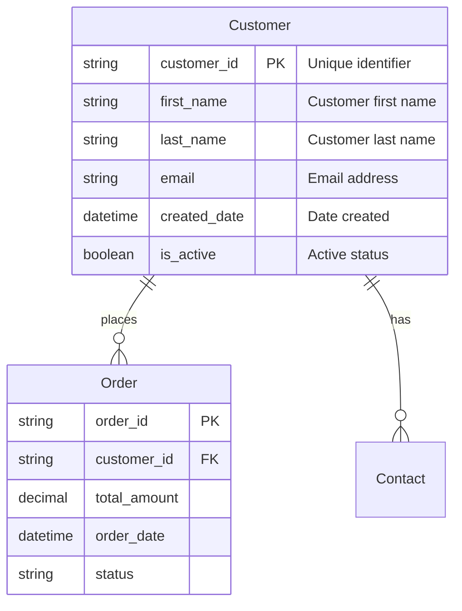
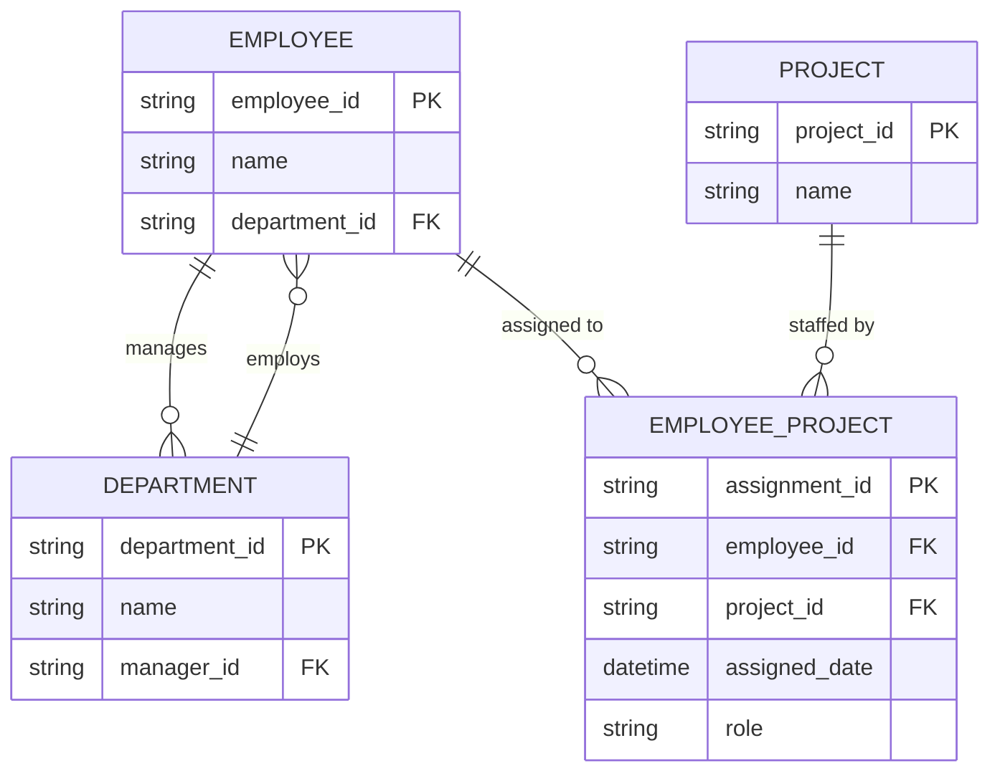
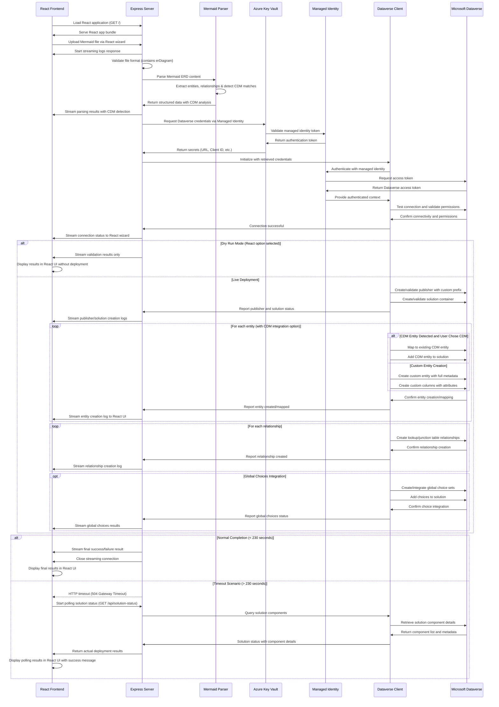
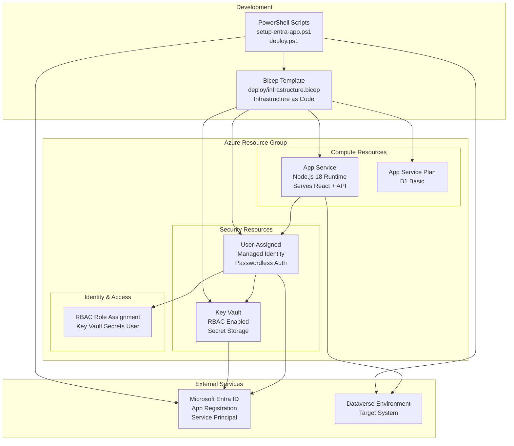

# Developer & Architecture Guide

This document provides a comprehensive overview of the Mermaid to Dataverse Converter application architecture, design decisions, and implementation details for developers who want to understand, maintain, or contribute to the project. Because after all - this is open-source - which is not only free, but I'd love to invite you to join me in this and make a good thing even better!

## System Overview

The Mermaid to Dataverse Converter is a modern React-based web application deployed on Azure App Service that converts Mermaid ERD diagrams into Microsoft Dataverse entities, columns, and relationships. The application features a React 18 frontend with Fluent UI v9 components and a Node.js Express backend.

### Key Features

- **Modern React Frontend** - React 18 + TypeScript + Fluent UI v9 wizard interface
- **Real-time ERD Validation** - Auto-correction and syntax checking
- **CDM Integration** - Automatic detection and mapping to Microsoft Common Data Model entities
- **Global Choices Integration** - Upload and manage option sets
- **Publisher Management** - Create or select existing publishers
- **Enterprise Security** - Azure Key Vault + Managed Identity
- **Two-Step Deployment** - Separate infrastructure setup and application deployment

### Architecture Overview

- **Frontend**: React 18 + TypeScript + Fluent UI v9 (built with Vite)
- **Backend**: Node.js + Express
- **Build System**: Vite for frontend, npm for backend
- **Deployment**: Azure App Service with Managed Identity
- **Security**: Azure Key Vault for credential storage
- **Infrastructure**: Azure Bicep templates for repeatable deployments

### High-Level Flow
1. **Modern React Wizard**: Step-by-step guided interface built with Fluent UI components
2. **ERD Upload & Validation**: Real-time syntax checking with auto-corrections
3. **Publisher Configuration**: Select existing or create new publisher with custom prefix
4. **Global Choices Integration**: Optional upload of global choice definitions
5. **Secure Deployment**: Managed identity for passwordless Azure service access


## Core Components

### 1. React Frontend (`src/frontend/`)

**Purpose**: Modern React 18 application providing the primary user interface with step-by-step wizard functionality.

**Technology Stack**:
- **React 18** with TypeScript for type safety
- **Fluent UI v9** for Microsoft-consistent design system
- **Vite** for fast development and optimized production builds
- **Modern CSS** with responsive design

**Key Features**:
- Multi-step wizard interface with progress tracking
- Real-time form validation and user feedback
- File upload with drag-and-drop support
- Publisher and solution management UI
- Global choices integration interface
- Responsive design for all device sizes

**Main Components**:
- `App.tsx` - Main application component with wizard orchestration
- `components/` - Reusable Fluent UI components
- `types/` - TypeScript type definitions
- `services/` - API client services for backend communication

**Build Process**:
```bash
cd src/frontend
npm install
npm run build  # Creates optimized dist/ folder
```

### 2. Node.js Backend (`src/backend/`)

**Purpose**: Service-oriented Express.js backend with controllers, services, repositories, and middleware layers.

**Architecture Pattern**: Clean architecture with dependency injection and separation of concerns.

**Technology Stack**:
- **Express.js** for HTTP server and routing
- **Node.js** with modern ES6+ patterns
- **Dependency Injection** for testable components
- **Repository Pattern** for data access abstraction

**Layer Structure**:
```
src/backend/
├── controllers/          # HTTP request/response handling
│   ├── base-controller.js
│   ├── wizard-controller.js
│   ├── validation-controller.js
│   ├── deployment-controller.js
│   └── admin-controller.js
├── services/            # Business logic layer
│   ├── base-service.js
│   ├── validation-service.js
│   ├── deployment-service.js
│   ├── publisher-service.js
│   ├── global-choices-service.js
│   └── solution-service.js
├── repositories/        # Data access layer
│   ├── base-repository.js
│   ├── dataverse-repository.js
│   └── configuration-repository.js
├── middleware/          # Cross-cutting concerns
│   ├── request-logger-middleware.js
│   ├── error-handler-middleware.js
│   ├── cors-middleware.js
│   └── streaming-middleware.js
└── server.js           # Application bootstrapping and DI container
```

**Key Features**:
- **Controllers**: Handle HTTP requests, validate input, format responses
- **Services**: Implement business logic and coordinate between repositories
- **Repositories**: Abstract data access to Dataverse and configuration sources
- **Middleware**: Provide logging, error handling, CORS, and streaming capabilities
- **Dependency Injection**: Full IoC pattern for testable and maintainable code

**Main Files**:
- `server.js` - Application bootstrap with dependency injection container
- `controllers/` - HTTP layer with request/response handling
- `services/` - Business logic and workflow orchestration
- `repositories/` - Data access abstraction over external APIs
- `middleware/` - Shared functionality across requests

### 3. Application Server (`src/backend/server.js`)

**Purpose**: Application bootstrap that initializes the service-oriented architecture with dependency injection.

**Key Responsibilities**:
- **Dependency Container**: Initializes and wires all services, repositories, and controllers
- **HTTP Routing**: Routes requests to appropriate controllers
- **Middleware Pipeline**: Applies logging, CORS, error handling, and streaming
- **Static File Serving**: Serves React frontend and legacy wizard files

**Architecture Pattern**:
```javascript
// Dependency injection initialization
const components = {
  // Repositories
  configRepo: new ConfigurationRepository(),
  dataverseRepo: new DataverseRepository({ configRepo, DataverseClient }),
  
  // Services  
  validationService: new ValidationService({ dataverseRepo, mermaidParser }),
  deploymentService: new DeploymentService({ dataverseRepo, validationService }),
  
  // Controllers
  wizardController: new WizardController(),
  validationController: new ValidationController(validationService),
  deploymentController: new DeploymentController(deploymentService),
  
  // Middleware
  requestLogger: new RequestLoggerMiddleware(),
  errorHandler: new ErrorHandlerMiddleware(),
  corsHandler: CorsMiddleware.createWebAppCors()
};
```

**Main Routes**:
- `GET /` - Redirects to React wizard
- `GET /wizard` - Serves React application
- `GET /legacy/wizard` - Serves legacy HTML wizard (backup)
- `POST /api/*` - API endpoints routed to controllers
- `GET /health` - Health check endpoint

**Service Architecture Benefits**:
- **Testability**: Services can be unit tested independently of HTTP layer
- **Maintainability**: Clear separation of concerns with single responsibility
- **Scalability**: Services can be moved to separate processes or containers
- **Dependency Injection**: Easy mocking and configuration for different environments


### 4. Mermaid Parser (`src/backend/mermaid-parser.js`)

**Purpose**: Parses Mermaid ERD syntax into structured JavaScript objects for Dataverse entity creation.

**Key Features**:
- **CommonJS Module**: Compatible with Node.js server environment
- **Regex-based Parsing**: Robust extraction of entities and relationships
- **Attribute Processing**: Support for types, constraints (PK, FK)
- **Relationship Detection**: One-to-many relationship parsing (many-to-many via junction tables)
- **Error Handling**: Comprehensive validation and error reporting

**Supported Syntax**:


**Validation & Auto-Correction**:
- Automatically adds missing primary keys
- Validates relationship consistency
- Suggests proper naming conventions
- Detects Common Data Model (CDM) entities

**Output Format**:
```javascript
{
  entities: [
    {
      name: "Customer",
      displayName: "Customer",
      attributes: [
        {
          name: "customer_id",
          type: "String",
          isPrimaryKey: true,
          isForeignKey: false,
          displayName: "Customer Id"
        }
      ]
    }
  ],
  relationships: [
    {
      fromEntity: "Customer",
      toEntity: "Order",
      cardinality: { type: "one-to-many" },
      label: "places"
    }
  ]
}
```

### 5. React Wizard Interface (`src/frontend/src/App.tsx`)

**Purpose**: Modern React-based user interface providing step-by-step guided deployment experience with Fluent UI components.

**Technology Stack**:
- **React 18** with functional components and hooks
- **TypeScript** for type safety and better developer experience
- **Fluent UI v9** for Microsoft-consistent design system
- **Modern CSS** with responsive design patterns

**Key Features**:
- **Multi-step Wizard**: Progressive disclosure with clear navigation
- **Real-time Validation**: Live ERD syntax checking with auto-corrections
- **File Upload**: Drag-and-drop support with validation
- **Publisher Management**: Visual selection and creation interface
- **Global Choices Integration**: Upload and preview functionality
- **Responsive Design**: Works on desktop, tablet, and mobile devices

**Wizard Steps Flow**:

**Step 1: ERD Upload & Validation**
- Modern file upload with drag-and-drop support
- Real-time syntax validation with detailed error messages
- Auto-correction suggestions with preview
- **CDM Detection**: Visual indication of Common Data Model matches
- **ERD Rendering**: Live Mermaid diagram display after validation
- Entity and relationship preview with expandable details

**Step 2: Solution & Publisher Configuration**
- Clean form design with Fluent UI components
- Publisher selection with search and filter capabilities
- New publisher creation with prefix validation
- Solution name validation and conflict checking

**Step 3: Global Choices Management (Optional)**
- File upload for custom global choice definitions
- Preview table with sortable columns
- Integration with existing Dataverse choices
- Search and filter functionality

**Step 4: Review & Deploy**
- Comprehensive configuration summary
- **CDM Integration Options**: Clear choice between CDM and custom entities
- Real-time deployment progress with streaming logs
- Success/error handling with detailed feedback

**Component Structure**:
```typescript
// Main application component
export const App: React.FC = () => {
  const [currentStep, setCurrentStep] = useState(1);
  const [erdData, setErdData] = useState<ERDData | null>(null);
  const [publishers, setPublishers] = useState<Publisher[]>([]);
  
  return (
    <FluentProvider theme={webLightTheme}>
      <div className="wizard-container">
        <ProgressIndicator currentStep={currentStep} totalSteps={4} />
        {renderCurrentStep()}
      </div>
    </FluentProvider>
  );
};
```

**Modern React Patterns**:
- **Hooks**: useState, useEffect, useCallback for state management
- **Context**: For sharing state across components
- **Error Boundaries**: Graceful error handling
- **Code Splitting**: Lazy loading for optimal performance


### 8. API Endpoints Reference

This section provides detailed documentation for all available API endpoints implemented through the controller-based architecture.

#### Core Endpoints

| Endpoint | Method | Controller | Description |
|----------|--------|------------|-------------|
| `GET /` | GET | WizardController | Redirects to React wizard interface |
| `GET /wizard` | GET | WizardController | Serves React application |
| `GET /legacy/wizard` | GET | WizardController | Serves legacy HTML wizard (backup) |
| `GET /health` | GET | AdminController | Application health status and diagnostics |
| `POST /upload` | POST | DeploymentController | Primary deployment with streaming response |
| `POST /api/validate-erd` | POST | ValidationController | ERD validation with auto-corrections |
| `GET /api/publishers` | GET | AdminController | Lists available publishers in Dataverse |
| `GET /api/global-choices-list` | GET | AdminController | Lists available global choice sets |
| `GET /api/solution-status` | GET | AdminController | Solution component status verification |
| `GET /api/health-detailed` | GET | AdminController | Detailed health check with components |
| `GET /api/logs` | GET | AdminController | Recent application logs |

#### Architecture Implementation

**Request Flow**:
1. **Middleware Pipeline**: Request logging, CORS handling
2. **Controller Layer**: HTTP request/response handling
3. **Service Layer**: Business logic execution
4. **Repository Layer**: Data access to Dataverse/configuration
5. **Response**: Formatted JSON or streaming data

**Error Handling**: Centralized through ErrorHandlerMiddleware with proper HTTP status codes and structured error responses.

#### Frontend Routes

```
GET /
GET /wizard
```

**Purpose**: Serves the React application for all frontend routes.

**Response**: Returns the React application HTML with proper SPA routing support.

**Static Assets**: 
- `/static/css/*` - Compiled CSS from Vite build
- `/static/js/*` - Compiled JavaScript bundles
- `/static/assets/*` - Images, fonts, and other assets

#### Health Endpoint

```
GET /health
```

**Purpose**: Comprehensive health check including Key Vault connectivity and Dataverse authentication.

**Response**:
```json
{
  "status": "healthy",
  "timestamp": "2025-09-07T14:30:00.000Z",
  "version": "2.0.0",
  "keyVault": {
    "accessible": true,
    "secretsLoaded": 5
  },
  "dataverse": {
    "authenticated": true,
    "connectionTest": "passed"
  }
}
```

#### Upload Endpoint (Primary Deployment)

```
POST /api/upload
```

**Purpose**: Deploys entities and relationships to Dataverse with real-time streaming progress updates.

**Request Body**:
```json
{
  "mermaid": "erDiagram\n    Customer {\n        string customer_id PK\n        string name\n    }",
  "entities": [...],
  "relationships": [...],
  "solutionName": "CustomerSolution",
  "solutionDisplayName": "Customer Management Solution",
  "createPublisher": true,
  "publisherName": "My Publisher",
  "publisherPrefix": "myp",
  "globalChoices": [...],
  "deploymentOptions": {
    "useCDMEntities": true,
    "dryRun": false
  }
}
```

**Response**: Streaming JSON response with real-time progress updates:

```json
{"type": "log", "message": "✅ Connected to Dataverse", "timestamp": "..."}
{"type": "log", "message": "✅ Publisher: MyPublisher (myp)", "timestamp": "..."}
{"type": "log", "message": "✅ Solution: CustomerSolution created", "timestamp": "..."}
{"type": "log", "message": "✅ Entity created: myp_customer", "timestamp": "..."}
{"type": "result", "success": true, "summary": "Successfully created 1 entity, 0 relationships", "entitiesCreated": 1, "relationshipsCreated": 0}
```

#### ERD Validation Endpoint

```
POST /api/validate-erd
```

**Purpose**: Validates Mermaid ERD syntax, provides auto-corrections, and detects CDM entities.

**Request Body**:
```json
{
  "mermaid": "erDiagram\n    Customer {\n        string customer_id PK\n        string name\n    }"
}
```

**Response**:
```json
{
  "valid": true,
  "entities": [
    {
      "name": "Customer",
      "displayName": "Customer",
      "attributes": [
        {
          "name": "customer_id",
          "dataType": "string",
          "isPrimaryKey": true,
          "displayName": "Customer Id"
        }
      ],
      "cdmMatch": {
        "detected": true,
        "entity": "account",
        "confidence": 0.85,
        "reason": "Entity name 'Customer' matches CDM 'account' entity"
      }
    }
  ],
  "relationships": [],
  "corrections": {
    "applied": ["Added missing primary key to Order entity"],
    "suggestions": ["Consider using CDM 'account' entity instead of custom 'Customer'"]
  }
}
```

#### Publishers Endpoint

```
GET /api/publishers
```

**Purpose**: Retrieves all available publishers from Dataverse for React frontend selection.

**Response**:
```json
{
  "success": true,
  "publishers": [
    {
      "id": "f30ac77a-6a86-f011-b4cc-000d3a66881e",
      "uniqueName": "MermaidPublisher",
      "friendlyName": "Mermaid Publisher",
      "prefix": "mdv",
      "isDefault": false,
      "canUse": true
    }
  ]
}
```

#### Global Choices Endpoint

```
GET /api/global-choices
```

**Purpose**: Retrieves available global choice sets with grouping and filtering support.

**Query Parameters**:
- `filter` (optional): Filter by name or type
- `type` (optional): 'custom' or 'builtin'

**Response**:
```json
{
  "success": true,
  "choices": [
    {
      "name": "custom_priority_level",
      "displayName": "Priority Level",
      "isCustom": true,
      "isManaged": false,
      "options": [
        {"value": 1, "label": "High"},
        {"value": 2, "label": "Medium"},
        {"value": 3, "label": "Low"}
      ]
    }
  ],
  "summary": {
    "total": 150,
    "custom": 5,
    "builtin": 145
  }
}
```

#### Solution Status Endpoint (Timeout Handling)

```
GET /api/solution-status?solution=SolutionName
```

**Purpose**: Retrieves solution components for deployment verification, especially after HTTP timeouts.

**Query Parameters**:
- `solution` (required): The unique name of the solution to check

**Response**:
```json
{
  "success": true,
  "solution": {
    "uniqueName": "CustomerSolution",
    "friendlyName": "Customer Management Solution",
    "solutionId": "guid-value"
  },
  "components": {
    "entities": [
      {
        "logicalName": "myp_customer",
        "displayName": "Customer",
        "type": "entity"
      }
    ],
    "optionSets": [
      {
        "logicalName": "myp_priority_level",
        "displayName": "Priority Level",
        "type": "optionset"
      }
    ],
    "others": [],
    "totalCount": 2
  },
  "lastModified": "2025-09-07T14:30:00.000Z"
}
```


### 6. Dataverse Client (`src/backend/dataverse-client.js`)

**Purpose**: Handle all Microsoft Dataverse Web API interactions with comprehensive entity, relationship, and solution management.

**Key Features**:
- **Managed Identity Authentication**: Passwordless authentication via Azure
- **Publisher and Solution Management**: Create or use existing resources
- **Entity Creation**: Full metadata support with proper naming conventions
- **Column and Relationship Creation**: Complete attribute and relationship support
- **Global Choice Management**: Create and integrate option sets
- **Solution Introspection**: Verify deployment results and component status
- **Comprehensive Error Handling**: Robust error recovery and logging

**Main Operations**:
- **Connection Testing**: Validates Dataverse connectivity and authentication
- **Publisher Management**: Creates or uses existing publishers with custom prefixes
- **Solution Management**: Creates or uses existing solutions with proper metadata
- **Entity Creation**: Creates custom entities with full metadata and naming conventions
- **Column Creation**: Adds custom columns with complete attribute support
- **Relationship Creation**: Establishes one-to-many and many-to-many relationships
- **Global Choice Management**: Creates and manages global choice sets with solution integration
- **Solution Component Verification**: Retrieves and validates deployment results

**Authentication with Managed Identity**:
```javascript
// Azure Managed Identity authentication
const credential = clientId 
  ? new ManagedIdentityCredential(clientId)
  : new ManagedIdentityCredential();

const token = await credential.getToken(`${dataverseUrl}/.default`);

// HTTP client with authentication headers
const headers = {
  'Authorization': `Bearer ${token.token}`,
  'Content-Type': 'application/json',
  'OData-MaxVersion': '4.0',
  'OData-Version': '4.0'
};
```

**Entity Creation Flow**:
```javascript
async createEntitiesFromMermaidWithLogging(entities, options, logFunction) {
  // 1. Validate connection and authenticate
  await this.testConnection();
  logFunction('✅ Connected to Dataverse');
  
  // 2. Create/validate publisher
  const publisherResult = await this.ensurePublisher(options.publisherPrefix);
  logFunction(`✅ Publisher: ${publisherResult.uniqueName}`);
  
  // 3. Create/validate solution
  const solutionResult = await this.createSolution(options.solutionName);
  logFunction(`✅ Solution: ${solutionResult.uniqueName}`);
  
  // 4. Create entities with full metadata
  for (const entity of entities) {
    const entityResult = await this.createEntity(entity, publisherResult.prefix);
    logFunction(`✅ Entity created: ${entityResult.LogicalName}`);
    
    // 5. Add entity to solution
    await this.addComponentToSolution(solutionResult.solutionid, entityResult.MetadataId, 1);
  }
  
  // 6. Create additional columns
  // 7. Create relationships
  // 8. Integrate global choices if specified
}
```

**Solution Status Verification**:
```javascript
// New method for deployment verification after timeouts
async getSolutionComponents(solutionUniqueName) {
  try {
    // 1. Get solution metadata
    const solution = await this.checkSolutionExists(solutionUniqueName);
    
    // 2. Query solution components
    const components = await this._req('get', 
      `/solutioncomponents?$filter=_solutionid_value eq '${solution.solutionid}'&$select=componenttype,objectid`);
    
    // 3. Process each component by type
    const entities = [], optionSets = [], others = [];
    
    for (const component of components.value) {
      switch (component.componenttype) {
        case 1: // Entity
          const entityMeta = await this._req('get', 
            `/EntityDefinitions(${component.objectid})?$select=LogicalName,DisplayName`);
          entities.push({
            logicalName: entityMeta.LogicalName,
            displayName: entityMeta.DisplayName.LocalizedLabels[0]?.Label,
            type: 'entity'
          });
          break;
          
        case 9: // Option Set (Global Choice)
          const optionMeta = await this._req('get', 
            `/GlobalOptionSetDefinitions(${component.objectid})?$select=Name,DisplayName`);
          optionSets.push({
            logicalName: optionMeta.Name,
            displayName: optionMeta.DisplayName.LocalizedLabels[0]?.Label,
            type: 'optionset'
          });
          break;
          
        default:
          others.push({ componenttype: component.componenttype, objectid: component.objectid });
      }
    }
    
    return { 
      success: true, 
      solution, 
      components: { 
        entities, 
        optionSets, 
        others,
        totalCount: entities.length + optionSets.length + others.length
      } 
    };
  } catch (error) {
    return { success: false, error: error.message };
  }
}
```

### 7. Azure Key Vault Integration (`src/backend/azure-keyvault.js`)

**Purpose**: Secure credential management via Azure Key Vault with Managed Identity authentication.

**Key Features**:
- **Managed Identity Integration**: Passwordless authentication with no secrets in code
- **Fallback Environment Variables**: Graceful degradation for local development
- **Secret Caching**: Efficient credential retrieval with intelligent caching
- **Comprehensive Error Handling**: Robust error recovery when Key Vault unavailable
- **Multiple Authentication Methods**: Support for both default and managed identity credentials

**Required Secrets in Key Vault**:
- `DATAVERSE-URL` - Target Dataverse environment URL
- `CLIENT-ID` - Entra ID app registration client ID
- `CLIENT-SECRET` - App registration client secret
- `TENANT-ID` - Azure Active Directory tenant ID
- `SOLUTION-NAME` - Default solution name for deployments

**Secret Retrieval Implementation**:
```javascript
async getKeyVaultSecrets() {
  try {
    const keyVaultUrl = process.env.KEY_VAULT_URI;
    if (!keyVaultUrl) {
      throw new Error('KEY_VAULT_URI environment variable not set');
    }
    
    // Determine authentication method
    const authType = process.env.AUTH_MODE || 'default';
    const clientId = process.env.MANAGED_IDENTITY_CLIENT_ID;
    
    let credential;
    if (authType === 'managed-identity' && clientId) {
      credential = new ManagedIdentityCredential(clientId);
    } else {
      credential = new DefaultAzureCredential();
    }
    
    const secretClient = new SecretClient(keyVaultUrl, credential);
    
    // Retrieve all required secrets
    const secrets = await this.retrieveAllSecrets(secretClient);
    
    return { success: true, secrets };
  } catch (error) {
    console.warn('Key Vault access failed, falling back to environment variables:', error.message);
    return this.getFallbackEnvironmentVariables();
  }
}

// Fallback to environment variables for local development
getFallbackEnvironmentVariables() {
  const secrets = {
    'DATAVERSE-URL': process.env.DATAVERSE_URL,
    'CLIENT-ID': process.env.CLIENT_ID,
    'CLIENT-SECRET': process.env.CLIENT_SECRET,
    'TENANT-ID': process.env.TENANT_ID,
    'SOLUTION-NAME': process.env.SOLUTION_NAME
  };
  
  const missing = Object.entries(secrets)
    .filter(([key, value]) => !value)
    .map(([key]) => key);
    
  if (missing.length > 0) {
    throw new Error(`Missing required configuration: ${missing.join(', ')}`);
  }
  
  return { success: true, secrets };
}
```

**Security Benefits**:
- **Zero Hardcoded Secrets**: All sensitive data stored securely in Azure Key Vault
- **Managed Identity**: No service credentials required for authentication
- **Audit Trail**: All secret access logged through Azure monitoring
- **RBAC Integration**: Fine-grained access control via Azure role assignments
- **Rotation Support**: Supports secret rotation without application changes

## Advanced Features

### CDM Integration

**Purpose**: Automatically detect and map Mermaid entities to Microsoft Common Data Model (CDM) standard entities to leverage existing Dataverse capabilities.

**Key Capabilities**:
- **Automatic Detection**: Analyzes entity names and attributes to identify potential CDM matches
- **Smart Mapping**: Matches entities like "Contact" → "contact"
- **Attribute Analysis**: Compares entity attributes against CDM entity schemas
- **User Choice**: Provides option to use CDM entities or create custom entities
- **Relationship Preservation**: Maintains relationships between CDM and custom entities

**Detection Algorithm**:
1. **Name-based Matching**: Fuzzy string matching against CDM entity names and display names
2. **Attribute Analysis**: Compares common attributes (name, email, phone) for validation
3. **Confidence Scoring**: Rates match quality based on name similarity and attribute overlap
4. **User Presentation**: Shows detected matches with confidence levels for user decision

**CDM Entity Examples**:
- `Customer` → `account` (Customer entity with business attributes)
- `Contact` → `contact` (Individual person contacts)
- `Opportunity` → `opportunity` (Sales opportunities)
- `Lead` → `lead` (Potential customers)

**Integration Benefits**:
- **Standard Fields**: Leverage pre-built CDM attributes and relationships
- **Business Processes**: Access to standard Dataverse business processes
- **Integration Ready**: Compatible with Power Platform and Dynamics 365
- **Future-Proof**: Benefits from ongoing CDM standard updates

### Global Choices Integration

**Purpose**: Manage Dataverse global choice sets (option sets) alongside entity creation with robust creation, verification, and solution integration processes.

**Key Features**:
- **Custom Global Choices**: Upload and create custom global choice sets with user-defined options
- **Duplicate Detection**: Case-insensitive duplicate checking to prevent conflicts
- **Solution Integration**: Automatic addition of created choices to the target solution
- **Robust Verification**: Multi-attempt verification with fallback mechanisms
- **API Constraint Handling**: Workarounds for Dataverse API limitations

**Supported Operations**:
1. Create new global choice sets in Dataverse
2. Add existing global choices to solutions
3. Verify creation success with retry logic
4. Handle API timing and caching issues

**JSON Format**:
```json
[
  {
    "name": "Status",
    "displayName": "Status",
    "description": "Simple status options",
    "options": [
      {
        "value": 1,
        "label": "Active"
      },
      {
        "value": 2,
        "label": "Inactive"
      }
    ]
  }
]
```

**Required Fields**:
- `name`: Logical name of the choice set
- `displayName`: Display name shown in UI
- `options`: Array of choice options

**Optional Fields**:
- `description`: Description of the choice set
- `value`: Numeric value for each option (auto-generated if not provided)

### Global Choice Creation & Verification Process

**Duplicate Detection Process**:
1. Fetch all existing global choices using `GlobalOptionSetDefinitions?$select=Name`
2. Convert existing names to lowercase for case-insensitive comparison
3. Check if choice name (with publisher prefix) already exists
4. If duplicate found, skip creation but attempt to add existing choice to solution

**Creation and Verification Workflow**:
1. **Create Choice Set**: POST to `/GlobalOptionSetDefinitions` with choice metadata
2. **Multi-Attempt Verification**: Try up to 5 times with progressive delays (3s, 5s, 7s, 9s, 10s)
3. **Fallback Verification**: Use comprehensive global choices list if direct lookup fails
4. **Solution Addition**: Add successfully created/found choices to target solution

**API Constraints and Workarounds**:

The Dataverse API has several limitations that required specific workarounds:

| **Issue** | **Problem** | **Workaround** |
|-----------|-------------|----------------|
| **No Filter Support** | `$filter` parameter not supported on `GlobalOptionSetDefinitions` | Fetch all choices and filter client-side |
| **Property Limitations** | `IsCustom` property not available on `OptionSetMetadataBase` | Use `IsManaged` property instead |
| **Caching Delays** | Created choices may not be immediately discoverable | Progressive retry with increasing delays |

**Fixed Query Examples**:

❌ **Unsupported (causes API errors)**:
```javascript
// These queries will fail
`GlobalOptionSetDefinitions?$filter=Name eq '${choiceName}'`
`GlobalOptionSetDefinitions?$select=MetadataId,Name,IsCustom`
```

✅ **Supported (working queries)**:
```javascript
// Get all choices and filter client-side
`GlobalOptionSetDefinitions?$select=MetadataId,Name,DisplayName`
const foundChoice = allChoices.value?.find(choice => choice.Name === targetName);

// Use IsManaged instead of IsCustom
`GlobalOptionSetDefinitions?$select=MetadataId,Name,IsManaged`
```

**Error Handling**:
- **API Limitations**: Handle unsupported `$filter` operations gracefully
- **Timing Issues**: Account for Dataverse caching with retry mechanisms
- **Non-Fatal Failures**: Treat verification failures as warnings when choices likely exist

**Implementation Details** (`src/dataverse-client.js`):
- **Method**: `createAndAddCustomGlobalChoices()`
- **Lines**: ~1100-1320
- **Key Functions**: Duplicate detection, multi-attempt verification, solution integration

**Status Messages**:
- `✅ Created and added`: Choice successfully created and added to solution
- `⚠️ Skipped`: Choice already exists, attempted to add to solution
- `❌ Failed`: Choice creation failed with error details


### Enhanced ERD Validation

**Purpose**: Provide comprehensive validation with auto-correction capabilities.

**Validation Features**:
- **Syntax checking** with specific error locations
- **Relationship validation** with cardinality verification
- **Naming convention enforcement** 
- **Auto-correction suggestions** for common issues
- **Warning categorization** (errors vs. warnings vs. info)

**Auto-Corrections**:
- Missing primary keys → Automatic ID field generation
- Invalid naming → Proper naming convention suggestions
- Relationship inconsistencies → Corrected relationship definitions

### ERD Visual Rendering

**Purpose**: Provide visual diagram rendering of Mermaid ERDs after validation and correction to enhance user understanding and verification.

**Key Features**:
- **Mermaid.js Integration**: Client-side rendering using the official Mermaid.js library in React components
- **Post-Correction Rendering**: Diagrams appear only after users apply corrected ERD
- **Strategic Placement**: Positioned between validation results and parsed schema overview
- **Clean UI Flow**: No overwhelming red/green comparisons, just clean visualization
- **React Integration**: Seamless integration with Fluent UI components

**Implementation Details**:
- **Library**: Mermaid.js loaded as npm dependency in React frontend
- **Trigger**: Diagram renders when "Use Corrected ERD" button is clicked
- **Container**: Dedicated React component with proper styling
- **Error Handling**: Graceful fallback if diagram cannot be rendered

**User Experience Flow**:
1. **Upload & Validate**: User uploads ERD, sees validation results with corrections
2. **Apply Corrections**: User clicks "Use Corrected ERD" button
3. **Visual Confirmation**: React component displays rendered Mermaid diagram above schema overview
4. **Proceed**: User can visually verify structure before deployment

**Technical Implementation** (React + TypeScript):
```typescript
// ERD Diagram React Component
import mermaid from 'mermaid';
import { useEffect, useRef } from 'react';

interface ERDDiagramProps {
  mermaidCode: string;
  diagramId: string;
}

export const ERDDiagram: React.FC<ERDDiagramProps> = ({ mermaidCode, diagramId }) => {
  const diagramRef = useRef<HTMLDivElement>(null);

  useEffect(() => {
    const renderDiagram = async () => {
      if (diagramRef.current && mermaidCode) {
        try {
          mermaid.initialize({ 
            startOnLoad: false,
            theme: 'default',
            er: { useMaxWidth: true }
          });
          
          const { svg } = await mermaid.render(diagramId, mermaidCode);
          diagramRef.current.innerHTML = svg;
        } catch (error) {
          console.error('Failed to render diagram:', error);
          diagramRef.current.innerHTML = '<p>Failed to render diagram</p>';
        }
      }
    };

    renderDiagram();
  }, [mermaidCode, diagramId]);

  return (
    <div 
      ref={diagramRef} 
      className="erd-diagram-container"
      style={{ textAlign: 'center', margin: '20px 0' }}
    />
  );
};
```

**Benefits**:
- **Visual Verification**: Users can see the structure before deployment
- **Error Detection**: Visual inconsistencies are easier to spot than text
- **Confidence Building**: Users feel more confident about their ERD structure
- **Professional UX**: Clean, modern interface with visual feedback integrated into React flow

### Smart Timeout Handling & Deployment Verification

**Purpose**: Handle Azure App Service HTTP timeouts (230 seconds) while ensuring deployment results are properly verified and displayed to users.

**The Challenge**:
- Azure App Service has a 230-second HTTP timeout limit
- Complex Dataverse deployments (especially with CDM entities) can take 4-6 minutes
- Traditional timeout messages left users uncertain about deployment success

**The Solution - Intelligent Polling**:
Instead of showing a generic timeout message, the application now:

1. **Detects Timeout**: Catches 504 Gateway Timeout or network fetch failures
2. **Starts Polling**: Automatically begins checking solution status via `/api/solution-status`
3. **Verifies Results**: Queries Dataverse to see what was actually created
4. **Reports Success**: Shows detailed results of what was deployed

**Implementation Flow**:
```typescript
// React timeout handling with polling
const handleDeployment = async (deploymentData: DeploymentRequest) => {
  try {
    // 1. Start normal deployment
    const response = await fetch('/api/upload', { 
      method: 'POST', 
      body: JSON.stringify(deploymentData),
      headers: { 'Content-Type': 'application/json' }
    });
    
    if (!response.ok) {
      throw new Error(`HTTP ${response.status}: ${response.statusText}`);
    }
    
    // Stream results normally
    await handleStreamingResponse(response);
    
  } catch (error) {
    // 2. If timeout occurs (504 or network error), start polling
    if (error.message.includes('504') || error.message.includes('Failed to fetch')) {
      await handleTimeoutWithPolling(deploymentData.solutionName);
    } else {
      throw error;
    }
  }
};

// 3. Polling implementation with React state updates
const handleTimeoutWithPolling = async (solutionName: string) => {
  setDeploymentStatus('polling');
  setStatusMessage('Deployment timed out, checking results...');
  
  for (let attempt = 1; attempt <= 10; attempt++) {
    try {
      const status = await fetch(`/api/solution-status?solution=${solutionName}`);
      const result = await status.json();
      
      if (result.success && result.components.totalCount > 0) {
        // Success! Show what was actually created
        setDeploymentStatus('success');
        setDeploymentResults(result.components);
        break;
      }
    } catch (pollingError) {
      console.warn(`Polling attempt ${attempt} failed:`, pollingError);
    }
    
    if (attempt < 10) {
      await new Promise(resolve => setTimeout(resolve, 3000));
    }
  }
};
```

**User Experience Benefits**:
- **No uncertainty**: Users see actual deployment results instead of timeout warnings
- **Detailed feedback**: Exact counts of entities, CDM integrations, and global choices
- **Clear messaging**: Distinguishes between normal completion and polling after timeout
- **Professional UX**: Eliminates confusing "may have completed" messages

**Technical Benefits**:
- **Deployment verification**: Confirms what was actually created in Dataverse
- **Solution introspection**: Uses Dataverse APIs to validate deployment success
- **Comprehensive logging**: Console logs clearly indicate deployment path taken
- **Fallback handling**: Graceful degradation if polling also fails

**Success Message Format**:
```
Deployment completed successfully

Successfully created X tables, integrated Y CDM tables, 
created Z new global choices and integrated W already existing global choices.
```

**Logging for Debugging**:
```typescript
// Clear distinction between deployment paths in React
console.log('🚀 DEPLOYMENT STARTED: Normal HTTP streaming');
// OR
console.log('⏳ POLLING AFTER TIMEOUT: Checking solution status');
console.log('✅ POLLING SUCCESS: Found solution with components');

// React state updates for user feedback
setDeploymentLogs(prev => [...prev, { 
  type: 'info', 
  message: '🚀 Starting deployment...',
  timestamp: new Date().toISOString()
}]);
```

### Advanced Relationship Handling

The parser supports the following relationship scenarios:

#### Relationship Types
- **One-to-Many (1:M)**: `||--o{` syntax ✅ **Directly supported**
- **Many-to-One (M:1)**: `}o--||` syntax ✅ **Directly supported** (inverse of one-to-many)
- **Many-to-Many (M:M)**: ❌ **NOT directly supported** - Use explicit junction tables instead
- **Self-Referencing**: ✅ **Supported** - Tables with relationships to themselves

#### Relationship Implementation
- **One-to-Many**: Directly supported with Dataverse lookup fields
- **Many-to-Many**: Must be implemented using an explicit junction table with two one-to-many relationships
- **Junction Tables**: Must be explicitly defined in the ERD with foreign keys to both related entities

> **Important**: Direct many-to-many syntax like `}o--o{` is not supported. Always use explicit junction tables for many-to-many relationships.

#### Example of Many-to-Many with Junction Table


In this example:
- `EMPLOYEE_PROJECT` is an explicitly defined junction table with foreign keys to both EMPLOYEE and PROJECT
- The many-to-many relationship is implemented using two one-to-many relationships
- Additional attributes like `assigned_date` and `role` can be added to the junction table

## Data Flow



### Enhanced Data Flow Features

1. **React-First Architecture**: Frontend is a modern React SPA with TypeScript and Fluent UI
2. **Real-time Updates**: Streaming JSON responses provide live deployment feedback
3. **CDM Integration**: Automatic detection and optional use of Common Data Model entities
4. **Timeout Resilience**: Intelligent polling system handles Azure App Service timeouts
5. **Secure Authentication**: Zero secrets in frontend, all credentials via Azure Key Vault
6. **Progressive Enhancement**: Graceful degradation from streaming to polling when needed

### Enhanced Schema Generation Process

1. **ERD Validation**: Real-time syntax checking with auto-corrections
2. **Parsing**: Extract entities, relationships, and attributes from Mermaid ERD
3. **Global Choices**: Process custom global choice definitions
4. **Publisher Management**: Create or validate publisher with custom prefix
5. **Solution Management**: Create or validate solution container
6. **Entity Creation**: Create custom entities with proper naming conventions
7. **Column Creation**: Add custom columns for each attribute with metadata
8. **Relationship Creation**: Establish lookup relationships between entities
9. **Global Choice Integration**: Add global choices to solution if specified
10. **Logging**: Record detailed logs of all operations

## Security Architecture

### Authentication & Authorization

- **Azure Managed Identity**: No secrets stored in application code
- **Key Vault Integration**: All sensitive configuration in Azure Key Vault
- **Least Privilege**: Managed identity has minimal required permissions

### Security Layers

1. **Transport Security**: HTTPS for all communications
2. **Identity Security**: Managed identity for Azure service authentication
3. **Secret Management**: Azure Key Vault for credential storage
4. **API Security**: Authentication required for Dataverse operations

### Permission Model

#### Setup Time Permissions (Temporary)

**Who**: PowerShell script user (DevOps/Admin)  
**When**: During initial setup and configuration  
**Duration**: Temporary (automatically cleaned up)

```powershell
# Grants temporary Key Vault Administrator role
az role assignment create --assignee $currentUser --role "Key Vault Administrator" --scope $keyVaultScope

# Store secrets in Key Vault
az keyvault secret set --vault-name $KeyVaultName --name "CLIENT-SECRET" --value $ClientSecret

# Clean up: Remove temporary role
az role assignment delete --assignee $currentUser --role "Key Vault Administrator" --scope $keyVaultScope
```

#### Runtime Permissions (Permanent)

**Who**: Managed Identity (App Service)  
**When**: Application runtime  
**Duration**: Permanent (for application lifetime)

```bicep
// Managed Identity gets read-only access to secrets
resource keyVaultSecretsUserRoleAssignment 'Microsoft.Authorization/roleAssignments@2022-04-01' = {
  properties: {
    roleDefinitionId: '4633458b-17de-408a-b874-0445c86b69e6' // Key Vault Secrets User
    principalId: managedIdentity.properties.principalId
  }
}
```

### Azure RBAC Roles Reference

| **Role** | **Role ID** | **Permissions** | **Use Case** |
|----------|-------------|-----------------|--------------|
| **Key Vault Administrator** | `00482a5a-887f-4fb3-b363-3b7fe8e74483` | Full access to secrets, keys, certificates, policies | Setup, emergency access |
| **Key Vault Secrets User** | `4633458b-17de-408a-b874-0445c86b69e6` | Read secrets only | Application runtime |
| **Key Vault Secrets Officer** | `b86a8fe4-44ce-4948-aee5-eccb2c155cd7` | Read, write secrets (no policies) | CI/CD pipelines |

### Environment Variables

**Production (Azure App Service)**:
```bash
KEY_VAULT_URI=https://your-keyvault.vault.azure.net/
AUTH_MODE=managed-identity
MANAGED_IDENTITY_CLIENT_ID=your-managed-identity-id
PORT=8080
```

**Local Development**:
```bash
# Local .env file (development only)
DATAVERSE_URL=https://yourorg.crm.dynamics.com
CLIENT_ID=xxxxxxxx-xxxx-xxxx-xxxx-xxxxxxxxxxxx
CLIENT_SECRET=your-client-secret
TENANT_ID=your-tenant-id
SOLUTION_NAME=MermaidSolution
```

## Field Type Mapping

### Supported Mermaid Types → Dataverse Types

| Mermaid Type | Dataverse Type | Notes |
|-------------|----------------|-------|
| `string` | StringAttributeMetadata | Single line text (255 chars) |
| `integer`, `int` | IntegerAttributeMetadata | Whole number |
| `decimal` | DecimalAttributeMetadata | Decimal number with precision |
| `boolean` | BooleanAttributeMetadata | Yes/No field |
| `datetime` | DateTimeAttributeMetadata | Date and time |

### Constraint Handling

| Constraint | Implementation | Dataverse Behavior |
|-----------|----------------|-------------------|
| `PK` | Primary key | Creates GUID primary key + name field |
| `FK` | Foreign key | Creates lookup relationship |

### Schema Generation Logic

```javascript
function generateColumnMetadata(attribute, publisherPrefix) {
  const baseMetadata = {
    LogicalName: `${publisherPrefix.toLowerCase()}_${attribute.name.toLowerCase()}`,
    DisplayName: { LocalizedLabels: [{ Label: attribute.displayName, LanguageCode: 1033 }] },
    RequiredLevel: { Value: attribute.isRequired ? 'ApplicationRequired' : 'None' }
  };
  
  switch (attribute.type.toLowerCase()) {
    case 'string':
      return {
        '@odata.type': 'Microsoft.Dynamics.CRM.StringAttributeMetadata',
        ...baseMetadata,
        AttributeType: 'String',
        MaxLength: 255
      };
    // ... other types
  }
}
```

## Error Handling

### Error Categories

1. **Validation Errors**: Invalid Mermaid syntax or missing required fields
2. **Authentication Errors**: Key Vault or Dataverse authentication failures
3. **Network Errors**: Connectivity issues with external services
4. **Business Logic Errors**: Dataverse entity creation conflicts
5. **File Upload Errors**: Invalid files, size limits, format issues
6. **API Errors**: Dataverse operation failures

### Recovery Strategies

- **Graceful Degradation**: Continue with partial functionality when possible
- **Retry Logic**: Automatic retry for transient failures
- **User Feedback**: Clear error messages with actionable guidance


### Error Response Strategy

```typescript
// React error handling with proper state management
const handleDeployment = async (deploymentData: DeploymentRequest) => {
  try {
    setDeploymentStatus('deploying');
    setErrorMessage(null);
    
    // Process deployment
    const result = await deployToDataverse(deploymentData);
    
    setDeploymentStatus('success');
    setDeploymentResults(result);
    
  } catch (error) {
    setDeploymentStatus('error');
    setErrorMessage(error.message);
    
    // Log detailed error for debugging
    console.error('Deployment failed:', error);
    
    // Show user-friendly error message
    addLogMessage({
      type: 'error',
      message: `Error: ${error.message}`,
      timestamp: new Date().toISOString()
    });
  }
};

// Streaming error handling for real-time updates
const handleStreamingErrors = (error: Error) => {
  addLogMessage({
    type: 'error',
    message: `Deployment error: ${error.message}`,
    timestamp: new Date().toISOString()
  });
  
  setDeploymentStatus('error');
};
```

## Testing Strategy

### 1. Integration Testing

**Test File**: `tests/test-schema-generation.js`

```bash
# Run integration tests
npm test

# Test with specific file
node tests/test-schema-generation.js examples/simple-sales.mmd

# Test with custom prefix
node tests/test-schema-generation.js examples/simple-sales.mmd myprefix
```

**What It Tests**:
- Mermaid file parsing
- Entity extraction and validation
- Relationship detection
- Dataverse naming conventions
- Primary key validation

### 2. API Testing

**Built-in Endpoints**:
```bash
# Health check
GET /health

# Solution status check (for deployment verification)
GET /api/solution-status?solution=YourSolutionName

# Publishers list
GET /api/publishers

# Global choices list  
GET /api/global-choices-list
```

### 3. Manual Testing Workflow

1. **React Frontend Testing**: Use the modern React interface with sample files
2. **Live Deployment**: Test actual Dataverse creation through the wizard
3. **Timeout Testing**: Test with complex files that trigger timeout polling
4. **Solution Verification**: Use `/api/solution-status` to verify deployment results
5. **Error Scenarios**: Test with invalid files, wrong credentials
6. **Browser Compatibility**: Test across different browsers (Chrome, Edge, Firefox)
7. **Responsive Design**: Test on desktop, tablet, and mobile viewports
8. **CDM Integration**: Test CDM entity detection and user choice functionality

## Deployment Architecture

### Two-Step Deployment Process

The application uses a **robust two-step deployment process** that separates infrastructure creation from application deployment:

**Step 1: Infrastructure Setup** (`scripts/setup-entra-app.ps1`)
- Creates Entra ID App Registration with proper API permissions
- Deploys Azure infrastructure using Bicep templates
- Configures Managed Identity and Key Vault access
- Sets up Dataverse application user and security roles
- Stores all secrets securely in Key Vault

**Step 2: Application Deployment** (`scripts/deploy.ps1`)
- Builds React frontend locally using Vite for optimal performance
- Packages only necessary backend files (excludes node_modules)
- Deploys to Azure App Service with proper static file configuration
- Configures runtime settings for Key Vault integration
- Validates deployment success

### Azure Resources Architecture



### Required Azure Resources

**Core Infrastructure**:
1. **Resource Group** - Container for all resources
2. **App Service Plan** - Compute resources (B1 Basic or higher)
3. **App Service** - Hosts the React + Node.js application
4. **User-Assigned Managed Identity** - Passwordless service authentication
5. **Key Vault** - Secure secret storage with RBAC enabled
6. **RBAC Role Assignment** - Grants Managed Identity "Key Vault Secrets User" role

**External Dependencies**:
1. **Entra ID App Registration** - Service principal for Dataverse access
2. **Dataverse Environment** - Target system for entity deployment
3. **Dataverse Application User** - Service account with appropriate permissions

### Automated Infrastructure Deployment

**No manual Azure portal configuration required!** The entire deployment is fully automated through PowerShell scripts and Bicep templates.

#### Infrastructure Setup Script (`scripts/setup-entra-app.ps1`)

```powershell
# Interactive setup with prompts
.\scripts\setup-entra-app.ps1

# Unattended setup with parameters
.\scripts\setup-entra-app.ps1 -Unattended `
  -EnvironmentUrl "https://org.crm.dynamics.com" `
  -ResourceGroup "rg-mermaid-prod" `
  -Location "westeurope" `
  -AppServiceName "app-mermaid-prod" `
  -KeyVaultName "kv-mermaid-prod"
```

**What it creates automatically**:
1. **Entra App Registration** with Dataverse API permissions
2. **Azure Infrastructure** via Bicep template deployment
3. **Managed Identity** with Key Vault access permissions
4. **Key Vault secrets** with all required configuration
5. **Dataverse Application User** with System Administrator role
6. **End-to-end testing** to verify complete setup

#### Application Deployment Script (`scripts/deploy.ps1`)

```powershell
# Deploy application to existing infrastructure
.\scripts\deploy.ps1 -AppName "app-mermaid-prod" -ResourceGroup "rg-mermaid-prod" -KeyVaultName "kv-mermaid-prod"
```

**What it does automatically**:
1. **Builds React frontend** with Vite for production optimization
2. **Packages backend** with only necessary files (no source files or node_modules)
3. **Deploys to App Service** using Azure CLI with zip deployment
4. **Configures runtime settings** for static file serving and Key Vault integration
5. **Tests deployment** by validating application endpoints

### Infrastructure as Code (Bicep)

All Azure resources are defined in `deploy/infrastructure.bicep` with the following key components:

```bicep
// App Service Plan
resource appServicePlan 'Microsoft.Web/serverfarms@2023-01-01' = {
  name: appServicePlanName
  location: location
  sku: {
    name: 'B1'  // Basic tier for production workloads
    tier: 'Basic'
  }
  kind: 'linux'
  properties: {
    reserved: true  // Linux hosting
  }
}

// App Service with Node.js 18
resource appService 'Microsoft.Web/sites@2023-01-01' = {
  name: appServiceName
  location: location
  identity: {
    type: 'UserAssigned'
    userAssignedIdentities: {
      '${managedIdentity.id}': {}
    }
  }
  properties: {
    serverFarmId: appServicePlan.id
    siteConfig: {
      linuxFxVersion: 'NODE|18-lts'
      appSettings: [
        {
          name: 'KEY_VAULT_URI'
          value: keyVault.properties.vaultUri
        }
        {
          name: 'MANAGED_IDENTITY_CLIENT_ID'
          value: managedIdentity.properties.clientId
        }
      ]
    }
  }
}

// User-Assigned Managed Identity
resource managedIdentity 'Microsoft.ManagedIdentity/userAssignedIdentities@2023-01-31' = {
  name: managedIdentityName
  location: location
}

// Key Vault with RBAC
resource keyVault 'Microsoft.KeyVault/vaults@2023-07-01' = {
  name: keyVaultName
  location: location
  properties: {
    enableRbacAuthorization: true  // Use RBAC instead of access policies
    sku: {
      family: 'A'
      name: 'standard'
    }
    tenantId: subscription().tenantId
  }
}

// RBAC Role Assignment for Managed Identity
resource keyVaultSecretsUserRoleAssignment 'Microsoft.Authorization/roleAssignments@2022-04-01' = {
  properties: {
    roleDefinitionId: '4633458b-17de-408a-b874-0445c86b69e6' // Key Vault Secrets User
    principalId: managedIdentity.properties.principalId
    principalType: 'ServicePrincipal'
  }
}
```

## Development Setup

### Prerequisites

**For Automated Deployment:**
- **Azure subscription** with Contributor permissions
- **Azure CLI** installed and logged in (`az login`)
- **PowerShell 7+** (recommended) or Windows PowerShell 5.1
- **Appropriate permissions** in Entra ID (to create App Registrations)
- **Dataverse admin rights** (to create application users)

**For Local Development:**
- **Node.js 18+** (required for both frontend and backend)
- **npm or yarn** for package management
- **.env file** with development credentials (optional)

### Local Development Setup

#### 1. Clone and Install Dependencies

```bash
# Clone repository
git clone https://github.com/LuiseFreese/mermaid.git
cd mermaid

# Install backend dependencies
npm install

# Install frontend dependencies
cd src/frontend
npm install
cd ../..
```

#### 2. Environment Configuration (Optional)

For local development, you can create a `.env` file in the root directory:

```bash
cp .env.example .env
# Edit .env with your development credentials
```

**Example `.env` file:**
```bash
# Dataverse Configuration
DATAVERSE_URL=https://yourorg.crm.dynamics.com
CLIENT_ID=xxxxxxxx-xxxx-xxxx-xxxx-xxxxxxxxxxxx
CLIENT_SECRET=your-client-secret
TENANT_ID=your-tenant-id
SOLUTION_NAME=MermaidDevSolution

# Development Settings
NODE_ENV=development
PORT=8080
```

#### 3. Development Commands

**Full Stack Development (Recommended):**
```bash
# Start both frontend and backend concurrently
npm run dev
# → Backend: http://localhost:8080 (Express server)
# → Frontend: http://localhost:3003 (Vite dev server with API proxy)
```

**Frontend Development** (React + Vite):
```bash
# Start frontend development server only
npm run dev:frontend
# → Starts Vite dev server at http://localhost:3003
# → Includes hot module replacement and React fast refresh
# → Proxy configuration routes /api calls to backend

# Build frontend for production (from root)
cd src/frontend
npm run build
# → Creates optimized dist/ folder with React bundles

# Preview production build (from frontend dir)
npm run preview
# → Serves production build for testing

# Lint and fix code (from frontend dir)
npm run lint
npm run lint:fix
```

**Backend Development** (Node.js + Express):
```bash
# Start backend server only
npm run dev:backend
# → Starts Express server at http://localhost:8080
# → Serves React build + API endpoints

# Alternative: Direct server start
cd src/backend
node server.js
# → Production mode start

# Run backend tests
npm run test:backend
# → Runs integration and schema generation tests
```

**Development Workflow:**
1. **Concurrent Development**: Use `npm run dev` to run both frontend and backend
2. **Frontend**: React dev server with hot reload on port 3003
3. **Backend**: Express server with service architecture on port 8080
4. **API Integration**: Vite proxy automatically routes `/api` calls to backend
5. **Production Testing**: Build frontend and test full integration

#### 4. Production Build and Test

```bash
# Build frontend for production
cd src/frontend
npm run build
cd ../..

# Start production server (serves React build + API)
npm start
# → Complete application at http://localhost:8080
```

### Development Workflow

#### Frontend Development (React + TypeScript)

**Key Files:**
- `src/frontend/src/App.tsx` - Main React application component
- `src/frontend/src/components/` - Reusable Fluent UI components
- `src/frontend/src/types/` - TypeScript type definitions
- `src/frontend/src/services/` - API client services
- `src/frontend/vite.config.ts` - Vite configuration

**Development Features:**
- **Hot Module Replacement**: Instant updates without losing component state
- **TypeScript**: Full type checking and IntelliSense support
- **Fluent UI Components**: Microsoft design system components
- **ESLint + Prettier**: Code quality and formatting
- **Vite DevTools**: Fast builds and excellent developer experience

#### Backend Development (Service-Oriented Architecture)

**Key Files:**
- `src/backend/server.js` - Application bootstrap with dependency injection
- `src/backend/controllers/` - HTTP request/response handling layer
- `src/backend/services/` - Business logic and workflow orchestration
- `src/backend/repositories/` - Data access abstraction layer
- `src/backend/middleware/` - Cross-cutting concerns (logging, CORS, errors)

**Architecture Benefits:**
- **Separation of Concerns**: Clear layer boundaries with single responsibilities
- **Dependency Injection**: Testable components with proper IoC pattern
- **Repository Pattern**: Abstracted data access with consistent interfaces
- **Service Layer**: Business logic isolated from HTTP and data concerns
- **Middleware Pipeline**: Reusable request processing components

**Development Features:**
- **Clean Architecture**: Controllers → Services → Repositories pattern
- **Error Handling**: Centralized error handling with proper HTTP status codes
- **Request Logging**: Comprehensive request/response logging middleware
- **Health Monitoring**: Component-level health checks and diagnostics

### Testing and Debugging

#### 1. Local Testing Workflow

```bash
# Test schema generation without deployment
node tests/test-schema-generation.js examples/simple-sales.mmd

# Test with custom publisher prefix
node tests/test-schema-generation.js examples/simple-sales.mmd myprefix

# Run full integration test suite
npm test
```

#### 2. API Testing

```bash
# Health check
curl http://localhost:8080/health

# Detailed health check with component status
curl http://localhost:8080/api/health-detailed

# Test ERD validation endpoint
curl -X POST http://localhost:8080/api/validate-erd \
  -H "Content-Type: application/json" \
  -d '{"mermaidContent": "erDiagram\n    Customer { string name }"}'

# Test publishers endpoint
curl http://localhost:8080/api/publishers

# Test global choices list
curl http://localhost:8080/api/global-choices-list

# Test solution status
curl "http://localhost:8080/api/solution-status?solution=TestSolution"
```
curl -X POST http://localhost:8080/api/validate-erd \
  -H "Content-Type: application/json" \
  -d '{"mermaid": "erDiagram\n Customer { string id PK }"}'

# Test publisher listing (requires valid credentials)
curl http://localhost:8080/api/publishers
```

#### 3. Frontend Testing

**React Component Testing:**
- Use React Developer Tools browser extension
- Vite has built-in debugging support
- TypeScript provides compile-time error checking

**Browser Testing:**
- Access development server at http://localhost:3003 (frontend)
- Access full application at http://localhost:8080 (production mode)
- Use browser developer tools for debugging

### Deployment Testing

#### 1. Local Production Build Test

```bash
# Build everything for production
cd src/frontend && npm run build && cd ../..

# Start production server
npm start

# Test complete application
open http://localhost:8080
```

#### 2. Deploy to Azure (Development Environment)

```bash
# Create development infrastructure
.\scripts\setup-entra-app.ps1

# Deploy application code
.\scripts\deploy.ps1 -AppName "your-dev-app" -ResourceGroup "your-dev-rg" -KeyVaultName "your-dev-kv"
```

### Diagnostic Tools

#### 1. Application Health Monitoring

```bash
# Local health check
curl http://localhost:8080/health

# Azure health check
curl https://your-app-service.azurewebsites.net/health
```

#### 2. Azure Application Logs

```powershell
# Stream live application logs
az webapp log tail --name your-app-service --resource-group your-resource-group

# Download log files
az webapp log download --name your-app-service --resource-group your-resource-group
```

#### 3. Local Development Debugging

**Backend Debugging:**
- Use Visual Studio Code with Node.js debugging
- Console logs appear in terminal
- Use breakpoints in VS Code

**Frontend Debugging:**
- React Developer Tools browser extension
- Browser developer tools
- Vite provides excellent error messages and stack traces
- TypeScript compiler provides detailed error information

### Common Development Tasks

#### Adding New API Endpoints

1. **Define route** in `src/backend/routes/`
2. **Add business logic** in `src/backend/services/`
3. **Update TypeScript types** in `src/frontend/src/types/`
4. **Add frontend service call** in `src/frontend/src/services/`
5. **Test locally** with both frontend and backend running

#### Adding New React Components

1. **Create component** in `src/frontend/src/components/`
2. **Define TypeScript props** interface
3. **Use Fluent UI components** for consistency
4. **Test with hot reload** in development mode
5. **Build and test** production version
