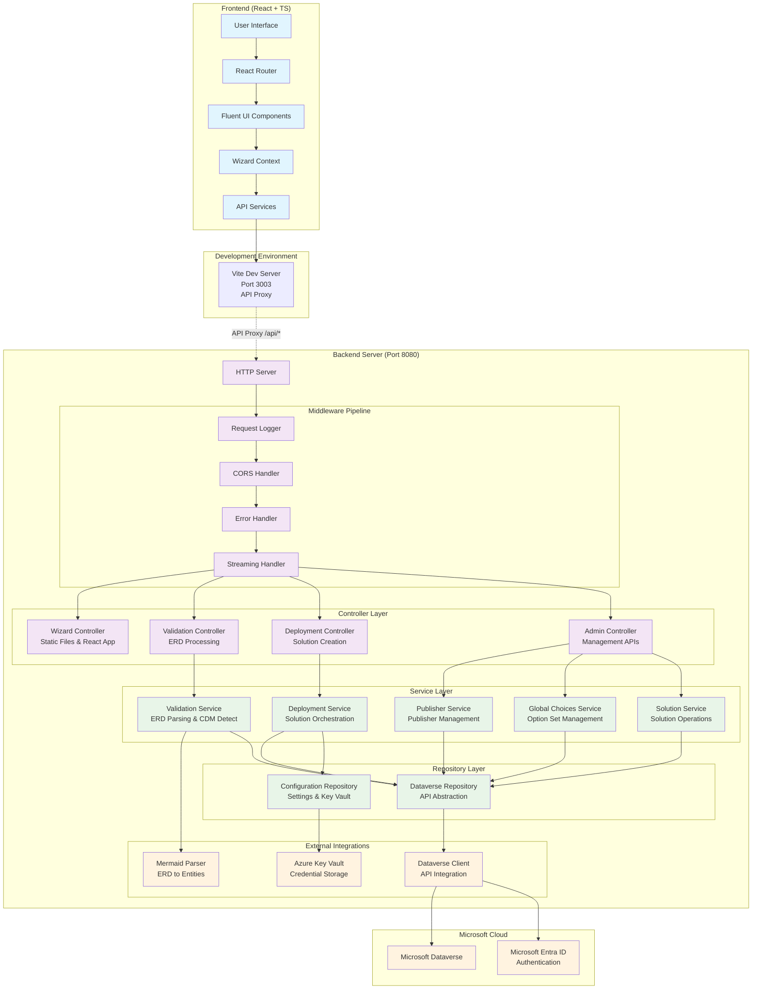
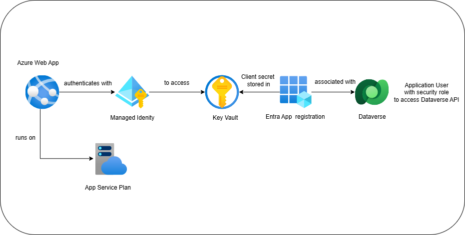

# Developer & Architecture Guide

This document provides a comprehensive overview of the Mermaid to Dataverse Converter application architecture, design decisions, and implementation details for developers who want to understand, maintain, or contribute to the project. Because after all - this is open-source - which is not only free, but I'd love to invite you to join me in this and make a good thing even better!

## System Overview

The Mermaid to Dataverse Converter is a modern React-based web application deployed on Azure App Service that converts Mermaid ERD diagrams into Microsoft Dataverse entities, columns, and relationships. The application features a React 18 frontend with Fluent UI v9 components and a custom Node.js HTTP server backend.

### Key Features

- **Modern React Frontend** - React 18 + TypeScript + Fluent UI v9 wizard interface
- **Real-time ERD Validation** - Auto-correction and syntax checking
- **CDM Integration** - Automatic detection and mapping to Microsoft Common Data Model entities
- **Global Choices Integration** - Upload and manage option sets
- **Publisher Management** - Create or select existing publishers
- **Enterprise Security** - Azure Key Vault + Managed Identity
- **Two-Step Deployment** - Separate infrastructure setup and application deployment

### Architecture Overview

- **Frontend**: React 18 + TypeScript + Fluent UI v9 (built with Vite)
  - **Modular Architecture**: All wizard steps fully modularized with clean separation of concerns
  - **FileUploadStep**: Modular components, hooks, types, and utilities for ERD processing
  - **SolutionSetupStep**: Modular configuration forms with reusable components and business logic
  - **DeploymentStep**: Modular deployment interface with summary, progress, and results components
  - **Comprehensive Testing**: 100% test coverage across all modular components and hooks
- **Backend**: Node.js + Custom HTTP Server
- **Build System**: Vite for frontend, npm for backend
- **Deployment**: Azure App Service with Managed Identity
- **Security**: Azure Key Vault for credential storage
- **Infrastructure**: Azure Bicep templates for repeatable deployments


### Architecture Overview Diagram




## Core Components

### 1. React Frontend (`src/frontend/`)

**Purpose**: Modern React 18 application providing the primary user interface with step-by-step wizard functionality.

**Technology Stack**:
- **React 18** with TypeScript
- **Fluent UI v9** 
- **Vite** for fast development and optimized production builds

**Key Features**:
- Multi-step wizard interface with progress tracking
- Real-time form validation and user feedback
- File upload with drag-and-drop support
- Publisher and solution management UI
- Global choices integration interface
- Responsive design for all device sizes

**Main Components**:
- `App.tsx` - Main application component with wizard orchestration
- `components/` - Reusable Fluent UI components
- `types/` - TypeScript type definitions
- `services/` - API client services for backend communication

**Build Process**:
```bash
cd src/frontend
npm install
npm run build  # Creates optimized dist/ folder
```

### 2. Node.js Backend (`src/backend/`)

**Purpose**: Service-oriented Node.js HTTP server with controllers, services, repositories, and middleware layers.

**Architecture Pattern**: Clean architecture with dependency injection and separation of concerns.

**Technology Stack**:
- **Node.js HTTP Server** for HTTP handling and custom routing
- **Node.js** with modern ES6+ patterns
- **Dependency Injection** for testable components
- **Repository Pattern** for data access abstraction

**Layer Structure**:
```
src/backend/
├── controllers/          # HTTP request/response handling
│   ├── base-controller.js
│   ├── wizard-controller.js
│   ├── validation-controller.js
│   ├── deployment-controller.js
│   └── admin-controller.js
├── services/            # Business logic layer
│   ├── base-service.js
│   ├── validation-service.js
│   ├── deployment-service.js
│   ├── publisher-service.js
│   ├── global-choices-service.js
│   └── solution-service.js
├── repositories/        # Data access layer
│   ├── base-repository.js
│   ├── dataverse-repository.js
│   └── configuration-repository.js
├── middleware/          # Cross-cutting concerns
│   ├── request-logger-middleware.js
│   ├── error-handler-middleware.js
│   ├── cors-middleware.js
│   └── streaming-middleware.js
└── server.js           # Application bootstrapping and DI container
```

**Key Features**:
- **Controllers**: Handle HTTP requests, validate input, format responses
- **Services**: Implement business logic and coordinate between repositories
- **Repositories**: Abstract data access to Dataverse and configuration sources
- **Middleware**: Provide logging, error handling, CORS, and streaming capabilities
- **Dependency Injection**: Full IoC pattern for testable and maintainable code

**Main Files**:
- `server.js` - Application bootstrap with dependency injection container
- `controllers/` - HTTP layer with request/response handling
- `services/` - Business logic and workflow orchestration
- `repositories/` - Data access abstraction over external APIs
- `middleware/` - Shared functionality across requests

### 3. Application Server (`src/backend/server.js`)

**Purpose**: Application bootstrap that initializes the service-oriented architecture with dependency injection.

**Key Responsibilities**:
- **Dependency Container**: Initializes and wires all services, repositories, and controllers
- **HTTP Routing**: Routes requests to appropriate controllers
- **Middleware Pipeline**: Applies logging, CORS, error handling, and streaming
- **Static File Serving**: Serves React frontend files

**Architecture Pattern**: Uses dependency injection with repositories → services → controllers pattern

**Main Routes**:
- `GET /` - Redirects to React wizard
- `GET /wizard` - Serves React application  
- `POST /api/*` - API endpoints routed to controllers
- `GET /health` - Health check endpoint


### 4. Mermaid Parser (`src/backend/mermaid-parser.js`)

**Purpose**: Parses Mermaid ERD syntax into structured JavaScript objects for Dataverse entity creation.

**Key Features**:
- **CommonJS Module**: Compatible with Node.js server environment
- **Regex-based Parsing**: Robust extraction of entities and relationships
- **Attribute Processing**: Support for types, constraints (PK, FK)
- **Relationship Detection**: One-to-many relationship parsing (many-to-many via junction tables)
- **Error Handling**: Comprehensive validation and error reporting

**Supported Syntax**:


**Validation & Auto-Correction**:
- Automatically adds missing primary keys
- Validates relationship consistency
- Suggests proper naming conventions
- Detects Common Data Model (CDM) entities


### 5. React Wizard Interface (`src/frontend/src/App.tsx`)

**Purpose**: Modern React-based user interface providing step-by-step guided deployment experience with Fluent UI components.

**Technology Stack**:
- **React 18** with functional components and hooks
- **TypeScript** for type safety and better developer experience
- **Fluent UI v9** for Microsoft-consistent design system
- **Modern CSS** with responsive design patterns

**Key Features**:
- **Multi-step Wizard**: Progressive disclosure with clear navigation
- **Real-time Validation**: Live ERD syntax checking with auto-corrections
- **File Upload**: Drag-and-drop support with validation
- **Publisher Management**: Visual selection and creation interface
- **Global Choices Integration**: Upload and preview functionality
- **Responsive Design**: Works on desktop, tablet, and mobile devices

**Wizard Steps Flow**:

**Step 1: ERD Upload & Validation**
- Modern file upload with drag-and-drop support
- Real-time syntax validation with detailed error messages
- Auto-correction suggestions with preview
- **CDM Detection**: Visual indication of Common Data Model matches
- **ERD Rendering**: Live Mermaid diagram display after validation
- Entity and relationship preview with expandable details

**Modular Architecture**: The FileUploadStep has been completely modularized using modern React patterns with clean separation of concerns. See [FileUploadStep Modular Architecture](#fileuploadstep-modular-architecture) section for detailed implementation.

**Step 2: Solution & Publisher Configuration**
- Clean form design with Fluent UI components
- Publisher selection with search and filter capabilities
- New publisher creation with prefix validation
- Solution name validation and conflict checking

**Modular Architecture**: The SolutionSetupStep has been completely modularized using modern React patterns with extracted components and business logic hooks. See [SolutionSetupStep Modular Architecture](#solutionsetupstep-modular-architecture) section for detailed implementation.

**Step 3: Global Choices Management (Optional)**
- File upload for custom global choice definitions
- Preview table with sortable columns
- Integration with existing Dataverse choices
- Search and filter functionality

**Step 4: Review & Deploy**
- Modular deployment step with comprehensive configuration summary
- **CDM Integration Options**: Clear choice between CDM and custom entities
- Real-time deployment progress with streaming logs
- Success/error handling with detailed feedback
- Modular architecture with separate components for review and deployment

**Component Structure**:

```typescript
// Main application component
export const App: React.FC = () => {
  const [currentStep, setCurrentStep] = useState(1);
  const [erdData, setErdData] = useState<ERDData | null>(null);
  const [publishers, setPublishers] = useState<Publisher[]>([]);
  
  return (
    <FluentProvider theme={webLightTheme}>
      <div className="wizard-container">
        <ProgressIndicator currentStep={currentStep} totalSteps={4} />
        {renderCurrentStep()}
      </div>
    </FluentProvider>
  );
};
```

**Modern React Patterns**:
- **Hooks**: useState, useEffect, useCallback for state management
- **Context**: For sharing state across components
- **Error Boundaries**: Graceful error handling
- **Code Splitting**: Lazy loading for optimal performance

## FileUploadStep Modular Architecture

**Purpose**: The FileUploadStep has been modularized

### Architecture Overview

```
file-upload/
├── 📄 FileUploadStep.tsx          # Main orchestrator component
├── 📄 index.ts                    # Public API exports
├── 🎨 components/                 # UI Components
│   ├── FileUploadZone.tsx         # File upload
│   ├── MermaidDiagramViewer.tsx   # Diagram rendering
│   ├── CDMDetectionCard.tsx       # CDM entity detection
│   ├── ERDValidationPanel.tsx     # Validation results display
│   ├── AutoFixSuggestions.tsx     # Auto-fix options
│   ├── ERDSummaryAccordion.tsx    # ERD structure summary
│   ├── [Component].module.css     # Scoped component styles
│   └── index.ts                   # Component exports
├── 🔧 hooks/                      # Custom Business Logic Hooks
│   ├── useFileProcessing.ts       # File upload and processing
│   ├── useCDMDetection.ts         # CDM entity detection
│   ├── useERDValidation.ts        # ERD validation logic
│   ├── useAutoFix.ts              # Auto-fix generation
│   ├── useMermaidRenderer.ts      # Diagram rendering
│   └── index.ts                   # Hook exports
├── 📝 types/                      # TypeScript Definitions
│   ├── file-upload.types.ts       # Component and data types
│   └── validation.types.ts        # Validation-specific types
└── 🛠️ utils/                      # Pure Utility Functions
    ├── cdmEntityList.ts           # CDM entity definitions
    ├── erdParser.ts               # ERD parsing logic
    └── validationRules.ts         # Validation rules
```

### Design Principles

**1. Single Responsibility Principle**
- Each component has one focused purpose
- Each hook manages one aspect of business logic
- Each utility handles one specific operation

**2. Separation of Concerns**
- **UI Components**: Pure presentation with props-based interface
- **Custom Hooks**: Business logic and state management
- **Utilities**: Pure functions with no side effects
- **Types**: Comprehensive TypeScript definitions

**3. Dependency Inversion**
- Components depend on abstractions (props interfaces)
- Hooks abstract complex business logic
- Clean interfaces between layers

### Component Architecture

#### UI Components (Presentation Layer)

**FileUploadZone**
```typescript
interface FileUploadZoneProps {
  onFileSelected: (file: File, content: string) => void;
  disabled?: boolean;
  className?: string;
}
```
- Pure presentation component for file upload
- Drag-and-drop functionality with visual feedback
- Scoped CSS modules for styling isolation

**MermaidDiagramViewer**
```typescript
interface MermaidDiagramViewerProps {
  content: string;
  onRenderError?: (error: string) => void;
  className?: string;
}
```
- Mermaid.js integration for ERD visualization
- Error boundary handling for render failures
- Responsive design with proper scaling

**CDMDetectionCard**
```typescript
interface CDMDetectionCardProps {
  detectionResult: CDMDetectionResult;
  onChoiceSelected: (choice: 'cdm' | 'custom') => void;
  onChoiceChanged: () => void;
  className?: string;
}
```
- Visual presentation of CDM entity matches
- User choice interface for CDM vs custom entities
- Confidence indicators and entity details

**ERDValidationPanel**
```typescript
interface ERDValidationPanelProps {
  validationResult: ERDValidationResult;
  className?: string;
}
```
- Comprehensive validation results display
- Severity-based issue categorization (error, warning, info)
- Visual indicators and detailed descriptions

**AutoFixSuggestions**
```typescript
interface AutoFixSuggestionsProps {
  autoFixes: AutoFix[];
  onApplyFix: (fixId: string) => void;
  onApplyAllFixes: () => void;
  isLoading?: boolean;
  className?: string;
}
```
- Interactive auto-fix recommendations
- Preview of changes before application
- Batch operations for multiple fixes

**ERDSummaryAccordion**
```typescript
interface ERDSummaryAccordionProps {
  erdStructure: ERDStructure;
  className?: string;
}
```
- Collapsible summary of parsed ERD structure
- DataGrid components for entities and relationships
- Sortable and filterable content

#### Custom Hooks (Business Logic Layer)

**useFileProcessing**
```typescript
export const useFileProcessing = () => {
  const [isLoading, setIsLoading] = useState(false);
  
  const processFile = useCallback(async (file: File, content: string) => {
    // File validation and processing logic
  }, []);
  
  return { processFile, isLoading };
};
```
- File upload handling and validation
- Content extraction and format checking
- Error handling and loading states

**useCDMDetection**
```typescript
export const useCDMDetection = () => {
  const [cdmDetection, setCdmDetection] = useState<CDMDetectionResult | null>(null);
  
  const detectCDMEntities = useCallback(async (content: string) => {
    // CDM entity detection algorithm
  }, []);
  
  return { detectCDMEntities, cdmDetection, setCDMChoice };
};
```
- CDM entity matching algorithm
- Confidence scoring and entity analysis
- User choice management

**useERDValidation**
```typescript
export const useERDValidation = () => {
  const [validationResult, setValidationResult] = useState<ERDValidationResult | null>(null);
  
  const validateERD = useCallback(async (content: string, isCdm: boolean) => {
    // ERD validation logic with severity categorization
  }, []);
  
  return { validateERD, validationResult };
};
```
- Comprehensive ERD structure validation
- Issue detection with severity levels
- Integration with validation rules engine

**useAutoFix**
```typescript
export const useAutoFix = () => {
  const [autoFixes, setAutoFixes] = useState<AutoFix[]>([]);
  const [isApplying, setIsApplying] = useState(false);
  
  const generateAutoFixes = useCallback(async (validation: ERDValidationResult, content: string) => {
    // Auto-fix generation logic
  }, []);
  
  return { generateAutoFixes, applyFix, applyAllFixes, autoFixes, isApplying };
};
```
- Intelligent fix suggestion generation
- Content modification and validation
- Progress tracking for fix application

**useMermaidRenderer**
```typescript
export const useMermaidRenderer = () => {
  const [renderResult, setRenderResult] = useState<MermaidRenderResult | null>(null);
  
  const renderDiagram = useCallback(async (content: string) => {
    // Mermaid.js integration and error handling
  }, []);
  
  return { renderDiagram, renderResult };
};
```
- Mermaid.js diagram generation
- SVG output management
- Render error handling and fallbacks

### Integration Pattern

**Main Orchestrator Component**
```typescript
export const FileUploadStep: React.FC = () => {
  // State management
  const [currentFile, setCurrentFile] = useState<UploadedFile | null>(null);
  const [isProcessing, setIsProcessing] = useState(false);
  const [error, setError] = useState<string | null>(null);

  // Custom hooks integration
  const { processFile, isLoading: isFileProcessing } = useFileProcessing();
  const { detectCDMEntities, cdmDetection, setCDMChoice } = useCDMDetection();
  const { validateERD, validationResult } = useERDValidation();
  const { generateAutoFixes, applyFix, autoFixes } = useAutoFix();
  const { renderDiagram, renderResult } = useMermaidRenderer();

  // Orchestrated workflow
  const handleFileSelected = useCallback(async (file: File, content: string) => {
    const result = await processFile(file, content);
    if (result.success) {
      setCurrentFile({ file, content, processed: true });
      await detectCDMEntities(content);
      await renderDiagram(content);
    }
  }, [processFile, detectCDMEntities, renderDiagram]);

  return (
    <div className={styles.fileUploadStep}>
      <FileUploadZone onFileSelected={handleFileSelected} disabled={isProcessing} />
      {cdmDetection && <CDMDetectionCard detectionResult={cdmDetection} onChoiceSelected={handleCDMChoice} />}
      {renderResult && <MermaidDiagramViewer content={currentFile.content} />}
      {validationResult && <ERDValidationPanel validationResult={validationResult} />}
      {autoFixes?.length > 0 && <AutoFixSuggestions autoFixes={autoFixes} onApplyFix={handleApplyFix} />}
      {erdStructure && <ERDSummaryAccordion erdStructure={erdStructure} />}
    </div>
  );
};
```

### Testing Strategy

**Unit Tests**: Each hook and utility function has dedicated unit tests
**Component Tests**: UI components tested with React Testing Library
**Integration Tests**: Full workflow tested with mocked dependencies
**Validation**: All 317 tests pass, confirming architectural integrity

**Test Coverage**:
- **Utilities**: 100% coverage of pure functions
- **Hooks**: State management and business logic validation
- **Components**: Props interface and rendering behavior
- **Integration**: End-to-end workflow validation

### Usage Examples

**Simple Component Import**:
```typescript
import { FileUploadZone } from './components/wizard/steps/file-upload';

<FileUploadZone onFileSelected={handleFile} disabled={isLoading} />
```

**Business Logic Hook Usage**:
```typescript
import { useFileProcessing, useCDMDetection } from './components/wizard/steps/file-upload';

const { processFile } = useFileProcessing();
const { detectCDMEntities, cdmDetection } = useCDMDetection();
```

**Complete Module Import**:
```typescript
import { FileUploadStep } from './components/wizard/steps/file-upload';

// Fully integrated, production-ready component
<FileUploadStep />
```

## SolutionSetupStep Modular Architecture

**Purpose**: The SolutionSetupStep has been modularized using clean architecture principles with extracted components and business logic hooks.

### Architecture Overview

```
solution-setup/
├── 📄 SolutionSetupStep.tsx       # Main orchestrator component
├── 📄 index.ts                    # Public API exports
├── 🎨 components/                 # UI Components
│   ├── SearchableDropdown.tsx     # Reusable searchable dropdown
│   ├── SolutionConfigSection.tsx  # Solution configuration form
│   ├── PublisherConfigSection.tsx # Publisher configuration form
│   ├── [Component].module.css     # Scoped component styles
│   └── index.ts                   # Component exports
├── 🔧 hooks/                      # Custom Business Logic Hooks
│   ├── useSolutionConfiguration.ts    # Solution state management
│   ├── usePublisherConfiguration.ts   # Publisher state management
│   ├── useSearchableDropdown.ts       # Dropdown search logic
│   ├── useNameGeneration.ts           # Name generation utilities
│   ├── useFormValidation.ts           # Form validation logic
│   └── index.ts                       # Hook exports
├── 📝 types/                      # TypeScript Definitions
│   ├── solution-setup.types.ts    # Component and data types
│   └── validation.types.ts        # Validation-specific types
└── 🛠️ utils/                      # Pure Utility Functions
    ├── validation.ts              # Validation rules and logic
    ├── filtering.ts               # Data filtering utilities
    └── nameGeneration.ts          # Name generation functions
```

### Design Principles

**1. Separation of Concerns**
- **UI Components**: Pure presentation with props-based interface
- **Business Logic Hooks**: State management and API integration
- **Utilities**: Pure functions for validation and data transformation
- **Types**: Comprehensive TypeScript definitions

**2. Reusability**
- SearchableDropdown extracted as reusable component
- Configuration hooks usable across different forms
- Validation utilities applicable to other wizard steps

**3. Testability**
- Each hook independently testable
- Components tested in isolation
- 97 passing tests validate all functionality

### Testing Strategy

**Comprehensive Test Coverage**: 97/97 tests passing across all components and hooks
- **SearchableDropdown**: 21 tests covering ARIA, keyboard navigation, error states
- **useSearchableDropdown**: 23 tests for search logic and state management
- **useSolutionConfiguration**: 12 tests for solution state and validation
- **usePublisherConfiguration**: 11 tests for publisher state and form handling
- **useNameGeneration**: 13 tests for name generation utilities
- **SolutionSetupStep**: 17 tests for integration and accessibility

This modular architecture ensures the SolutionSetupStep is **maintainable**, **testable**, **reusable**, and **scalable** while providing robust form validation and user experience.

## DeploymentStep Modular Architecture

**Purpose**: The DeploymentStep has been completely modularized using clean architecture principles with separated components for configuration summary, deployment progress, and result handling.

### Architecture Overview

```
deployment/
├── 📄 DeploymentStep.tsx          # Main orchestrator component
├── 📄 index.ts                    # Public API exports
├── 🎨 components/                 # UI Components
│   ├── ConfigurationSummary.tsx   # Solution and entity summary
│   ├── DeploymentProgress.tsx     # Real-time progress display
│   ├── DeploymentResults.tsx      # Success/error results
│   ├── DeploymentControls.tsx     # Navigation and deploy buttons
│   ├── [Component].module.css     # Scoped component styles
│   └── index.ts                   # Component exports
├── 🔧 hooks/                      # Custom Business Logic Hooks
│   ├── useConfigurationSummary.ts # Data aggregation and filtering
│   ├── useDeploymentStatus.ts     # Deployment state management
│   ├── useDeploymentProgress.ts   # Progress tracking and updates
│   └── index.ts                   # Hook exports
├── 📝 types/                      # TypeScript Definitions
│   ├── deployment.types.ts        # Component and data types
│   └── index.ts                   # Type exports
└── 🛠️ utils/                      # Pure Utility Functions
    ├── dataTransformation.ts      # Wizard data to deployment mapping
    ├── validation.ts              # Deployment data validation
    └── index.ts                   # Utility exports
```

### Design Principles

**1. Component Separation**
- **ConfigurationSummary**: Pure presentation of solution, publisher, entities, and relationships
- **DeploymentProgress**: Real-time streaming deployment progress with logs
- **DeploymentResults**: Success/error result display with detailed feedback
- **DeploymentControls**: Navigation buttons and deployment trigger

**2. Business Logic Abstraction**
- **useConfigurationSummary**: Aggregates wizard data into deployment-ready format
- **useDeploymentStatus**: Manages deployment state and API integration
- **useDeploymentProgress**: Handles streaming progress updates and error states

**3. Data Flow Management**
- **Utils**: Pure functions for data transformation and validation
- **Types**: Comprehensive TypeScript definitions for all interfaces
- **Clean Dependencies**: Each component depends only on its required props

### Testing Strategy

**Comprehensive Test Coverage**: 19/19 tests passing across all components and utilities
- **Utils Tests (11 tests)**: Data transformation, validation, and filtering functions
- **Hooks Tests (4 tests)**: Configuration summary and business logic validation  
- **Integration Tests (4 tests)**: Full component integration and rendering behavior

**Test Categories**:
- **Unit Tests**: Pure utility functions with 100% coverage
- **Hook Tests**: State management and wizard context integration
- **Component Tests**: UI rendering and props interface validation
- **Integration Tests**: End-to-end deployment step workflow

This modular architecture ensures the DeploymentStep is **production-ready**, **maintainable**, **testable**, and **scalable** while providing comprehensive deployment functionality with real-time progress tracking.


### 8. API Endpoints Reference

This section provides detailed documentation for all available API endpoints implemented through the controller-based architecture.

#### Core Endpoints

| Endpoint | Method | Controller | Description |
|----------|--------|------------|-------------|
| `GET /` | GET | WizardController | Redirects to React wizard interface |
| `GET /wizard` | GET | WizardController | Serves React application |
| `GET /health` | GET | AdminController | Application health status and diagnostics |
| `POST /upload` | POST | DeploymentController | Primary deployment with streaming response |
| `POST /api/validate-erd` | POST | ValidationController | ERD validation with auto-corrections |
| `GET /api/publishers` | GET | AdminController | Lists available publishers in Dataverse |
| `GET /api/global-choices-list` | GET | AdminController | Lists available global choice sets |
| `GET /api/solution-status` | GET | AdminController | Solution component status verification |
| `GET /api/health-detailed` | GET | AdminController | Detailed health check with components |
| `GET /api/logs` | GET | AdminController | Recent application logs |

#### Architecture Implementation

**Request Flow**:
1. **Middleware Pipeline**: Request logging, CORS handling
2. **Controller Layer**: HTTP request/response handling
3. **Service Layer**: Business logic execution
4. **Repository Layer**: Data access to Dataverse/configuration
5. **Response**: Formatted JSON or streaming data

**Error Handling**: Centralized through ErrorHandlerMiddleware with proper HTTP status codes and structured error responses.

#### Frontend Routes

```
GET /
GET /wizard
```

**Purpose**: Serves the React application for all frontend routes.

**Response**: Returns the React application HTML with proper SPA routing support.

**Static Assets**: 
- `/static/css/*` - Compiled CSS from Vite build
- `/static/js/*` - Compiled JavaScript bundles
- `/static/assets/*` - Images, fonts, and other assets

#### Health Endpoint

```
GET /health
```

**Purpose**: Comprehensive health check including Key Vault connectivity and Dataverse authentication.

**Response**:
```json
{
  "status": "healthy",
  "timestamp": "2025-09-07T14:30:00.000Z",
  "version": "2.0.0",
  "keyVault": {
    "accessible": true,
    "secretsLoaded": 5
  },
  "dataverse": {
    "authenticated": true,
    "connectionTest": "passed"
  }
}
```

#### Upload Endpoint (Primary Deployment)

```
POST /api/upload
```

**Purpose**: Deploys entities and relationships to Dataverse with real-time streaming progress updates.

**Request**: JSON with mermaidContent, entities, relationships, solutionName, publisherInfo, and deploymentOptions
**Response**: Streaming JSON with real-time progress updates and final deployment results

#### ERD Validation Endpoint

```
POST /api/validate-erd
```

**Purpose**: Validates Mermaid ERD syntax, provides auto-corrections, and detects CDM entities.

**Request**: JSON with mermaid ERD content
**Response**: JSON with validation results, entities, relationships, CDM matches, and corrections

#### Publishers Endpoint

```
GET /api/publishers
```

**Purpose**: Retrieves available publishers from Dataverse for frontend selection.

#### Global Choices Endpoint

```
GET /api/global-choices
```

**Purpose**: Retrieves available global choice sets with grouping and filtering support.
    "builtin": 145
  }
}


#### Solution Status Endpoint (Timeout Handling)

```
GET /api/solution-status?solution=SolutionName
```

**Purpose**: Retrieves solution components for deployment verification, especially after HTTP timeouts.

**Query Parameters**:
- `solution` (required): The unique name of the solution to check

**Response**:

```json
{
  "success": true,
  "solution": {
    "uniqueName": "CustomerSolution",
    "friendlyName": "Customer Management Solution",
    "solutionId": "guid-value"
  },
  "components": {
    "entities": [
      {
        "logicalName": "myp_customer",
        "displayName": "Customer",
        "type": "entity"
      }
    ],
    "optionSets": [
      {
        "logicalName": "myp_priority_level",
        "displayName": "Priority Level",
        "type": "optionset"
      }
    ],
    "others": [],
    "totalCount": 2
  },
  "lastModified": "2025-09-07T14:30:00.000Z"
}
```


### 6. Dataverse Client (`src/backend/dataverse-client.js`)

**Purpose**: Handle all Microsoft Dataverse Web API interactions with comprehensive entity, relationship, and solution management.

**Key Features**:
- **Managed Identity Authentication**: Passwordless authentication via Azure
- **Publisher and Solution Management**: Create or use existing resources
- **Entity Creation**: Full metadata support with proper naming conventions
- **Column and Relationship Creation**: Complete attribute and relationship support
- **Global Choice Management**: Create and integrate option sets
- **Solution Introspection**: Verify deployment results and component status
- **Comprehensive Error Handling**: Robust error recovery and logging

**Main Operations**:
- **Connection Testing**: Validates Dataverse connectivity and authentication
- **Publisher Management**: Creates or uses existing publishers with custom prefixes
- **Solution Management**: Creates or uses existing solutions with proper metadata
- **Entity Creation**: Creates custom entities with full metadata and naming conventions
- **Column Creation**: Adds custom columns with complete attribute support
- **Relationship Creation**: Establishes one-to-many and many-to-many relationships
- **Global Choice Management**: Creates and manages global choice sets with solution integration
- **Solution Component Verification**: Retrieves and validates deployment results

**Authentication**: Uses Azure Managed Identity for passwordless authentication with proper headers and token management

**Entity Creation Flow**: Validates connection → Creates/validates publisher → Creates/validates solution → Creates entities with metadata → Adds to solution → Creates columns and relationships

**Solution Status Verification**: Retrieves solution metadata and enumerates all components (entities, option sets, etc.) for deployment verification 
           

### 7. Azure Key Vault Integration (`src/backend/azure-keyvault.js`)

**Purpose**: Secure credential management via Azure Key Vault with Managed Identity authentication.

**Key Features**:
- **Managed Identity Integration**: Passwordless authentication with no secrets in code
- **Fallback Environment Variables**: Graceful degradation for local development
- **Secret Caching**: Efficient credential retrieval with intelligent caching
- **Comprehensive Error Handling**: Robust error recovery when Key Vault unavailable
- **Multiple Authentication Methods**: Support for both default and managed identity credentials

**Required Secrets in Key Vault**:
- `DATAVERSE-URL` - Target Dataverse environment URL
- `CLIENT-ID` - Entra ID app registration client ID
- `CLIENT-SECRET` - App registration client secret
- `TENANT-ID` - Azure Active Directory tenant ID
- `SOLUTION-NAME` - Default solution name for deployments

**Secret Retrieval Implementation**:

```javascript
async getKeyVaultSecrets() {
  try {
    const keyVaultUrl = process.env.KEY_VAULT_URI;
    if (!keyVaultUrl) {
      throw new Error('KEY_VAULT_URI environment variable not set');
    }
    
    // Determine authentication method
    const authType = process.env.AUTH_MODE || 'default';
    const clientId = process.env.MANAGED_IDENTITY_CLIENT_ID;
    
    let credential;
    if (authType === 'managed-identity' && clientId) {
      credential = new ManagedIdentityCredential(clientId);
    } else {
      credential = new DefaultAzureCredential();
    }
    
    const secretClient = new SecretClient(keyVaultUrl, credential);
    
    // Retrieve all required secrets
    const secrets = await this.retrieveAllSecrets(secretClient);
    
    return { success: true, secrets };
  } catch (error) {
    console.warn('Key Vault access failed, falling back to environment variables:', error.message);
    return this.getFallbackEnvironmentVariables();
  }
}

// Fallback to environment variables for local development
getFallbackEnvironmentVariables() {
  const secrets = {
    'DATAVERSE-URL': process.env.DATAVERSE_URL,
    'CLIENT-ID': process.env.CLIENT_ID,
    'CLIENT-SECRET': process.env.CLIENT_SECRET,
    'TENANT-ID': process.env.TENANT_ID,
    'SOLUTION-NAME': process.env.SOLUTION_NAME
  };
  
  const missing = Object.entries(secrets)
    .filter(([key, value]) => !value)
    .map(([key]) => key);
    
  if (missing.length > 0) {
    throw new Error(`Missing required configuration: ${missing.join(', ')}`);
  }
  
  return { success: true, secrets };
}
```

**Security Benefits**:
- **Zero Hardcoded Secrets**: All sensitive data stored securely in Azure Key Vault
- **Managed Identity**: No service credentials required for authentication
- **Audit Trail**: All secret access logged through Azure monitoring
- **RBAC Integration**: Fine-grained access control via Azure role assignments
- **Rotation Support**: Supports secret rotation without application changes

## Advanced Features

### CDM Integration

**Purpose**: Automatically detect and map Mermaid entities to Microsoft Common Data Model (CDM) standard entities to leverage existing Dataverse capabilities.

**Key Capabilities**:
- **Automatic Detection**: Analyzes entity names and attributes to identify potential CDM matches
- **Smart Mapping**: Matches entities like "Contact" → "contact"
- **Attribute Analysis**: Compares entity attributes against CDM entity schemas
- **User Choice**: Provides option to use CDM entities or create custom entities
- **Relationship Preservation**: Maintains relationships between CDM and custom entities

**Detection Algorithm**:
1. **Name-based Matching**: Fuzzy string matching against CDM entity names and display names
2. **Attribute Analysis**: Compares common attributes (name, email, phone) for validation
3. **Confidence Scoring**: Rates match quality based on name similarity and attribute overlap
4. **User Presentation**: Shows detected matches with confidence levels for user decision

**CDM Entity Examples**:
- `Customer` → `account` (Customer entity with business attributes)
- `Contact` → `contact` (Individual person contacts)
- `Opportunity` → `opportunity` (Sales opportunities)
- `Lead` → `lead` (Potential customers)

**Integration Benefits**:
- **Standard Fields**: Leverage pre-built CDM attributes and relationships
- **Business Processes**: Access to standard Dataverse business processes
- **Integration Ready**: Compatible with Power Platform and Dynamics 365
- **Future-Proof**: Benefits from ongoing CDM standard updates

### Global Choices Integration

**Purpose**: Manage Dataverse global choice sets (option sets) alongside entity creation with robust creation, verification, and solution integration processes.

**Key Features**:
- **Custom Global Choices**: Upload and create custom global choice sets with user-defined options
- **Duplicate Detection**: Case-insensitive duplicate checking to prevent conflicts
- **Solution Integration**: Automatic addition of created choices to the target solution
- **Robust Verification**: Multi-attempt verification with fallback mechanisms
- **API Constraint Handling**: Workarounds for Dataverse API limitations

**Supported Operations**:
1. Create new global choice sets in Dataverse
2. Add existing global choices to solutions
3. Verify creation success with retry logic
4. Handle API timing and caching issues

**JSON Format**:
```json
[
  {
    "name": "Status",
    "displayName": "Status",
    "description": "Simple status options",
    "options": [
      {
        "value": 1,
        "label": "Active"
      },
      {
        "value": 2,
        "label": "Inactive"
      }
    ]
  }
]
```

**Required Fields**:
- `name`: Logical name of the choice set
- `displayName`: Display name shown in UI
- `options`: Array of choice options

**Optional Fields**:
- `description`: Description of the choice set
- `value`: Numeric value for each option (auto-generated if not provided)

### Global Choice Creation & Verification Process

**Duplicate Detection Process**:
1. Fetch all existing global choices using `GlobalOptionSetDefinitions?$select=Name`
2. Convert existing names to lowercase for case-insensitive comparison
3. Check if choice name (with publisher prefix) already exists
4. If duplicate found, skip creation but attempt to add existing choice to solution

**Creation and Verification Workflow**:
1. **Create Choice Set**: POST to `/GlobalOptionSetDefinitions` with choice metadata
2. **Multi-Attempt Verification**: Try up to 5 times with progressive delays (3s, 5s, 7s, 9s, 10s)
3. **Fallback Verification**: Use comprehensive global choices list if direct lookup fails
4. **Solution Addition**: Add successfully created/found choices to target solution

**API Constraints and Workarounds**:

The Dataverse API has several limitations that required specific workarounds:

| **Issue** | **Problem** | **Workaround** |
|-----------|-------------|----------------|
| **No Filter Support** | `$filter` parameter not supported on `GlobalOptionSetDefinitions` | Fetch all choices and filter client-side |
| **Property Limitations** | `IsCustom` property not available on `OptionSetMetadataBase` | Use `IsManaged` property instead |
| **Caching Delays** | Created choices may not be immediately discoverable | Progressive retry with increasing delays |


### ERD Validation

**Purpose**: Provide comprehensive validation with auto-correction capabilities.

**Validation Features**:
- **Syntax checking** with specific error locations
- **Relationship validation** with cardinality verification
- **Naming convention enforcement** 
- **Auto-correction suggestions** for common issues
- **Warning categorization** (errors vs. warnings vs. info)

**Auto-Corrections**:
- Missing primary keys → Automatic ID field generation
- Invalid naming → Proper naming convention suggestions
- Relationship inconsistencies → Corrected relationship definitions

### ERD Visual Rendering

**Purpose**: Provide visual diagram rendering of Mermaid ERDs after validation and correction to enhance user understanding and verification.

**Key Features**:
- **Mermaid.js Integration**: Client-side rendering using the official Mermaid.js library in React components
- **Post-Correction Rendering**: Diagrams appear only after users apply corrected ERD
- **Strategic Placement**: Positioned between validation results and parsed schema overview
- **Clean UI Flow**: No overwhelming red/green comparisons, just clean visualization
- **React Integration**: Seamless integration with Fluent UI components

**Implementation Details**:
- **Library**: Mermaid.js loaded as npm dependency in React frontend
- **Trigger**: Diagram renders when "Use Corrected ERD" button is clicked
- **Container**: Dedicated React component with proper styling
- **Error Handling**: Graceful fallback if diagram cannot be rendered

**User Experience Flow**:
1. **Upload & Validate**: User uploads ERD, sees validation results with corrections
2. **Apply Corrections**: User clicks "Use Corrected ERD" button
3. **Visual Confirmation**: React component displays rendered Mermaid diagram above schema overview
4. **Proceed**: User can visually verify structure before deployment

**Technical Implementation** (React + TypeScript):
```typescript
// ERD Diagram React Component
import mermaid from 'mermaid';
import { useEffect, useRef } from 'react';

interface ERDDiagramProps {
  mermaidCode: string;
  diagramId: string;
}

export const ERDDiagram: React.FC<ERDDiagramProps> = ({ mermaidCode, diagramId }) => {
  const diagramRef = useRef<HTMLDivElement>(null);

  useEffect(() => {
    const renderDiagram = async () => {
      if (diagramRef.current && mermaidCode) {
        try {
          mermaid.initialize({ 
            startOnLoad: false,
            theme: 'default',
            er: { useMaxWidth: true }
          });
          
          const { svg } = await mermaid.render(diagramId, mermaidCode);
          diagramRef.current.innerHTML = svg;
        } catch (error) {
          console.error('Failed to render diagram:', error);
          diagramRef.current.innerHTML = '<p>Failed to render diagram</p>';
        }
      }
    };

    renderDiagram();
  }, [mermaidCode, diagramId]);

  return (
    <div 
      ref={diagramRef} 
      className="erd-diagram-container"
      style={{ textAlign: 'center', margin: '20px 0' }}
    />
  );
};
```

**Benefits**:
- **Visual Verification**: Users can see the structure before deployment
- **Error Detection**: Visual inconsistencies are easier to spot than text
- **Confidence Building**: Users feel more confident about their ERD structure
- **Professional UX**: Clean, modern interface with visual feedback integrated into React flow


### Advanced Relationship Handling

The parser supports the following relationship scenarios:

#### Relationship Types
- **One-to-Many (1:M)**: `||--o{` syntax **Directly supported**
- **Many-to-One (M:1)**: `}o--||` syntax **Directly supported** (inverse of one-to-many)
- **Many-to-Many (M:M)**: **NOT directly supported** - Use explicit junction tables instead
- **Self-Referencing**: **Supported** - Tables with relationships to themselves

#### Relationship Implementation
- **One-to-Many**: Directly supported with Dataverse lookup fields
- **Many-to-Many**: Must be implemented using an explicit junction table with two one-to-many relationships
- **Junction Tables**: Must be explicitly defined in the ERD with foreign keys to both related entities

> **Important**: Direct many-to-many syntax like `}o--o{` is not supported. Always use explicit junction tables for many-to-many relationships.


## Data Flow (please use CTRL + or CMD + ) 🙈


### Permission Model

#### Setup Time Permissions (Temporary)

**Who**: PowerShell script user (DevOps/Admin)  
**When**: During initial setup and configuration  
**Duration**: Temporary (automatically cleaned up)

```powershell
# Grants temporary Key Vault Administrator role
az role assignment create --assignee $currentUser --role "Key Vault Administrator" --scope $keyVaultScope

# Store secrets in Key Vault
az keyvault secret set --vault-name $KeyVaultName --name "CLIENT-SECRET" --value $ClientSecret

# Clean up: Remove temporary role
az role assignment delete --assignee $currentUser --role "Key Vault Administrator" --scope $keyVaultScope
```

#### Runtime Permissions (Permanent)

**Who**: Managed Identity (App Service)  
**When**: Application runtime  
**Duration**: Permanent (for application lifetime)

```bicep
// Managed Identity gets read-only access to secrets
resource keyVaultSecretsUserRoleAssignment 'Microsoft.Authorization/roleAssignments@2022-04-01' = {
  properties: {
    roleDefinitionId: '4633458b-17de-408a-b874-0445c86b69e6' // Key Vault Secrets User
    principalId: managedIdentity.properties.principalId
  }
}
```

### Azure RBAC Roles Reference

| **Role** | **Role ID** | **Permissions** | **Use Case** |
|----------|-------------|-----------------|--------------|
| **Key Vault Administrator** | `00482a5a-887f-4fb3-b363-3b7fe8e74483` | Full access to secrets, keys, certificates, policies | Setup, emergency access |
| **Key Vault Secrets User** | `4633458b-17de-408a-b874-0445c86b69e6` | Read secrets only | Application runtime |
| **Key Vault Secrets Officer** | `b86a8fe4-44ce-4948-aee5-eccb2c155cd7` | Read, write secrets (no policies) | CI/CD pipelines |

### Environment Variables

**Production (Azure App Service)**:
```bash
KEY_VAULT_URI=https://your-keyvault.vault.azure.net/
AUTH_MODE=managed-identity
MANAGED_IDENTITY_CLIENT_ID=your-managed-identity-id
PORT=8080
```

**Local Development**:
```bash
# Local .env file (development only)
DATAVERSE_URL=https://yourorg.crm.dynamics.com
CLIENT_ID=xxxxxxxx-xxxx-xxxx-xxxx-xxxxxxxxxxxx
CLIENT_SECRET=your-client-secret
TENANT_ID=your-tenant-id
SOLUTION_NAME=MermaidSolution
```

## Field Type Mapping

### Supported Mermaid Types → Dataverse Types

| Mermaid Type | Dataverse Type | Notes |
|-------------|----------------|-------|
| `string` | StringAttributeMetadata | Single line text (255 chars) |
| `integer`, `int` | IntegerAttributeMetadata | Whole number |
| `decimal` | DecimalAttributeMetadata | Decimal number with precision |
| `boolean` | BooleanAttributeMetadata | Yes/No field |
| `datetime` | DateTimeAttributeMetadata | Date and time |

### Constraint Handling

| Constraint | Implementation | Dataverse Behavior |
|-----------|----------------|-------------------|
| `PK` | Primary key | Creates GUID primary key + name field |
| `FK` | Foreign key | Creates lookup relationship |

### Schema Generation Logic

```javascript
function generateColumnMetadata(attribute, publisherPrefix) {
  const baseMetadata = {
    LogicalName: `${publisherPrefix.toLowerCase()}_${attribute.name.toLowerCase()}`,
    DisplayName: { LocalizedLabels: [{ Label: attribute.displayName, LanguageCode: 1033 }] },
    RequiredLevel: { Value: attribute.isRequired ? 'ApplicationRequired' : 'None' }
  };
  
  switch (attribute.type.toLowerCase()) {
    case 'string':
      return {
        '@odata.type': 'Microsoft.Dynamics.CRM.StringAttributeMetadata',
        ...baseMetadata,
        AttributeType: 'String',
        MaxLength: 255
      };
    // ... other types
  }
}
```

## Deployment Architecture

### Two-Step Deployment Process

The application uses a **robust two-step deployment process** that separates infrastructure creation from application deployment:

**Step 1: Infrastructure Setup** (`scripts/setup-entra-app.ps1`)
- Creates Entra ID App Registration with proper API permissions
- Deploys Azure infrastructure using Bicep templates
- Configures Managed Identity and Key Vault access
- Sets up Dataverse application user and security roles
- Stores all secrets securely in Key Vault

**Step 2: Application Deployment** (`scripts/deploy.ps1`)
- Builds React frontend locally using Vite for optimal performance
- Packages only necessary backend files (excludes node_modules)
- Deploys to Azure App Service with proper static file configuration
- Configures runtime settings for Key Vault integration
- Validates deployment success

### Azure Resources Architecture

**Core Infrastructure**: Resource Group, App Service Plan, App Service, User-Assigned Managed Identity, Key Vault with RBAC

**External Dependencies**: Entra ID App Registration, Dataverse Environment, Dataverse Application User



### Automated Infrastructure Deployment

The entire deployment is fully automated through PowerShell scripts and Bicep templates:

**Infrastructure Setup**: `.\scripts\setup-entra-app.ps1` - Creates Entra app, Azure infrastructure, managed identity, Key Vault secrets, and Dataverse application user

**Application Deployment**: `.\scripts\deploy.ps1` - Builds React frontend, packages backend, deploys to App Service with proper configuration

### Infrastructure as Code (Bicep)

All Azure resources are defined in `deploy/infrastructure.bicep` with App Service Plan, App Service with Node.js 18, Managed Identity, and Key Vault integration

## System Architecture Deep Dive

This section provides a comprehensive analysis of how the frontend, backend, and middleware layers work together, based on examination of the actual codebase implementation.

### Request Flow Analysis

#### Frontend Flow
- **Development**: User Action → React Component → API Service → Vite Proxy → Backend
- **Production**: User Action → React Component → API Service → Backend

#### Backend Processing
- **Middleware Pipeline**: Request Logger → CORS → Error Handler → Streaming Handler → Controllers
- **Controller Routing**: 
  - Root/wizard → WizardController (serves React app)
  - /api/validate → ValidationController (ERD processing)
  - /api/deployment → DeploymentController (solution creation)
  - /api/admin → AdminController (management APIs)

#### Service Architecture
- **Validation Flow**: ValidationController → ValidationService → Mermaid Parser + Dataverse Repository
- **Deployment Flow**: DeploymentController → DeploymentService → Dataverse Repository + Configuration Repository  
- **Admin Flow**: AdminController → Publisher/Choices/Solution Services → Dataverse Repository

#### External Integration
- **Authentication**: All Dataverse operations authenticate via Microsoft Entra ID
- **Configuration**: Sensitive settings stored in Azure Key Vault
- **Data Storage**: All entities and metadata stored in Microsoft Dataverse
  - Static files → Static file serving

#### Service Layer
Services use dependency injection pattern with repositories for data access.
});

const deploymentService = new DeploymentService({
  dataverseRepository: dataverseRepo,
  configRepository: configRepo,
  validationService,
  globalChoicesService,
  solutionService,
  publisherService,
  mermaidParser: new MermaidERDParser(),
  logger: console
});
```

**Service Orchestration Example - ERD Validation:**
```
ValidationController.validateERD() 
  → ValidationService.validateERD()
    → MermaidERDParser.parse()
    → DataverseRepository.getCDMEntities()
    → DataverseClient.authenticate()
    → Microsoft Dataverse API
```

#### 4. Repository Layer Abstraction

**Configuration Management:**
```javascript
// ConfigurationRepository handles multiple sources
Key Vault (preferred) → Environment Variables (fallback) → Default Values
```

**Dataverse Integration:**
```javascript
// DataverseRepository wraps the legacy DataverseClient
DataverseRepository.createEntity() 
  → DataverseClient.createEntity()
    → Azure AD Authentication
    → Dataverse Web API
```

### Authentication & Security Flow

**Current Implementation (No Authentication):**
```
React Frontend → Backend API → Azure Managed Identity → Dataverse
```

**Key Security Features:**
- **Azure Managed Identity**: Passwordless authentication to Azure services
- **Azure Key Vault**: Secure credential storage with RBAC
- **CORS Configuration**: Restricts cross-origin requests
- **Request Logging**: Comprehensive audit trail

**Authentication Implementation Ready For PR 4:**
The architecture is prepared for authentication with:
- Controller base classes that can check authentication
- Middleware pipeline ready for auth middleware
- Repository pattern can handle user context
- Service layer can implement authorization logic

### Development vs Production Architecture

**Development**: Vite proxy routes `/api/*` to backend on port 8080  
**Production**: Custom HTTP server serves both static React files and API endpoints  
**Configuration**: Development uses .env files, Production uses Azure Key Vault

## Development Setup

### Prerequisites

**For Automated Deployment:**
- Azure subscription with Contributor permissions
- Azure CLI installed and logged in
- PowerShell 7+ recommended
- Dataverse admin rights

**For Local Development:**
- Node.js 18+
- npm or yarn

### Local Development

1. **Install**: `npm install` (root), then `cd src/frontend && npm install`
2. **Start**: `npm run dev` (starts both frontend and backend)
3. **Frontend**: http://localhost:3003 (Vite with hot reload)
4. **Backend**: http://localhost:8080 (Custom Node.js HTTP server)

### Common Tasks

**Add API Endpoint**: Route → Service → Frontend Type → Frontend Service → Test  
**Add React Component**: Component → Props Interface → Fluent UI → Test

For comprehensive testing information, see [`TESTING.md`](TESTING.md).
