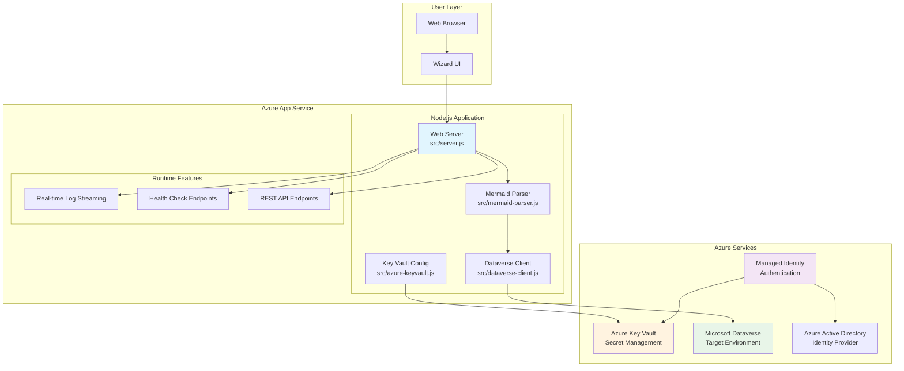
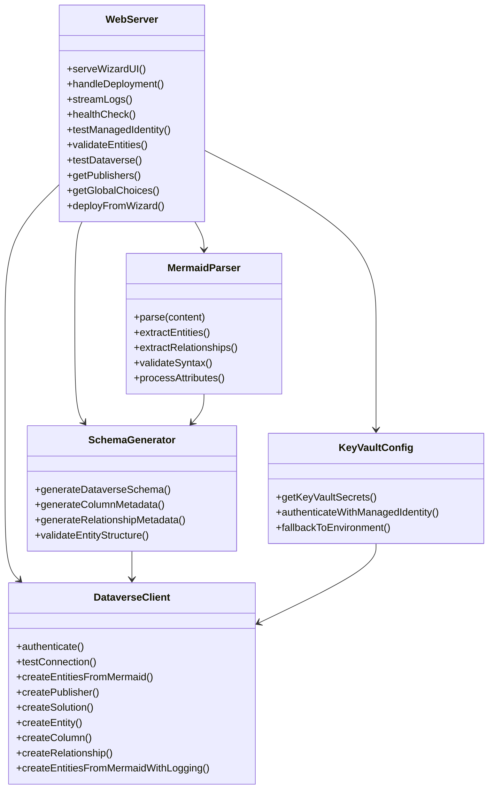
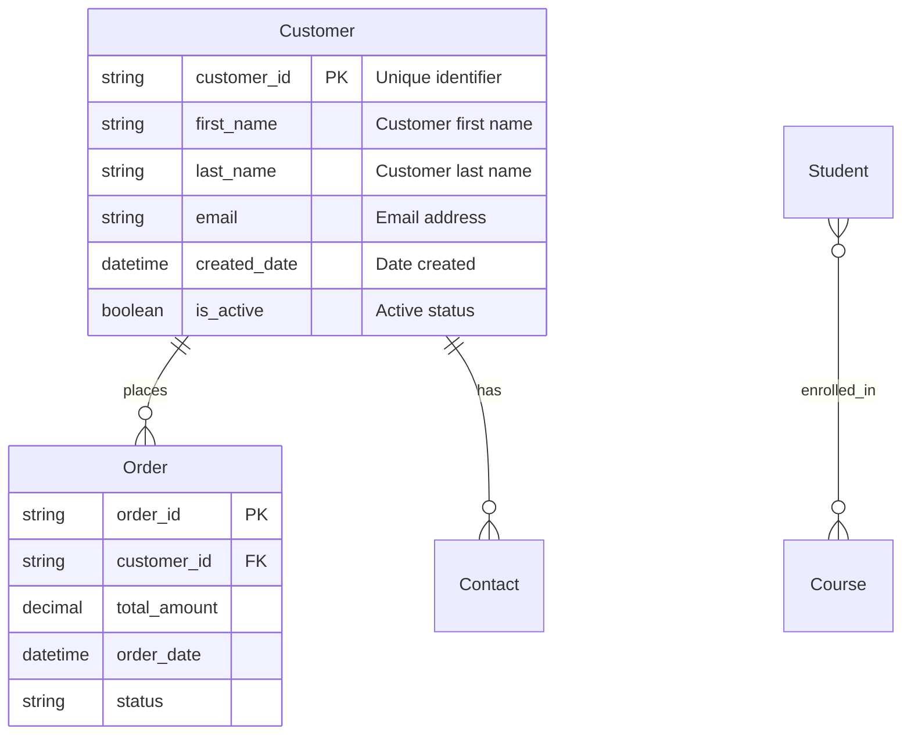
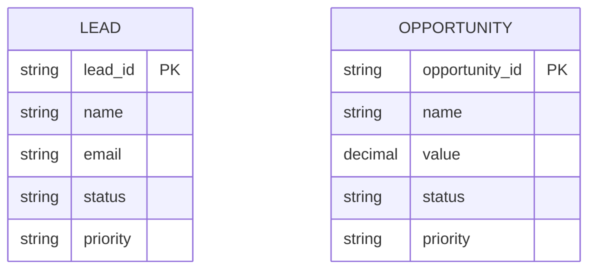
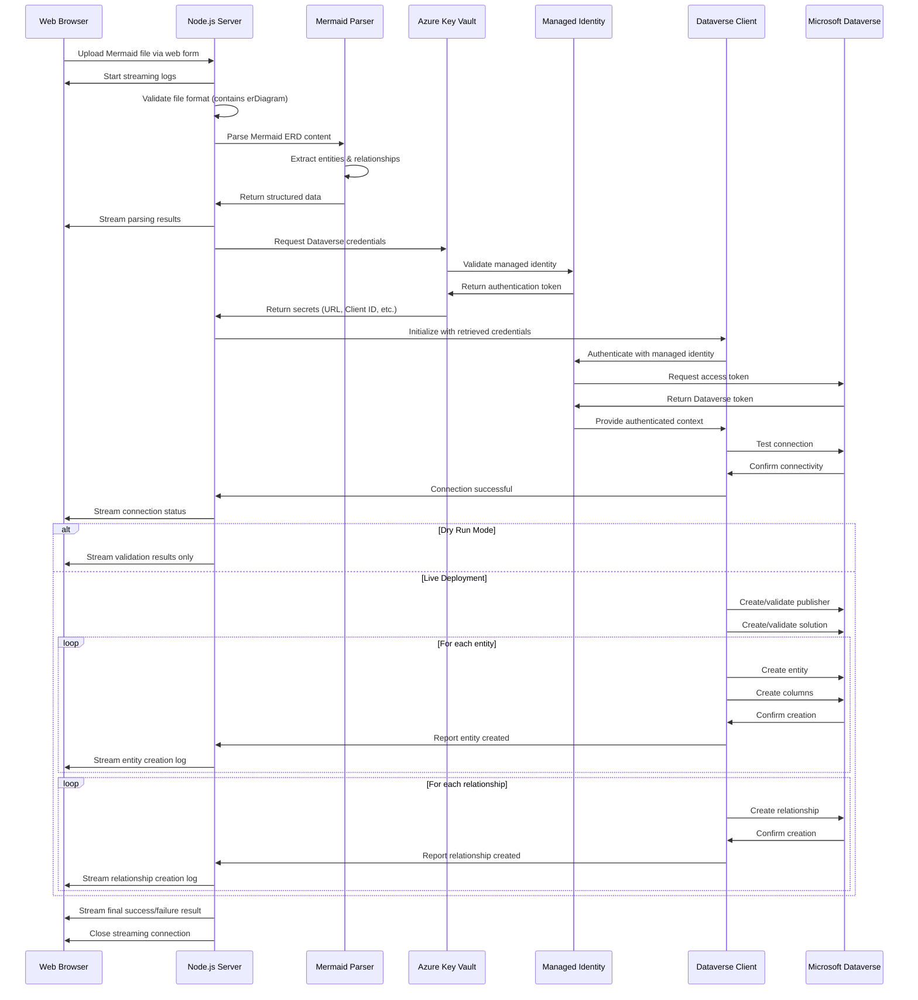

# Developer & Architecture Guide

This document provides a comprehensive overview of the Mermaid to Dataverse Converter application architecture, design decisions, and implementation details for developers who want to understand, maintain, or contribute to the project.

## System Overview

The Mermaid to Dataverse Converter is a **production-ready Node.js web application** deployed on Azure App Service that converts Mermaid ERD diagrams into Microsoft Dataverse entities, columns, and relationships.

**Key Features:**
- **Modern Wizard Interface** - Step-by-step guided deployment
- **Real-time ERD Validation** - Auto-correction and syntax checking  
- **Global Choices Integration** - Upload and manage option sets
- **Publisher Management** - Create or select existing publishers
- **Enterprise Security** - Azure Key Vault + Managed Identity
- **Comprehensive Logging** - File-based and UI streaming

### Key Characteristics

- **Runtime**: Node.js (CommonJS modules)
- **Deployment**: Azure App Service with managed identity
- **Authentication**: Azure Key Vault with managed identity
- **Security**: No secrets in code, all credentials in Key Vault
- **UI**: Web-based wizard with real-time streaming logs
- **API**: RESTful endpoints for validation and testing
- **Logging**: Comprehensive logging to files and UI

## High-Level Architecture



### High-Level Flow
1. **Modern Wizard Interface**: User accesses step-by-step wizard at `/wizard`
2. **ERD Input & Validation**: Real-time syntax checking with auto-corrections
3. **Publisher Configuration**: Select existing or create new publisher with custom prefix
4. **Global Choices Integration**: Optional upload of global choice definitions
5. **Real-time Deployment**: Live progress tracking with detailed logging
6. **Authentication**: Managed identity for secure Azure service access
7. **Result Dashboard**: Success/failure feedback with comprehensive details

## Core Components



### 1. Web Server (`src/server.js`)

**Purpose**: Main application entry point providing web UI, wizard interface, and comprehensive API endpoints.

**Key Features**:
- HTTP server with wizard interface
- Real-time log streaming to frontend
- Health check and diagnostic endpoints
- CORS-enabled API for cross-origin requests
- Publisher and solution management
- Global choices integration

**Main Endpoints**:

**UI Endpoints**:
- `GET /wizard` - **Primary wizard interface** for guided deployment

**Core API Endpoints**:
- `POST /upload` - **Primary deployment endpoint** from wizard with streaming logs
- `POST /api/validate-erd` - Enhanced ERD validation with corrections
- `POST /api/validate` - Validate Mermaid entities without creation

**Dataverse Integration**:
- `GET /api/dataverse-config` - Get Dataverse configuration
- `POST /api/test-dataverse` - Test Dataverse operations
- `GET /api/publishers` - Get available publishers from Dataverse

**Global Choices Management**:
- `POST /api/global-choices` - Create global choices from JSON
- `GET /api/global-choices-list` - List existing global choice sets

**System & Diagnostics**:
- `GET /health` - Application health status
- `GET /keyvault` - Key Vault connectivity test
- `GET /managed-identity` - Managed identity status
- `POST /api/cache/clear` - Clear system caches

**Real-time Logging Implementation**:
```javascript
// Streaming logs to frontend
function sendLog(message) {
  const logData = JSON.stringify({ type: 'log', message: message }) + '\n';
  res.write(logData);
}

// Final result
function sendResult(success, data) {
  const resultData = JSON.stringify({ type: 'result', success: success, ...data }) + '\n';
  res.write(resultData);
  res.end();
}
```

### 2. Mermaid Parser (`src/mermaid-parser.js`)

**Purpose**: Parses Mermaid ERD syntax into structured JavaScript objects

**Key Features**:
- **CommonJS Module**: Compatible with Node.js server environment
- **Regex-based Parsing**: Robust extraction of entities and relationships
- **Attribute Processing**: Support for types, constraints (PK, FK)
- **Relationship Detection**: One-to-many relationship parsing (many-to-many via junction tables)
- **Error Handling**: Comprehensive validation and error reporting

**Supported Syntax**:


**Validation & Auto-Correction**:
- Automatically adds missing primary keys
- Validates relationship consistency
- Suggests proper naming conventions

**Output Format**:
```javascript
{
  entities: [
    {
      name: "Customer",
      displayName: "Customer",
      attributes: [
        {
          name: "customer_id",
          type: "String",
          isPrimaryKey: true,
          isForeignKey: false,
          displayName: "Customer Id"
        }
      ]
    }
  ],
  relationships: [
    {
      fromEntity: "Customer",
      toEntity: "Order",
      cardinality: { type: "one-to-many" },
      label: "places"
    }
  ]
}
```

### 3. Modern Wizard Interface (`src/wizard-ui.html`)

**Purpose**: Primary user interface providing step-by-step guided deployment experience.

**Key Features**:
- **Step-by-step Wizard**: Guided deployment process with main steps
- **Real-time ERD Validation**: Live syntax checking with auto-corrections
- **Modern Responsive UI**: Clean, intuitive interface for all devices
- **Publisher Management**: Visual selection of existing or creation of new publishers
- **Global Choices Integration**: Upload and preview global choice definitions
- **Real-time Progress**: Live deployment feedback with detailed logging
- **Interactive Elements**: Dynamic form validation and user guidance

**Wizard Steps Flow**:
```javascript
// Step 1: ERD Input & Validation
- Paste Mermaid ERD content
- Real-time syntax validation
- Auto-correction suggestions
- Entity/relationship preview

// Step 2: Publisher Configuration  
- Select existing publisher OR
- Create new publisher with custom prefix
- Validation of publisher requirements

// Step 3: Solution Configuration
- Solution name (required field)
- Description and metadata
- Integration with selected publisher

// Step 4: Global Choices (Optional)
- Upload JSON file with global choice definitions
- Preview choice sets and options
- Dry-run validation

// Step 5: Deployment & Results
- Dry-run option for validation-only
- Real-time deployment progress
- Detailed success/failure reporting
- Download deployment logs
```

### 4. Dataverse Client (`src/dataverse-client.js`)

**Purpose**: Handle all Microsoft Dataverse Web API interactions

**Key Features**:
- Authentication via Azure managed identity
- Publisher and solution management
- Entity creation with metadata
- Column and relationship creation
- Comprehensive error handling and logging

**Main Operations**:
- **Connection Testing**: Validates Dataverse connectivity
- **Publisher Management**: Creates or uses existing publishers with custom prefixes
- **Solution Management**: Creates or uses existing solutions with proper metadata
- **Entity Creation**: Creates custom entities with proper metadata and naming
- **Column Creation**: Adds custom columns to entities with full attribute support
- **Relationship Creation**: Establishes one-to-many and many-to-many relationships
- **Global Choice Management**: Creates and manages global choice sets
- **Logging**: Creates detailed logs in the file system and streams to UI

**Authentication with Managed Identity**:
```javascript
// Managed Identity authentication
const credential = clientId 
  ? new ManagedIdentityCredential(clientId)
  : new ManagedIdentityCredential();

const token = await credential.getToken(`${dataverseUrl}/.default`);
```

**Entity Creation Flow**:
```javascript
async createEntitiesFromMermaidWithLogging(entities, options, logFunction) {
  // 1. Create/validate publisher
  const publisherResult = await this.ensurePublisher(options.publisherPrefix);
  logFunction(`Publisher: ${publisherResult.uniqueName}`);
  
  // 2. Create/validate solution
  const solutionResult = await this.createSolution(options.solutionName);
  logFunction(`Solution: ${solutionResult.uniqueName}`);
  
  // 3. Create entities
  for (const entity of entities) {
    const entityResult = await this.createEntity(entity);
    logFunction(`Entity created: ${entityResult.LogicalName}`);
  }
  
  // 4. Create additional columns
  // 5. Create relationships
}
```

### 5. Key Vault Configuration (`src/azure-keyvault.js`)

**Purpose**: Secure credential management via Azure Key Vault

**Key Features**:
- **Managed Identity Integration**: No secrets in application code
- **Fallback Support**: Environment variables for local development
- **Secret Caching**: Efficient credential retrieval
- **Error Handling**: Graceful degradation when Key Vault unavailable

**Required Secrets**:
- `DATAVERSE-URL` - Dataverse environment URL
- `CLIENT-ID` - App registration client ID
- `CLIENT-SECRET` - App registration secret
- `TENANT-ID` - Azure AD tenant ID
- `SOLUTION-NAME` - Default solution name

**Secret Retrieval**:
```javascript
async getKeyVaultSecrets() {
  try {
    const keyVaultUrl = process.env.KEY_VAULT_URI;
    const authType = process.env.AUTH_MODE || 'default';
    
    let credential;
    if (authType === 'managed-identity') {
      credential = new ManagedIdentityCredential(clientId);
    } else {
      credential = new DefaultAzureCredential();
    }
    
    const secretClient = new SecretClient(keyVaultUrl, credential);
    const secrets = await this.retrieveAllSecrets(secretClient);
    
    return { success: true, secrets };
  } catch (error) {
    return { success: false, message: error.message };
  }
}
```

## Advanced Features

### Global Choices Integration

**Purpose**: Manage Dataverse global choice sets (option sets) alongside entity creation.

**Capabilities**:
- **Upload JSON definitions** of global choice sets
- **Automatic validation** of choice set structure
- **Dry-run preview** before creation
- **Solution integration** - automatically add created choices to solution
- **Conflict detection** - identify existing choices to avoid duplicates

**JSON Format**:
```json
{
  "globalChoices": [
    {
      "name": "priority_level",
      "displayName": "Priority Level",
      "description": "Priority levels for tasks",
      "options": [
        { "value": 1, "label": "High", "description": "High priority" },
        { "value": 2, "label": "Medium", "description": "Medium priority" },
        { "value": 3, "label": "Low", "description": "Low priority" }
      ]
    }
  ]
}
```

**Example Usage in Mermaid Diagrams**:

When designing your ERD, create standard entities and attributes. After uploading both the Mermaid file and the global choices JSON file, the system will associate the appropriate fields with the global choice sets based on field names.



The `status` and `priority` fields in the entities above can be linked to the global choice sets defined in the JSON file.

### Global Choice Detection
- Automatically detects fields designated for global choice sets
- Creates global choices for reusable optionsets like Status, Priority, Region
- Prevents duplicate choice creation across deployments

### Global Choice Creation Process
1. **Parse ERD**: Extract all choice field definitions
2. **Validate**: Check if global choice already exists
3. **Create**: Generate new global choice with proper metadata
4. **Link**: Associate choice with entity fields during table creation

### Enhanced ERD Validation

**Purpose**: Provide comprehensive validation with auto-correction capabilities.

**Validation Features**:
- **Syntax checking** with specific error locations
- **Relationship validation** with cardinality verification
- **Naming convention enforcement** 
- **Auto-correction suggestions** for common issues
- **Warning categorization** (errors vs. warnings vs. info)

**Auto-Corrections**:
- Missing primary keys → Automatic ID field generation
- Invalid naming → Proper naming convention suggestions
- Relationship inconsistencies → Corrected relationship definitions

### Logging

**Purpose**: Provide detailed logging for debugging and auditing.

**Features**:
- **File-based logging** - Writes logs to files in `/logs` and `/src/logs` directories
- **Real-time streaming** - Sends log events to the wizard UI
- **Log levels** - ERROR, WARN, INFO, DEBUG levels for appropriate filtering
- **Log rotation** - Automatically manages log file sizes and archives old logs
- **IP and timestamp** - Records client IP and precise timestamps for audit trails

### Advanced Relationship Handling

The parser supports the following relationship scenarios:

#### Relationship Types
- **One-to-Many (1:M)**: `||--o{` syntax (primary relationship type supported)
- **Many-to-One (M:1)**: `}o--||` syntax (inverse of one-to-many)
- **Many-to-Many (M:M)**: Requires explicit junction table definition in the ERD
- **Self-Referencing**: Tables with relationships to themselves

#### Relationship Implementation
- **One-to-Many**: Directly supported with lookup fields
- **Many-to-Many**: Implemented using a junction table with two one-to-many relationships
- **Junction Tables**: Must be explicitly defined in the ERD with foreign keys to both related entities

#### Example of Many-to-Many with Junction Table


In this example:
- `EMPLOYEE_PROJECT` is an explicitly defined junction table with foreign keys to both EMPLOYEE and PROJECT
- The many-to-many relationship is implemented using two one-to-many relationships
- Additional attributes like `assigned_date` and `role` can be added to the junction table

## Data Flow



### Enhanced Schema Generation Process

1. **ERD Validation**: Real-time syntax checking with auto-corrections
2. **Parsing**: Extract entities, relationships, and attributes from Mermaid ERD
3. **Global Choices**: Process custom global choice definitions
4. **Publisher Management**: Create or validate publisher with custom prefix
5. **Solution Management**: Create or validate solution container
6. **Entity Creation**: Create custom entities with proper naming conventions
7. **Column Creation**: Add custom columns for each attribute with metadata
8. **Relationship Creation**: Establish lookup relationships between entities
9. **Global Choice Integration**: Add global choices to solution if specified
10. **Logging**: Record detailed logs of all operations

## Security Architecture

### Authentication & Authorization

- **Azure Managed Identity**: No secrets stored in application code
- **Key Vault Integration**: All sensitive configuration in Azure Key Vault
- **Least Privilege**: Managed identity has minimal required permissions

### Security Layers

1. **Transport Security**: HTTPS for all communications
2. **Identity Security**: Managed identity for Azure service authentication
3. **Secret Management**: Azure Key Vault for credential storage
4. **API Security**: Authentication required for Dataverse operations

### Permission Model

#### Setup Time Permissions (Temporary)

**Who**: PowerShell script user (DevOps/Admin)  
**When**: During initial setup and configuration  
**Duration**: Temporary (automatically cleaned up)

```powershell
# Grants temporary Key Vault Administrator role
az role assignment create --assignee $currentUser --role "Key Vault Administrator" --scope $keyVaultScope

# Store secrets in Key Vault
az keyvault secret set --vault-name $KeyVaultName --name "CLIENT-SECRET" --value $ClientSecret

# Clean up: Remove temporary role
az role assignment delete --assignee $currentUser --role "Key Vault Administrator" --scope $keyVaultScope
```

#### Runtime Permissions (Permanent)

**Who**: Managed Identity (App Service)  
**When**: Application runtime  
**Duration**: Permanent (for application lifetime)

```bicep
// Managed Identity gets read-only access to secrets
resource keyVaultSecretsUserRoleAssignment 'Microsoft.Authorization/roleAssignments@2022-04-01' = {
  properties: {
    roleDefinitionId: '4633458b-17de-408a-b874-0445c86b69e6' // Key Vault Secrets User
    principalId: managedIdentity.properties.principalId
  }
}
```

### Azure RBAC Roles Reference

| **Role** | **Role ID** | **Permissions** | **Use Case** |
|----------|-------------|-----------------|--------------|
| **Key Vault Administrator** | `00482a5a-887f-4fb3-b363-3b7fe8e74483` | Full access to secrets, keys, certificates, policies | Setup, emergency access |
| **Key Vault Secrets User** | `4633458b-17de-408a-b874-0445c86b69e6` | Read secrets only | Application runtime |
| **Key Vault Secrets Officer** | `b86a8fe4-44ce-4948-aee5-eccb2c155cd7` | Read, write secrets (no policies) | CI/CD pipelines |

### Environment Variables

**Production (Azure App Service)**:
```bash
KEY_VAULT_URI=https://your-keyvault.vault.azure.net/
AUTH_MODE=managed-identity
MANAGED_IDENTITY_CLIENT_ID=your-managed-identity-id
PORT=8080
```

**Local Development**:
```bash
# Local .env file (development only)
DATAVERSE_URL=https://yourorg.crm.dynamics.com
CLIENT_ID=xxxxxxxx-xxxx-xxxx-xxxx-xxxxxxxxxxxx
CLIENT_SECRET=your-client-secret
TENANT_ID=your-tenant-id
SOLUTION_NAME=MermaidSolution
```

## Field Type Mapping

### Supported Mermaid Types → Dataverse Types

| Mermaid Type | Dataverse Type | Notes |
|-------------|----------------|-------|
| `string` | StringAttributeMetadata | Single line text (255 chars) |
| `integer`, `int` | IntegerAttributeMetadata | Whole number |
| `decimal` | DecimalAttributeMetadata | Decimal number with precision |
| `boolean` | BooleanAttributeMetadata | Yes/No field |
| `datetime` | DateTimeAttributeMetadata | Date and time |

### Constraint Handling

| Constraint | Implementation | Dataverse Behavior |
|-----------|----------------|-------------------|
| `PK` | Primary key | Creates GUID primary key + name field |
| `FK` | Foreign key | Creates lookup relationship |

### Schema Generation Logic

```javascript
function generateColumnMetadata(attribute, publisherPrefix) {
  const baseMetadata = {
    LogicalName: `${publisherPrefix.toLowerCase()}_${attribute.name.toLowerCase()}`,
    DisplayName: { LocalizedLabels: [{ Label: attribute.displayName, LanguageCode: 1033 }] },
    RequiredLevel: { Value: attribute.isRequired ? 'ApplicationRequired' : 'None' }
  };
  
  switch (attribute.type.toLowerCase()) {
    case 'string':
      return {
        '@odata.type': 'Microsoft.Dynamics.CRM.StringAttributeMetadata',
        ...baseMetadata,
        AttributeType: 'String',
        MaxLength: 255
      };
    // ... other types
  }
}
```

## Error Handling

### Error Categories

1. **Validation Errors**: Invalid Mermaid syntax or missing required fields
2. **Authentication Errors**: Key Vault or Dataverse authentication failures
3. **Network Errors**: Connectivity issues with external services
4. **Business Logic Errors**: Dataverse entity creation conflicts
5. **File Upload Errors**: Invalid files, size limits, format issues
6. **API Errors**: Dataverse operation failures

### Recovery Strategies

- **Graceful Degradation**: Continue with partial functionality when possible
- **Retry Logic**: Automatic retry for transient failures
- **User Feedback**: Clear error messages with actionable guidance
- **Fallback Options**: Dry-run mode for validation without creation

### Error Response Strategy

```javascript
// Streaming error handling
try {
  // Process file
  const result = await processMermaidFile(fileContent, options);
  sendResult(true, result);
} catch (error) {
  sendLog(`Error: ${error.message}`);
  sendResult(false, { error: error.message });
}
```

## Testing Strategy

### 1. Integration Testing

**Test File**: `tests/test-schema-generation.js`

```bash
# Run integration tests
npm test

# Test with specific file
node tests/test-schema-generation.js examples/simple-sales.mmd

# Test with custom prefix
node tests/test-schema-generation.js examples/simple-sales.mmd myprefix
```

**What It Tests**:
- Mermaid file parsing
- Entity extraction and validation
- Relationship detection
- Dataverse naming conventions
- Primary key validation

### 2. API Testing

**Built-in Endpoints**:
```bash
# Health check
GET /health

# Key Vault connectivity
GET /keyvault

# Managed identity status
GET /managed-identity

# Dataverse connection test
POST /api/test-dataverse
```

### 3. Manual Testing Workflow

1. **Upload Test File**: Use web interface with sample files
2. **Dry Run Mode**: Validate without creating entities
3. **Live Deployment**: Test actual Dataverse creation
4. **Error Scenarios**: Test with invalid files, wrong credentials

## Deployment Architecture

### Azure Resources


### Required Azure Resources

1. **App Service**: Hosts the Node.js application
2. **App Service Plan**: Compute resources (B1 Basic or higher)
3. **Managed Identity**: Service authentication
4. **Key Vault**: Secure secret storage
5. **Key Vault Access Policy**: Grant managed identity access

### ⚡ Automated One-Click Setup

**No manual Azure resource creation needed!** The entire deployment is fully automated through a single PowerShell script.

### Quick Start

```powershell
# Clone repository
git clone https://github.com/LuiseFreese/mermaid.git
cd mermaid

# Run automated setup (interactive prompts)
./scripts/setup-entra-app.ps1
```

**What it does automatically**:
- Creates App Registration with secret
- **Calls Bicep template** (`deploy/infrastructure.bicep`) to deploy Azure resources
- **Deploys complete Node.js application** (not just empty webapp)
- Configures managed identity & RBAC
- Stores secrets in Key Vault
- Creates Dataverse application user
- Tests end-to-end functionality

### Interactive Setup Process

The setup script guides you through configuration with prompts:

```powershell
Interactive Setup for Mermaid-to-Dataverse Solution
==================================================

Resource Group Name (or 'new' to create): rg-mermaid-prod
Location for new resources: East US
App Registration Name: MermaidToDataverse-Prod
App Service Name: mermaid-dataverse-prod
Key Vault Name: kv-mermaid-prod-001
Dataverse URL: https://yourorg.crm.dynamics.com
Solution Name: MermaidSolution
Publisher Prefix (3-8 chars): mmrd
Security Role Name: System Administrator

Step 1: Creating App Registration and secret...
Step 2: Deploying infrastructure via Bicep template...
Step 3: Deploying application source code to App Service...
Step 4: Storing secrets securely in Key Vault...
Step 5: Creating Dataverse application user...
Step 6: Testing end-to-end functionality...

Setup complete! Application ready at: https://mermaid-dataverse-prod.azurewebsites.net
```

## Development Setup

### Prerequisites

**For Automated Deployment:**
- **Azure subscription** with Dataverse environment access
- **PowerShell 7+** (includes Azure CLI integration)
- **Appropriate permissions** in Azure AD (to create App Registrations)
- **Dataverse admin rights** (to create application users)

**For Local Development (optional):**
- **Node.js 20+** (for running locally)
- **.env file** with development credentials

### Local Development

1. **Clone Repository**:
   ```bash
   git clone https://github.com/LuiseFreese/mermaid.git
   cd mermaid
   ```

2. **Install Dependencies**:
   ```bash
   npm install
   ```

3. **Development Commands**:
   ```bash
   # Start the web server (production mode)
   npm start
   # → Starts the web server at http://localhost:8082

   # Start with auto-restart on file changes
   npm run dev  
   # → Starts with auto-restart on file changes for development

   # Run integration tests
   npm test
   # → Runs the schema generation test

   # Deploy to Azure
   npm run deploy
   # → Deploys the application to Azure
   ```

3. **Setup Environment**:
   ```bash
   cp .env.example .env
   # Edit .env with your development credentials
   ```

4. **Start Development Server**:
   ```bash
   npm run dev
   # Server runs with auto-restart on file changes
   ```

5. **Access Application**:
   ```
   http://localhost:8082/wizard
   ```

## Best Practices

### Development

- **Separation of Concerns**: Each module has a single responsibility
- **Error First**: Always handle errors before success cases
- **Logging**: Comprehensive logging for debugging and monitoring
- **Testing**: Unit tests for core logic, integration tests for API

### Security

- **No Hardcoded Secrets**: All sensitive data in Key Vault
- **Principle of Least Privilege**: Minimal required permissions
- **Input Validation**: Validate all user inputs
- **Output Encoding**: Prevent injection attacks

### Performance & Caching

**Caching Strategy**:
- **Publisher Cache**: 10-minute cache for Dataverse publishers
- **Global Choices Cache**: 5-minute cache for global choice sets
- **Cache Invalidation**: Manual cache clearing via `/api/cache/clear`
- **Development Optimization**: Reduces repeated Dataverse API calls

**Memory Management**:
- In-memory caching for frequently accessed data
- Automatic cache expiration with configurable duration
- Cache hit/miss logging for performance monitoring
- **Graceful Shutdown**: Handle SIGTERM (termination request) and SIGINT (interrupt signal) properly
- **Resource Cleanup**: Clean up temporary files and connections
- **Monitoring**: Track key business and technical metrics

## Troubleshooting

### Common Issues

1. **Authentication Failures**
   - **Symptom**: "Failed to authenticate with Key Vault" or "Unable to acquire token"
   - **Solution**: Verify managed identity is properly configured, check Key Vault access policies

2. **Dataverse Connection Issues**
   - **Symptom**: "Unable to connect to Dataverse" or "Organization not found"
   - **Solution**: Verify Dataverse URL, check application user permissions

3. **Publisher Prefix Errors**
   - **Symptom**: "Invalid publisher prefix" or "Publisher not found"
   - **Solution**: Ensure publisher exists in Dataverse with specified prefix

4. **Deployment Failures**
   - **Symptom**: Azure deployment fails with permission errors
   - **Solution**: Verify Azure AD permissions, try running setup script with `-Verbose` flag

### Diagnostic Tools

1. **Health Check Endpoints**
   ```
   https://your-app-service.azurewebsites.net/health
   https://your-app-service.azurewebsites.net/keyvault
   https://your-app-service.azurewebsites.net/managed-identity
   ```

2. **Azure Logs**
   ```powershell
   # Stream live logs
   az webapp log tail --name your-app-service --resource-group your-resource-group
   ```

3. **Local Testing**
   ```bash
   # Test schema generation without deployment
   node tests/test-schema-generation.js examples/simple-sales.mmd
   ```
