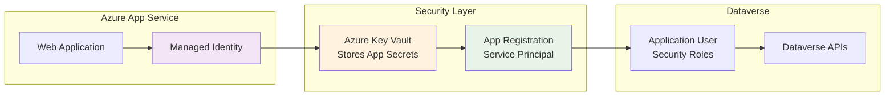

# Microsoft Entra ID App Registration Setup Guide

This application uses **fully automated setup** - no manual configuration required! The setup script handles all Microsoft Entra ID app registration, Azure Key Vault configuration, and Dataverse user creation automatically.

## Architecture Overview

This application uses a **secure, production-ready approach**:

1. **App Registration** → Creates service principal for Dataverse access
2. **Key Vault** → Stores app registration secrets securely  
3. **Managed Identity** → Accesses Key Vault without secrets in code
4. **Dataverse Application User** → Links app registration to Dataverse permissions



**Why this approach?**
- ✅ **No secrets in code** - All credentials in Key Vault
- ✅ **Managed Identity** - Azure handles authentication automatically
- ✅ **Production ready** - Meets enterprise security requirements
- ✅ **Easy rotation** - Change secrets in Key Vault without code changes

---

## ⚡ Automated Setup (One Command)

**This is the only setup method needed.** The automation script handles all the complex configuration for you.

### Prerequisites

1. **Azure CLI** installed and logged in
2. **PowerShell 7+** (recommended) or Windows PowerShell 5.1
3. **Appropriate Azure permissions**:
   - **Microsoft Entra ID**: Application Administrator or Global Administrator
   - **Subscription**: Contributor or Owner role
   - **Power Platform**: System Administrator in target environment

### One-Command Setup

```powershell
# Clone repository and run automated setup
git clone https://github.com/LuiseFreese/mermaid.git
cd mermaid
./scripts/setup-entra-app.ps1
```

The script will prompt you interactively for all required configuration.

### What the Script Does Automatically

The automation script (`scripts/setup-entra-app.ps1`) performs these tasks:

1. ✅ **Creates App Registration** with proper configuration
2. ✅ **Generates Client Secret** with 12-month expiration
3. ✅ **Deploys Infrastructure** using Bicep (Key Vault, Managed Identity, App Service)
4. ✅ **Configures RBAC permissions** for Key Vault access
5. ✅ **Stores all secrets** securely in Key Vault
6. ✅ **Creates Application User** in Dataverse via REST API
7. ✅ **Assigns Security Roles** (System Administrator by default)
8. ✅ **Tests the complete setup** end-to-end
9. ✅ **Provides ready-to-use App Service URL**

### Example Script Output

```powershell
Interactive Setup for Mermaid-to-Dataverse Solution
==================================================

Resource Group Name (or 'new' to create): rg-mermaid-prod
Location for new resources: East US
App Registration Name: MermaidToDataverse-Prod
App Service Name: mermaid-dataverse-prod
Key Vault Name: kv-mermaid-prod-001
Dataverse URL: https://yourorg.crm.dynamics.com
Solution Name: MermaidSolution
Publisher Prefix (3-8 chars): mmrd
Security Role Name: System Administrator

Step 1: Creating App Registration and secret...
✅ App Registration created: MermaidToDataverse-Prod
   Application ID: xxxxxxxx-xxxx-xxxx-xxxx-xxxxxxxxxxxx

Step 2: Deploying infrastructure via Bicep template...
✅ Infrastructure deployed successfully:
   - Key Vault: https://kv-mermaid-prod-001.vault.azure.net/
   - Managed Identity: mi-mermaid-prod
   - App Service: https://mermaid-dataverse-prod.azurewebsites.net/

Step 3: Deploying application source code to App Service...
✅ Application code deployed successfully

Step 4: Storing secrets securely in Key Vault...
✅ Secrets stored in Key Vault:
   - DATAVERSE-URL, CLIENT-ID, CLIENT-SECRET, TENANT-ID, SOLUTION-NAME

Step 5: Creating Dataverse application user...
✅ Application User created in Dataverse
   Security Role: System Administrator

Step 6: Testing end-to-end functionality...
✅ End-to-End Test: Upload → Parse → Validate ✅

🎉 Setup Complete! Application ready at: 
   https://mermaid-dataverse-prod.azurewebsites.net/
```

### Advanced Script Options

```powershell
# Full parameter example with custom settings
./scripts/setup-entra-app.ps1 `
    -ResourceGroupName "rg-my-production" `
    -AppRegistrationName "MyCustomMermaidApp" `
    -DataverseUrl "https://yourorg.crm.dynamics.com" `
    -SecurityRole "System Customizer" `
    -Location "West Europe" `
    -Environment "prod"
```

**Available Parameters:**
- `-ResourceGroupName`: Target resource group (default: creates new)
- `-AppRegistrationName`: Custom app registration name (default: auto-generated)
- `-DataverseUrl`: Your Dataverse environment URL (interactive prompt if not provided)
- `-SecurityRole`: Dataverse security role (default: "System Administrator")
- `-Location`: Azure region (default: "East US")
- `-Environment`: Environment suffix (dev/test/prod)

### Zero-Downtime Updates

For updates to existing deployments:

```powershell
# Update application code only
./scripts/setup-entra-app.ps1 -UpdateCodeOnly

# Full infrastructure update (idempotent)
./scripts/setup-entra-app.ps1 -Force
```

---

## Important: No Manual Steps Required

**Unlike many Azure applications, you do NOT need to:**

- ❌ Manually create app registrations in Azure Portal
- ❌ Manually add API permissions (Dataverse uses security roles, not API permissions)
- ❌ Manually create Azure resources
- ❌ Manually configure Key Vault access policies
- ❌ Manually create Dataverse application users
- ❌ Manually configure environment variables

**The automation script handles everything!**

> **Note**: For Dataverse service principals, API permissions like `user_impersonation` are **not needed**. Authorization is handled entirely through Dataverse security roles. See [Why your Power Platform service principal doesn't need a Dynamics user_impersonation scope](https://www.m365princess.com/blogs/2022-07-25-why-your-service-principal-doesnt-need-a-dynamics-user_impersonation-scope/).

---

## Verification & Testing

After the automated setup completes, you can verify everything works:

### 1. Check Azure Resources
```powershell
# Verify app registration
az ad app list --display-name "MermaidToDataverse-Prod"

# Verify Key Vault secrets
az keyvault secret list --vault-name "kv-mermaid-prod-001"
```

### 2. Test Application
Visit your deployed application URL and:
- ✅ Check the status dashboard (should show all green)
- ✅ Test Dataverse connection
- ✅ Upload a sample Mermaid file in dry-run mode

### 3. Diagnostic Endpoints
```bash
# Application health
GET https://your-app-service.azurewebsites.net/health

# Key Vault connectivity  
GET https://your-app-service.azurewebsites.net/keyvault

# Managed identity status
GET https://your-app-service.azurewebsites.net/managed-identity
```

---

## Security Benefits

### Production Security
1. **All secrets in Key Vault** - No credentials in code or config files
2. **Managed Identity authentication** - No secrets needed for Key Vault access
3. **Role-based access control** - Fine-grained permissions
4. **Automatic secret rotation** - Easy to update without code changes
5. **Complete audit trail** - All access logged in Azure Monitor

### Development Security  
1. **Environment separation** - Different resources for dev/test/prod
2. **No local secrets** - All credentials retrieved from Key Vault
3. **Principle of least privilege** - Minimal required permissions
4. **Automated compliance** - Security best practices built-in

---

## Troubleshooting

### Common Issues After Automated Setup

**1. Setup Script Fails**
```
❌ Error: App Registration creation failed
```
**Solutions**:
- Ensure you have Application Administrator rights in Azure AD
- Check Azure CLI login: `az account show`
- Verify subscription permissions: `az account list-locations`

**2. Dataverse Connection Issues**
```
❌ Application User creation failed
```
**Solutions**:
- Verify you have System Administrator rights in the Dataverse environment
- Check Dataverse URL is correct and accessible
- Ensure environment is not in Administration Mode

**3. Key Vault Access Issues**
```
❌ Managed Identity cannot access Key Vault
```
**Solutions**:
- Script should handle this automatically
- Check RBAC assignments in Azure Portal
- Verify managed identity is properly assigned to App Service

### Getting Help

1. **Run with verbose output**: `./scripts/setup-entra-app.ps1 -Verbose`
2. **Check diagnostic endpoints** on your deployed app
3. **Review Azure Activity Logs** for any permission errors
4. **Test individual components** using the provided diagnostic endpoints

For detailed technical architecture and developer information, see [DEVELOPER.md](DEVELOPER.md).

## Additional Resources

- [Azure Managed Identity Documentation](https://learn.microsoft.com/en-us/azure/active-directory/managed-identities-azure-resources/overview)
- [Azure Key Vault Best Practices](https://learn.microsoft.com/en-us/azure/key-vault/general/best-practices)
- [Power Platform Application Users](https://learn.microsoft.com/en-us/power-platform/admin/manage-application-users)
- [Why service principals don't need user_impersonation scope](https://www.m365princess.com/blogs/2022-07-25-why-your-service-principal-doesnt-need-a-dynamics-user_impersonation-scope/)

### Step 1: Create Microsoft Entra ID App Registration

1. Go to the [Azure Portal](https://portal.azure.com)
2. Navigate to **Microsoft Entra ID** > **App registrations**
3. Select **"New registration"**
4. Fill in the details:
   - **Name**: `Mermaid to Dataverse Converter`
   - **Supported account types**: `Accounts in this organizational directory only`
   - **Redirect URI**: Leave blank
5. Select **Register**

### Step 2: Skip API Permissions ⚠️

**Important**: Unlike other Azure services, Dataverse service principals do **NOT** need API permissions in the Microsoft Entra ID app registration.

- **Do NOT add any API permissions** (like `user_impersonation`)
- Authorization is handled entirely through **Dataverse security roles**
- The `user_impersonation` scope is only for delegated (user) access, not service principals

This is a common misconception - Dataverse uses its own security role system for authorization.

> **Read More**: For a detailed explanation, see this blog post: [Why your Power Platform service principal doesn't need a Dynamics user_impersonation scope](https://www.m365princess.com/blogs/2022-07-25-why-your-service-principal-doesnt-need-a-dynamics-user_impersonation-scope/).

### Step 3: Create Client Secret

```powershell
# Alternative: Use Azure CLI
$appId = "xxxxxxxx-xxxx-xxxx-xxxx-xxxxxxxxxxxx"
az ad app credential reset --id $appId --display-name "Mermaid Converter Secret"
```

*If you prefer the Azure Portal approach:*
1. Go to **Certificates & secrets**
2. Select **"New client secret"**
3. Add a description: `Mermaid Converter Secret`
4. Set expiration as needed (recommended: 12 months)
5. Select **Add**
6. **Important**: Copy the secret value immediately - you won't be able to see it again

### Step 4: Get Required Information

Collect the following information from your app registration:

#### From Overview page:
- **Application (client) ID**: `xxxxxxxx-xxxx-xxxx-xxxx-xxxxxxxxxxxx`
- **Directory (tenant) ID**: `xxxxxxxx-xxxx-xxxx-xxxx-xxxxxxxxxxxx`

#### From Certificates & secrets:
- **Client secret**: `xxxxxxxxxxxxxxxxxxxxxxxxxxxxxx`

#### From your Dataverse environment:
- **Dataverse URL**: `https://your-org.crm.dynamics.com`

---

## Step 5: Store Credentials in Azure Key Vault

**Instead of `.env` files, we use Azure Key Vault for security:**

### Add Secrets to Key Vault

```bash
# Set your Key Vault name
$vaultName = "kv-mermaid-secrets"

# Add Dataverse credentials
az keyvault secret set --vault-name $vaultName --name "DATAVERSE-URL" --value "https://yourorg.crm.dynamics.com"
az keyvault secret set --vault-name $vaultName --name "CLIENT-ID" --value "xxxxxxxx-xxxx-xxxx-xxxx-xxxxxxxxxxxx"  
az keyvault secret set --vault-name $vaultName --name "CLIENT-SECRET" --value "your-client-secret"
az keyvault secret set --vault-name $vaultName --name "TENANT-ID" --value "your-tenant-id"
az keyvault secret set --vault-name $vaultName --name "SOLUTION-NAME" --value "MermaidSolution"
```

### Configure App Service Environment Variables

Set these in your Azure App Service configuration:

```bash
KEY_VAULT_URI=https://your-keyvault.vault.azure.net/
AUTH_MODE=managed-identity
MANAGED_IDENTITY_CLIENT_ID=your-managed-identity-client-id
```

### For Local Development Only

Create a `.env` file for local testing (never commit this!):

```env
DATAVERSE_URL=https://your-org.crm.dynamics.com
CLIENT_ID=your-application-client-id
CLIENT_SECRET=your-client-secret-value
TENANT_ID=your-tenant-id
SOLUTION_NAME=MermaidERDSolution
```

## Step 6: Configure Dataverse Application User

**This is the crucial step where authorization is actually configured!**

After creating your Microsoft Entra ID app registration, you need to create an Application User in Dataverse and assign appropriate security roles:

1. Go to [Power Platform Admin Center](https://admin.powerplatform.microsoft.com)
2. Select your environment
3. Go to **Settings** > **Users + permissions** > **Application users**
4. Select **"+ New app user"**
5. Select **"+ Add an app"** and select your registered application
6. Select appropriate Business Unit
7. **Assign Security Roles** - this is where the actual permissions are granted:
   - **System Administrator** (full access - recommended for development)
   - **System Customizer** (can create/modify entities - minimum required)
   - Or create a custom role with specific privileges

## Step 7: Test Configuration

### Test via Web Interface

1. **Navigate to your deployed app**: `https://your-app-service.azurewebsites.net`
2. **Check status dashboard**: Should show green checkmarks for Key Vault and Managed Identity
3. **Test Dataverse connection**: Click the "🧪 Test Dataverse" button
4. **Upload a test file**: Try with dry-run mode first

### Test Individual Components

Access these diagnostic endpoints:

```bash
# Check application health
GET https://your-app-service.azurewebsites.net/health

# Test Key Vault connectivity  
GET https://your-app-service.azurewebsites.net/keyvault

# Test managed identity
GET https://your-app-service.azurewebsites.net/managed-identity
```

### Local Development Testing

```bash
# Start the application locally
npm start

# Access the web interface
# http://localhost:8080

# Upload a test file with dry-run enabled
```

**Use this option only if you need to understand the individual steps or have specific customization requirements. The automated setup is recommended for most users.**

### Step 1: Create Microsoft Entra ID App Registration

```powershell
# Alternative: Use Azure CLI instead of clicking through portal
az ad app create \
    --display-name "Mermaid-Dataverse-Converter" \
    --available-to-other-tenants false
```

*If you prefer the Azure Portal approach:*
1. Go to the [Azure Portal](https://portal.azure.com)
2. Navigate to **Microsoft Entra ID** > **App registrations**
3. Select **"New registration"**
4. Fill in the details:
   - **Name**: `Mermaid to Dataverse Converter`
   - **Supported account types**: `Accounts in this organizational directory only`
   - **Redirect URI**: Leave blank
5. Select **Register**

### Step 2: Skip API Permissions ⚠️

**Important**: Unlike other Azure services, Dataverse service principals do **NOT** need API permissions in the Microsoft Entra ID app registration.

- **Do NOT add any API permissions** (like `user_impersonation`)
- Authorization is handled entirely through **Dataverse security roles**
- The `user_impersonation` scope is only for delegated (user) access, not service principals

This is a common misconception - Dataverse uses its own security role system for authorization.

> **Read More**: For a detailed explanation of why service principals don't need the `user_impersonation` scope, see this excellent blog post: [Why your Power Platform service principal doesn't need a Dynamics user_impersonation scope](https://www.m365princess.com/blogs/2022-07-25-why-your-service-principal-doesnt-need-a-dynamics-user_impersonation-scope/).

### Step 3: Create Client Secret

1. Go to **Certificates & secrets**
2. Select **"New client secret"**
3. Add a description: `Mermaid Converter Secret`
4. Set expiration as needed (recommended: 12 months)
5. Select **Add**
6. **Important**: Copy the secret value immediately - you won't be able to see it again

### Step 4: Get Required Information

Collect the following information from your app registration:

#### From Overview page:
- **Application (client) ID**: `xxxxxxxx-xxxx-xxxx-xxxx-xxxxxxxxxxxx`
- **Directory (tenant) ID**: `xxxxxxxx-xxxx-xxxx-xxxx-xxxxxxxxxxxx`

#### From Certificates & secrets:
- **Client secret**: `xxxxxxxxxxxxxxxxxxxxxxxxxxxxxx`

#### From your Dataverse environment:
- **Dataverse URL**: `https://your-org.crm.dynamics.com`

---

## Step 5: Configure Environment Variables

Create a `.env` file in your project root with the following content:

```env
DATAVERSE_URL=https://your-org.crm.dynamics.com
CLIENT_ID=your-application-client-id
CLIENT_SECRET=your-client-secret-value
TENANT_ID=your-tenant-id
SOLUTION_NAME=MermaidERDSolution
```

## Step 6: Configure Dataverse Application User

**This is the crucial step where authorization is actually configured!**

After creating your Microsoft Entra ID app registration, you need to create an Application User in Dataverse and assign appropriate security roles:

1. Go to [Power Platform Admin Center](https://admin.powerplatform.microsoft.com)
2. Select your environment
3. Go to **Settings** > **Users + permissions** > **Application users**
4. Select **"+ New app user"**
5. Select **"+ Add an app"** and select your registered application
6. Select appropriate Business Unit
7. **Assign Security Roles** - this is where the actual permissions are granted:
   - **System Administrator** (full access - recommended for development)
   - **System Customizer** (can create/modify entities - minimum required)
   - Or create a custom role with specific privileges


## Step 7: Test Configuration

Run the configuration check:

```bash
npm start config
```

All values should show ✅ status.


## Security Considerations

### Production Security (Key Vault)
1. **All secrets in Key Vault** - Never store credentials in code or config files
2. **Managed Identity authentication** - No secrets needed for Key Vault access
3. **Role-based access control** - Fine-grained permissions for Key Vault and Dataverse
4. **Secret rotation** - Easy to rotate secrets without code changes
5. **Audit logging** - Complete access history in Azure Monitor

### Development Security  
1. **Never commit your `.env` file** to version control
2. **Use separate environments** - Different app registrations for dev/test/prod
3. **Rotate client secrets regularly** - Set calendar reminders for secret expiration
4. **Follow principle of least privilege** - Grant only required permissions

### Security Best Practices
- Use **system-assigned managed identity** when possible
- Enable **Key Vault access policies** or **RBAC** (recommended)
- Configure **network access restrictions** for Key Vault
- Monitor **Key Vault access logs** for unusual activity
- Implement **secret expiration policies**

## Troubleshooting

### Common Issues:

**1. Key Vault Access Denied**
```
❌ Error accessing Key Vault: Forbidden
```
**Solutions**:
- Verify managed identity has Key Vault access (RBAC: "Key Vault Secrets User")
- Check KEY_VAULT_URI environment variable is correct
- Ensure managed identity is enabled on App Service
- Verify network access to Key Vault (if using private endpoints)

**2. Dataverse Authentication Failed**
```
❌ Dataverse connection failed: Unauthorized  
```
**Solutions**:
- Verify app registration client ID and secret in Key Vault
- Check that Application User exists in Dataverse environment
- Ensure Application User has appropriate security roles
- Verify Dataverse URL is correct and accessible

**3. Managed Identity Not Found**
```
❌ Managed identity not available
```
**Solutions**:
- Enable system-assigned managed identity on App Service
- If using user-assigned, set MANAGED_IDENTITY_CLIENT_ID
- Restart App Service after enabling managed identity
- Check that MSI_ENDPOINT environment variable is set (automatic in App Service)

**4. Application User Missing**
```
❌ Principal user is missing privilege
```
**Solutions**:
- Create Application User in Power Platform Admin Center
- Assign "System Administrator" or "System Customizer" role
- Link Application User to the correct app registration
- Verify environment access permissions

**5. Entity Creation Permissions**
```
❌ Entity creation failed: Insufficient privileges
```
**Solutions**:
- Ensure Application User has "System Customizer" role minimum
- Check solution-level permissions
- Verify publisher creation permissions
- Try with "System Administrator" role for full access

### Testing Steps:

**1. Test Key Vault Access**
```bash
# Via web interface
GET https://your-app-service.azurewebsites.net/keyvault

# Expected: { "success": true, "message": "Key Vault accessible" }
```

**2. Test Managed Identity**
```bash
# Via web interface  
GET https://your-app-service.azurewebsites.net/managed-identity

# Expected: { "success": true, "hasToken": true }
```

**3. Test Dataverse Connection**
```bash
# Via web interface diagnostic
POST https://your-app-service.azurewebsites.net/api/test-dataverse
Body: { "testType": "connection" }

# Expected: { "success": true, "connection": { "success": true } }
```

**4. Test End-to-End**
1. Upload a sample Mermaid file via web interface
2. Enable dry-run mode for safe testing
3. Check real-time logs for any errors
4. Verify all steps complete successfully

### Local Development Troubleshooting

**Environment Variable Issues**:
```bash
# Check if .env file is loaded
node -e "require('dotenv').config(); console.log(process.env.DATAVERSE_URL)"

# Should output your Dataverse URL, not undefined
```

**Authentication Testing**:
```bash
# Start the application
npm start

# Test locally at http://localhost:8080
# Upload a test file with dry-run enabled
```

## Additional Resources

- [Azure Managed Identity Documentation](https://learn.microsoft.com/en-us/azure/active-directory/managed-identities-azure-resources/overview)
- [Azure Key Vault Best Practices](https://learn.microsoft.com/en-us/azure/key-vault/general/best-practices)
- [Why your Power Platform service principal doesn't need a Dynamics user_impersonation scope](https://www.m365princess.com/blogs/2022-07-25-why-your-service-principal-doesnt-need-a-dynamics-user_impersonation-scope/) - Essential read about Dataverse authentication
- [Power Platform Application Users](https://learn.microsoft.com/en-us/power-platform/admin/manage-application-users)
- [Azure App Service Managed Identity](https://learn.microsoft.com/en-us/azure/app-service/overview-managed-identity)
