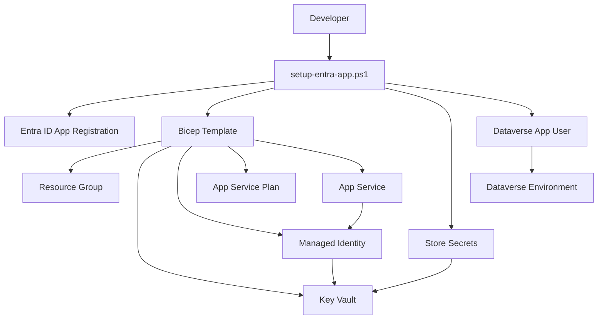

# Microsoft Entra ID App Registration Setup Guide

This guide helps you **deploy and use** the Mermaid-to-Dataverse application. The application uses **fully automated setup** - no manual configuration required!

## Quick Start (Recommended)

**One command deploys everything:**

```powershell
git clone https://github.com/LuiseFreese/mermaid.git
cd mermaid
./scripts/setup-entra-app.ps1
```

The script will prompt you for configuration and handle all setup automatically.

## What You Get

After setup, you'll have a **complete working application** that:
-  Converts Mermaid ERD files to Dataverse entities
-  Provides a web interface for file uploads
-  Shows real-time processing logs
-  Supports dry-run mode for validation
-  Uses enterprise-grade security (Managed Identity + Key Vault)

## Prerequisites

Before running the setup:

1. **Azure subscription** with permissions to create resources
2. **PowerShell 7+** (recommended) or Windows PowerShell 5.1
3. **Azure CLI** installed and logged in (`az login`)
4. **Access to Dataverse environment** where you want to create entities
5. **Appropriate permissions**:
   - **Azure**: Contributor or Owner on subscription
   - **Microsoft Entra ID**: Application Administrator (to create app registrations)
   - **Dataverse**: System Administrator (to create application users)

## Automated Setup Process

The setup script (`scripts/setup-entra-app.ps1`) performs these tasks automatically:

1.  **Creates App Registration** with proper configuration (using latest Azure CLI syntax)
2.  **Generates Client Secret** with 2-year expiration (securely, without console exposure)
3.  **Deploys Infrastructure** using Bicep (Key Vault, Managed Identity, App Service)
4.  **Configures RBAC permissions** for Key Vault access
5.  **Stores all secrets** securely in Key Vault
6.  **Updates .env file** automatically with new credentials
7.  **Deploys application code** to Azure App Service
8.  **Creates Application User** in Dataverse via REST API
9.  **Assigns Security Roles** (System Administrator by default)
10.  **Tests the complete setup** end-to-end

### Deployment Options

```powershell
# Interactive mode (prompts for configuration)
.\scripts\setup-entra-app.ps1

# Dry run mode (test without making changes)
.\scripts\setup-entra-app.ps1 -DryRun

# Unattended mode (provide all parameters)
.\scripts\setup-entra-app.ps1 -Unattended `
  -EnvironmentUrl "https://yourorg.crm.dynamics.com" `
  -ResourceGroup "rg-mermaid-dataverse" `
  -Location "East US"
```

**What gets deployed:**
- **Azure Resource Group** - Container for all resources
- **App Service & App Service Plan** - Web application hosting (B1 tier)
- **Key Vault** - Secure secret storage with RBAC
- **User-Assigned Managed Identity** - Secure authentication without passwords
- **Entra ID App Registration** - Service principal for Dataverse access
- **Dataverse Application User** - Configured with appropriate security roles

## Infrastructure as Code

All Azure resources are defined in `deploy/infrastructure.bicep`:

```bicep
// Key components deployed:
resource keyVault 'Microsoft.KeyVault/vaults@2023-07-01'
resource managedIdentity 'Microsoft.ManagedIdentity/userAssignedIdentities@2023-01-31'  
resource appServicePlan 'Microsoft.Web/serverfarms@2023-01-01'
resource appService 'Microsoft.Web/sites@2023-01-01'
resource roleAssignment 'Microsoft.Authorization/roleAssignments@2022-04-01'
```

The Bicep template ensures:
- **Idempotent deployments** - Can be run multiple times safely
- **Secure configuration** - RBAC-enabled Key Vault with least privilege access
- **Production-ready settings** - HTTPS-only, TLS 1.2+, Node.js 18.17.0 LTS
- **Managed identity integration** - No passwords or connection strings in code

### Deployment Architecture



## Interactive Setup Example

The setup script guides you through configuration with prompts:

```powershell
Interactive Setup for Mermaid-to-Dataverse Solution
==================================================

Resource Group Name (or 'new' to create): rg-mermaid-prod
Location for new resources: East US
App Registration Name: MermaidToDataverse-Prod
App Service Name: mermaid-dataverse-prod
Key Vault Name: kv-mermaid-prod-001
Dataverse URL: https://yourorg.crm.dynamics.com
Solution Name: MermaidSolution
Publisher Prefix (3-8 chars): mmrd
Security Role Name: System Administrator

Step 1: Creating App Registration and secret...
 App Registration created: MermaidToDataverse-Prod
   Application ID: xxxxxxxx-xxxx-xxxx-xxxx-xxxxxxxxxxxx

Step 2: Deploying infrastructure via Bicep template...
 Infrastructure deployed successfully:
   - Key Vault: https://kv-mermaid-prod-001.vault.azure.net/
   - Managed Identity: mi-mermaid-prod
   - App Service: https://mermaid-dataverse-prod.azurewebsites.net/

Step 3: Deploying application source code to App Service...
 Application code deployed successfully

Step 4: Storing secrets securely in Key Vault...
 Secrets stored in Key Vault:
   - DATAVERSE-URL, CLIENT-ID, CLIENT-SECRET, TENANT-ID, SOLUTION-NAME

Step 5: Updating local .env file...
 Configuration saved to .env file (secrets not exposed in console)
 Example configuration saved to .env.example

Step 6: Creating Dataverse application user...
 Application User created in Dataverse
   Security Role: System Administrator

Step 7: Testing end-to-end functionality...
 End-to-End Test: Upload → Parse → Validate 

🎉 Setup Complete! Application ready at: 
   https://mermaid-dataverse-prod.azurewebsites.net/
```

### Advanced Script Options

```powershell
# Full parameter example with custom settings
./scripts/setup-entra-app.ps1 `
    -ResourceGroupName "rg-my-production" `
    -AppRegistrationName "MyCustomMermaidApp" `
    -DataverseUrl "https://yourorg.crm.dynamics.com" `
    -SecurityRole "System Customizer" `
    -Location "West Europe" `
    -Environment "prod"
```

**Available Parameters:**
- `-ResourceGroupName`: Target resource group (default: creates new)
- `-AppRegistrationName`: Custom app registration name (default: auto-generated)
- `-DataverseUrl`: Your Dataverse environment URL (interactive prompt if not provided)
- `-SecurityRole`: Dataverse security role (default: "System Administrator")
- `-Location`: Azure region (default: "East US")
- `-Environment`: Environment suffix (dev/test/prod)

### Zero-Downtime Updates

For updates to existing deployments, the script is **idempotent** - it can be run multiple times safely:

```powershell
# Re-run setup to update existing deployment
./scripts/setup-entra-app.ps1

# The script will:
# - Detect existing resources and reuse them
# - Update application code if needed
# - Only create missing components
# - Preserve existing configuration
```

---

## Using Your Deployed Application

After the automated setup completes, you can start using the application:

### 1. Access Your Application
Visit the URL provided by the setup script:
```
https://your-app-name.azurewebsites.net
```

**Interface Options:**
- **Root Interface** (`/`) - Direct file upload with real-time processing logs
- **Wizard Interface** (`/wizard`) - Step-by-step guided setup process

Both interfaces provide the same functionality with different user experiences.

### 2. Upload Mermaid Files
- Use the web interface to upload `.mmd` files
- Start with **dry-run mode** to validate your files
- Review the real-time processing logs
- Switch to **live mode** to create actual Dataverse entities

### 3. Monitor and Manage
- Check the status dashboard for system health
- Use diagnostic endpoints to troubleshoot issues
- View created entities in your Dataverse environment

## Troubleshooting

### Common Setup Issues

**1. Setup Script Fails**
```
❌ Error: App Registration creation failed
```
**Solutions**:
- Ensure you have Application Administrator rights in Microsoft Entra ID
- Check Azure CLI login: `az account show`
- Verify subscription permissions: `az account list-locations`

**2. Permission Errors**
```
❌ Insufficient privileges to complete the operation
```
**Solutions**:
- Verify you have Contributor/Owner role on the Azure subscription
- Check you have System Administrator role in Dataverse environment
- Ensure you can create App Registrations in Microsoft Entra ID

**3. Dataverse Connection Issues**
```
❌ Application User creation failed
```
**Solutions**:
- Verify Dataverse URL is correct and accessible
- Check you have admin rights in the target environment
- Ensure environment is not in Administration Mode

### Getting Help

1. **Run in dry-run mode first**: `./scripts/setup-entra-app.ps1 -DryRun` to see what would be created
2. **Check diagnostic endpoints** on your deployed app
3. **Review Azure Activity Logs** for permission errors
4. **Use the web interface diagnostics** to test individual components

## Next Steps

After successful deployment:

1. **Read the Usage Guide**: See [USAGE-GUIDE.md](USAGE-GUIDE.md) for how to use the application
2. **Try Examples**: Test with sample files in the `examples/` folder
3. **Understand Mermaid Syntax**: Review [MERMAID-GUIDE.md](MERMAID-GUIDE.md) for supported ERD syntax
4. **Learn About Relationships**: See [RELATIONSHIP_TYPES.md](RELATIONSHIP_TYPES.md) for relationship modeling

For technical details about the application architecture, see [DEVELOPER_ARCHITECTURE.md](DEVELOPER_ARCHITECTURE.md).
