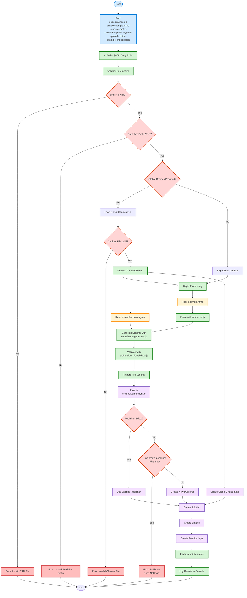
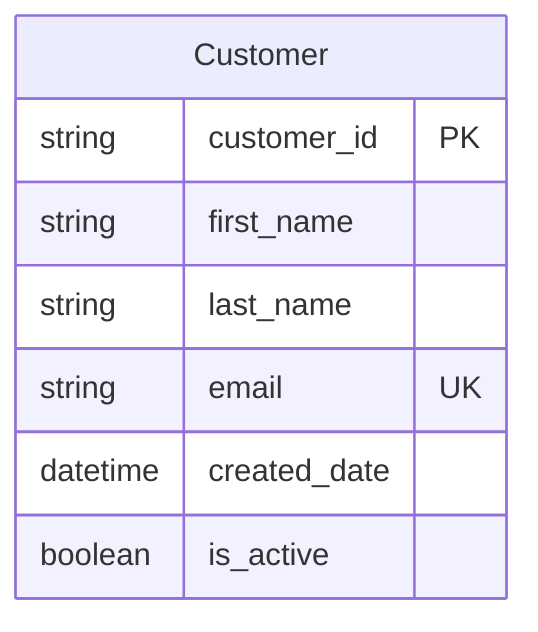
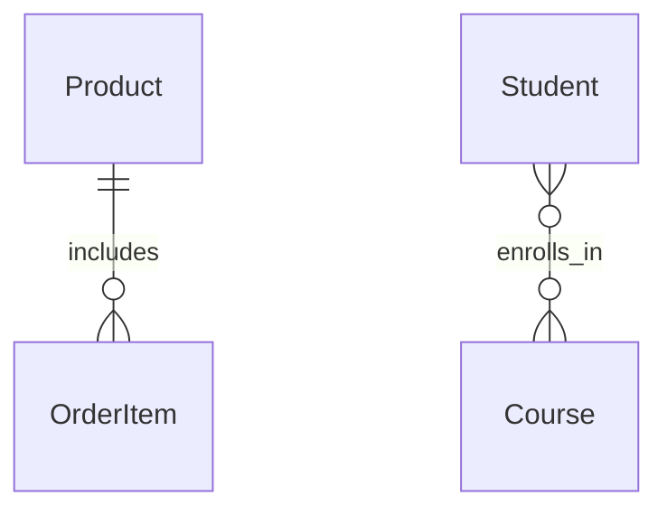

# Mermaid to Dataverse Deployment Guide

This guide explains how to use the Mermaid to Dataverse converter and deployment scripts to provision Microsoft Dataverse solutions, tables, columns, relationships, and global choices directly from a Mermaid entity-relationship diagram.

## Prerequisites

* Node.js installed (v14 or later)
* `.env` file with Dataverse API credentials - automated setup will take of that for you
* Mermaid diagram file (`.mmd` extension) containing an ER diagram

### Environment Variables

Ensure your `.env` file has the following values:

```properties
DATAVERSE_URL=https://your-org.crm.dynamics.com
CLIENT_ID=your-client-id
CLIENT_SECRET=your-client-secret
TENANT_ID=your-tenant-id
```

You can create different `.env` files for different environments:

* `.env.dev` - Development environment
* `.env.test` - Test environment
* `.env.prod` - Production environment

Load a specific environment:

```bash
cp .env.dev .env
npm start convert -- -i my-erd.mmd --solution MyProjectSolution
```

## Quick Start

1. **Install dependencies**:

   ```bash
   npm install
   ```

2. **Configure authentication** (see [Entra ID Setup Guide](entra-id-setup.md))

3. **Validate your ERD**:

   ```bash
   npm start validate -- -i your-erd-file.mmd
   ```

4. **Preview conversion**:

   ```bash
   npm start convert -- -i your-erd-file.mmd --dry-run
   ```

5. **Create entities in Dataverse**:

   ```bash
   npm start convert -- -i your-erd-file.mmd --solution MyProjectSolution
   ```

## Deployment Options

### Option 1: Interactive Deployment (Recommended)

The easiest way to deploy is using the interactive `create` command:

```bash
node src/index.js create path/to/your-erd.mmd
```

Or using the npm script:

```bash
npm run create
```

Then provide the path to your Mermaid file when prompted.

This interactive mode will:

1. Prompt for a solution name (e.g., "Customer Management")
2. Prompt for a publisher prefix (default: "mmd")
3. Ask if you want to include global choice sets
4. Prompt for a location of your global choice .json file
5. Show a configuration summary
6. Deploy the entire solution to Dataverse

### Option 2: Non-Interactive CLI Deployment

For automation or scripted deployments, use the non-interactive mode with all parameters specified:

```bash
node src/index.js create path/to/your-erd.mmd --non-interactive --publisher-prefix myprefix --global-choices path/to/choices.json
```

**Parameters:**

* `--publisher-prefix <prefix>`: Publisher prefix to use (default: 'mmd')
* `--global-choices <file>`: Path to global choices JSON file
* `--non-interactive`: Run without prompts (required for automation)
* `--verbose`: Enable detailed logging
* `--dry-run`: Preview without creating anything in Dataverse



### Option 3: Convert Command

For more traditional command-line usage:

```bash
node src/index.js convert -i path/to/your-erd.mmd -s "Solution Name" --publisher-prefix myprefix
```

**Parameters:**

* `-i, --input <file>`: Path to the Mermaid diagram file (required)
* `-s, --solution <name>`: Solution name to create entities in (required)
* `--publisher-prefix <prefix>`: Custom publisher prefix (default: 'mmd')
* `--global-choices <file>`: Path to global choices JSON file
* `--verbose`: Show detailed output
* `--dry-run`: Preview without creating

```bash
# Interactive mode
node src/index.js create examples/event-erd.mmd

# Preview without creating
node src/index.js create examples/event-erd.mmd --dry-run

# Shortcut for interactive mode
npm run create
```

This will:

1. Prompt for solution name
2. Prompt for publisher prefix
3. Ask if you want to include global choice sets and their location
4. Show configuration summary
5. Create the solution in Dataverse

## What Happens During Deployment

1. Parses the Mermaid diagram
2. Converts it to a Dataverse schema
3. Creates a solution with the specified publisher prefix
4. Creates tables, columns, relationships, and global choice sets
5. Adds all components to the solution

## Global Choice Sets

Global choice sets are defined in separate JSON files. Read more in the [GLOBAL CHOICES GUIDE](docs/GLOBAL-CHOICES-GUIDE.md).


## Supported Mermaid Syntax

### Entity Example



### Supported Data Types

All column types are supported except

-  `Choice` (isn't supported by Mermaid). However, you can define the global choices with a json definition, so taht the choice gets created in the environment and associated with yor solution. This allows you to manually create a choice column that can then sync with your already created global choice. 
-   `Lookup` (also not supported by Mermaid). Your relationship though will be created automatically as defined in the Mermaid diagram abd you can later manually create your Lookup column

### Examples



## CLI Commands Reference

### Create Command (Interactive)

```bash
# Direct command
node src/index.js create [erdFile]

# Using npm script
npm run create
```

**Options:**
- `--publisher-prefix <prefix>` - Custom publisher prefix (default: mmd)
- `--global-choices <file>` - Path to JSON file with global choice sets
- `--dry-run` - Preview without creating
- `--non-interactive` - Run without prompts (for automation)
- `--verbose` - Show detailed output

### Convert Command

```bash
node src/index.js convert -i file.mmd -s "Solution Name" [options]
```

**Options:**
- `-i, --input <file>` - Input Mermaid ERD file path (required)
- `-s, --solution <name>` - Solution name (required)
- `-o, --output <file>` - Output JSON schema file (optional)
- `--dry-run` - Preview without creating
- `--verbose` - Show detailed output
- `--publisher-prefix <prefix>` - Custom publisher prefix (default: mmd)
- `--global-choices <file>` - Path to JSON file with global choice sets
- `--list-publishers` - List available publishers
- `--no-create-publisher` - Don't create publisher if missing

### Publishers Command

```bash
# List publishers in your Dataverse environment
node src/index.js publishers

# Or using npm script
npm run publishers
```

### Using npm Scripts

For convenience, you can use the npm scripts with the standard npm run syntax:

```bash
npm run create      # Interactive create command
npm run convert -- -i file.mmd -s "Solution Name"  # Convert command
npm run publishers  # List publishers
npm run cleanup     # Clean temporary files
```

## Best Practices

* Use dry run to preview
* Use `snake_case` for columns
* Use `is_`/`has_` for booleans
* Use `_date`/`_time` suffixes
* Keep diagrams in source control
* Backup before creating
* Use `--verbose` to monitor


## Relationship Behavior

By default, relationships are **referential (lookup)**. This prevents cascade delete conflicts.

* Safe by default
* Manual editing required for cascade delete
* [Read more](docs/RELATIONSHIP_TYPES.md)

## Validation Features

* Detects self-references
* Ensures primary keys exist
* Warns on orphaned entities
* Validates syntax

### Validation Example

```
🔍 Validating ERD structure...
✅ All entities have primary keys
✅ No self-references detected
ℹ️ All relationships will be created as referential (lookup) by default
✅ Validation completed successfully
```

## Example Files

The `examples/` folder contains several ready-to-use samples:

### Mermaid ERD Examples
* `event-erd.mmd` - Event management with venues, events, and attendees
* `crm-solution.mmd` - Customer relationship management with companies, contacts, and activities
* `department-employee.mmd` - Simple department and employee relationship example
* `simple-sales.mmd` - Basic sales tracking with customers, orders, and products

### Global Choice Examples
* `crm-choices.json` - Global choice sets for the CRM solution
* `global-choices.json` - Example of team assignment and other global choice sets

## Getting Help

1. Run `npm start config`
2. Validate your ERD
3. Use `--verbose`
4. Try a working example first

## Running Tests

To validate the codebase functionality:

```bash
npm test
```

This runs the test suite for the parser and schema generator components.

