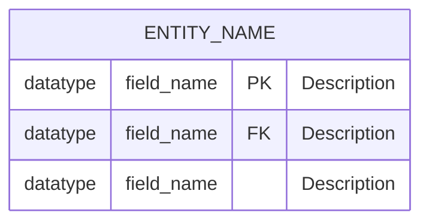
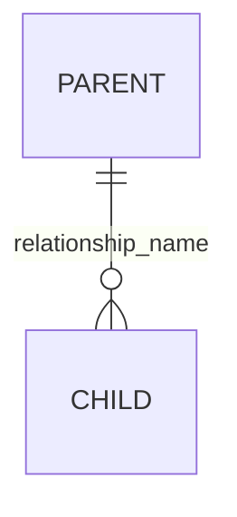
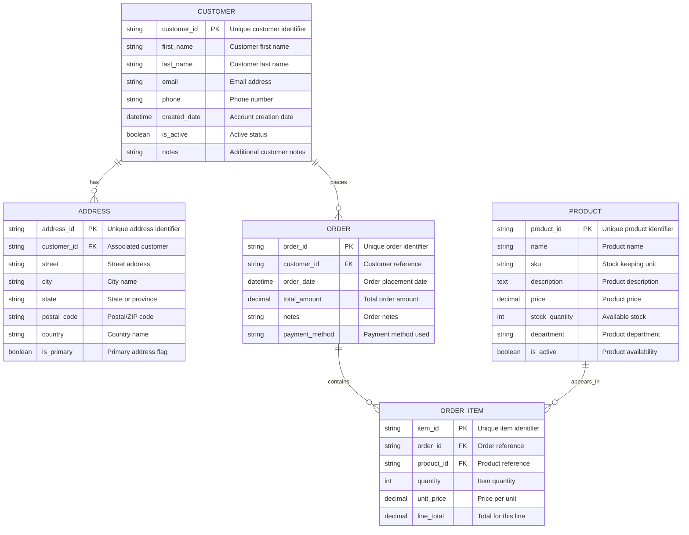
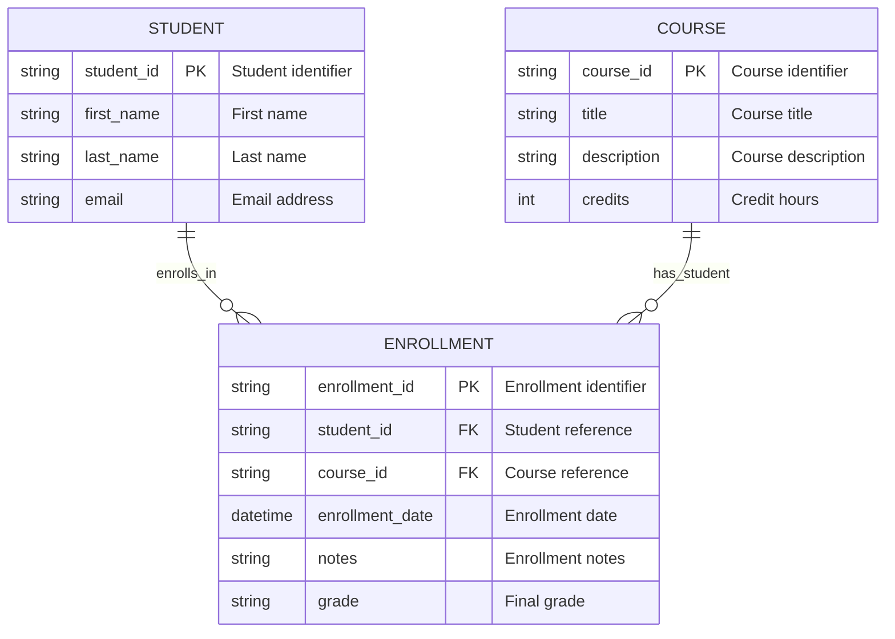
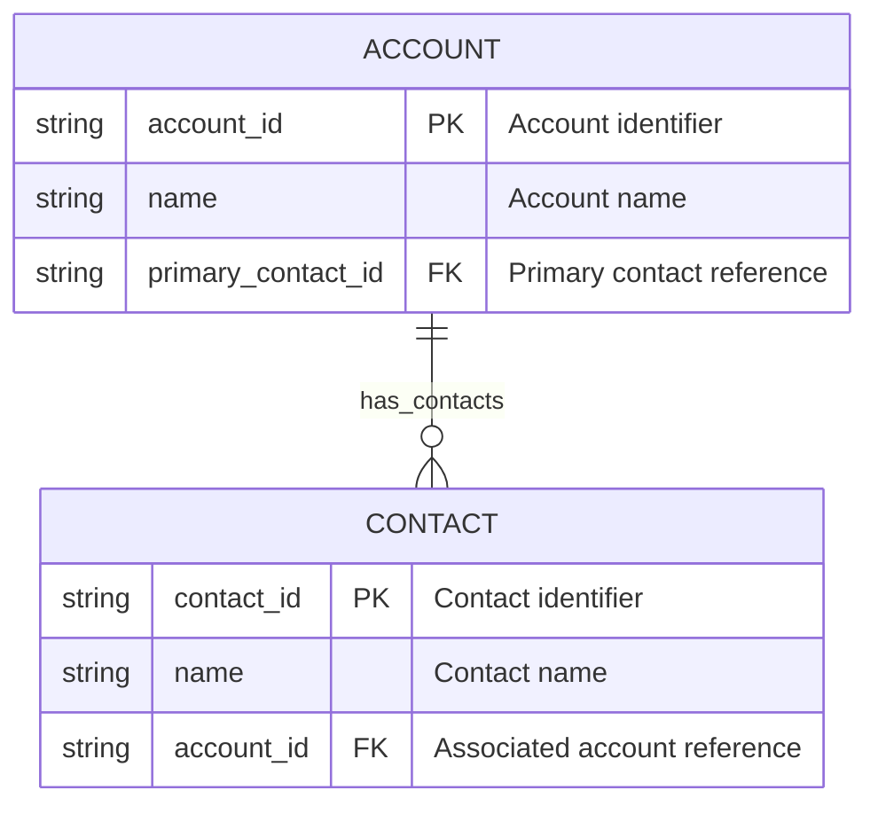

# Mermaid ERD Guide for Dataverse

## Overview

This guide explains how to create Mermaid Entity Relationship Diagrams (ERDs) that work optimally with the Mermaid to Dataverse web application. Learn the syntax, best practices, and advanced features to create professional data models.

## Basic Mermaid ERD Syntax

### Entity Definition



**Key Components:**
- **ENTITY_NAME**: Use UPPERCASE for entity names
- **datatype**: Specify the field data type (see supported types below)
- **field_name**: Use lowercase with underscores for field names
- **PK**: Primary Key marker
- **FK**: Foreign Key marker
- **"Description"**: Optional field description in quotes

### Supported Data Types

| Mermaid Type | Dataverse Type | Description |
|--------------|----------------|-------------|
| `string` | Single Line of Text | Text up to 4,000 characters |
| `text` | Multiple Lines of Text | Large text fields |
| `int` | Whole Number | Integer values |
| `decimal` | Decimal Number | Numbers with decimal places |
| `boolean` | Two Options (Yes/No) | True/false values |
| `datetime` | Date and Time | Date and time values |
| `date` | Date Only | Date without time |

> **Note**: Choice columns (picklists) cannot be defined in Mermaid ERD syntax. They should be added manually after entity creation or configured as global choice sets.

### Relationships



**Supported Relationship Types:**
- `||--o{` : One-to-many (creates lookup relationship)
- All relationships are created as referential (lookup) relationships by default

## Complete Example



## Many-to-Many Relationships

Since Dataverse doesn't support direct many-to-many relationships through the web application, use junction entities. **This is actually considered a best practice** in database design as it provides better control, performance, and flexibility compared to native many-to-many relationships.

**Why Junction Tables are Recommended:**
- **Additional Attributes**: Store relationship-specific data (dates, quantities, statuses)
- **Better Performance**: More efficient queries and indexing
- **Explicit Control**: Clear understanding of the relationship structure
- **Future-Proof**: Easier to extend and modify relationships
- **Dataverse Optimized**: Works seamlessly with Dataverse's lookup relationship model



## Choice Fields (Post-Creation Configuration)

Choice fields provide predefined options for users but **cannot be defined in Mermaid ERD syntax**. They must be configured after entity creation.

## Lookup Fields

Lookup relationships are created automatically through foreign key (FK) relationships in your ERD:



> **Note**: The application automatically creates lookup relationships based on FK fields and relationship definitions. You don't need special syntax beyond marking fields as FK.

## Best Practices

### 2. **Field Descriptions**
- Always include descriptions in quotes
- Be clear and concise
- Explain the purpose, not just repeat the field name
- Good: `"Customer's preferred contact method"`
- Poor: `"Contact method"`

### 4. **Relationships**
- Keep relationship names descriptive
- Use present tense verbs ("has", "contains", "manages")
- Model many-to-many as junction entities with additional attributes

## Advanced Features

### Audit Fields Pattern
```mermaid
ENTITY {
    string entity_id PK "Unique identifier"
    string name "Entity name"
    datetime created_date "Creation timestamp"
    datetime modified_date "Last modification timestamp"
    string created_by_id FK "Created by user reference"
    string modified_by_id FK "Modified by user reference"
    boolean is_active "Active status"
}
```

### Address Pattern
```mermaid
ADDRESS {
    string address_id PK "Address identifier"
    string street_1 "Street address line 1"
    string street_2 "Street address line 2"
    string city "City name"
    string state_province "State or province"
    string postal_code "Postal or ZIP code"
    string country "Country name"
    string address_label "Address label or description"
    boolean is_primary "Primary address flag"
}
```

### Contact Information Pattern
```mermaid
CONTACT_INFO {
    string contact_label "Label or description for contact method"
    string value "Contact value"
    boolean is_primary "Primary contact flag"
    boolean is_active "Active status"
}
```

## Validation and Testing

Before using your ERD with the web application:

1. **Check Syntax**: Ensure proper Mermaid syntax
2. **Validate Relationships**: Verify all FK references exist
3. **Review Data Types**: Confirm appropriate types for each field
4. **Test Relationships**: Ensure relationships make business sense
5. **Consider Scale**: Think about performance with large datasets

This guide provides the foundation for creating effective Mermaid ERDs that work seamlessly with the Dataverse web application. Start with simple examples and gradually add complexity as you become more comfortable with the syntax and patterns.
