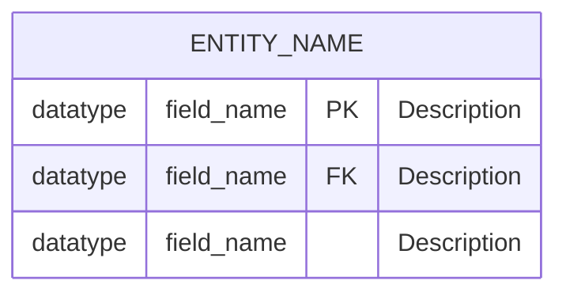
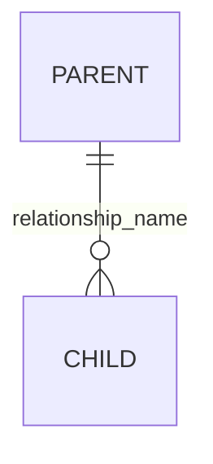
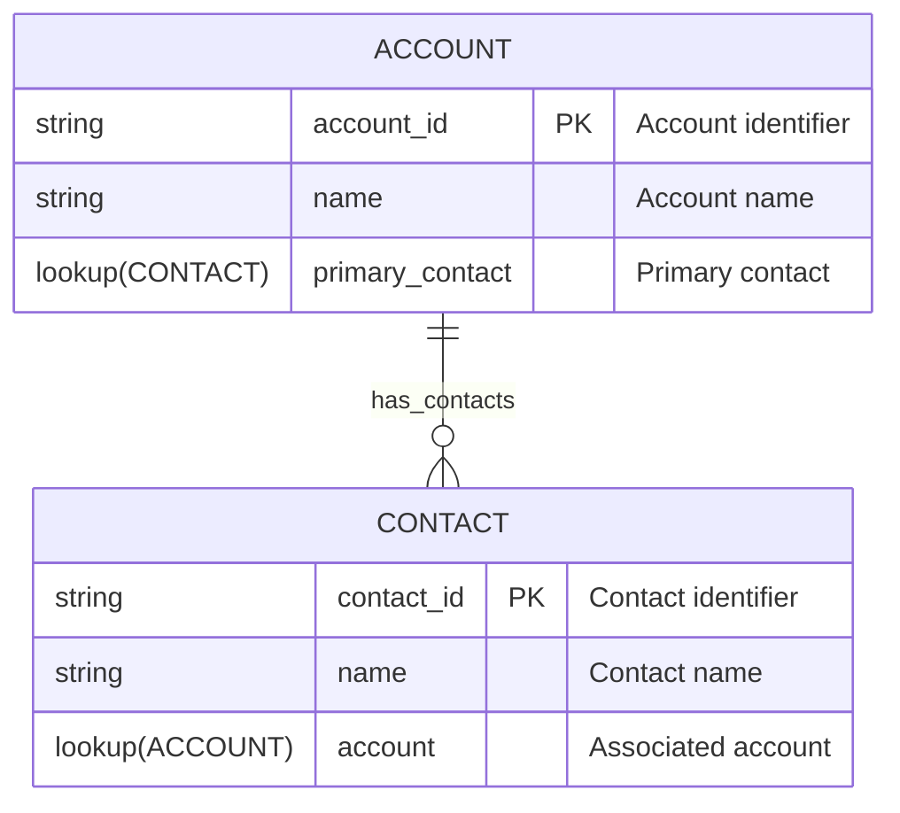
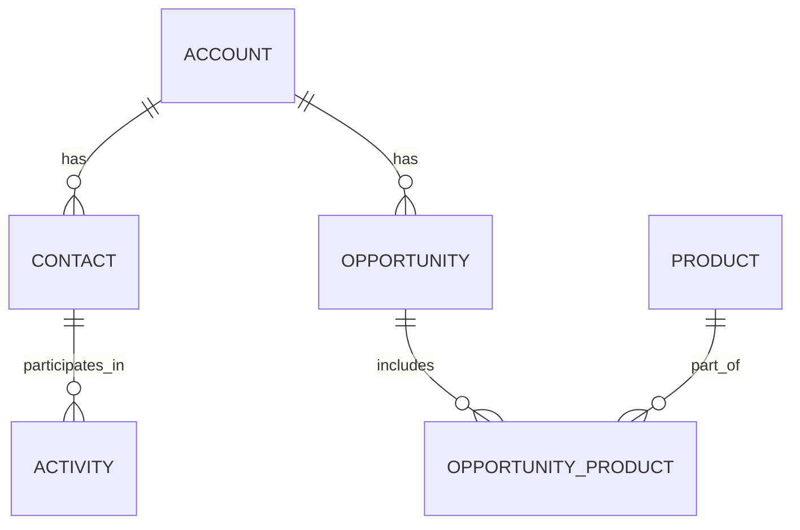
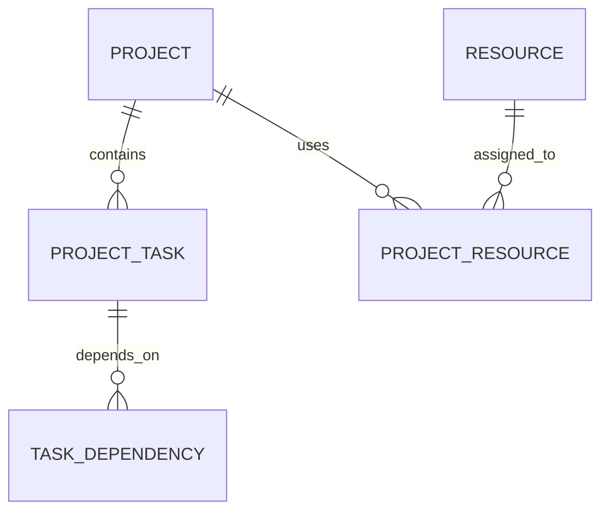
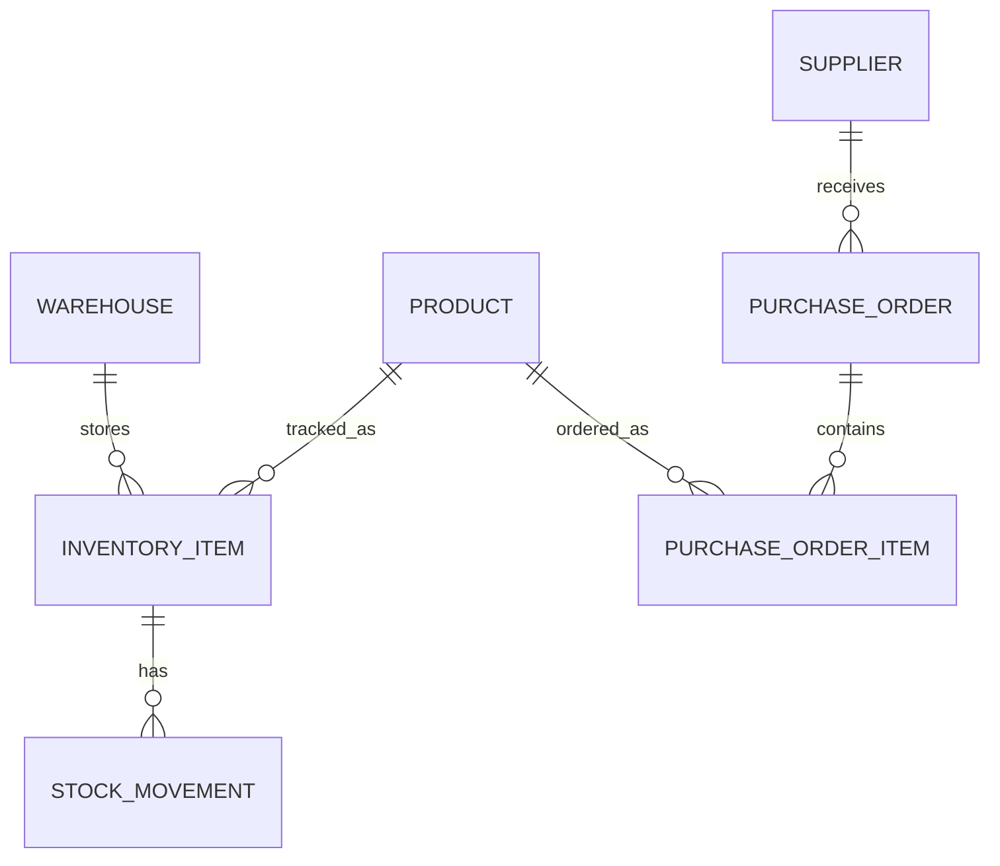

# Mermaid ERD Guide for Dataverse

## Overview

This guide explains how to create Mermaid Entity Relationship Diagrams (ERDs) that work optimally with the Mermaid to Dataverse web application. Learn the syntax, best practices, and advanced features to create professional data models.

## Basic Mermaid ERD Syntax

### Entity Definition



**Key Components:**
- **ENTITY_NAME**: Use UPPERCASE for entity names
- **datatype**: Specify the field data type (see supported types below)
- **field_name**: Use lowercase with underscores for field names
- **PK**: Primary Key marker
- **FK**: Foreign Key marker
- **"Description"**: Optional field description in quotes

### Supported Data Types

| Mermaid Type | Dataverse Type | Description |
|--------------|----------------|-------------|
| `string` | Single Line of Text | Text up to 4,000 characters |
| `text` | Multiple Lines of Text | Large text fields |
| `int` | Whole Number | Integer values |
| `decimal` | Decimal Number | Numbers with decimal places |
| `boolean` | Two Options (Yes/No) | True/false values |
| `datetime` | Date and Time | Date and time values |
| `date` | Date Only | Date without time |
| `lookup(ENTITY)` | Lookup | Reference to another entity |
| `choice(opt1,opt2,opt3)` | Choice | Predefined options |

### Relationships



**Supported Relationship Types:**
- `||--o{` : One-to-many (creates lookup relationship)
- All relationships are created as referential (lookup) relationships by default

## Complete Example

```mermaid
erDiagram
    CUSTOMER {
        string customer_id PK "Unique customer identifier"
        string first_name "Customer first name"
        string last_name "Customer last name"
        string email "Email address"
        string phone "Phone number"
        datetime created_date "Account creation date"
        boolean is_active "Active status"
        choice(individual,business,partner) customer_type "Type of customer"
    }
    
    ADDRESS {
        string address_id PK "Unique address identifier"
        string customer_id FK "Associated customer"
        string street "Street address"
        string city "City name"
        string state "State or province"
        string postal_code "Postal/ZIP code"
        string country "Country name"
        boolean is_primary "Primary address flag"
    }
    
    ORDER {
        string order_id PK "Unique order identifier"
        string customer_id FK "Customer reference"
        datetime order_date "Order placement date"
        decimal total_amount "Total order amount"
        choice(pending,processing,shipped,delivered,cancelled) status "Order status"
        string payment_method "Payment method used"
    }
    
    ORDER_ITEM {
        string item_id PK "Unique item identifier"
        string order_id FK "Order reference"
        string product_id FK "Product reference"
        int quantity "Item quantity"
        decimal unit_price "Price per unit"
        decimal line_total "Total for this line"
    }
    
    PRODUCT {
        string product_id PK "Unique product identifier"
        string name "Product name"
        string sku "Stock keeping unit"
        text description "Product description"
        decimal price "Product price"
        int stock_quantity "Available stock"
        choice(electronics,clothing,books,home) category "Product category"
        boolean is_active "Product availability"
    }
    
    CUSTOMER ||--o{ ADDRESS : "has"
    CUSTOMER ||--o{ ORDER : "places"
    ORDER ||--o{ ORDER_ITEM : "contains"
    PRODUCT ||--o{ ORDER_ITEM : "appears_in"
```

## Many-to-Many Relationships

Since Dataverse doesn't support direct many-to-many relationships through the web application, use junction entities. **This is actually considered a best practice** in database design as it provides better control, performance, and flexibility compared to native many-to-many relationships.

**Why Junction Tables are Recommended:**
- **Additional Attributes**: Store relationship-specific data (dates, quantities, statuses)
- **Better Performance**: More efficient queries and indexing
- **Explicit Control**: Clear understanding of the relationship structure
- **Future-Proof**: Easier to extend and modify relationships
- **Dataverse Optimized**: Works seamlessly with Dataverse's lookup relationship model

```mermaid
erDiagram
    STUDENT {
        string student_id PK "Student identifier"
        string first_name "First name"
        string last_name "Last name"
        string email "Email address"
    }
    
    COURSE {
        string course_id PK "Course identifier"
        string title "Course title"
        string description "Course description"
        int credits "Credit hours"
    }
    
    ENROLLMENT {
        string enrollment_id PK "Enrollment identifier"
        string student_id FK "Student reference"
        string course_id FK "Course reference"
        datetime enrollment_date "Enrollment date"
        choice(enrolled,completed,dropped,failed) status "Enrollment status"
        string grade "Final grade"
    }
    
    STUDENT ||--o{ ENROLLMENT : "enrolls_in"
    COURSE ||--o{ ENROLLMENT : "has_student"
```

## Choice Fields

Choice fields provide predefined options for users:

### Simple Choices
```mermaid
ENTITY {
    choice(option1,option2,option3) field_name "Description"
}
```

### Real-World Choice Examples
```mermaid
CONTACT {
    choice(mr,mrs,ms,dr,prof) title "Title prefix"
    choice(email,phone,mail,sms) preferred_contact "Preferred contact method"
    choice(hot,warm,cold) lead_temperature "Lead temperature"
    choice(new,qualified,proposal,negotiation,closed_won,closed_lost) opportunity_stage "Sales stage"
}
```

## Lookup Fields

Reference other entities using lookup fields:



## Best Practices

### 1. **Naming Conventions**
- **Entities**: Use UPPERCASE with descriptive names (CUSTOMER, ORDER, PRODUCT)
- **Fields**: Use lowercase with underscores (first_name, order_date, total_amount)
- **Primary Keys**: End with "_id" (customer_id, order_id)
- **Foreign Keys**: Match the referenced primary key name

### 2. **Field Descriptions**
- Always include descriptions in quotes
- Be clear and concise
- Explain the purpose, not just repeat the field name
- Good: `"Customer's preferred contact method"`
- Poor: `"Contact method"`

### 3. **Data Types**
- Choose appropriate data types for your data
- Use `text` for long descriptions, `string` for short text
- Use `decimal` for currency and precise numbers
- Use `choice` fields for predefined options
- Use `boolean` for yes/no scenarios

### 4. **Relationships**
- Keep relationship names descriptive
- Use present tense verbs ("has", "contains", "manages")
- Model many-to-many as junction entities with additional attributes

### 5. **Entity Design**
- Include all necessary fields for your business logic
- Consider adding audit fields (created_date, modified_date)
- Add status or flag fields for business processes
- Plan for extensibility

## Advanced Features

### Audit Fields Pattern
```mermaid
ENTITY {
    string entity_id PK "Unique identifier"
    string name "Entity name"
    datetime created_date "Creation timestamp"
    datetime modified_date "Last modification timestamp"
    lookup(USER) created_by "Created by user"
    lookup(USER) modified_by "Modified by user"
    boolean is_active "Active status"
}
```

### Address Pattern
```mermaid
ADDRESS {
    string address_id PK "Address identifier"
    string street_1 "Street address line 1"
    string street_2 "Street address line 2"
    string city "City name"
    string state_province "State or province"
    string postal_code "Postal or ZIP code"
    string country "Country name"
    choice(billing,shipping,mailing,office) address_type "Address type"
    boolean is_primary "Primary address flag"
}
```

### Contact Information Pattern
```mermaid
CONTACT_INFO {
    choice(email,phone,fax,mobile,website) contact_type "Type of contact"
    string value "Contact value"
    boolean is_primary "Primary contact flag"
    boolean is_active "Active status"
}
```

## Common Patterns

### 1. **Customer Relationship Management**


### 2. **Project Management**


### 3. **Inventory Management**


## Validation and Testing

Before using your ERD with the web application:

1. **Check Syntax**: Ensure proper Mermaid syntax
2. **Validate Relationships**: Verify all FK references exist
3. **Review Data Types**: Confirm appropriate types for each field
4. **Test Relationships**: Ensure relationships make business sense
5. **Consider Scale**: Think about performance with large datasets

## Troubleshooting

### Common Issues

**Entity not created:**
- Check entity name format (UPPERCASE, no spaces)
- Verify all required fields are present
- Ensure primary key is defined

**Relationship errors:**
- Confirm both entities exist in the diagram
- Check foreign key field names match primary keys
- Verify relationship syntax

**Field creation issues:**
- Validate data type spelling
- Check field name format (lowercase, underscores)
- Ensure choice options are properly formatted

**Choice field problems:**
- Use parentheses and commas: `choice(opt1,opt2,opt3)`
- No spaces around commas
- Keep option names simple

This guide provides the foundation for creating effective Mermaid ERDs that work seamlessly with the Dataverse web application. Start with simple examples and gradually add complexity as you become more comfortable with the syntax and patterns.
