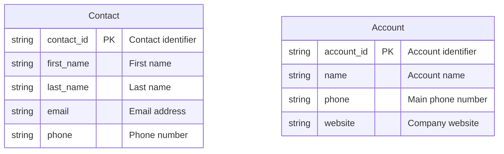
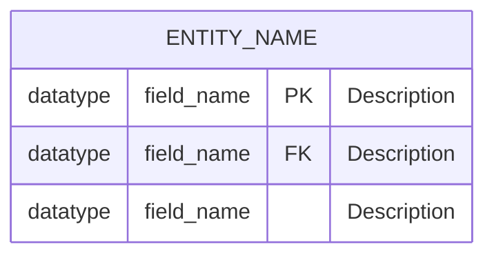
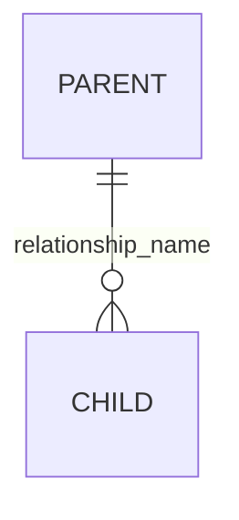
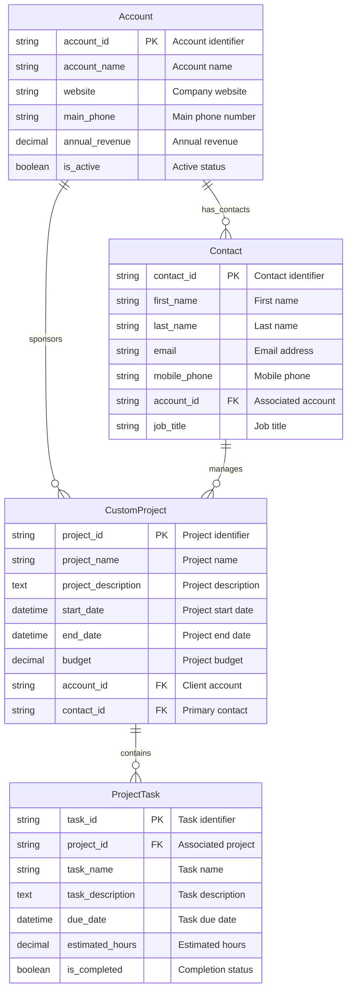
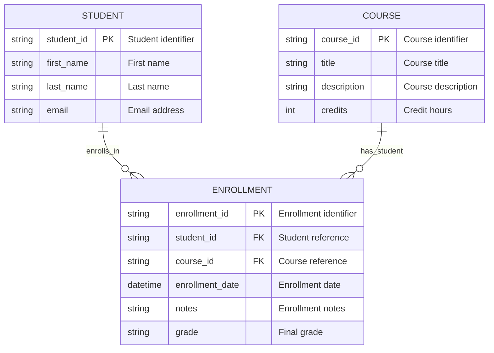
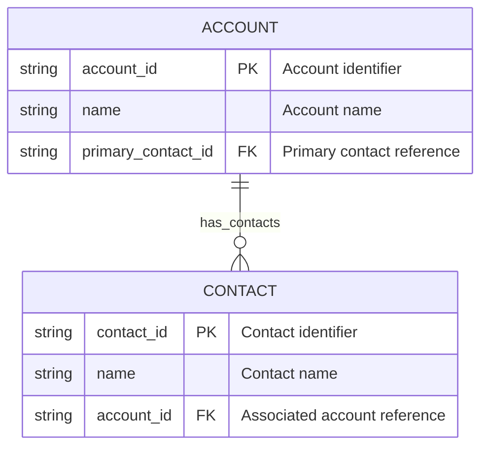

# Mermaid ERD Guide for Dataverse

## Overview

This guide explains how to create Mermaid Entity Relationship Diagrams (ERDs) that work optimally with the modern React-based Mermaid to Dataverse application. Learn the syntax, best practices, automatic validations, and Common Data Model (CDM) integration features.

## Smart Validation & Auto-Corrections

The React application includes intelligent validation that automatically detects and helps fix common issues:

### Common Data Model (CDM) Detection
The system automatically identifies entities that match Microsoft's Common Data Model:

**What it detects:**
- **Exact matches**: Entity names like `Contact`, `Account`, `Lead` that match CDM entities
- **Attribute matching**: Compares your entity attributes with CDM entity schemas
- **Smart suggestions**: Recommends using CDM entities when appropriate

**Benefits of using CDM entities:**
- Pre-built relationships and attributes
- Standard business logic and workflows
- Better Power Platform integration
- Consistent data model across organizations

**Example with CDM detection:**


> **🎯 Smart Detection**: The system will identify these as CDM entities and offer to use the existing `contact` and `account` entities instead of creating custom ones.

### Primary Column Validation
Dataverse automatically creates a primary name column for each entity. The validator detects conflicts:

**Problem detected:**

```bash
erDiagram
    Customer {
        string customer_id PK "Customer identifier"
        string name "Customer name"  
        string email "Email address"
    }
```
> Note: The `name` column may conflict with auto-generated primary column naming.

**Auto-suggested fix:**
```bash
erDiagram
    Customer {
        string customer_id PK "Customer identifier"
        string name "Customer name"
        string email "Email address"
    }
```

> Note: Renamed to avoid conflict

### 🚫 **Status Column Handling**
Dataverse has built-in status management via `statecode` and `statuscode`. Status columns are automatically ignored:

**Original ERD:**
```bash
erDiagram
    Order {
        string order_id PK "Order identifier"
        decimal total_amount "Order total"
        string status "Order status"
    }

```
Note: Removed inline comment to avoid parse error.

**System behavior:**
- Status columns are automatically filtered out during entity creation
- Built-in Dataverse status fields (Active/Inactive) are used instead
- Suggestion provided to use choice columns for custom status values

### System Column Conflict Detection
Prevents conflicts with Dataverse system columns:

**Detected conflicts:**
- `ownerid` - Conflicts with ownership system
- `statecode` - Conflicts with built-in status
- `statuscode` - Conflicts with built-in status reason

**Auto-suggested renaming pattern:**

```bash
erDiagram
    Task {
        string task_id PK "Task identifier"
        string task_ownerid FK "Task owner reference" 
        string description "Task description"
    }
```

>Note: Prefixed to avoid conflict

## Basic Mermaid ERD Syntax

### Entity Definition



**Key Components:**
- **ENTITY_NAME**: Use UPPERCASE for entity names
- **datatype**: Specify the field data type (see supported types below)
- **field_name**: Use lowercase with underscores for field names
- **PK**: Primary Key marker
- **FK**: Foreign Key marker
- **"Description"**: Optional field description in quotes

### Supported Data Types

The system supports a comprehensive range of Dataverse column types with smart type mapping:

| Mermaid Type | Dataverse Type | Description | Max Length/Precision |
|--------------|----------------|-------------|--------------------|
| **Basic Types** |
| `string` | Single Line of Text | Basic text up to 4,000 characters | 4,000 chars |
| `text` / `memo` / `textarea` | Multiple Lines of Text | Large text fields for descriptions | 1M chars |
| `int` / `integer` | Whole Number | 32-bit integer values | -2,147,483,648 to 2,147,483,647 |
| `decimal` | Decimal Number | Fixed precision decimal numbers | Precision: 2 |
| `money` | Currency | Currency values with formatting | Precision: 2 |
| `boolean` / `bool` | Two Options (Yes/No) | True/false values | N/A |
| `float` / `double` | Floating Point Number | 64-bit floating point numbers | Precision: 5 |
| **Date/Time Types** |
| `datetime` | Date and Time | Full date and time values | N/A |
| `date` / `dateonly` | Date Only | Date without time component | N/A |
| **Communication Types** |
| `email` | Email | Email address with validation | 100 chars |
| `phone` | Phone | Phone number with formatting | 50 chars |
| `url` | URL | Website URL with validation | 200 chars |
| **Specialized Types** |
| `ticker` | Ticker Symbol | Stock ticker symbol | 10 chars |
| `timezone` | Time Zone | Time zone identifier | N/A |
| `language` | Language | Language LCID code | N/A |
| `duration` | Duration | Duration in minutes | N/A |
| `guid` / `uniqueidentifier` | Unique Identifier | GUID values | N/A |
| **File Types** |
| `file` | File | File storage (blob) | N/A |
| `image` | Image | Image blob storage | N/A |

### Smart Type Detection

The system includes intelligent type detection that automatically improves data types based on field names:

**Automatic Email Detection:**
```bash
erDiagram
    Contact {
        string user_email "Email address"
        string contact_email "Contact email"  
    }
```
>Note: Automatically becomes 'email' type

**Automatic Phone Detection:**
```bash
erDiagram
    Contact {
        string mobile_phone "Mobile number" 
        string office_tel "Office telephone"  
    }
```
> Note: Automatically becomes 'phone' type

**Automatic URL Detection:**
```bash
erDiagram
    Company {
        string website_url "Company website" 
        string homepage "Company homepage"
    }
```

> Note: Automatically becomes 'url' type

### Type Aliases

Multiple Mermaid type names map to the same Dataverse type for flexibility:

- **Text**: `text`, `memo`, `textarea` → Multiple Lines of Text
- **Numbers**: `int`, `integer` → Whole Number
- **Boolean**: `boolean`, `bool` → Two Options
- **Floating Point**: `float`, `double`, `floatingpoint` → Floating Point Number
- **Date**: `date`, `dateonly` → Date Only
- **GUID**: `guid`, `uniqueidentifier` → Unique Identifier

### Complete Example with All Data Types

```bash
erDiagram
    DataTypeShowcase {
        string showcase_id PK "Primary identifier"
        string display_name "Display name (auto-detected as primary name column)"
        text long_description "Multi-line description"
        email contact_email "Email address (auto-detected)"
        phone mobile_phone "Phone number (auto-detected)"
        url website_url "Website URL (auto-detected)"
        ticker stock_symbol "Stock ticker symbol"
        datetime created_date "Date and time created"
        dateonly birth_date "Date of birth"
        timezone user_timezone "User's time zone"
        language preferred_language "Preferred language LCID"
        int quantity "Whole number quantity"
        float rating "Floating point rating"
        decimal price "Fixed precision price"
        money annual_revenue "Currency value"
        boolean is_active "Yes/No active status"
        duration session_duration "Duration in minutes"
        file attachment "File storage"
        image profile_picture "Image storage"
        guid external_id "Unique identifier from external system"
    }
```

> **Pro Tip**: Use descriptive field names that include type hints (email, phone, url, etc.) to leverage automatic type detection and get the most appropriate Dataverse column types.

### Relationships



**Supported Relationship Types:**
- `||--o{` : One-to-many (creates lookup relationship)
- All relationships are created as referential (lookup) relationships by default

## Complete Example with CDM Integration



**Smart Processing Results:**
- **CDM Detection**: `Account` and `Contact` detected as CDM entities
- **User Choice**: Option to use existing CDM entities or create custom ones
- **Auto-Corrections**: No naming conflicts detected
- **Relationships**: All maintained between CDM and custom entities
- **Result**: Optimal mix of standard CDM entities with custom project management entities

## Many-to-Many Relationships

Since Dataverse doesn't support direct many-to-many relationships through the web application, use junction entities. **This is actually considered a best practice** in database design as it provides better control, performance, and flexibility compared to native many-to-many relationships.

**Why Junction Tables are Recommended:**
- **Additional Attributes**: Store relationship-specific data (dates, quantities, statuses)
- **Better Performance**: More efficient queries and indexing
- **Explicit Control**: Clear understanding of the relationship structure
- **Future-Proof**: Easier to extend and modify relationships
- **Dataverse Optimized**: Works seamlessly with Dataverse's lookup relationship model




## Lookup Fields

Lookup relationships are created automatically through foreign key (FK) relationships in your ERD:



> **Note**: The application automatically creates lookup relationships based on FK fields and relationship definitions. You don't need special syntax beyond marking fields as FK.
