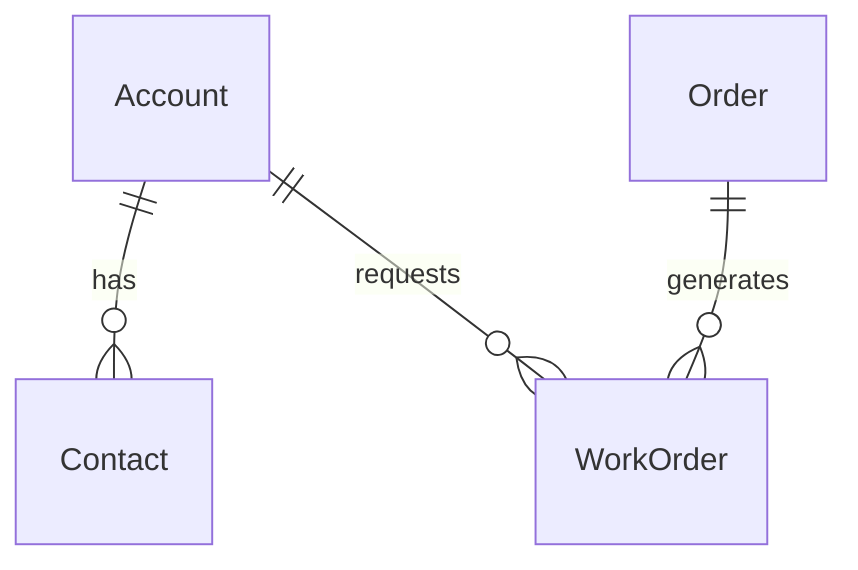
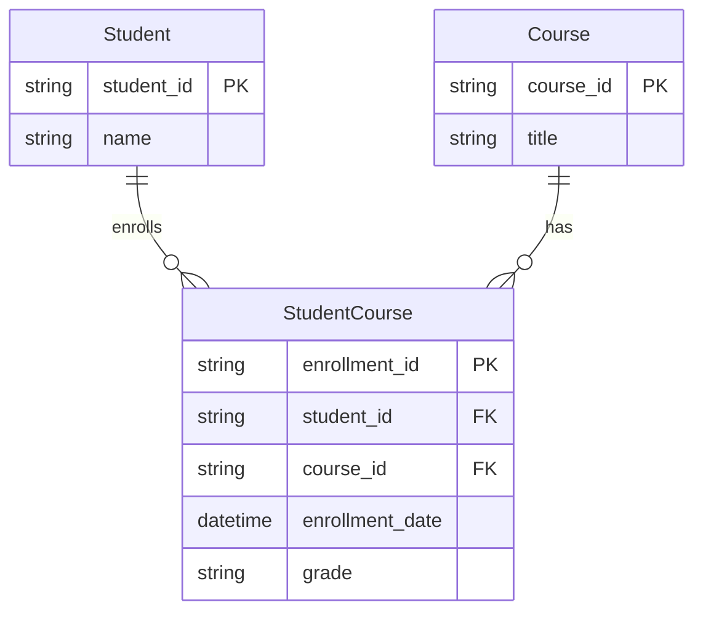

# Relationship Types in Mermaid to Dataverse Conversion

## Overview

When converting Mermaid ERD files to Dataverse entities, this web application automatically creates **referential (lookup) relationships** by default using Dataverse's native lookup relationship behavior. This document explains why this design decision was made and how to customize relationship behavior if needed.

## Default Behavior: Referential Relationships

### What are Referential Relationships?

Referential relationships (also called "lookup relationships") in Dataverse are:
- **Non-owning relationships** where the parent doesn't "own" the child record
- **Default cascade behavior**: When the parent is deleted, the child record remains but loses its reference
- **Multiple allowed**: A child entity can have multiple referential relationships to different parents
- **Safer option**: No risk of cascade delete conflicts or multiple parental relationship errors

The web application creates these relationships using Dataverse's native lookup relationship type, which automatically applies the appropriate non-cascade behavior.

### Why Default to Referential?

Mermaid ERD syntax uses the same notation (`||--o{`) for all one-to-many relationships, regardless of whether they represent:
- **Ownership relationships** (parent owns child, should be parental in Dataverse)
- **Reference relationships** (parent is referenced by child, should be looked up in Dataverse)

Since Mermaid cannot distinguish between these two types, we default to the **safer option** that:
1. **Prevents API errors** - Avoids "multiple parental relationships" conflicts
2. **Ensures successful creation** - All relationships will be created without conflicts
3. **Maintains data integrity** - References are preserved, just without cascade delete
4. **Allows manual enhancement** - Users can upgrade to parental relationships later in Dataverse

### Supported Relationship Types

The web application supports:
- **One-to-many relationships** (`||--o{`): Creates lookup relationships between entities
- **Many-to-many relationships**: Supported through junction entities with two one-to-many relationships

> **Note**: While the native many-to-many syntax (`}o--o{`) is parsed but not automatically implemented, you can easily create many-to-many relationships by designing junction entities in your Mermaid diagram. This is actually the recommended approach for Dataverse and provides more control over the relationship.

## Examples

### Mermaid ERD Syntax

### Resulting Dataverse Relationships
All relationships are created as **referential (lookup)** using Dataverse's default lookup behavior:
- `Account → Contact`: Lookup relationship (Contact can exist without Account)
- `Account → WorkOrder`: Lookup relationship (WorkOrder can exist without Account)  
- `Order → WorkOrder`: Lookup relationship (WorkOrder can exist without Order)

This means:
- No "multiple parental relationships" error for WorkOrder
- All relationships created successfully using standard Dataverse lookup types
- WorkOrder can reference both Account and Order simultaneously
- Deleting Account won't automatically delete related Contacts or WorkOrders
- Manual cleanup may be needed when deleting parent records

### Creating Many-to-Many Relationships

The web application fully supports many-to-many relationships when modeled using junction entities. This approach is actually preferred for Dataverse as it provides better control and flexibility. **Recent improvements include enhanced detection and automatic handling of junction table patterns:**

**Benefits of this approach:**
- **Full Dataverse support**: Creates proper lookup relationships automatically
- **Intelligent detection**: The system automatically identifies junction table patterns and handles them appropriately
- **Primary key optimization**: Junction tables without explicit primary keys are automatically configured with composite keys
- **Additional attributes**: Junction table can store relationship-specific data (like `enrollment_date`, `grade`)
- **Better performance**: More efficient than native Dataverse many-to-many relationships
- **Flexibility**: Easier to modify and extend the relationship structure
- **Autocorrection**: The system can fix common junction table modeling issues automatically

**Real-world examples** from the included sample files:
- `simple-sales.mmd`: ORDER ↔ PRODUCT via ORDER_ITEM junction
- `event-erd.mmd`: EVENT ↔ VOLUNTEER via VOLUNTEER_ASSIGNMENT junction
- `crm-solution.mmd`: OPPORTUNITY ↔ PRODUCT via OPPORTUNITY_PRODUCT junction

### Recent Improvements for Junction Tables

The system now includes enhanced detection and handling for junction table patterns:

**Automatic Junction Table Detection**
- Identifies entities that serve as junction tables based on their relationships and attributes
- Recognizes common patterns like entities with multiple foreign key relationships
- Handles both explicit and implicit junction table definitions

**Smart Primary Key Management**
- Automatically creates composite primary keys for junction tables when no explicit PK is defined
- Converts foreign key columns to primary key + foreign key combinations where appropriate
- Ensures proper indexing and relationship integrity

**Pattern Recognition**
- Detects junction tables with names ending in common patterns (e.g., `EntityEntity`, `Entity_Entity`)
- Handles entities with only foreign key attributes as potential junction tables
- Supports both simple and complex junction table designs with additional attributes

## When You Might Want Parental Relationships

Parental relationships provide stronger data integrity through a cascade of delete behavior. Consider upgrading to parental relationships in Dataverse when:

### Strong Ownership Scenarios
- **Account → Contact**: Account truly "owns" the contact
- **Project → ProjectTask**: Project owns its tasks
- **WorkOrder → WorkOrderProduct**: WorkOrder owns its line items
- **Quote → Order**: Quote generates the order

### Benefits of Parental Relationships
- **Cascade delete**: Deleting parent automatically deletes children
- **Stronger integrity**: Children cannot exist without their parent
- **Better reporting**: Parent-child hierarchies are clearly defined
- **Automatic cleanup**: No orphaned records when parents are deleted

### Limitations of Parental Relationships
- **Only one per entity**: Each entity can have only ONE parental relationship
- **Cascade conflicts**: Can cause circular delete dependencies
- **Less flexible**: Harder to change once established

## Benefits of This Approach

- **Predictable results**: Always creates successfully without relationship conflicts using standard Dataverse lookup types
- **Flexible starting point**: Can be enhanced manually based on business needs
- **Clear expectations**: Users know exactly what type of relationships will be created (standard lookup relationships)
- **Fast iteration**: No need to debug complex relationship hierarchies in ERD
- **Dataverse native**: Uses built-in Dataverse lookup relationship behavior for reliable results

