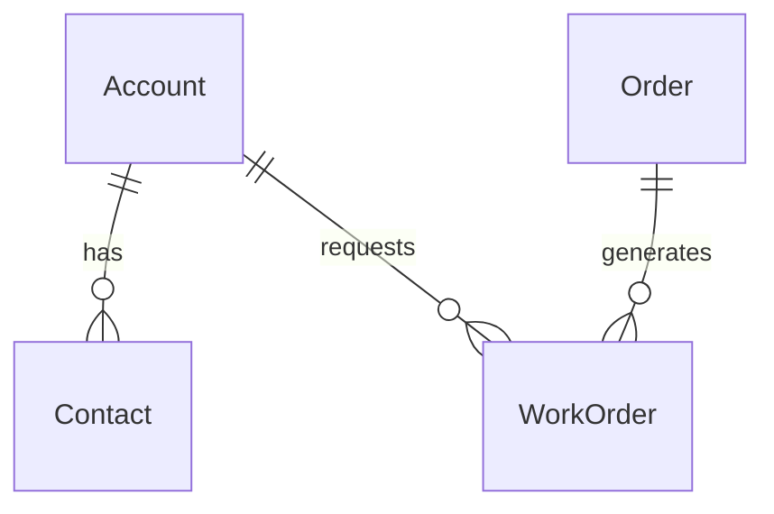

# Relationship Types in Mermaid to Dataverse Conversion

## Overview

When converting Mermaid ERD files to Dataverse entities, this tool automatically creates **referential (lookup) relationships** by default. This document explains why this design decision was made and how to customize relationship behavior if needed.

## Default Behavior: Referential Relationships

### What are Referential Relationships?

Referential relationships (also called "lookup relationships") in Dataverse are:
- **Non-owning relationships** where the parent doesn't "own" the child record
- **Cascade behavior**: `RemoveLink` - when parent is deleted, the child record remains but loses its reference
- **Multiple allowed**: A child entity can have multiple referential relationships to different parents
- **Safer option**: No risk of cascade delete conflicts or multiple parental relationship errors

### Why Default to Referential?

Mermaid ERD syntax uses the same notation (`||--o{`) for all one-to-many relationships, regardless of whether they represent:
- **Ownership relationships** (parent owns child, should be parental in Dataverse)
- **Reference relationships** (parent is referenced by child, should be lookup in Dataverse)

💡 Since Mermaid cannot distinguish between these two types, we default to the **safer option** that:
1. **Prevents API errors** - Avoids "multiple parental relationships" conflicts
2. **Ensures successful creation** - All relationships will be created without conflicts
3. **Maintains data integrity** - References are preserved, just without cascade delete
4. **Allows manual enhancement** - Users can upgrade to parental relationships later in Dataverse

## Examples

### Mermaid ERD Syntax

### Resulting Dataverse Relationships
All relationships are created as **referential (lookup)**:
- `Account → Contact`: Lookup relationship (Contact can exist without Account)
- `Account → WorkOrder`: Lookup relationship (WorkOrder can exist without Account)  
- `Order → WorkOrder`: Lookup relationship (WorkOrder can exist without Order)

This means:
- No "multiple parental relationships" error for WorkOrder
- All relationships created successfully
- WorkOrder can reference both Account and Order simultaneously
- Deleting Account won't automatically delete related Contacts or WorkOrders
- Manual cleanup may be needed when deleting parent records

## When You Might Want Parental Relationships

Parental relationships provide stronger data integrity through cascade delete behavior. Consider upgrading to parental relationships in Dataverse when:

### Strong Ownership Scenarios
- **Account → Contact**: Account truly "owns" the contact
- **Project → ProjectTask**: Project owns its tasks
- **WorkOrder → WorkOrderProduct**: WorkOrder owns its line items
- **Quote → Order**: Quote generates the order

### Benefits of Parental Relationships
- **Cascade delete**: Deleting parent automatically deletes children
- **Stronger integrity**: Children cannot exist without their parent
- **Better reporting**: Parent-child hierarchies are clearly defined
- **Automatic cleanup**: No orphaned records when parents are deleted

### Limitations of Parental Relationships
- **Only one per entity**: Each entity can have only ONE parental relationship
- **Cascade conflicts**: Can cause circular delete dependencies
- **Less flexible**: Harder to change once established

## Benefits of This Approach

- **Predictable results**: Always creates successfully without relationship conflicts
- **Flexible starting point**: Can be enhanced manually based on business needs
- **Clear expectations**: Users know exactly what type of relationships will be created
- **Fast iteration**: No need to debug complex relationship hierarchies in ERD

