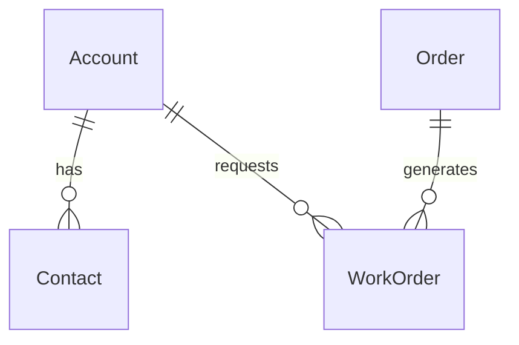

# Relationship Types in Mermaid to Dataverse Conversion

## Overview

When converting Mermaid ERD files to Dataverse entities, this tool automatically creates **referential (lookup) relationships** by default. This document explains why this design decision was made and how to customize relationship behavior if needed.

## Default Behavior: Referential Relationships

### What are Referential Relationships?

Referential relationships (also called "lookup relationships") in Dataverse are:
- **Non-owning relationships** where the parent doesn't "own" the child record
- **Cascade behavior**: `RemoveLink` - when parent is deleted, the child record remains but loses its reference
- **Multiple allowed**: A child entity can have multiple referential relationships to different parents
- **Safer option**: No risk of cascade delete conflicts or multiple parental relationship errors

### Why Default to Referential?

Mermaid ERD syntax uses the same notation (`||--o{`) for all one-to-many relationships, regardless of whether they represent:
- **Ownership relationships** (parent owns child, should be parental in Dataverse)
- **Reference relationships** (parent is referenced by child, should be lookup in Dataverse)

Since Mermaid cannot distinguish between these two types, we default to the **safer option** that:
1. **Prevents API errors** - Avoids "multiple parental relationships" conflicts
2. **Ensures successful creation** - All relationships will be created without conflicts
3. **Maintains data integrity** - References are preserved, just without cascade delete
4. **Allows manual enhancement** - Users can upgrade to parental relationships later in Dataverse

## Examples

### Mermaid ERD Syntax


### Resulting Dataverse Relationships
All relationships are created as **referential (lookup)**:
- `Account → Contact`: Lookup relationship (Contact can exist without Account)
- `Account → WorkOrder`: Lookup relationship (WorkOrder can exist without Account)  
- `Order → WorkOrder`: Lookup relationship (WorkOrder can exist without Order)

This means:
- No "multiple parental relationships" error for WorkOrder
- All relationships created successfully
- WorkOrder can reference both Account and Order simultaneously
- Deleting Account won't automatically delete related Contacts or WorkOrders
- Manual cleanup may be needed when deleting parent records

## When You Might Want Parental Relationships

Parental relationships provide stronger data integrity through cascade delete behavior. Consider upgrading to parental relationships in Dataverse when:

### Strong Ownership Scenarios
- **Account → Contact**: Account truly "owns" the contact
- **Project → ProjectTask**: Project owns its tasks
- **WorkOrder → WorkOrderProduct**: WorkOrder owns its line items
- **Quote → Order**: Quote generates the order

### Benefits of Parental Relationships
- **Cascade delete**: Deleting parent automatically deletes children
- **Stronger integrity**: Children cannot exist without their parent
- **Better reporting**: Parent-child hierarchies are clearly defined
- **Automatic cleanup**: No orphaned records when parents are deleted

### Limitations of Parental Relationships
- **Only one per entity**: Each entity can have only ONE parental relationship
- **Cascade conflicts**: Can cause circular delete dependencies
- **Less flexible**: Harder to change once established

## How to Manually Configure Parental Relationships

After creating your Dataverse solution with this tool, you can manually upgrade specific relationships to parental:

### In Power Platform Admin Center
1. Navigate to **Tables** → Select your entity
2. Go to **Relationships** tab
3. Select the lookup relationship to modify
4. Change **Type of Behavior** from "Referential" to "Parental"
5. Configure cascade delete options as needed

### Key Considerations
- Only upgrade relationships where true ownership exists
- Ensure no circular cascade delete dependencies
- Test thoroughly before deploying to production

## Command Line Options

### Force All Referential (Default)
```bash
node src/index.js create examples/service-core.mmd --verbose
# All relationships created as referential (default behavior)
```

### Explicit All Referential Mode
```bash
node src/index.js create examples/service-core.mmd --all-referential --verbose
# Explicitly force all relationships to be referential (same as default)
```

### Safe Mode (Legacy)
```bash
node src/index.js create examples/service-core.mmd --safe-mode --verbose
# Safe mode also forces all relationships to be referential
```

## Benefits of This Approach

### For Users
- **Predictable results**: Always creates successfully without relationship conflicts
- **Flexible starting point**: Can be enhanced manually based on business needs
- **Clear expectations**: Users know exactly what type of relationships will be created
- **Fast iteration**: No need to debug complex relationship hierarchies in ERD

### For Dataverse
- **API compatibility**: No "multiple parental relationships" errors
- **Clean creation**: All entities and relationships created without conflicts
- **Extensible**: Relationships can be upgraded to parental after creation
- **Recoverable**: Mistakes can be easily corrected

## Migration from Previous Versions

If you were using an earlier version of this tool that attempted to auto-detect parental relationships:

### What Changed
- **Before**: Complex heuristics tried to determine parental vs referential relationships
- **After**: All relationships are referential by default for consistency and reliability

### Migration Steps
1. **Re-run the tool** - Your ERD will now create successfully without relationship conflicts
2. **Review relationships** - Identify which ones should be parental based on your business logic
3. **Manually configure** - Upgrade specific relationships to parental in Dataverse admin
4. **Test thoroughly** - Ensure cascade delete behavior matches your expectations

## Best Practices

### ERD Design
- **Document ownership** - Add comments in your ERD to note intended parental relationships
- **Review relationships** - Consider which relationships represent true ownership
- **Plan hierarchy** - Design your entity hierarchy to minimize circular dependencies

### Post-Creation Configuration
- **Start with referential** - Let the tool create all relationships as referential
- **Identify ownership** - Determine which relationships represent true ownership
- **Upgrade selectively** - Convert only the most critical ownership relationships to parental
- **Test cascade behavior** - Verify cascade delete works as expected

## Conclusion

By defaulting to referential relationships, this tool provides a **reliable foundation** for your Dataverse schema that can be enhanced based on your specific business requirements. This approach eliminates the complexity and unpredictability of trying to auto-detect relationship types from Mermaid ERD syntax, while still providing full flexibility for customization in Dataverse.

The result is a tool that **"just works"** for all ERD designs, letting you focus on your business logic rather than debugging relationship conflicts.
