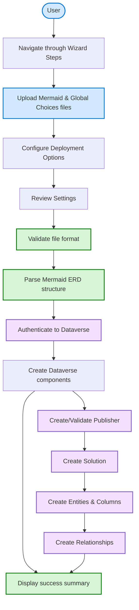
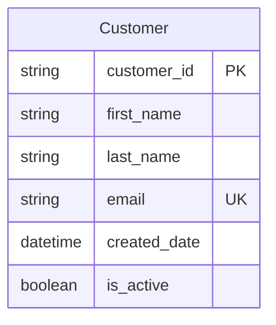
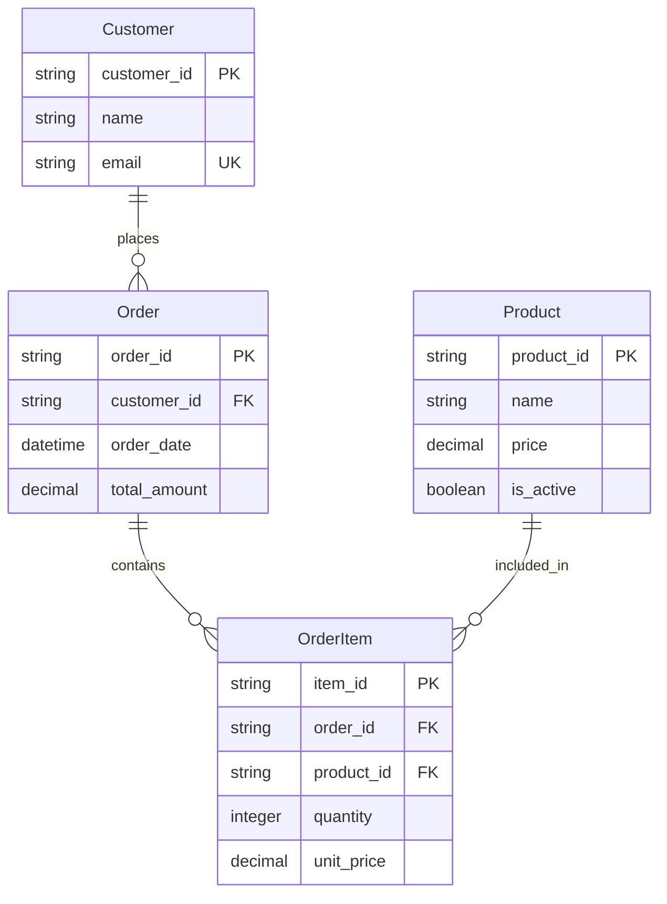

# Usage Guide

This guide explains how to use the Mermaid to Dataverse web application to transform Mermaid entity-relationship diagrams into Microsoft Dataverse solutions, tables, columns, and relationships.

## Getting Started

### 1. Initial Setup

Before using the application, you need to deploy it to Azure. See [Deployment](DEPLOYMENT.md) for details.

### 2. Prerequisites

* **Mermaid ERD file** (`.mmd` extension) with valid ER diagram syntax  
* **Dataverse environment** with admin access
* **Global Choices file** (optional) - JSON file with choice definitions if needed

## Overview

The application provides a **step-by-step wizard interface** for uploading Mermaid ERD files and automatically creating corresponding Dataverse entities. Once deployed, everything runs in your browser: https://your-app-name.azurewebsites.net/wizard

## 1. Use the Step-by-Step Wizard

1. **ERD Validation & Upload**:
   - Upload your Mermaid ERD file (`.mmd` extension)
   - Review the parsed entities and relationships
   - Click "Next" to proceed

2. **Solution & Publisher Setup**:
   - **Solution Name**: Name for your Dataverse solution (e.g., "Customer Management")
   - **Publisher Prefix**: 3-8 character prefix (e.g., "cmgt")
   - **Publisher Options**: Create new or use existing publisher
   - Click "Next" to continue

3. **Global Choices** (Optional):
   - Upload JSON file with global choice definitions if needed
   - Review and select existing choices from Dataverse
   - Click "Next" to continue

4. **Final Review & Deploy**:
   - Review your complete configuration
   - Click "Convert & Deploy" to create your solution

### 3. Wait for your success message! 

```bash
✅ Deployment completed successfully!
✓ Solution 'Customer Management' created in Dataverse
✓ 3 entities created
✓ 2 relationships established
✓ Global choices processed (if provided)
```

## What Happens During Deployment

When you use the wizard interface to deploy your Mermaid ERD:



### Processing Steps

1. **File Upload**: Browser uploads your `.mmd` file
2. **Validation**: Checks for valid Mermaid ERD syntax
3. **Parsing**: Extracts entities, columns, and relationships
4. **Authentication**: Connects to Dataverse using managed identity
5. **Publisher Creation**: Creates or validates publisher prefix
6. **Solution Creation**: Creates Dataverse solution container
7. **Entity Creation**: Creates tables with specified columns
8. **Relationship Creation**: Establishes entity relationships
9. **Summary**: Displays deployment results

## Supported Mermaid Syntax

### Basic Entity Example



### Supported Data Types

| Mermaid Type | Dataverse Type | Notes |
|-------------|----------------|-------|
| `string` | Single Line Text | Max 255 characters |
| `integer` | Whole Number | Integer values |
| `decimal` | Decimal Number | Floating point |
| `boolean` | Yes/No | True/false values |
| `datetime` | Date and Time | Full timestamp |

### Supported Constraints

| Constraint | Meaning | Implementation |
|-----------|---------|----------------|
| `PK` | Primary Key | Creates GUID primary key + name field |
| `FK` | Foreign Key | Will be used for relationship creation |
| `UK` | Unique Key | Creates unique constraint |

### Relationship Examples

