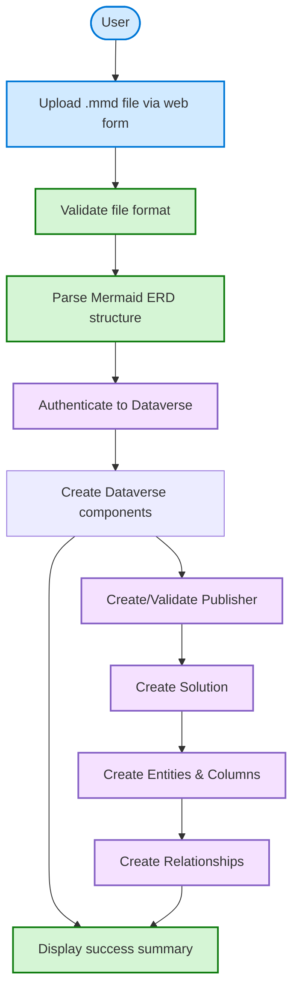
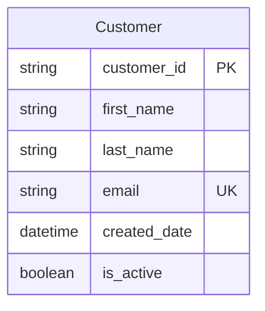
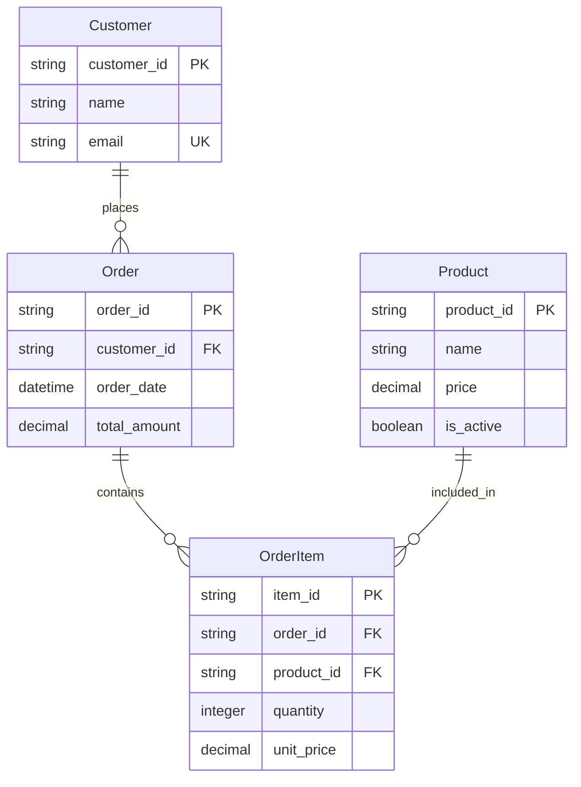
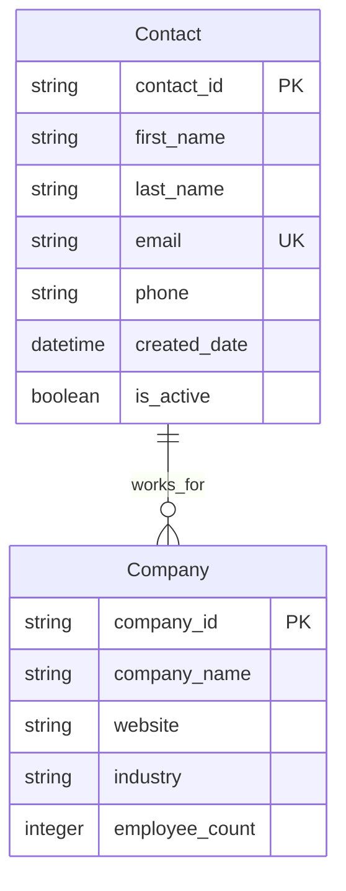
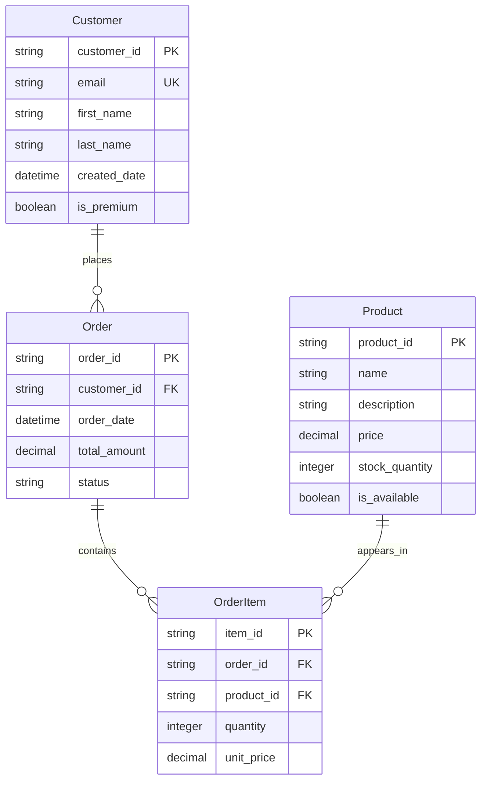

# Usage Guide

This guide explains how to use the Mermaid to Dataverse web application to transform Mermaid entity-relationship diagrams into Microsoft Dataverse solutions, tables, columns, and relationships.

## Overview

The application provides a **web interface** for uploading Mermaid ERD files and automatically creating corresponding Dataverse entities. No local installation or CLI commands required - everything runs in your browser!

## Prerequisites

✅ **Application URL** - Get this from your automated deployment  
✅ **Mermaid ERD file** (`.mmd` extension) with valid ER diagram syntax  
✅ **Dataverse environment** - Already configured during setup  

> 📝 **Note**: All authentication and environment setup is handled automatically. You just need your deployed application URL and a Mermaid file.

## Before You Start: Testing with Dry Run

🧪 **Recommended**: Before making actual changes to your Dataverse environment, test your setup and configuration using the dry run feature.

### Running Dry Run for Initial Setup

If you used the automated setup script, you can test the entire infrastructure deployment process:

```powershell
# Test deployment without making changes
.\scripts\setup-entra-app.ps1 -DryRun

# Or test with specific configuration
.\scripts\setup-entra-app.ps1 -DryRun -Unattended `
  -EnvironmentUrl "https://yourorg.crm.dynamics.com" `
  -ResourceGroup "rg-mermaid" `
  -Location "East US"
```

The dry run will:
- ✅ Validate all your inputs and configuration
- ✅ Check Azure CLI access and permissions  
- ✅ Verify Dataverse environment connectivity
- ✅ Show exactly what would be created
- ✅ Provide the exact command to run for actual deployment

### Running Dry Run for Mermaid Processing

In the web application, always enable "Dry Run" first to preview what will be created:

1. **Upload your Mermaid file**
2. **Enable "Dry Run" checkbox**  
3. **Review the preview** of entities, columns, and relationships
4. **Run again without dry run** once you're satisfied

**Dry Run Output Example:**
```
🧪 DRY RUN MODE - No changes will be made to Dataverse

✅ File validation passed
✅ Entity structure valid
✅ Relationships valid
✅ Publisher prefix available

📋 Would create:
   - Solution: "Customer Management" 
   - Publisher: "cmgt" (Customer Management Publisher)
   - Entity: Customer (3 columns)
   - Entity: Order (4 columns)
   - Entity: Product (5 columns)
   - Relationship: Customer ||--o{ Order
   - Relationship: Order ||--o{ Product

🎯 Ready for actual deployment!
```

## Web Interface Features

### 📊 Status Dashboard

The application shows real-time status of all components:

- ✅ **Application Health**: Server status
- ✅ **Azure Key Vault**: Secret access  
- ✅ **Managed Identity**: Authentication status
- ✅ **Dataverse Connection**: API connectivity

### 🔍 Diagnostic Endpoints

Access additional diagnostic information:

- `/health` - Application health check
- `/keyvault` - Key Vault connectivity test
- `/managed-identity` - Authentication status
- `/api/validate` - Validate Mermaid files
- `/api/test-dataverse` - Test Dataverse operations

### 📋 Real-Time Logging

The web interface provides live feedback during processing:

- **File upload progress**
- **Parsing status**
- **Validation results**  
- **Entity creation progress**
- **Relationship establishment**
- **Final deployment summary**

## Quick Start

### 1. Access the Web Application

Navigate to your deployed application URL:
```
https://your-app-name.azurewebsites.net
```

### 2. Upload Your Mermaid File

1. **Click "Choose File"** and select your `.mmd` file
2. **Configure options**:
   - **Solution Name**: Name for your Dataverse solution (e.g., "Customer Management")
   - **Publisher Prefix**: 3-8 character prefix (e.g., "cmgt")
   - **Dry Run**: Enable to preview without creating anything
3. **Click "Upload and Process"**

### 3. Monitor Real-Time Progress

Watch the live log output as your solution is created:

```
📁 File uploaded: customer-management.mmd (2.3 KB)
✅ File contains valid erDiagram syntax
🔍 Parsing Mermaid ERD structure...
📊 Found 3 entities: Customer, Order, Product
🔗 Found 2 relationships
✅ Validation completed successfully

🔑 Connecting to Dataverse...
✅ Dataverse connection successful
📦 Creating solution: Customer Management
👤 Creating entity: Customer (3 columns)
📦 Creating entity: Order (4 columns)  
🛍️ Creating entity: Product (5 columns)
🔗 Creating relationship: Customer → Order
🔗 Creating relationship: Order → Product

🎉 Deployment completed successfully!
✅ Solution 'Customer Management' created in Dataverse
✅ 3 entities created
✅ 2 relationships established
```

## Deployment Options

### 🧪 Dry Run Mode (Recommended First)

Always test with **Dry Run** enabled first:

1. Upload your Mermaid file
2. ✅ Enable "Dry Run" option
3. Click "Upload and Process"
4. Review the validation output
5. If everything looks good, repeat with Dry Run disabled

**Dry Run Output Example:**
```
🧪 DRY RUN MODE - No changes will be made to Dataverse

✅ File validation passed
✅ Entity structure valid
✅ Relationships valid
✅ Publisher prefix available

📋 Would create:
   - Solution: "Customer Management" 
   - Publisher: "cmgt" (Customer Management Publisher)
   - Entity: Customer (3 columns)
   - Entity: Order (4 columns)
   - Entity: Product (5 columns)
   - Relationship: Customer ||--o{ Order
   - Relationship: Order ||--o{ Product

🎯 Ready for actual deployment!
```

### 🚀 Live Deployment

When ready to create actual Dataverse entities:

1. Upload your Mermaid file
2. ❌ Disable "Dry Run" option  
3. Configure Solution Name and Publisher Prefix
4. Click "Upload and Process"
5. Monitor the real-time progress
6. Verify success in your Dataverse environment

## What Happens During Deployment

When you upload a Mermaid file through the web interface:



### Processing Steps

1. **File Upload**: Browser uploads your `.mmd` file
2. **Validation**: Checks for valid Mermaid ERD syntax
3. **Parsing**: Extracts entities, columns, and relationships
4. **Authentication**: Connects to Dataverse using managed identity
5. **Publisher Creation**: Creates or validates publisher prefix
6. **Solution Creation**: Creates Dataverse solution container
7. **Entity Creation**: Creates tables with specified columns
8. **Relationship Creation**: Establishes entity relationships
9. **Summary**: Displays deployment results

## Supported Mermaid Syntax

### Basic Entity Example



### Supported Data Types

| Mermaid Type | Dataverse Type | Notes |
|-------------|----------------|-------|
| `string` | Single Line Text | Max 255 characters |
| `integer` | Whole Number | Integer values |
| `decimal` | Decimal Number | Floating point |
| `boolean` | Yes/No | True/false values |
| `datetime` | Date and Time | Full timestamp |

### Supported Constraints

| Constraint | Meaning | Implementation |
|-----------|---------|----------------|
| `PK` | Primary Key | Creates GUID primary key + name field |
| `FK` | Foreign Key | Will be used for relationship creation |
| `UK` | Unique Key | Creates unique constraint |

### Relationship Examples



### Relationship Types Supported

- `||--o{` : One-to-many relationship
- `}o--o{` : Many-to-many relationship (creates junction table)
- `||--||` : One-to-one relationship

> **Note**: All relationships are created as **referential (lookup)** by default using Dataverse's native lookup relationship type. This prevents cascade delete conflicts and you can manually configure parental relationships in Dataverse if needed.

## Best Practices

### 📝 File Preparation
- **Use descriptive entity names**: `Customer`, `Order`, `Product`
- **Use snake_case for columns**: `first_name`, `created_date`, `is_active`
- **Use boolean prefixes**: `is_active`, `has_discount`, `can_edit`
- **Use descriptive suffixes**: `_date`, `_time`, `_amount`, `_count`
- **Keep file size reasonable**: Large ERDs may take longer to process

### 🧪 Testing Strategy
1. **Always start with Dry Run** to validate your ERD
2. **Test with small examples** before large deployments
3. **Review generated names** in the preview output
4. **Backup your Dataverse environment** before major deployments

### 🔄 Version Control
- **Store Mermaid files in source control** (Git, etc.)
- **Document your entity relationships** with meaningful names
- **Use consistent naming conventions** across projects
- **Tag versions** when deploying to production

### 🛡️ Safety Considerations
- **Publisher prefixes are permanent** - choose wisely
- **Entity names cannot be changed** after creation
- **Relationships default to referential** (safe, using native Dataverse lookup types)
- **Manual cleanup required** if deployment fails partway

## Example Files

The application works with any valid Mermaid ERD. Here are some examples:

### Simple CRM Example


### E-commerce Example


## Validation & Error Handling

### Built-in Validation
The application automatically validates:

- ✅ **File format**: Must be valid Mermaid ERD syntax
- ✅ **Entity structure**: Each entity must have at least one primary key
- ✅ **Relationship validity**: References must point to existing entities
- ✅ **Naming conventions**: Publisher prefix format validation
- ✅ **Dataverse limits**: Column names, solution names, etc.

### Common Validation Messages
```
🔍 Validating ERD structure...
✅ All entities have primary keys
✅ No self-references detected
✅ All relationship targets exist
ℹ️ All relationships will be created as referential (lookup) using Dataverse's native lookup relationship behavior
✅ Validation completed successfully
```

### Error Examples
```
❌ Entity 'Order' references unknown entity 'InvalidEntity'
❌ Entity 'Customer' has no primary key defined
❌ Publisher prefix must be 3-8 characters (got: 'ab')
❌ Solution name cannot contain special characters
```

## Troubleshooting

### File Upload Issues
```
❌ File upload failed: File too large
```
**Solutions**: 
- Check file size (limit: ~10MB)
- Ensure file has `.mmd` extension
- Verify file contains valid Mermaid syntax

### Authentication Issues
```
❌ Dataverse connection failed: Unauthorized
```
**Solutions**:
- Check application health status on the dashboard
- Verify Dataverse environment is accessible
- Contact administrator if managed identity issues persist

### Entity Creation Issues
```
❌ Entity creation failed: Publisher prefix invalid
```
**Solutions**:
- Use 3-8 character publisher prefix
- Only lowercase letters allowed
- Ensure prefix doesn't conflict with existing publishers
- Try different solution name if conflicts exist

### Performance Considerations
- **Large ERDs**: May take several minutes to process
- **Many relationships**: Processing time increases with complexity
- **Network latency**: Depends on Dataverse environment location
- **Browser timeout**: For very large deployments, monitor progress actively

## Getting Help

### 1. Check Application Status
Visit the status dashboard to verify all components are healthy:
- Application Health ✅
- Key Vault Access ✅  
- Managed Identity ✅
- Dataverse Connection ✅

### 2. Use Diagnostic Endpoints
- `/health` - Overall application health
- `/api/validate` - Test file validation without deployment

### 3. Review Examples
Start with the provided examples to understand the expected format and behavior.

### 4. Raise an issue
If issues persist, provide:
- Application URL
- Error messages from the web interface
- Sample Mermaid file that's causing issues
- Browser console errors (F12 Developer Tools)

For detailed technical architecture and developer information, see [DEVELOPER.md](DEVELOPER.md).

For automated deployment setup, see [ENTRA-ID-SETUP.md](ENTRA-ID-SETUP.md).

