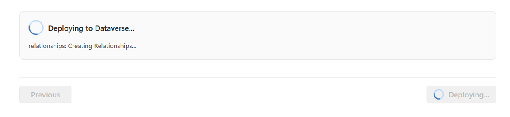
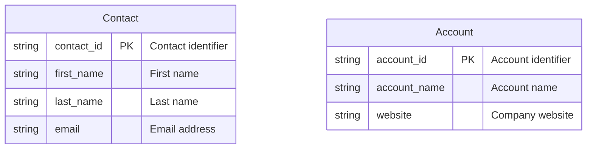
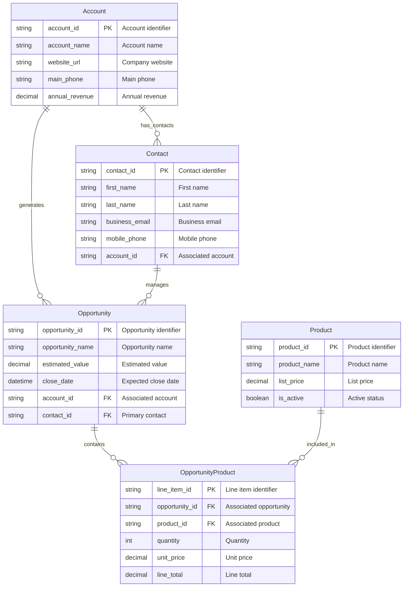

# Usage Guide

This guide explains how to use the modern React-based Mermaid to Dataverse application to transform Mermaid entity-relationship diagrams into Microsoft Dataverse solutions, tables, columns, and relationships with intelligent validation and Common Data Model (CDM) integration.

## Getting Started

### 1. Initial Setup

The application is deployed to Azure App Service. See [Deployment Guide](DEPLOYMENT.md) for deployment instructions.

### 2. Prerequisites

* **Mermaid ERD file** (`.mmd` extension) with valid ER diagram syntax  
* **Dataverse environment** with admin access
* **Global Choices file** (optional) - JSON file with choice definitions if needed

## Overview

The application provides a **modern React wizard interface** with Fluent UI v9 components for uploading Mermaid ERD files and automatically creating corresponding Dataverse entities. Once deployed, access the React application: `https://your-app-name.azurewebsites.net`

**Key Features:**
- **Smart CDM Detection**: Automatically identifies Common Data Model entities
- **Intelligent Validation**: Real-time error detection and auto-corrections
- **Type Detection**: Smart data type mapping based on field names
- **Modern UI**: Intuitive React wizard
- **Secure**: Azure Managed Identity with Key Vault integration

## 1. Use the Modern React Wizard

### Step 1: ERD Upload & Intelligent Validation
- **Browse**: Upload your Mermaid ERD file (`.mmd` extension) using the modern file upload component


- **Real-time Parsing**: Immediate ERD structure analysis and entity detection


- **Smart Validation**: Comprehensive validation with automatic error detection:
  - **CDM Detection**: Identifies entities matching Common Data Model (e.g., Account, Contact)


  - **Naming Conflicts**: Detects conflicts with Dataverse system columns
  - **Status Columns**: Automatically filters out status columns (uses Dataverse built-in status)
  - **Primary Key Issues**: Validates primary key structure
  - **Data Type Mapping**: Smart type detection based on field names
- **Auto-Corrections**: View suggested fixes with side-by-side comparison


- Select **Next** to proceed


### Step 2: Solution & Publisher Configuration
- **Solution Name**: Name for your Dataverse solution (e.g., "Customer Management") or choose from an existing solution
- **Publisher Selection**: Choose existing publisher or create new one with the React interface
- **Publisher Prefix**: 3-8 character prefix (e.g., "cmgt") with real-time validation
- Select **Next** to continue


### Step 3: Global Choices Integration

- **Upload JSON**: Upload JSON file with global choice definitions
- 


- **Browse Existing**: View and select from existing Dataverse global choices


- **Preview Choices**: Real-time preview of choice sets before deployment
- **Combined Selection**: Mix new and existing choices in a single deployment
- See [Global Choices Guide](GLOBAL-CHOICES-GUIDE.md) for detailed documentation
- Select **Next** to continue

### Step 4: Review & Deploy
- **Configuration Summary**: Complete review of all settings with modern UI


- **CDM Integration Summary**: Clear display of CDM vs. custom entity choices
- **Real-time Validation**: Final validation before deployment
- **Deploy**: Click **Deploy to Dataverse** to create your solution with live progress tracking



## Intelligent Validation & Auto-Corrections

The React application includes sophisticated validation that provides real-time feedback and intelligent fixes:

### 🔍 Common Data Model (CDM) Detection

The system automatically analyzes your entities and detects potential CDM matches:

**What happens:**


**CDM Detection Results:**
- ✅ **Contact detected**: Matches CDM Contact entity (confidence: 95%)
- ✅ **Account detected**: Matches CDM Account entity (confidence: 90%)
- 💡 **Recommendation**: Use existing CDM entities for better Power Platform integration

**User Choice:**
- **Use CDM entities**: Leverage existing Contact and Account with built-in relationships
- **Create custom entities**: Proceed with your custom entity definitions
- **Mixed approach**: Use CDM for some, custom for others

### 🛠️ Automatic Problem Detection & Fixes

#### Primary Column Conflicts

**Problem detected:**

```bash
Customer {
    string customer_id PK
    string name "Customer name"  // Conflicts with auto-generated primary column
}
```

**Auto-suggested fix:**

```bash
ERD
Customer {
    string customer_id PK
    string customer_name "Customer name"  // Renamed to avoid conflict
}
```

#### Status Column Filtering
**Original ERD:**
```bash
Order {
    string order_id PK
    string status "Order status"  // Will be automatically ignored
}
```

**System handling:**
- Status columns automatically filtered out during deployment
- Built-in Dataverse status fields (Active/Inactive) used instead
- Suggestion provided to create choice columns manually for custom status values

#### System Column Conflicts
**Problem detected:**
```bash
Task {
    string task_id PK
    string ownerid FK "Task owner"  // Conflicts with Dataverse system column
}
```

**Auto-suggested fix:**
```bash
Task {
    string task_id PK
    string task_ownerid FK "Task owner reference"  // Prefixed to avoid conflict
}
```

### Smart Type Detection

The system includes intelligent field name analysis for automatic type improvement:

**Email Detection:**

```bash
Contact {
    string user_email "User email"      // → Automatically becomes 'email' type
    string contact_email "Contact email" // → Automatically becomes 'email' type
}
```

**Phone Detection:**

```bash
Contact {
    string mobile_phone "Mobile number"  // → Automatically becomes 'phone' type
    string office_tel "Office telephone" // → Automatically becomes 'phone' type
}
```

**URL Detection:**

```bash
Company {
    string website_url "Company website" // → Automatically becomes 'url' type
    string homepage "Company homepage"    // → Automatically becomes 'url' type
}
```

### 3. Live Deployment Progress

The React interface provides real-time deployment tracking:

```bash
Starting deployment...
✓ Validating ERD structure
✓ Applying auto-corrections
✓ Processing CDM integration choices
✓ Connecting to Dataverse (Azure Managed Identity)
✓ Creating solution 'Customer Management'
✓ Creating publisher 'cmgt'
✓ Processing global choices (2 new, 3 existing)
✓ Creating entities:
  - Contact (using CDM entity)
  - Account (using CDM entity)  
  - CustomProject (new custom entity)
  - ProjectTask (new custom entity)
✓ Creating relationships (4 relationships established)
✓ Deployment completed successfully!

📊 Summary:
- Solution: Customer Management (created)
- Entities: 2 CDM + 2 custom
- Relationships: 4 established
- Global Choices: 5 processed
```

### Complete Data Type Support

| Mermaid Type | Dataverse Type | Description | Auto-Detection |
|-------------|----------------|-------------|----------------|
| `string` | Single Line Text | Text up to 4,000 chars | Email, Phone, URL detection |
| `text` / `memo` | Multiple Lines Text | Large text fields | N/A |
| `email` | Email | Email with validation | Auto-detected from field names |
| `phone` | Phone | Phone with formatting | Auto-detected from field names |
| `url` | URL | URL with validation | Auto-detected from field names |
| `int` / `integer` | Whole Number | Integer values | N/A |
| `decimal` | Decimal Number | Fixed precision decimal | N/A |
| `money` | Currency | Currency with formatting | N/A |
| `boolean` / `bool` | Two Options | Yes/No values | N/A |
| `datetime` | Date and Time | Full timestamp | N/A |
| `date` / `dateonly` | Date Only | Date without time | N/A |
| `float` / `double` | Floating Point | Floating point numbers | N/A |
| `ticker` | Ticker Symbol | Stock ticker | N/A |
| `timezone` | Time Zone | Time zone identifier | N/A |
| `language` | Language | Language LCID | N/A |
| `duration` | Duration | Duration in minutes | N/A |
| `file` | File | File storage | N/A |
| `image` | Image | Image storage | N/A |

For complete data type documentation, see [Mermaid Guide](MERMAID-GUIDE.md#supported-data-types).

### Supported Constraints & Markers

| Constraint | Meaning | Implementation | Smart Validation |
|-----------|---------|----------------|------------------|
| `PK` | Primary Key | Creates GUID primary key + auto-generated name field | Validates single PK per entity |
| `FK` | Foreign Key | Used for automatic relationship creation | Validates target entity exists |
| `UK` | Unique Key | Creates unique constraint | Validates uniqueness rules |

### Advanced Relationship Examples with CDM Integration



**Smart Processing Results:**
- **CDM Detection**: Account & Contact identified as CDM entities
- **Type Detection**: website_url → URL, business_email → Email, mobile_phone → Phone
- **Validation**: All relationships validated, junction table recognized
- **Mixed Solution**: CDM entities + custom entities in single deployment
- **Optimized**: Best of both worlds - standard CDM + business-specific entities

### Global Choices Integration Example

For entities that need choice columns, upload a global choices JSON file:

```json
{
  "globalChoices": [
    {
      "name": "opportunity_stage",
      "displayName": "Opportunity Stage",
      "description": "Sales opportunity stages",
      "options": [
        { "value": 100000000, "label": "Prospect" },
        { "value": 100000001, "label": "Qualified" },
        { "value": 100000002, "label": "Proposal" },
        { "value": 100000003, "label": "Negotiation" },
        { "value": 100000004, "label": "Closed Won" },
        { "value": 100000005, "label": "Closed Lost" }
      ]
    }
  ]
}
```

For more detailed guidance, see:

- [Mermaid Guide](MERMAID-GUIDE.md) - Complete ERD syntax reference
- [Global Choices Guide](GLOBAL-CHOICES-GUIDE.md) - Choice management
- [Developer Architecture Guide](DEVELOPER_ARCHITECTURE.md) - Technical details
