# Usage Guide

This guide explains how to use the modern React-based Mermaid to Dataverse application to transform Mermaid entity-relationship diagrams into Microsoft Dataverse solutions, tables, columns, and relationships with intelligent validation and Common Data Model (CDM) integration.

## Getting Started

### 1. Initial Setup

The application is deployed to Azure App Service. See [Deployment Guide](DEPLOYMENT.md) for deployment instructions.

### 2. Prerequisites

* **Mermaid ERD file** (`.mmd` extension) with valid ER diagram syntax  
* **Dataverse environment** with admin access
* **Global Choices file** (optional) - JSON file with choice definitions if needed

## Overview

The application provides a **modern React wizard interface** with Fluent UI v9 components for uploading Mermaid ERD files and automatically creating corresponding Dataverse entities. Once deployed, access the React application: `https://your-app-name.azurewebsites.net`

**Key Features:**
- **Smart CDM Detection**: Automatically identifies Common Data Model entities
- **Intelligent Validation**: Real-time error detection and auto-corrections
- **Type Detection**: Smart data type mapping based on field names
- **Modern UI**: Intuitive React wizard
- **Secure**: Azure Managed Identity authentication

## Use the Wizard

### Step 1: ERD Upload & Intelligent Validation
- **Browse**: Upload your Mermaid ERD file (`.mmd` extension) using the modern file upload component

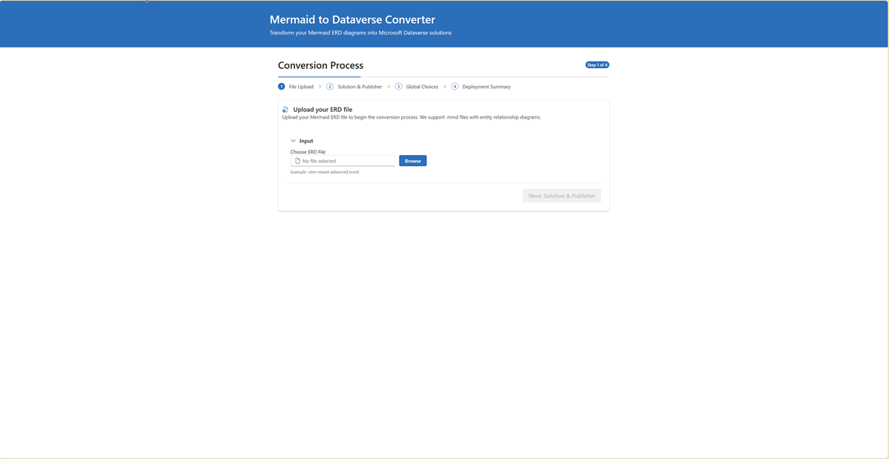

- **Import**: You can also as an alternative choose from your already existing solutions in your Dataverse environment - either to copy the .mmd file or to deploy it again.

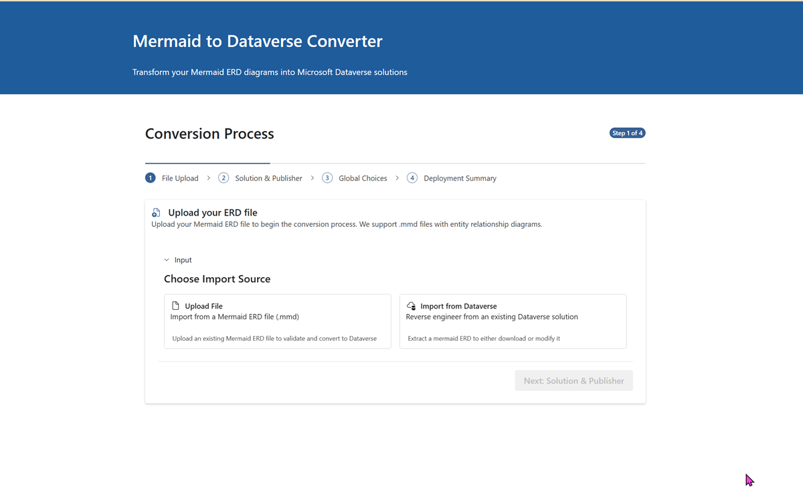

- **Real-time Parsing**: Immediate ERD structure analysis and entity detection
- **Smart Validation**: Comprehensive validation with automatic error detection:
  - **CDM Detection**: Identifies entities matching Common Data Model (e.g., Account, Contact)

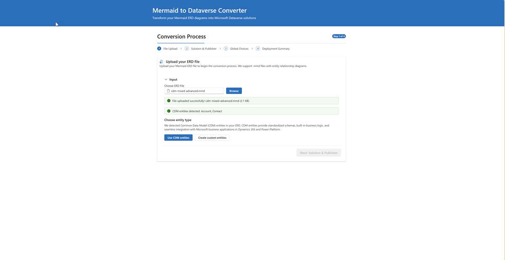

  - **Naming Conflicts**: Detects conflicts with Dataverse system columns
  - **Status Columns**: Automatically filters out status columns (uses Dataverse built-in status)
  - **Primary Key Issues**: Validates primary key structure
  - **Data Type Mapping**: Smart type detection based on field names
- **Auto-Corrections**: View suggested fixes with side-by-side comparison

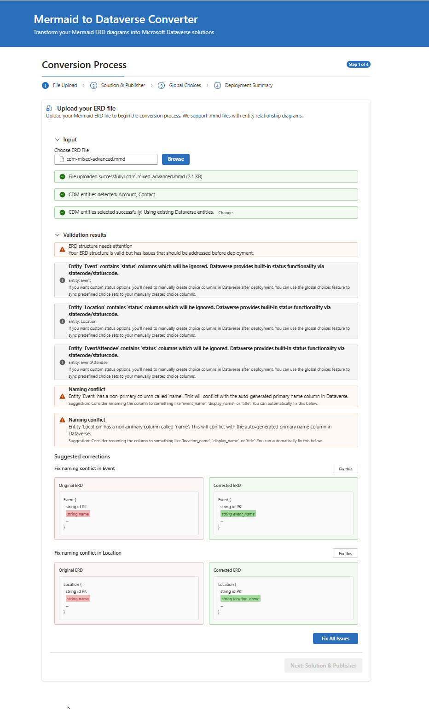

- Select **Next** to proceed

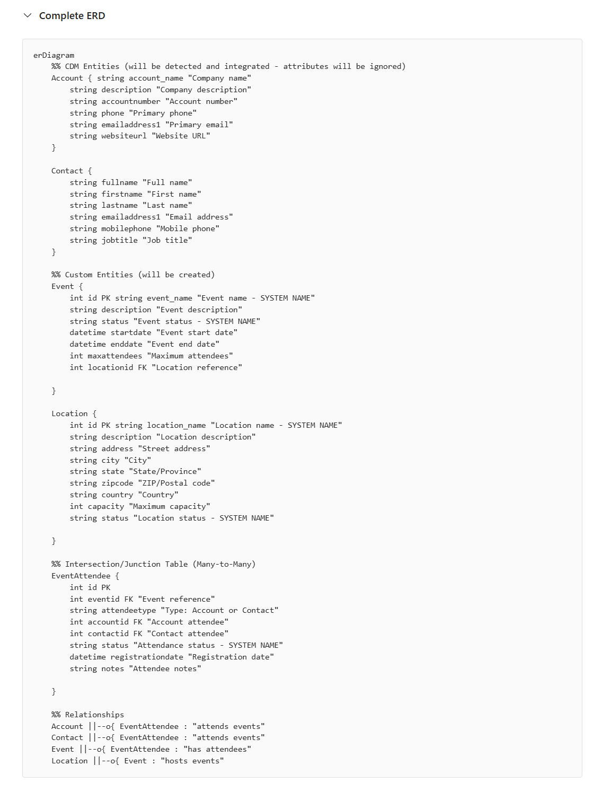

### Step 2: Solution & Publisher Configuration
- **Solution Name**: Name for your Dataverse solution (e.g., "Customer Management") or choose from an existing solution
- **Publisher Selection**: Choose an existing publisher or create a new one with the React interface
- **Publisher Prefix**: 3-8 character prefix (e.g., "cmgt") with real-time validation
- Select **Next** to continue

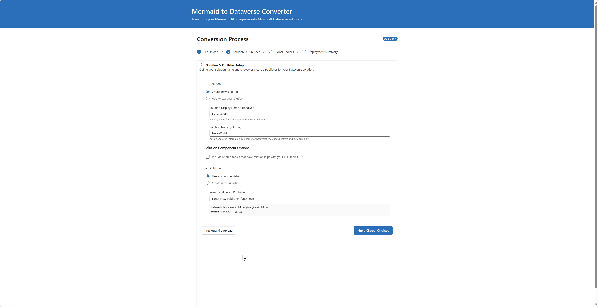


### Step 3: Global Choices Integration

- **Upload JSON**: Upload JSON file with global choice definitions

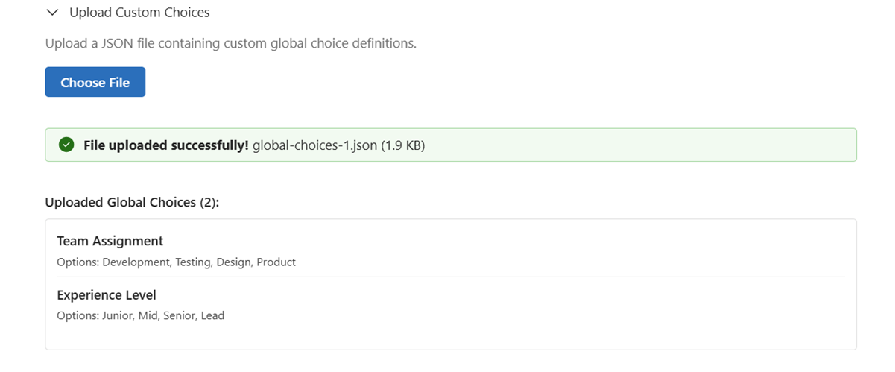

- **Browse Existing**: View and select from existing Dataverse global choices

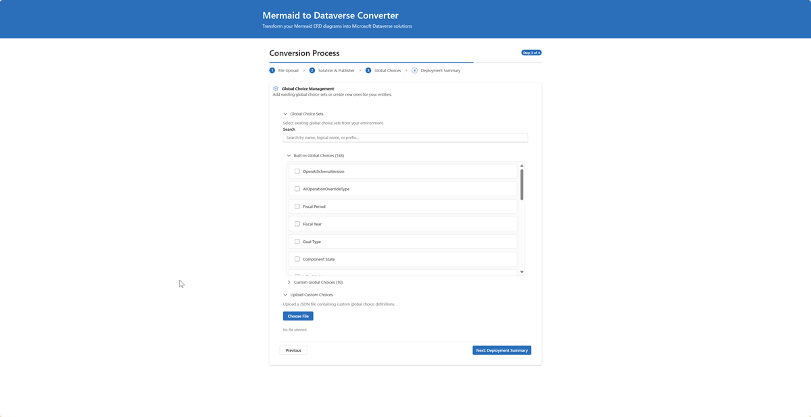

- **Preview Choices**: Real-time preview of choice sets before deployment
- **Combined Selection**: Mix new and existing choices in a single deployment
- See [Global Choices Guide](GLOBAL-CHOICES-GUIDE.md) for detailed documentation
- Select **Next** to continue

### Step 4: Review & Deploy
- **Configuration Summary**: Complete review of all settings with modern UI

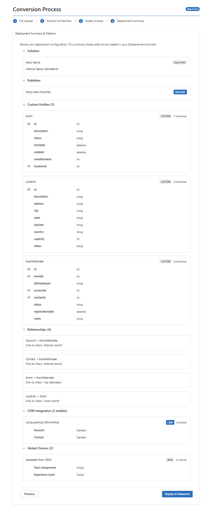

- **CDM Integration Summary**: Clear display of CDM vs. custom entity choices
- **Real-time Validation**: Final validation before deployment
- **Deploy**: Select **Deploy to Dataverse** to create your solution with live progress tracking

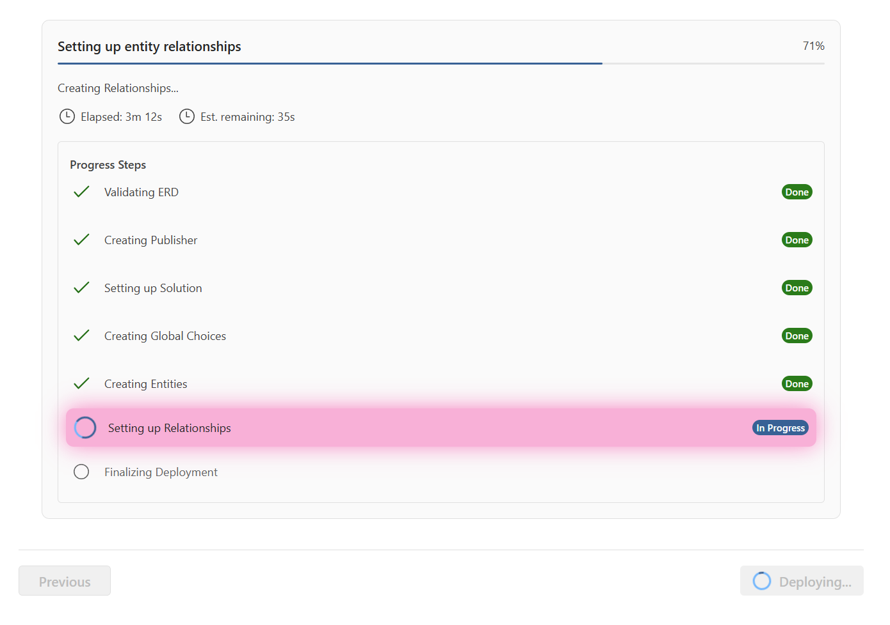

And finally 

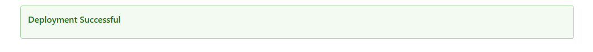

## Deployment History & Multi-Environment Management

After deploying your solutions, you can track and manage them across multiple environments using the Deployment History feature.

### Viewing Deployment History

1. **Open History Modal**: Click the "View History" button in the application header
2. **Environment Filter**: Select which environment to view:
   - **All Environments**: See deployments across all configured environments
   - **Specific Environment**: Filter by Dev, Test, or Production environment
3. **Environment Badges**: Each deployment shows a colored badge indicating its environment:
   - 🔵 **Blue**: Development environment
   - 🟣 **Purple**: Test environment  
   - 🟢 **Green**: Production environment

### Deployment Details

Each deployment record shows:
- **Solution Name**: The Dataverse solution that was created
- **Environment**: Where the solution was deployed (with colored badge)
- **Status**: Success, Failed, or Partial
- **Timestamp**: When the deployment occurred
- **Solution Link**: Direct link to view the solution in Power Platform
- **Deployment Details**: Expandable section showing:
  - Deployed entities and their properties
  - Relationships created
  - Global choices used
  - Any errors or warnings

### Rolling Back Deployments

You can safely reverse a deployment and remove it from Dataverse:

#### Eligibility Requirements
- Deployment must have status "success" or "partial"
- No dependent deployments exist
- Solution components must be removable

#### How to Rollback

1. **Select Deployment**: In the deployment history, find the deployment you want to rollback
2. **Check Environment**: Verify the environment badge shows the correct target environment
3. **Click Rollback**: Click the "Rollback" button next to the deployment
4. **Confirm**: Confirm the rollback operation
5. **Monitor Progress**: Watch the real-time progress tracker showing:
   - Relationship removal
   - Entity deletion
   - Global choice cleanup
   - Solution removal
   - Publisher cleanup (if applicable)

#### What Gets Removed

The rollback process removes components in this order:
1. **Relationships**: All relationships between entities
2. **Custom Entities**: Tables created during deployment (preserves data where possible)
3. **Global Choices**: Choice sets that were created
4. **Solution**: The Dataverse solution (if no other components remain)
5. **Publisher**: The publisher (if no other solutions use it)

#### Multi-Environment Rollback

The rollback system is **environment-aware**:
- Rollback operations target the **specific environment** where the deployment was created
- You can safely rollback from Dev without affecting Test or Production
- Each environment maintains its own deployment history
- Rollback buttons only appear for eligible deployments in each environment

## Intelligent Validation & Auto-Corrections

The React application includes sophisticated validation that provides real-time feedback and intelligent fixes:

### Common Data Model (CDM) Detection

The system automatically analyzes your entities and detects potential CDM matches:

**What happens:**
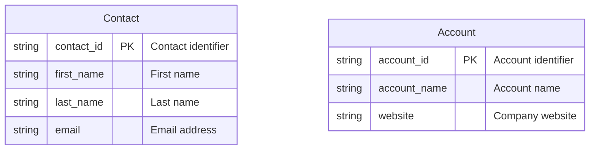

**CDM Detection Results:**
- **Contact detected**: Matches CDM Contact entity
- **Account detected**: Matches CDM Account entity
- 💡 **Recommendation**: Use existing CDM entities for better Power Platform integration

**User Choice:**
- **Use CDM entities**: Leverage existing Contact and Account with built-in relationships
- **Create custom entities**: Proceed with your custom entity definitions
- **Mixed approach**: Use CDM for some, custom for others

### Automatic Problem Detection & Fixes

#### Primary Column Conflicts

**Problem detected:**

```bash
Customer {
    string customer_id PK
    string name "Customer name"  // Conflicts with auto-generated primary column
}
```

**Auto-suggested fix:**

```bash
ERD
Customer {
    string customer_id PK
    string customer_name "Customer name"  // Renamed to avoid conflict
}
```

#### Status Column Filtering
**Original ERD:**
```bash
Order {
    string order_id PK
    string status "Order status"  // Will be automatically ignored
}
```

**System handling:**
- Status columns automatically filtered out during deployment
- Built-in Dataverse status fields (Active/Inactive) used instead
- Suggestion provided to create choice columns manually for custom status values

#### System Column Conflicts
**Problem detected:**
```bash
Task {
    string task_id PK
    string ownerid FK "Task owner"  // Conflicts with Dataverse system column
}
```

**Auto-suggested fix:**
```bash
Task {
    string task_id PK
    string task_ownerid FK "Task owner reference"  // Prefixed to avoid conflict
}
```

### Smart Type Detection

The system includes intelligent field name analysis for automatic type improvement:

**Email Detection:**

```bash
Contact {
    string user_email "User email"      // → Automatically becomes 'email' type
    string contact_email "Contact email" // → Automatically becomes 'email' type
}
```

**Phone Detection:**

```bash
Contact {
    string mobile_phone "Mobile number"  // → Automatically becomes 'phone' type
    string office_tel "Office telephone" // → Automatically becomes 'phone' type
}
```

**URL Detection:**

```bash
Company {
    string website_url "Company website" // → Automatically becomes 'url' type
    string homepage "Company homepage"    // → Automatically becomes 'url' type
}
```


### Complete Data Type Support

| Mermaid Type | Dataverse Type | Description | Auto-Detection |
|-------------|----------------|-------------|----------------|
| `string` | Single Line Text | Text up to 4,000 chars | Email, Phone, URL detection |
| `text` / `memo` | Multiple Lines Text | Large text fields | N/A |
| `email` | Email | Email with validation | Auto-detected from field names |
| `phone` | Phone | Phone with formatting | Auto-detected from field names |
| `url` | URL | URL with validation | Auto-detected from field names |
| `int` / `integer` | Whole Number | Integer values | N/A |
| `decimal` | Decimal Number | Fixed precision decimal | N/A |
| `money` | Currency | Currency with formatting | N/A |
| `boolean` / `bool` | Two Options | Yes/No values | N/A |
| `datetime` | Date and Time | Full timestamp | N/A |
| `date` / `dateonly` | Date Only | Date without time | N/A |
| `float` / `double` | Floating Point | Floating point numbers | N/A |
| `ticker` | Ticker Symbol | Stock ticker | N/A |
| `timezone` | Time Zone | Time zone identifier | N/A |
| `language` | Language | Language LCID | N/A |
| `duration` | Duration | Duration in minutes | N/A |
| `file` | File | File storage | N/A |
| `image` | Image | Image storage | N/A |

### Supported Constraints & Markers

| Constraint | Meaning | Implementation | Smart Validation |
|-----------|---------|----------------|------------------|
| `PK` | Primary Key | Creates GUID primary key + auto-generated name field | Validates single PK per entity |
| `FK` | Foreign Key | Used for automatic relationship creation | Validates target entity exists |
| `UK` | Unique Key | Creates unique constraint | Validates uniqueness rules |

### Advanced Relationship Examples with CDM Integration

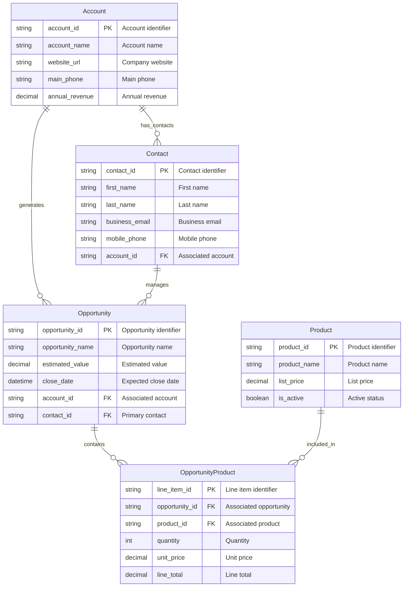

**Smart Processing Results:**
- **CDM Detection**: Account & Contact identified as CDM entities
- **Type Detection**: website_url → URL, business_email → Email, mobile_phone → Phone
- **Validation**: All relationships validated, junction table recognized
- **Mixed Solution**: CDM entities + custom entities in single deployment
- **Optimized**: Best of both worlds - standard CDM + business-specific entities

---

## Rollback Deployments

The application provides **modular rollback** functionality, giving you granular control over which components to remove from Dataverse while preserving deployment history.

### Accessing Rollback

1. Navigate to **Deployment History** (view past deployments)
2. Find the deployment you want to rollback
3. Select the **"Rollback"** button
4. Select components to remove

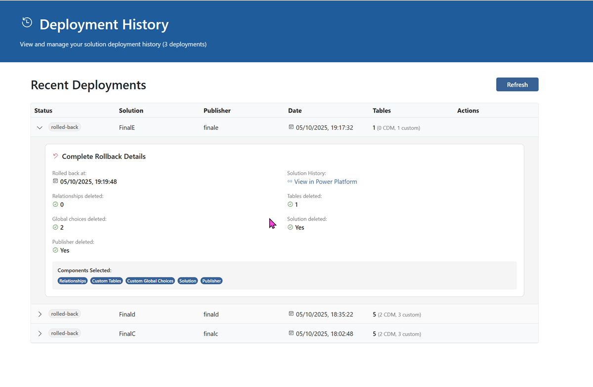

### Enhanced Progress Tracking

The rollback process includes **real-time progress indicators** with step-by-step visibility:

**Visual Progress Features:**
- **Step-by-Step Display**: Each rollback component shown as individual progress steps
- **Active Step Highlighting**: Currently processing step highlighted with pink pulsing animation
- **Status Badges**: Clear "Preparing", "In Progress", "Completed" indicators for each step
- **Time Estimation**: Real-time elapsed time and estimated remaining time
- **Spinner Animations**: Visual feedback for active operations

**Progress Steps Include:**
1. **Preparation** - Validating rollback requirements
2. **Relationships** - Removing entity relationships 
3. **Custom Entities** - Deleting custom tables
4. **Global Choices** - Removing custom choice sets
5. **Solution** - Deleting solution container
6. **Publisher** - Removing publisher
7. **Cleanup** - Final cleanup operations

This enhanced progress tracking matches the same visual style and functionality as deployment progress, providing consistent user experience throughout the application.

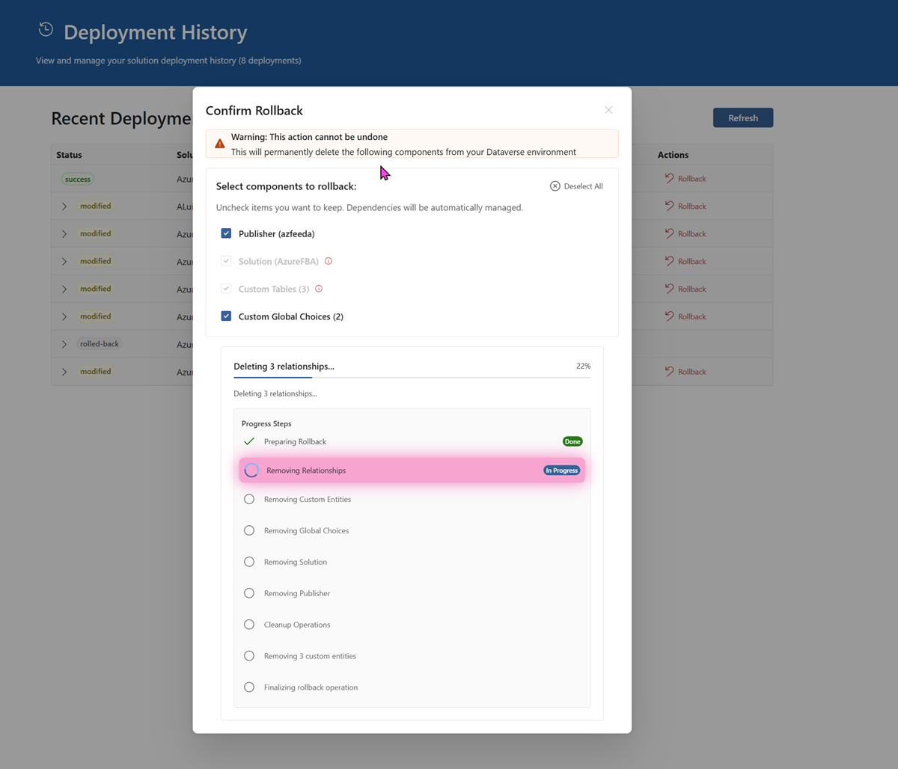

### Rollback Options

You can choose exactly what to rollback:

#### Available Components


- **Custom Entities** - Delete custom tables created by deployment
- **Global Choices** - Delete custom global choice sets
- **Solution** - Remove the solution container
- **Publisher** - Delete the publisher

#### Dependency Rules

The system automatically enforces safe rollback order:

1. **Custom Entities** require **Relationships** to be deleted first - this happens automagically
2. **Solution** requires all **Custom Entities** + **CDM Entities** to be removed (auto-selected)
3. **Publisher** requires **Solution** to be deleted first (auto-selected)

### Multiple Rollbacks

You can perform **multiple sequential rollbacks** on the same deployment.

**Smart Tracking:**
- System tracks what was deleted in each rollback
- Prevents attempting to delete already-removed components
- Each rollback shows only the components selected for that specific operation
- Deployment status updates automatically:
  - **`deployed`** - Active deployment with all components
  - **`modified`** - Partial rollback (some components remain)
  - **`rolled-back`** - Complete rollback (all components deleted)

### Rollback Best Practices

#### ⚠️ Important Considerations


1. **CDM vs Custom**: CDM entities are only removed from solution, not from Dataverse
2. **Publisher Dependencies**: Cannot delete publisher if solution exists
3. **Irreversible**: Rollback cannot be undone (re-deploy if needed)


### Viewing Rollback History

Each deployment card in the history shows:
- **Status badge** (deployed/modified/rolled-back)
- **Rollback badges** listing what was rolled back in each operation
- **Rollback numbering** in chronological order
- **Component details** for each rollback

**Example Display:**
```
Deployment: university_v1.0
Status: modified
Rollbacks:
  #1 - Relationships (Jan 15, 2025)
  #2 - Custom Entities (Jan 16, 2025)
```


