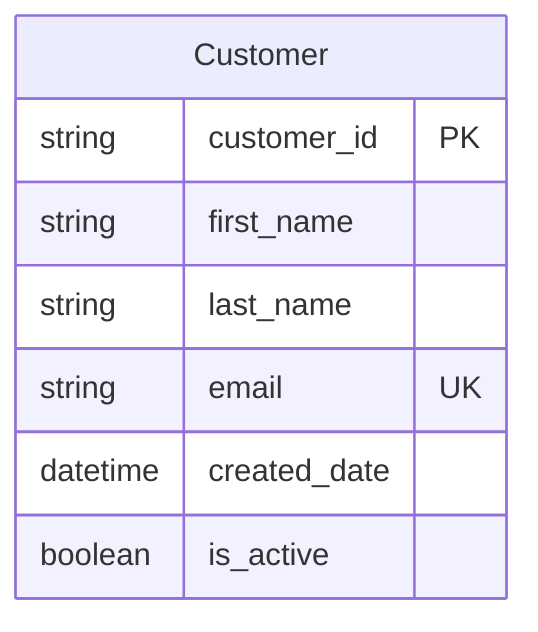
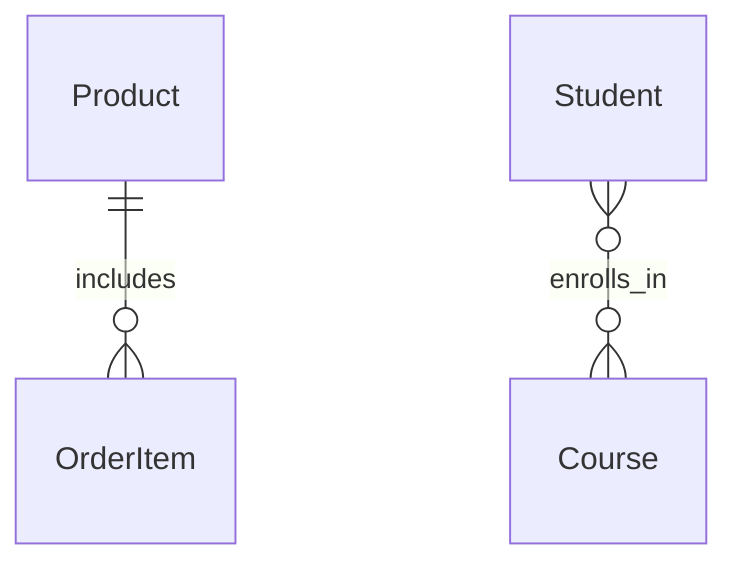

# Usage Guide

This guide explains how to use the Mermaid to Dataverse converter effectively.

## Quick Start

1. **Install dependencies**:
   ```bash
   npm install
   ```

2. **Configure authentication** (see [Entra ID Setup Guide](entra-id-setup.md))

3. **Validate your ERD**:
   ```bash
   npm start validate -- -i your-erd-file.mmd
   ```

4. **Preview conversion**:
   ```bash
   npm start convert -- -i your-erd-file.mmd --dry-run
   ```

5. **Create entities in Dataverse** (creates solution and entities):
   ```bash
   npm start convert -- -i your-erd-file.mmd --solution MyProjectSolution
   ```

## Supported Mermaid ERD Syntax

### Basic Entity Definition



### Supported Data Types

|--------------|----------------|-------------|
| `string` | `Edm.String` | Text field (max 100 chars by default) |
| `int`, `integer` | `Edm.Int32` | 32-bit integer |
| `decimal` | `Edm.Decimal` | Decimal number with precision |
| `text`, `varchar`, `nvarchar` | `Edm.String` | Text field |

### Field Constraints

| Constraint | Description | Example |
|------------|-------------|---------|
| `PK` | Primary Key | `string id PK` |
| `FK` | Foreign Key | `string customer_id FK` |
| `UK` | Unique Key | `string email UK` |
| `NOT NULL` | Required field | `string name NOT NULL` |

### Relationship Types

| Mermaid Notation | Cardinality | Description |
|------------------|-------------|-------------|
| `}o--\|\|` | Many-to-One | Many records relate to one other |
| `}o--o{` | Many-to-Many | Many records relate to many others |

### Relationship Examples



## Command Line Options
### Convert Command

```bash
npm start convert [options]
```
**Options:**
- `-i, --input <file>` - Input Mermaid ERD file (required)
- `-o, --output <file>` - Output JSON schema file (optional)
- `--dry-run` - Preview conversion without creating entities
- `--verbose` - Show detailed output

**Examples:**
```bash
# Basic conversion with solution
npm start convert -- -i my-erd.mmd --solution MyProjectSolution
# Dry run with verbose output (no solution needed for preview)

# Save schema to file (no solution needed for schema export)
npm start convert -- -i my-erd.mmd -o schema.json

# Custom publisher prefix with solution
npm start convert -- -i my-erd.mmd --solution MyProjectSolution --publisher-prefix "myorg"
```

### Validate Command

```bash
npm start validate [options]
```

**Options:**
- `-i, --input <file>` - Input Mermaid ERD file (required)

**Example:**
npm start validate -- -i my-erd.mmd
```

## Solution Management

The tool automatically creates and manages Dataverse solutions for you. Solutions provide organization and deployment benefits:

### Solution Features

- **Automatic Creation**: Solutions are created if they don't exist
- **Idempotent Operations**: Safe to run multiple times - existing solutions are reused
- **Entity Organization**: All entities and relationships are created within the solution
- **Publisher Management**: Automatically creates or reuses publishers with your prefix

### Solution Naming
- Use descriptive names: `MyProjectSolution`, `CustomerManagement`, `InventorySystem`
- Solution names must be unique within your Dataverse environment
- Names should be alphanumeric with no spaces (underscores allowed)

### Examples
```bash
# Create a solution for a customer management system
npm start convert -- -i customer-erd.mmd --solution CustomerManagement

# Create a solution for inventory tracking
npm start convert -- -i inventory-erd.mmd --solution InventorySystem --publisher-prefix "inv"

# Running again with the same solution name is safe (idempotent)
```

### Config Command

```bash
npm start config
```

Shows current configuration status and required environment variables.

## Best Practices

### 1. ERD Design

- **Use descriptive names**: `customer_id` instead of `id`
- **Follow naming conventions**: Use snake_case for consistency
- **Specify constraints**: Mark primary keys, foreign keys, and unique fields
- **Document relationships**: Use meaningful relationship names

### 2. Field Naming

- **Foreign keys**: Reference the related table (e.g., `customer_id` in Order table)
- **Boolean fields**: Start with `is_` or `has_` (e.g., `is_active`)
- **Date fields**: End with `_date` or `_time` (e.g., `created_date`)
2. **Use dry runs**: Preview changes before applying to Dataverse
4. **Version control**: Keep your Mermaid files in source control
5. **Document changes**: Use meaningful commit messages for ERD updates
- **Backup before changes**: Create solution backups
- **Monitor creation**: Use verbose mode to track progress
- **Validate results**: Check created entities in Dataverse maker portal

## Limitations

### Current Limitations

1. **No update support**: The tool only creates new entities (no updates to existing)
2. **Basic field types**: Limited to common Dataverse field types
3. **No calculated fields**: Doesn't support calculated or rollup fields
4. **No business rules**: Doesn't create business rules or workflows
5. **No forms/views**: Only creates entities and fields, not UI components

### Workarounds

1. **Manual updates**: Use Dataverse maker portal for entity updates
2. **Custom fields**: Add specialized fields manually after creation
3. **Business logic**: Implement business rules separately
4. **User interface**: Design forms and views in Power Apps

## Troubleshooting

### Common Issues

**Issue**: "Entity already exists"
- **Solution**: The tool skips existing entities. Delete manually or use different names.

**Issue**: "Invalid field type"
- **Solution**: Check that your Mermaid data types are supported (see table above).

**Issue**: "Relationship creation failed"
- **Solution**: Ensure both entities exist before creating relationships.

**Issue**: "Authentication failed"
- **Solution**: Check your Azure AD app registration and environment variables.

### Getting Help

1. **Check configuration**: Run `npm start config`
2. **Validate ERD**: Run validate command first
3. **Use verbose mode**: Add `--verbose` for detailed error messages
4. **Test with examples**: Try the provided example files first

## Examples

See the `examples/` directory for complete ERD examples:

- `ecommerce-erd.mmd` - E-commerce system with customers, orders, and products
- `hr-system-erd.mmd` - HR system with employees, departments, and projects

## Advanced Usage

### Custom Publisher Prefix

```bash
npm start convert -- -i my-erd.mmd --solution ContosoSolution --publisher-prefix "contoso"
```

This creates entities like `contoso_customer` instead of `mmd_customer`.

### Schema Export

```bash
npm start convert -- -i my-erd.mmd -o dataverse-schema.json --dry-run
```

Exports the generated Dataverse schema to a JSON file for review or documentation.

### Environment Variables

Create different `.env` files for different environments:

- `.env.dev` - Development environment
- `.env.test` - Test environment  
- `.env.prod` - Production environment

Load specific environment:
```bash
cp .env.dev .env
npm start convert -- -i my-erd.mmd --solution MyProjectSolution
```
